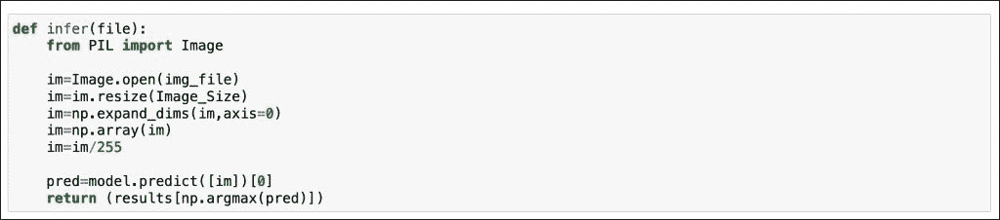

# 用 Kubeflow 进行张量流模型部署和推理

> 原文：<https://thenewstack.io/tensorflow-model-deployment-and-inferencing-with-kubeflow/>

在这个系列的[最后一部分](https://thenewstack.io/train-a-tensorflow-model-with-a-kubeflow-jupyter-notebook-server/)中，我们训练了一个 Tensorflow 模型来对猫和狗的图像进行分类。该模型存储在一个共享的 Kubernetes 持久性卷声明(PVC)中，另一个 Kubeflow 笔记本服务器可以访问该声明来测试该模型。

请记住，本系列的目的不是构建一个极其复杂的神经网络，而是展示 Kubeflow 如何帮助组织进行机器学习操作(MLOps)。


推出新的基于 CPU 的 Jupyter 笔记本服务器，并上传 [GitHub](https://github.com/janakiramm/kubeflow-notebook-tutorial) 上的笔记本。这个笔记本通过传递一些图像来验证这个模型。


按照相同的步骤启动基于映像的笔记本服务器，`janakiramm/infer`。确保挂载共享的 PVC-`models`。

该笔记本加载 TensorFlow 模型，并基于样本图像执行分类。


`infer`函数接受一个文件并返回预测。




现在让我们在 Kubernetes 中运行的 TensorFlow 服务中部署模型。首先克隆 [Github 库](https://github.com/janakiramm/kubeflow-notebook-tutorial.git),它拥有运行推理代码所需的一切。

```
git clone https://github.com/janakiramm/kubeflow-notebook-tutorial.git

```

导航至`inference`目录，找到 YAML 文件和其他相关资产。

让我们在`kubeflow-user-example-com`名称空间中部署 [TensorFlow 服务](https://www.tensorflow.org/tfx/guide/serving)，并将其公开为节点端口服务。Jupyter 笔记本服务器运行在同一个名称空间中。

```
cd inference
kubectl apply  -f  tf-serve-deploy.yaml
kubectl apply  -f  tf-serve-service.yaml

```


以下是 TF 服务部署和服务的 YAML 规范。

```
apiVersion:  apps/v1
kind:  Deployment
metadata:
  labels:
    app:  dogs-vs-cats
  name:  dogs-vs-cats-v1
  namespace:  kubeflow-user-example-com
spec:
  selector:
    matchLabels:
      app:  dogs-vs-cats
  template:
    metadata:
      labels:
        app:  dogs-vs-cats
        version:  v1
    spec:
      containers:
      -  args:
        -  --port=9000
        -  --rest_api_port=8500
        -  --model_name=dogs-vs-cats
        -  --model_base_path=/models
        command:
        -  /usr/bin/tensorflow_model_server
        image:  tensorflow/serving:latest
        imagePullPolicy:  IfNotPresent
        livenessProbe:
          initialDelaySeconds:  30
          periodSeconds:  30
          tcpSocket:
            port:  9000
        name:  dogs-vs-cats
        ports:
        -  containerPort:  9000
        -  containerPort:  8500
        volumeMounts:
        -  mountPath:  /models
          name:  model-serve-storage
      volumes:
        -  name:  model-serve-storage
          persistentVolumeClaim:
            claimName:  models

```

```
apiVersion:  v1
kind:  Service
metadata:
  labels:
    app:  dogs-vs-cats
  name:  dogs-vs-cats-service
  namespace:  kubeflow-user-example-com
spec:
  ports:
  -  name:  http-tf-serving
    port:  8500
    targetPort:  8500
    nodePort:  31000
  -  name:  grpc-tf-serving
    port:  9000
    targetPort:  9000
    nodePort:  31001    
  selector:
    app:  dogs-vs-cats
  type:  NodePort

```

实际上，我们安装的 PVC 与 Jupyter 笔记本服务器使用的 PVC 相同，用于为该型号提供服务。

TF 服务端点可作为 Kubeflow 集群上的节点端口。

由于 Kubeflow 依赖 Istio 来授权请求，我们需要应用一个授权策略来允许请求到 TF Serving。

```
apiVersion:  security.istio.io/v1beta1
kind:  AuthorizationPolicy
metadata:
  name:  default
  namespace:  kubeflow-user-example-com
spec:
  rules:
  -  to:
    -  operation:
        methods:  ["GET","POST"]
        paths:  ["/v1/models/*"]

```

```
kubectl apply  -f  tf-serve-auth.yaml

```

是时候从 Python 客户端调用端点了。让我们创建一个虚拟环境并安装所需的模块。

```
python3  -m  venv inferenv
source inferenv/bin/activate

```

```
pip install  -r  requirements.txt

```

下面是我们用于推理的 Python 客户端代码。

```
import argparse
import json

import numpy as np
import requests
import tensorflow
import PIL
from tensorflow.keras.preprocessing import image

ap  =  argparse.ArgumentParser()
ap.add_argument("-i",  "--image",  required=True,
                help="path of the image")
ap.add_argument("-u",  "--uri",  required=True,
                help="URI of model server")

args  =  vars(ap.parse_args())

image_path  =  args['image']
uri  =  args['uri']

img  =  image.img_to_array(image.load_img(image_path,  target_size=(128,  128)))  /  255.

payload  =  {
    "instances":  [{'conv2d_3_input':  img.tolist()}]
}

r  =  requests.post(uri+'/v1/models/dogs-vs-cats:predict',  json=payload)
pred  =  json.loads(r.content.decode('utf-8'))
predict=np.asarray(pred['predictions']).argmax(axis=1)[0]
print(  "Dog"  if predict==1  else  "Cat"  )

```

让我们通过传递 TF 服务 URL 和样本图像来运行 Python 客户端。当发送`sample1.jpg`时，我们看到使用`sample2.jpg`时预测为狗和猫。


```
HOST=http://10.0.0.54:31000
python infer.py  -i  sample1.jpg  -u  $HOST

```

根据您的集群和 TF Serving NodePort 服务，用适当的 IP 和端口替换主机。


```
HOST=http://10.0.0.54:31000
python infer.py  -i  sample2.jpg  -u  $HOST

```


如您所见，我们发送的图像分类是准确的。

Kubeflow Jupyter 笔记本电脑服务器系列到此结束，在该系列中，我们探索了配置环境、执行数据准备、培训、部署和推理的端到端 MLOps 场景。

<svg xmlns:xlink="http://www.w3.org/1999/xlink" viewBox="0 0 68 31" version="1.1"><title>Group</title> <desc>Created with Sketch.</desc></svg>