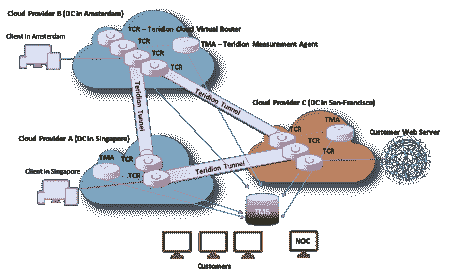
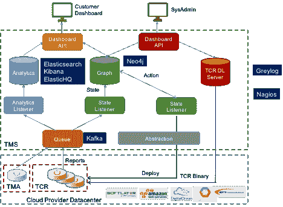
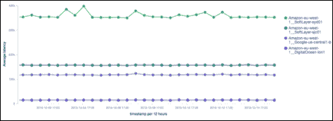
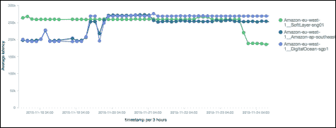
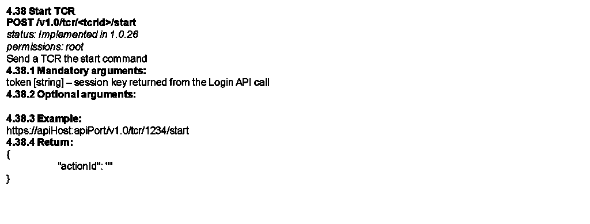

# Teridion 跨云提供商迁移的流程和架构

> 原文：<https://thenewstack.io/teridion-cloud-architecture/>

随着应用程序、服务和现在的网络向云迁移，一个关键问题是可移植性——一家公司，无论是 SaaS 公司还是其他公司，从一家云运营商迁移到另一家云运营商的能力。事实上，451 研究报告称，根据他们的[云价格指数](https://451research.com/services/price-indexing-benchmarking/cloud-price-index)，一个“多云”策略可以节省高达 74%的成本。

多伦·萨梅尔森

Doron Samelson 是 DevOps 的联合创始人和副总裁，负责客户成功和 Teridion 部署。他为公司带来了软件平台管理和云计算公司的丰富经验。

现在，公司已经习惯了公共云和混合云，下一个合乎逻辑的问题是如何跨多个运营商部署，以最佳地利用他们的足迹、功能和价格。关键是实现允许这种方法的过程和架构。

一个例子是 [Teridion 的](https://www.teridion.com/)全球云网络(GCN)，部署在十几个云运营商之间，而不必每次都重新发明轮子。它依赖于管理系统、抽象层和 API，在启动和分解服务时引入了一种通用语言。例如，如果在操作符“B”中请求服务“A”和参数“C”，那么在操作符“D”中对应的术语是什么？此外，在决定使用哪个运算符时，可以使用什么标准？在进入技术细节之前，简要回顾一下 Teridion 架构会有所帮助。

戴夫·金斯伯格

Dave Ginsburg 是首席营销官，为 Teridion 带来了 25 年以上的经验，涵盖企业和产品营销、产品管理、数字营销和营销自动化。之前的角色包括 Pluribus、Extreme、Riverstone、Nortel 和 Cisco。

我们的 Teridion GCN 由三个主要部分组成:

*   **Teridion 测量代理(TMA)**运行在云运营商内的虚拟机上，用于确定运营商主干网或其他云运营商的延迟。这些 TMA 是本报告的收集点。
*   **Teridion 云虚拟路由器(TCR)**根据吞吐量、延迟或地理位置在互联网上创建覆盖路径，以优化给定客户的动态内容。
*   **Teridion 管理系统(TMS)** 从 TMAs 收集数据以描绘互联网性能的实时视图，并为云运营商维护 API 以按需并基于客户要求创建或销毁 TCR。

[](https://thenewstack.io/wp-content/uploads/2015/12/E7D0ADBA-88E5-4A0E-8990-5682E7CA55F6.png)

上图描述了该系统。位于云中的 TMS 在每个主要云运营商的每个区域加速 TMA。这些 TMA 不断收集性能数据，包括通过 iPerf 的吞吐量和通过建立 TCP 连接的延迟，并将这些数据发送给 TMS。

任何已经存在的 TCR 通过嵌入式 TMA 做同样的事情。TMS 使用所有这些数据来构建互联网性能图。TMS 使用相同的数据来部署 TCR，云运营商也是如此。客户流量沿着最佳路径通过这些 TCR 发送，TCR 还用于生成链路吞吐量数据。这里有两个关键操作:

*   确定 TCR 部署的云运营商——时间和地点。
*   有效地连接到云运营商。

更多关于特里迪翁 GCN 建筑的详细信息请点击[这里](http://107.170.240.244/wp-content/uploads/2015/11/rethinking_network_performance_oct2015.pdf)。

## 云运营商选择

如上所述，TMS 开发了互联网云运营商绩效的实时视图。我们的客户可能会根据吞吐量、延迟甚至是偏好或避开某些地理位置来选择虚拟覆盖网络。因此，TMS 利用这一点和定价为给定客户选择最佳云运营商，这可能因地区和日期/时间而异。例如，我们的一个客户在四个不同的运营商中平均部署了 500 多个 TCR。在部署 TCRs 之后，TMS 建立从一个到另一个的覆盖路径，并且还可以创建用于弹性的备用路径。

## 云操作员界面

TMS 能够通过一个 API 来实现这一点，该 API 包含了每个操作者所必需的钩子。它需要既灵活又能够实现极高的性能。看待我们的控制平面(TMS)和数据转发平面(TCRs)之间的这种抽象的一种方式是使用数据中心交换机或路由器的类比。在大多数情况下，供应商的网络操作系统并不局限于单个芯片系列，而是实现了一个抽象层。我们刚刚将这一点扩展到了云，其中 TMS 是云网络操作系统，TCR 是云运营商内部的虚拟路由器，是交换元素。

```
"targetTMAPort":  80,
"tcrBilling":  "hourly",
"networkName":  "devopsday-net",
"customerName":  "DevOpsDay",
"customerId":  "a4c064d604364c8e866ff164f3e83267",
"tcrPackage":  "/tcr/TCR-1.0.116-1.x86_64.rpm",
"regions":  [
{
"regionName":  "Japan",
"geoRegions":  [
"JP"
],
"nearDcs":  [
"SoftLayer-tok02",
"Amazon-ap-northeast-1"

```

我们设计 TMS 的方式确保了高性能。对于给定的区域和子区域，TMS 维护潜在云运营商的列表。一旦它选择了一个给定的操作员，它就发出一个部署命令来启动 TCR。请注意，在创建 TMA 之前，可能已经发生了相同的过程。对于这两种情况，我们使用 TMA/TCR 映像实现了一个下载服务器，并且在 Teridion GCN 上，不同的 TCR 可以运行不同的软件版本。

TMA 和 TCR 基于 Kafka 向 TMS 排队/记录引擎报告。这是来自网络节点的所有数据的漏斗。从那里，数据被分流到两个方向。TMS 通过图形数据库 Neo4j 构建了 GCN 的实时视图。同时，我们将性能数据转发给 Elasticsearch 进行分析、Kibana 可视化和 ElasticHQ 进行集群监控和管理。这是我们确定互联网状态和最佳路径的地方。可以实时向 Kibana 查询这些数据。

[](https://thenewstack.io/wp-content/uploads/2015/12/AC683D6C-2165-47B3-95DE-49B45DE2371B.png)

Teridion 全球云网络架构

[](https://thenewstack.io/wp-content/uploads/2015/12/0EFE1892-9A65-440A-BAB5-199BC8236C88.png)

从英国基巴纳到英国、美国和澳大利亚不同运营商的延迟图示例

[](https://thenewstack.io/wp-content/uploads/2015/12/AF716A35-1A0C-41D5-842F-6F87CF342FA8.png)

从 EMEA 的 Kibana 运营商到新加坡的 3 家运营商的延迟图示例

来自我们的分析和图形引擎的汇总数据由用户门户呈现，提供了每个客户的视图。我们还实现了一个 REST API，用户可以通过它设计自己的 UI。

[](https://thenewstack.io/wp-content/uploads/2015/12/image03.png)

客户休息 API 摘录

## 结论

对于希望在计算、存储、网络或这三者的任意组合方面利用多个云运营商的组织来说，上述架构可以作为一个蓝图。关键的不仅是文档化的 API，还有后端智能，它可以决定使用哪个操作符，最好是以自动化的方式。

Teridion 是新堆栈的赞助商。

专题图片: [Broo_am(安迪 B)](https://www.flickr.com/photos/ambroo/) 的《[高飞者](https://www.flickr.com/photos/ambroo/8617918965/in/photolist-e8x64K-r8YiPP-9b9XxF-7ayPmy-dCXBBy-7FPSdN-cGABLo-e9hnCw-7amoJP-6TaU4X-6ShJVa-k9UyrV-f8oPXX-etf1xm-9kdq1M-akaqKe-dNMxem-hPRjc6-8HZWG-9nLj2i-owmXGB-5yfenV-ax4evK-7xAUaQ-pm5sac-bo4db7-cYTjFu-qHyQKc-4zit57-69tf1j-5ftxDG-4vAm4z-atMkQ3-9A7aib-eSgAoy-eWToA7-9YqkHJ-bs6db6-t5Wjwe-BekwS1-rhh8y1-tc8V1Q-az4Err-A6Am71-7teNNA-pfmcRF-5B7g8b-dojCPq-dJLSyb-8Z8ptT)》在 [CC BY-ND 2.0](https://creativecommons.org/licenses/by-nd/2.0/) 下授权。

<svg xmlns:xlink="http://www.w3.org/1999/xlink" viewBox="0 0 68 31" version="1.1"><title>Group</title> <desc>Created with Sketch.</desc></svg>