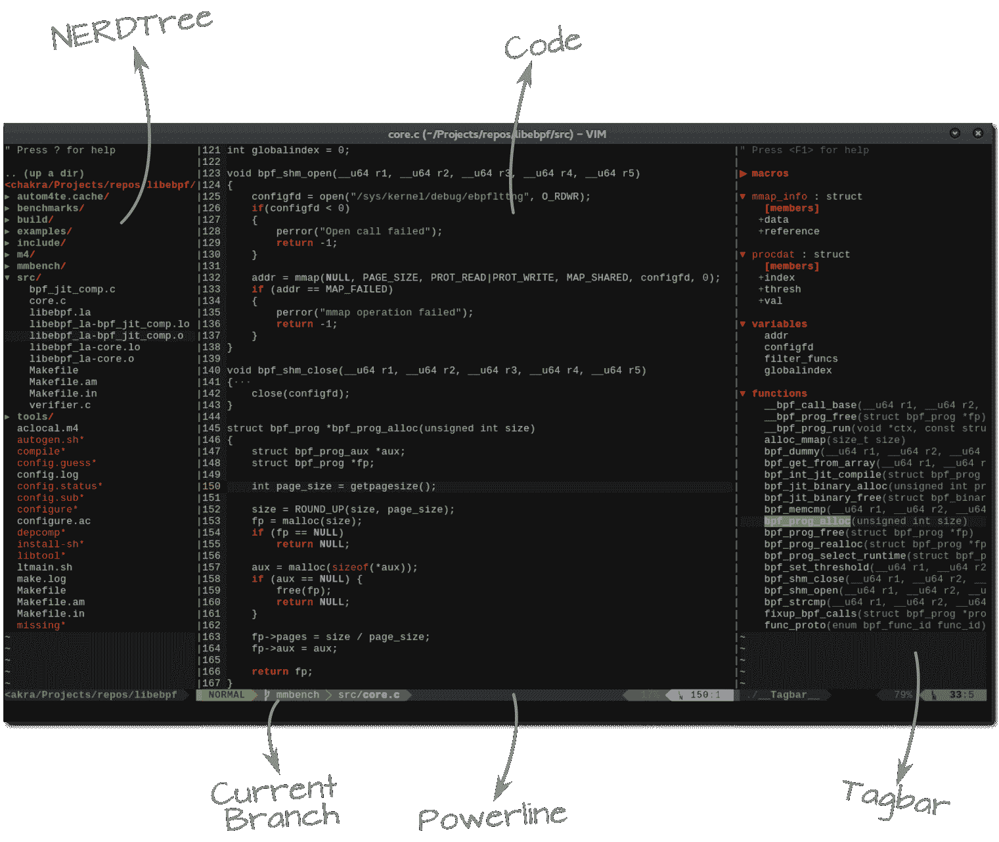
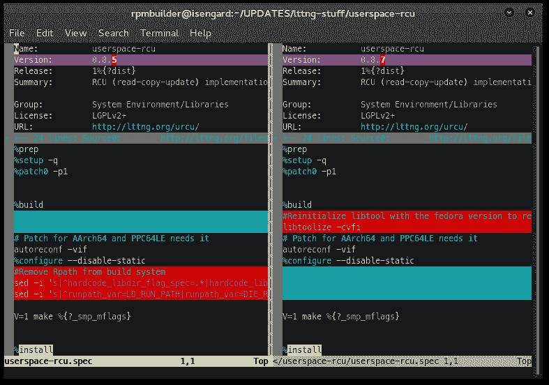
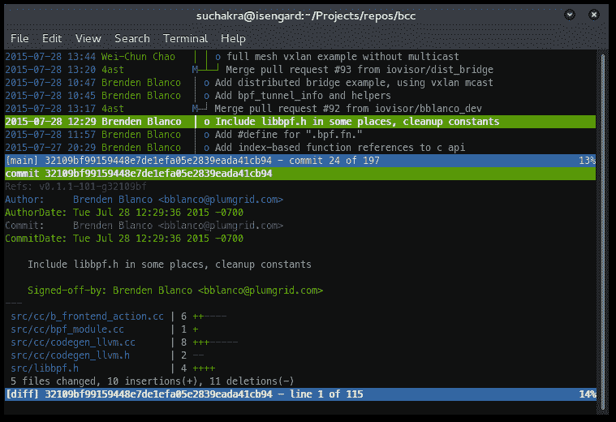
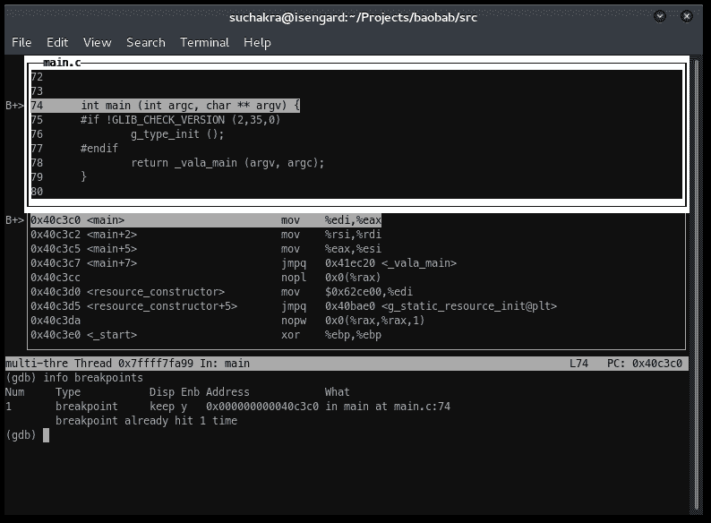
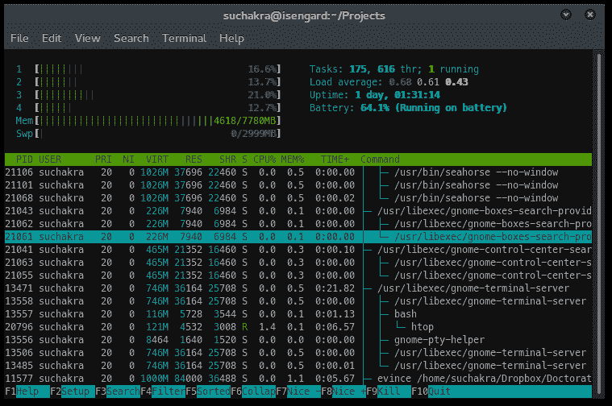
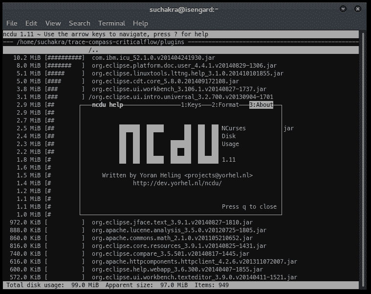
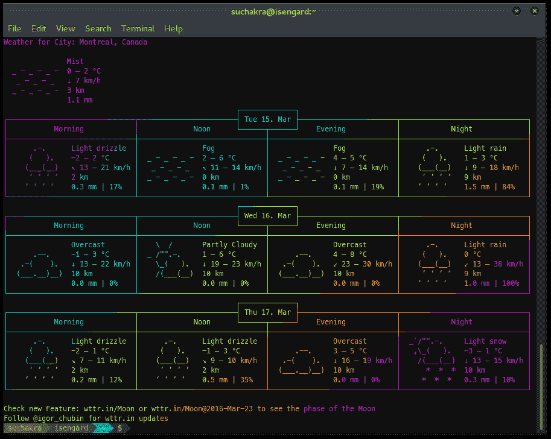

# 终端基础:面向开发人员和系统管理员的高级命令行工具

> 原文：<https://thenewstack.io/terminal-essentials-command-line-tools-devs-sysadmins/>

以前，我曾经写过关于终端工具的文章，对于那些发现命令行有多方便的计算机用户来说，这些工具可能很有用。在本文中，我将深入探讨一些针对开发人员和系统管理员的高级设置。这不是命令行工具和技巧的详尽列表，选择可能不是最终的，但它们肯定是既酷又有用的正确平衡。

## 各种 vim 工具

我不会进入传统的 [vim vs emacs](https://www.prismnet.com/~dierdorf/emacsvi.html) 之战，因为它们是目前使用最广泛的两种终端编辑器，而且使用范围很广。大多数管理员喜欢这样或那样，他们对自己的选择非常虔诚。

但是我想分享一些关于如何增强 vim 的技巧，并从本质上使它成为一种 IDE。

要使 vim 有用，您需要具备三个基本要素。首先是 [NERDTree](https://github.com/scrooloose/nerdtree) 插件，它在侧边栏中提供了一个树状的文件浏览器。这使得在同一个项目中浏览和打开不同的文件变得非常容易。



第二个是 Tagbar 插件，显示当前文件中的标签，如变量、函数名等。当然，为此，您需要安装丰富的 Ctags 库。

另一个使用它们最有效的方法是创建快捷方式来切换 NERDTree 和 Tagbar 插件。为此，只需将以下内容添加到您的`vimrc`文件中:

```
" Tagbar Toggle Shortcut
noremap &lt;leader&gt;] :TagbarToggle&lt;CR&gt;

"  NERDtree Toggle Shortcut
noremap  &lt;leader&gt;q  :NERDTreeToggle&lt;CR&gt;

```

所以现在，你可以做 \ + ] 来切换树，做 \ + q 来切换标签栏。相当酷！接下来你不应该错过的是 vim 的[电力线](https://github.com/powerline/powerline)插件。这将在打开的缓冲区底部显示一个简短的状态栏，显示你在哪个 git 分支上，vim 的当前模式(不同的模式用不同的颜色)，当前的动作和行号。关于 vim 的其他高级配置，可以查看 [Xero 的点文件](https://github.com/xero/dotfiles#vim)。掌握 vim 的另一个有用资源是在[vimcasts.org](http://vimcasts.org/)的精彩的 vim 截屏

## vimdiff

虽然有许多功能丰富的 GUI 工具用于区分和合并，如 [Meld](http://meldmerge.org/) ，但终端极客的终极工具是 [vimdiff](https://gist.github.com/mattratleph/4026987) 命令。它让开发人员保持在相同的熟悉的终端和 vim *区域。*要区分两个版本的文件，你只需简单地，

```
$  vimdiff old_version.c new_version.c

```

这将打开两个 vim 缓冲区，这些文件在分割窗口中排列。正如您在下面看到的，这是两个版本的规格文件。线内的变化用紫色突出显示，增加和减少用红色和蓝绿色显示。但是，颜色方案可以根据您的选择而变化。



你可以用Ctrl+w+w在两个拆分的窗口之间跳转。要移动到下一个变更，执行 ] + c ，要移动到上一个变更，执行 [ + c 。通常，您只需要在一个缓冲区中，使用 :diffput 和 :diffget 命令将更改推送到相邻的文件，或者从该文件中获取这些更改。把你的光标移到那一行，然后发出命令。就这么简单！

如需更多高级功能，如三向差速，请查看本视频。通常，当我们刚刚在 git 托管存储库中应用了一个补丁或多个版本之间的差异时，我们最终会关心差异。这就引出了我们的下一个工具。

## 捉人游戏

在试图了解 git 分支的当前情况或之前的提交时，您是否一直在使用常用的`git log`和`git diff`命令？嗯，git 浏览有[众多的 GUI](https://git-scm.com/download/gui/linux)。然而，一个快速和轻量级的终端基础是 [Tig](https://github.com/jonas/tig) 。它在大多数 Linux 发行版上都是现成的。



首先，在 repo 目录中执行一个简单的`tig`命令(容易记住——与‘git’相反)。您将得到的第一个视图是所有提交的一个有组织的列表，标识合并点和分支。您可以使用向上和向下键来浏览提交。当您在任何 commit 上点击 Enter 时，视图将会改变，看起来类似于图中所示。它在底部打开一个分割视图，显示提交的细节——包括增加和减少。在这里按下向上和向下将开始滚动整个提交信息。您可以执行 PageUp 和 PageDown 在上面的拆分视图提交列表中滚动。下方的拆分视图会相应改变。这有助于跟踪自上次提交以来发生了什么变化。您可以按下 q 退出分割视图，然后再次按下 q 退出`tig`。

## 基因组数据库

坦白说，你逃不出 [GDB GNU 项目调试器](https://www.gnu.org/software/gdb/)。它可以处理 C/C++，围棋，Java 等。很好。无论是通过 Eclipse CDT 插件还是通过[许多其他图形用户界面](https://sourceware.org/gdb/wiki/GDB%20Front%20Ends)，它肯定有时会与您不期而遇。

无论 GDB 变得多么先进和复杂，它的命令行根基仍然坚如磐石。调试器实际上只是一个 gdb 命令！GDB 最受欢迎的用途之一就是理解程序流程。而且没有比 [TUI 模式](https://sourceware.org/gdb/onlinedocs/gdb/TUI.html)更简单的使用方法了。



调试时切换 TUI 模式最简单的方法就是做一个Ctrl+x+a。默认情况下，您将获得源代码视图。要打开装配窗口，在`gdb`控制台中输入`layout split`命令。命令`layout next`和`layout prev`切换 TUI 布局。汇编和源代码视图是同步的，断点在代码窗口中突出显示为`B+>`。您可以通过Ctrl+x+o选择单个分割窗口。现在，当您开始单步执行指令或函数时，源代码和汇编视图将会引导您。

要了解更多细节，Beej 的 [GDB 指南](https://beej.us/guide/bggdb/)可以作为高效调试的良好起点。另一个漂亮的工具是 [gdb-dashboard](https://github.com/cyrus-and/gdb-dashboard) 项目，它为您提供了调试时程序中正在发生的事情的另一种可视化表示。

## htop

光写程序是不够的。在运行的系统上，您需要了解它们是如何影响系统的。如果您只是想知道系统上正在运行什么进程以及它们正在占用什么资源，`top`是一个默认的选择。不过，top 的一个更完善、互动性更强的版本是 [htop](http://hisham.hm/htop/) 。



htop 不仅仅是一个进程查看器。它可以用来设置 CPU 关联，向进程发送终止信号，以图形方式观察资源使用情况。您可以按下 t 来观察用树表示的流程的父子关系。使用熟悉的/搜索进程，并使用 k 终止进程。到目前为止最棒的功能是——你可以通过按下 s 并连接到它来跟踪应用程序。神奇！

## ncdu

既然我们已经讨论了资源消耗，另一个为你的数字腰带准备的漂亮工具是基于 Ncurses 的磁盘使用工具，叫做`[ncdu](https://dev.yorhel.nl/ncdu)`。这是对大家最熟悉的`du`命令最受欢迎的升级。



文件按大小排序，您可以立即识别最占用空间的文件。您可以按下 i 获取有关所选文件的更多信息，按下 d 快速删除困扰您的文件。

当然，开发者也不能错过这一乐趣。这是通过管道传输给 [lolcat](https://github.com/busyloop/lolcat) 命令的天气输出。今天的天气预报是…彩虹！

```
$  curl wttr.in/Montreal  |  lolcat

```



那都是乡亲们！正在注销。

<svg xmlns:xlink="http://www.w3.org/1999/xlink" viewBox="0 0 68 31" version="1.1"><title>Group</title> <desc>Created with Sketch.</desc></svg>