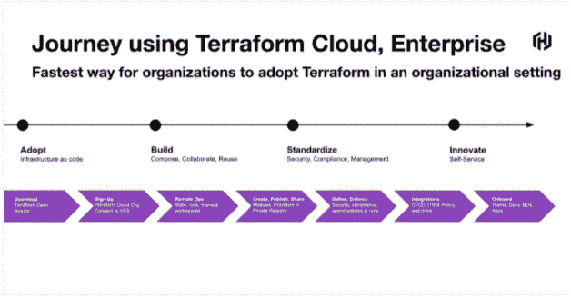
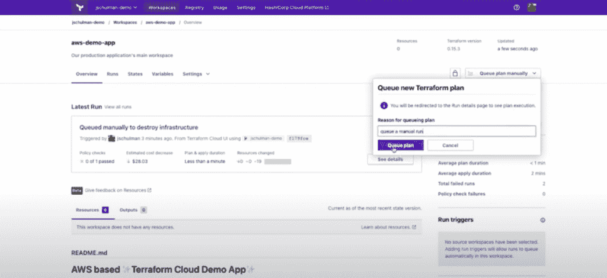
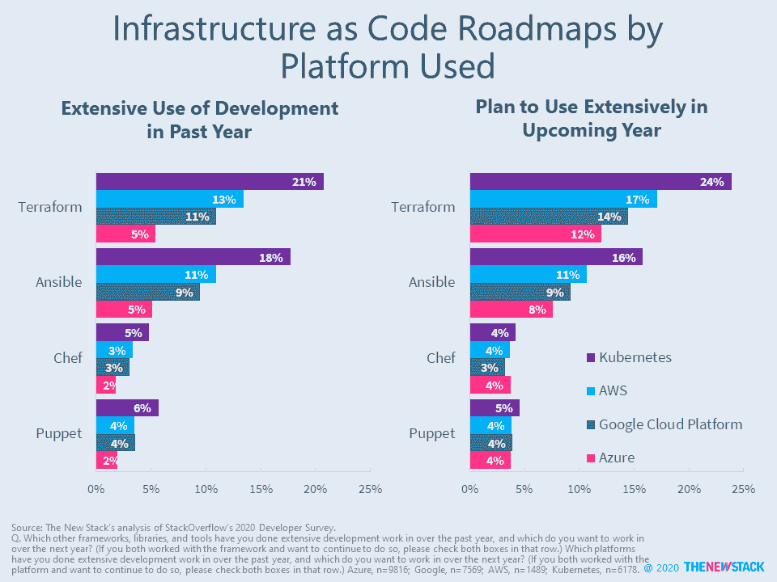
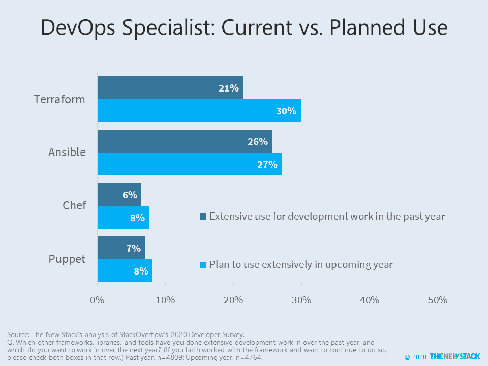
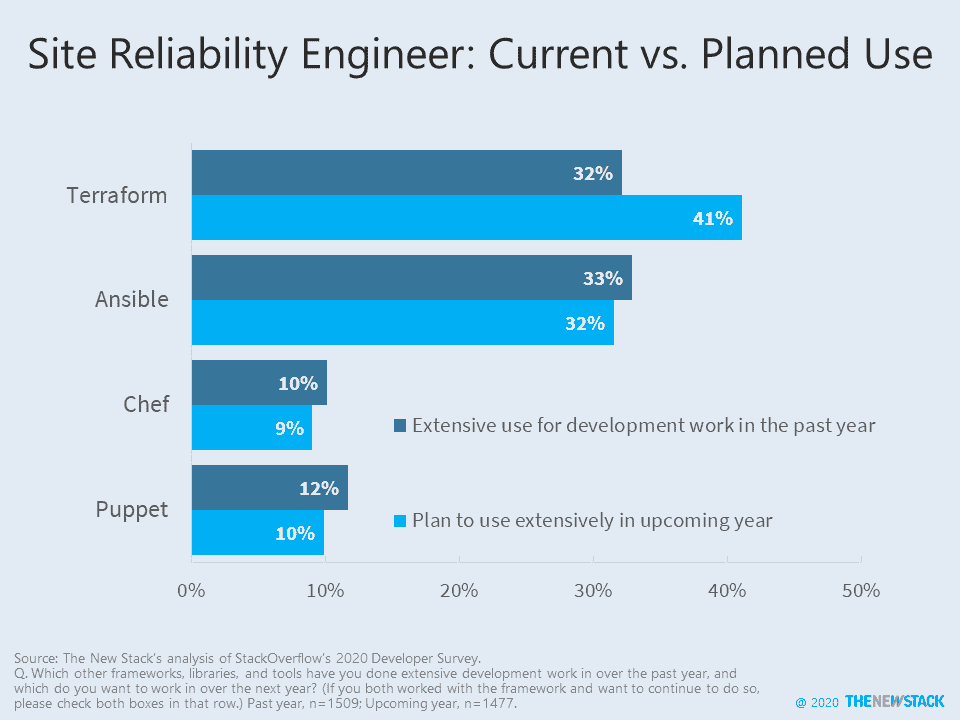

# Terraform 1.0 反映了 HashiCorp 对基础设施即代码的了解

> 原文：<https://thenewstack.io/terraform-1-0-reflects-what-hashicorp-has-learned-about-infrastructure-as-code/>

在许多方面，[基础设施作为代码(IaC)](https://en.wikipedia.org/wiki/Infrastructure_as_code#:~:text=Infrastructure%20as%20code%20(IaC)%20is,configuration%20or%20interactive%20configuration%20tools.) 的采用仍然是一项进行中的工作，因为提供商对站点可靠性工程师(SREs)和 DevOps 团队关于如何简化和标准化基础设施的供应和管理的反馈做出了回应。开发人员经常面临着管理跨越多个不同环境(包括多云和不同数据中心)的基础设施的问题，当依赖 IaC 时，他们仍然会在许多方面遇到困难，包括满足安全性、合规性、可扩展性和其他基础设施管理挑战。

正是在这种背景下， [HashiCorp](https://www.hashicorp.com/?utm_content=inline-mention) 发布了[terra form 1.0](https://github.com/hashicorp/terraform/releases/tag/v1.0.0)——这对于云原生迁移来说尤其受欢迎——因为它寻求改善其 IaC 平台的互操作性，简化自动化工作流的升级和维护，[terra form 产品营销高级总监 Meghan Liese](https://www.linkedin.com/in/meghanliese) 解释道。

Liese 说，HashiCorp 从 Terraform 的采用中学到的是，对于组织来说，“基础设施自动化是一个四阶段的旅程”,以便:

1.  采用基础设施作为代码。
2.  构建工作流，以代码形式组合、协作和重用基础架构。
3.  根据安全性、合规性和管理要求标准化工作流。
4.  通过自助服务基础架构选项为最终用户应用程序开发人员和交付团队提供创新。

虽然 Terraform OSS 解决了第一阶段的问题，Liese 表示，Terraform 云和 Terraform Enterprise 提供了“以基础设施为代码，为任何规模的团队和组织进行构建、标准化和创新”的能力。

HashiCorp 是 Terraform 开源项目的主要负责人。Liese 说，除了将工程和产品团队投入到开源版本中，HashiCorp 还与云提供商合作，将 Terraform 与亚马逊网络服务(AWS)T1、Azure、谷歌云等环境相集成。Liese 说，HashiCorp 还投资于 Terraform 的商业企业版，以解决围绕基础设施自动化的组织挑战，包括大型组织的协作、治理和政策管理。

Liese 说，自从 Terraform 的第一个版本于 2014 年发布以来，这项技术已经被下载了超过 1 亿次。她说，组织通常从 Terraform 开源开始，以减少供应基础设施的时间和复杂性，特别是在多提供商云环境中。然后，他们依靠 Terraform Cloud (SaaS)或 Enterprise(自托管)来标准化其对 Terraform 的使用，以实现云支出的安全性、合规性和管理。Liese 说:“安全性正在成为 IT 团队所做的一切工作的前沿和中心。“代码标准化、可见性、策略实施和审核是任何组织使用的基础架构自动化工作流的关键原则。”

借助 Terraform 云和 Enterprise，自动驾驶汽车初创公司 Cruise 在一个[案例研究](https://www.hashicorp.com/case-studies/cruise)中展示了它如何能够将供应时间减少多达 75%。Liese 说，电子支付提供商 Cielo 在 Cielo 案例研究中坚持认为，它能够使用 Terraform 云和企业，通过更快的应用交付，业务速度提高了五倍。

  

根据 2020 年 [StackOverflow 调查](https://insights.stackoverflow.com/survey/2020)的数据，HashiCorp 的 [Terraform](https://www.terraform.io/) 和 Red Hat 的 [Ansible](https://www.redhat.com/en/technologies/management/ansible) (见上图)，已经成为领先的选择，Terraform 已经成为 Kubernetes 部署的主要选择。然而，除了 SaltStack 之外，IaC 的竞争者 Pulumi 在调查中遗漏了——这将包括在今年的 StackOverflow 研究中。

“展望未来，我们必须调查的一个关键点是 Terraform 在多大程度上是用于管理 IaC 部署的主要工具。新堆栈的分析师劳伦斯·赫克特(Lawrence Hecht)说:“在与主要云提供商进行了大量开发工作的开发人员中，Terraform 的采用率大幅下降。“如果已经需要使用 AWS CloudFormation，为什么还要使用 Terraform？哈希公司是处理多云配置管理的最佳方式吗？”

<svg xmlns:xlink="http://www.w3.org/1999/xlink" viewBox="0 0 68 31" version="1.1"><title>Group</title> <desc>Created with Sketch.</desc></svg>