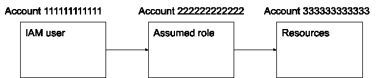

# AWS 上的 Terraform:多帐户设置和其他高级提示

> 原文：<https://thenewstack.io/terraform-on-aws-multi-account-setup-and-other-advanced-tips/>

本文将探索 HashiCorp 的 [Terraform](https://www.terraform.io/) 使用的某些高级领域，特别关注如何在管理多个 Amazon Web Services 的帐户时使用 terra form——这越来越受欢迎，要么是由于组织的庞大规模，要么是其 DevOps 团队的故意选择。事实上，AWS 本身正在温和地推动其客户至少考虑使用多个账户，并且它最近发布了新的服务来帮助你这样做。

## 需要多个 AWS 帐户

 [塞尔坎·奥扎勒

塞尔坎是桑德拉的联合创始人兼首席技术官。他在软件开发方面有 10 多年的专业经验，是 AWS 认证专家，拥有分布式环境专利。他主要从事无服务器架构、分布式系统和监控工具方面的工作。](https://www.linkedin.com/in/serkanozal/) 

您的组织可能希望或需要多个 AWS 帐户的原因有很多，例如，为了轻松提高安全性。这种策略可以帮助您按照兴趣线分离资源，例如，允许您为每个开发人员、环境或组织部门授予一个 AWS 帐户。

在这种情况下，管理安全性肯定比让一个巨大的 AWS 负责所有事情要容易得多，因为管理 IAM 权限变得非常困难。默认情况下，独立的 AWS 帐户绝对不能相互访问，使得一个帐户不可能访问另一个帐户的资源。

实际上，大型组织由于其庞大的规模已经在使用多个 AWS 帐户，但是这些帐户并没有关联。这使得采购部门的工作变得更加困难，因为每个 AWS 帐户将被单独计费，并且将由组织根据其内部规则或政府法规来合并计费。AWS 创建了 [AWS 组织](https://aws.amazon.com/organizations/)来解决这个问题；它允许您管理帐户的层次结构，并合并更高层次的帐单，简化您的采购部门的工作。最近，AWS 发布了 [AWS 控制塔](https://aws.amazon.com/controltower/)，它可以帮助你用一组预设的资源供应新账户，并在一个屋檐下管理所有这些账户。

### 新趋势

总的来说，AWS 推动组织使用多个帐户——可能是因为人们倾向于授予帐户中的所有用户管理员权限，因此所有用户都可以在该帐户中查看和执行任何操作。

为这些用户创建 IAM 权限而不是使用默认的管理员访问权限非常耗时；另外，也不能保证最小特权原则会得到遵守。另一方面，默认情况下，一个 AWS 帐户上的管理员用户不能在另一个 AWS 帐户上查看或执行任何操作，即使是在同一个组织中。因此，这在默认情况下是安全的，并且需要额外的工作来创建 IAM 权限，以允许一个帐户中的用户在需要时访问另一个帐户的资源。在这种情况下，DevOps 工程师也更有可能应用最小特权原则。

这种趋势对基础设施即代码(IaC)有影响，例如在使用 Terraform 时。默认情况下，IaC 工具通常绑定在单个 AWS 帐户上工作。很早以前，Terraform 的特色是在一个脚本中有多个所谓的“[提供商](https://www.terraform.io/docs/providers/index.html)”，这将允许您访问多个 AWS 帐户，甚至来自不同云供应商的帐户。

## 具有多个帐户的基础架构即代码

### 管理不同帐户中的资源

第一个用例如下:单个 Terraform 状态可以管理不同帐户中的资源。这通常需要声明多个“提供者”块，通常每个 AWS 帐户一个。

默认情况下，AWS 提供程序块将在用于连接 AWS API 的凭据所引用的帐户中工作。例如，如果使用给定 AWS 用户的访问密钥 ID/秘密访问密钥对，Terraform 将应用于该用户所属的帐户；地形代码应该是这样的:

```
provider  “aws”  {

region  =  “us-east-1”

}

```

为了在不同的帐户中创建资源，您需要使用“提供者”块的“承担角色”选项，这允许您在另一个帐户中承担角色并获得对该帐户的访问:

```
provider  “aws”  {
  region  =  “us-east-1”
  assume_role  {
    role_arn  =  “arn:aws:iam::123456789012:role/iac”
  }
}

```

显然，这将需要您设置该角色的 IAM 权限以及执行 Terraform 命令的用户，以便该用户拥有承担该角色的权限。AWS 在这里记录了如何实现这个[。](https://docs.aws.amazon.com/IAM/latest/UserGuide/id_roles_use_permissions-to-switch.html)

### 使用中间角色访问第三个帐户

第二个用例是第一个用例的扩展:假设的角色可能拥有在第三个 AWS 帐户中创建、更新和删除资源的权限。这需要在最终 AWS 帐户中创建 IAM 权限，以允许中间 AWS 帐户在最终 AWS 帐户中创建、更新和删除资源。控制流程如下所示:

[](https://cdn.thenewstack.io/media/2020/11/a89701a7-image1.png)

图 1:中间角色访问最终 AWS 帐户的流程控制

这个用例变得非常复杂，IAM 权限的管理可能非常麻烦，很难调试。在特定情况下，这样的设置可能是值得的，但是安全优势是有限的。事实上，黑客并没有以上图中的帐户 333333333333 为目标，而是试图访问帐户 222222222222，以获得帐户 333333333333 中的控制或资源。如果帐户 222222222222 用于控制 333333333333 之外的其他帐户中的资源，您可能会认为安全性较弱，因为获得对帐户 222222222222 的访问权限会打开更大的访问范围。

## 其他高级地形策略

### 多状态

如果资源的数量变得相当大，将 Terraform 脚本分成多个状态可能是个好主意——尤其是在使用连续部署(CD)时。在单一状态下管理所有资源有一些缺点:

*   每次你应用哪怕是微小的改变，你都会担心 Terraform 会触及一些你不想触及的基础资源。
*   通过持续部署盲目应用的基础资源的错误变化可能是毁灭性的。
*   应用 Terraform 脚本所需的 IAM 权限范围很广，肯定比 CD 设置所需的权限要多。
*   应用更改需要相当多的时间，因为 Terraform 需要获取由状态管理的所有资源的状态，即使绝大多数资源不会更改。
*   部署失败的影响可能是广泛的。

通常有许多基本资源变化很小，例如 VPC、子网、转接网关、VPN、RDS 数据库和负载平衡器。这些资源将属于一种“基础”状态，很少会随着时间的推移而改变。对这种状态的更新通常由人来运行。

还有一些资源通常会发生很大变化，例如 EC2 实例、自动扩展组、ECS 任务定义和服务以及 EKS 部署。这种资源通常是由 CD 管道部署(或更新)的资源。它们可以被置于与基础资源不同的状态。这套独特的 Terraform 脚本将只管理您的工作负载资源的快速变化的小子集，并且您需要的权限要少得多。以这种方式分隔地形状态对于自动化部署来说是理想的。

这种设置的一个有趣例子是由基础堆栈管理的 Kubernetes 集群，其中 Kubernetes 部署由 CD 堆栈管理。

### 模块

Terraform 使得模块化 IaC 代码变得容易。你只需要把你的代码放在一个不同的目录中，然后像这样使用“模块”指令:

```
provider  “aws”  {

region  =  “us-east-1”

}

module  “mymodule”  {

source  =  “./modules/my_module”

variable1  =  “value1”

variable2  =  “value2”

}

```

Terraform 拥有一个“[注册中心](https://registry.terraform.io/browse/modules)”，其中包含了许多由 Terraform 社区编写的供公众使用的模块。在使用此注册表之前，请确保您打算使用的模块符合您组织的安全策略。

Terraform 模块帮助你保持代码干爽(不要重复自己)。然而，仍然有一些样板代码不能模块化——比如后端定义和对模块本身的调用。

### 环境

一种非常常见的情况是，您的工作负载需要多个环境—试运行、生产、测试等。通常，保持这些环境尽可能相似是一个好主意，这样可以最大限度地提高在“试运行”环境中工作的部署在“生产”环境中也能工作的机会，从而避免“但是它对我有效”的借口。

Terraform 提供了“[工作区](https://www.terraform.io/docs/state/workspaces.html)”，但它要求您在应用更改之前切换工作区(例如，从“生产”切换到“暂存”)。当手动完成时，很有可能有一天有人会忘记切换工作区并部署到一个非预期的环境，这显然会带来灾难性的后果。

另一个解决方案是为不同的环境使用不同的脚本集；但是这很麻烦，而且在这些环境之间会有很多重复的代码，即使使用模块也是如此。这实际上也是研发出 [Terragrunt](https://terragrunt.gruntwork.io/) 的原因之一，在这里[由创始人之一](https://blog.gruntwork.io/terragrunt-how-to-keep-your-terraform-code-dry-and-maintainable-f61ae06959d8)进一步解释。

## 结论

总之，我们可以总结出，在大型(和不太大型)组织中，多帐户 AWS 设置是非常常见的；通过一点技巧，在这样一个多账户系统中运行 Terraform 是完全可能的。事实上，Terraform 已经从底层发展成为多云，并支持大量可以在给定脚本集内使用的“提供者”。

本文高级策略中的一些技巧可以帮助你的 Terraform 代码变得简洁明了。

<svg xmlns:xlink="http://www.w3.org/1999/xlink" viewBox="0 0 68 31" version="1.1"><title>Group</title> <desc>Created with Sketch.</desc></svg>