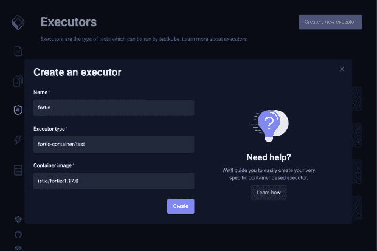
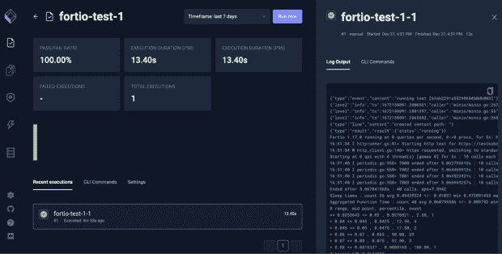
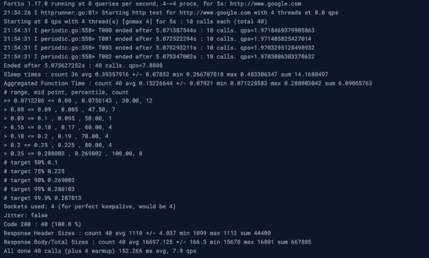

# 测试自动化工具 Unite！

> 原文：<https://thenewstack.io/test-automation-tools-unite/>

在云原生应用成为趋势之前，测试自动化工具已经存在了一段时间。

说到集成测试，我观察到的最常见的模式是团队将这些工具打包并集成到他们的 CI/CD 管道中，然后使用它们连接到他们的每个 Kubernetes 集群。

然而，对于我所分析的几十家公司来说，每一家都以一种定制的方式这样做，他们构建自己的内部定制解决方案来测试他们的 Kubernetes 环境。

他们这样做是因为没有开源解决方案允许团队简单地在 Kubernetes 中运行他们的测试，而不用痛苦地经历将他们的测试活动集成到他们的 CI/CD 中，然后在 Kubernetes 中编排他们的执行的过程。

## 在云中使用 Testkube 进行所有类型的测试

您想要测试代码的许多不同方面，无论是功能性测试还是非功能性测试，每个测试工具做的都不同。有安全测试，端到端测试，集成测试，负载测试，UI 测试等等。

对于这些类别中的每一个，都有许多开源工具，它们有自己的工作方式并与您的开发生命周期相集成。

因为每个测试工具都是不同的，每个公司都有不同的用例以及测试方式， [Kubeshop.io](http://kubeshop.io) 决定创建 [Testkube.io](http://testkube.io) 来允许公司以一种简单的方式对他们在 K8s 中运行的微服务执行测试。

Testkube 允许你花更多的时间写测试，花更少的时间自动化和集成到你的开发生命周期中。

为此，您可以使用 [Testkube 的内置执行器](https://kubeshop.github.io/testkube/category/test-types)。每月支持 Postman，Cypress，任何基于 Java 的工具(Jmeter，Maven/Graddle)，SoapUI，k6 等等。

[下面是一个如何使用 k6 和 Testkube 运行性能测试的例子。但是等等，如果你使用了 Testkube 上默认不支持的工具呢？这就是为什么我们创建了一个叫做](https://testkube.io/blog/load-testing-in-kubernetes-with-k6-and-testkube)[容器执行器](https://kubeshop.github.io/testkube/test-types/container-executor)的东西。

## 为什么使用容器进行 Kubernetes 测试？

一个[容器执行器](https://kubeshop.github.io/testkube/test-types/container-executor)是任何一个 Docker 映像，其中包含了你的测试工具。你不需要别的东西。通过创建一个可以添加到 Testkube 来运行测试的轻量级容器，您可以快速地自动化新的测试，并使它们成为您开发生命周期的一部分。

Testkube 将通过使用您创建的容器来协调您的测试的执行，从而处理剩下的事情。它将日志、测试工件、度量标准和测试结果提取到它的中央数据库中，在那里您可以组合不同测试的所有结果。

## 如何构建容器执行器并运行测试

我们首先确定运行测试需要哪个图像。

你可以在 [Docker Hub](https://hub.docker.com/) 上找到一个，或者你可以使用 Docker 文件创建自己的文件，然后将其存储在任何公共或私人的图像注册表中。

在这个例子中，我们将使用 [Fortio](https://github.com/fortio/fortio) 执行负载测试，这是为了在 [Istio](https://istio.io/) 上进行负载测试。Istio 开发人员很好地在 Docker Hub 上为 [Fortio 维护了一个更新的 Docker 映像。我们将使用它，而不是从头开始创建我们自己的形象。](https://hub.docker.com/r/istio/fortio)

*专业提示:大多数测试工具在 Docker Hub 上都有现成的图像。我建议你在自己建立一个之前总是从那里开始。；)*

有三种与 Testkube 交互的方式。您可以使用 UI、CLI 或自定义 Kubernetes 资源(CRDs)。我将向您展示如何以这三种方式在 Kubernetes 中创建和运行测试。

让我们从定义 K8s 集群中的执行器开始。

### 创建容器执行器

为此，您可以使用 [Testkube 的 CLI](https://kubeshop.github.io/testkube/installing#macos) 并运行:

```
testkube create executor  --name fortio  --executor-type container  --image istio/fortio:1.17.0  --types fortio-container/test

```

或使用用户界面:



或者，如果您习惯使用 YAMLs，您可以定义以下 CRD(确保使用`executor_type: container` ):

```
```
apiVersion:  executor.testkube.io/v1
kind:  Executor
metadata:
  name:  fortio
  namespace:  testkube
spec:
  types:
  -  fortio-container/test
  executor_type:  container
  image:  istio/fortio:1.17.0
```

```

然后您可以使用`[kubectl](https://kubernetes.io/docs/tasks/tools/install-kubectl-macos/):`将这个 YAML 部署到您的 K8s 名称空间

`kubectl apply -f MyFortioExecutor.yaml`

属于 Testkube 的执行器、测试和许多其他实体被定义为 CRD。这是使它成为 Kubernetes 土著的原因之一。

定义了执行者之后，我们就可以开始创建测试了。

### 在 Testkube 中创建测试

让我们在 https://testkube.io/使用 Testkube 的 CLI:
对 Testkube 的网站进行一次负载测试

```
tk create test  --name fortio-test  --type fortio-container/test  --executor-args  "load https://testkube.io/"

```

使用用户界面:

或者直接创建一个 CRD:

```
```
apiVersion:  tests.testkube.io/v3
kind:  Test
metadata:
  name:  fortio-test
  namespace:  testkube
spec:
  type:  fortio-container/test
  executionRequest:
    args:
      -  load
      -  https://testkube.io/
```

```


无论您使用 CLI 还是 UI，最终 Testkube 总是将执行器和测试存储为 CRD。

### 运行测试

使用 CLI 运行它:

```
testkube run test fortio-test

```

或使用用户界面:





就是这样！✅

## 是时候开始做更多的测试了！

通过[安装 Testkube 的 CLI](https://testkube.kubeshop.io/download) 或 macOS、Linux 或 Windows，开始在 Kubernetes 上测试自动化的未来，并在几分钟内开始构建您的第一个容器执行器。或者，如果现在有一个官方的集成与你的测试自动化工具相匹配，比如 Cypress.io、k6、Postman、cannon 等等，你可以开始执行几乎零配置的测试。

无论哪种方式，您都可以从一个仪表板上运行和查看所有的 Kubernetes 测试，从而让您不必担心测试基础设施，可以将全部时间集中在测试增长和优化上。

我们有一个活跃的 [Discord](https://discord.com/invite/6zupCZFQbe) 服务器，我们所有的开发都发生在我们在 GitHub 上的[开源项目中。如果你能接受这个挑战，我们也很乐意把你的 executor 贡献给主要的开源库。给我们喊一声！](https://github.com/kubeshop/testkube)

<svg xmlns:xlink="http://www.w3.org/1999/xlink" viewBox="0 0 68 31" version="1.1"><title>Group</title> <desc>Created with Sketch.</desc></svg>