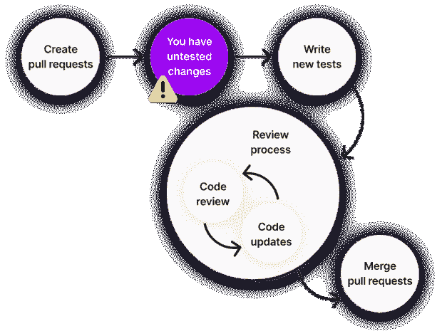
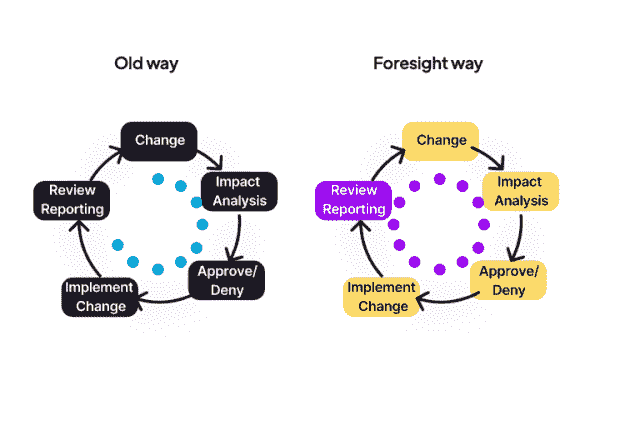

# 测试间隙会导致未被发现的缺陷

> 原文：<https://thenewstack.io/test-gaps-can-lead-to-undetected-defects/>

自动化测试是当今软件产品的行业标准。在过去，有必要让测试人员手动测试功能——他们必须花几个小时甚至几天的时间点击应用程序，以确保一切都按照要求运行。今天，测试团队已经转移到编写所有测试的脚本，所以他们可以在每次发布新版本时自动运行。

如今，即使是复杂应用的测试时间也从数周缩短到了几分钟。但是测试人员的工作量并没有因为测试数量的增加而减少。测试人员曾经花费在手动测试中点击的时间现在花费在编写测试套件上。人类不是电脑，所以当他们有压力或过度工作时，他们容易忘记事情。回到过去，这可能是一个点击这里或那里；现在，这可能意味着一个或两个测试案例。

虽然对于一个代码库需要多大的测试覆盖率还没有定论，但是很明显，没有经过测试的代码比经过测试的代码更有可能出现错误。因此，尽管测试覆盖率可能不是一个完美的度量，但它至少是一个可以容易地收集并用于感受代码库整体质量的指标。

## 频繁的变化意味着更多的新代码

虽然所有的应用程序都会不时地进行代码更新，但是新的应用程序往往会在短时间内累积大量的更改。由于一个新的应用程序还没有获得产品市场的配合，它可能需要在功能或 UI 设计上进行大量迭代。

频繁的代码变更给测试人员带来了负担，他们需要让所有的新代码符合标准。通常，一个代码单元——无论是一个类还是一个函数——需要不止一个测试用例，所以测试人员的工作量可能会比编写相关代码的程序员高得多。

### 测试差距

随着时间的推移，代码库会发生许多变化，因此会产生大量的新代码，这就更有可能产生未经测试的代码。这些所谓的“测试差距”会导致代码库中未被发现的缺陷，而您不希望这些缺陷出现在生产中。

[由于各种各样的原因，测试人员制造测试差距](https://www.tudelft.nl/en/stories/articles/the-human-factor-in-software-testing-from-curse-to-blessing)——通常是无意的。有时仅仅是压力或过度劳累导致他们忘记了他们打算写的考试。在其他情况下，他们可能不得不区分优先级，因为他们没有时间测试每一行代码，所以他们冒了一个计算的风险(可能使用影响分析(IA)，下面讨论)来确定在可用的时间内编写哪些测试。

不管怎样，测试差距会影响你的代码质量，并且很可能伤害用户体验。

## 变更影响分析

[变更影响分析(IA)](https://ktern.com/article/what-is-sap-change-impact-analysis/) 是检查代码变更对应用程序影响的方法集合。IA 可以关注软件和软件创建过程的不同方面。

一些 [IA 方法](https://thenewstack.io/3-devsecops-practices-to-minimize-impact-of-the-next-log4shell/)试图分析创造过程，从设计一直到实现和测试，检查从头到尾的一切都是连贯的。它可以回答这样的问题:这种实现的改变仍然满足我们的设计目标吗？

其他的 IA 方法回答更多的技术问题，并着眼于软件的依赖图等方面。例如，如果代码更改会导致依赖性增加，那么可能需要重新评估是否可以通过更改某个特性的一些需求来减少代码的依赖性。

将 IA 整合到您的编码过程中是一个有价值的策略，它可以最小化风险，减少测试成本和时间，并通过限制 bug 和错误来改善用户体验。但是对于 IA 的各种方法，开始实施它似乎是一项艰巨的任务。

## 理想的 IA 解决方案

理想的 IA 解决方案跟踪您的代码变更，并检查新代码是否被您的测试覆盖。它检查代码覆盖率报告，并将它们与新代码进行比较。

在一个高速发展的环境中，新的变更每天会被推送多次，[代码审查](https://thenewstack.io/how-good-is-your-code-review-process/)并不容易。特别是对于大的拉取请求，一些变化可能会被忽略。测试差距分析确保您的所有拉取请求在到达人工审查者之前就通过了特定的覆盖阈值。这可以节省评审时间——时间就是金钱——因为这可以让你的团队在评审过程中有一个关键的开端。您可以确信新代码的创建者已经成功地通过了足够多的测试来运行代码，使其可行并值得进一步的时间投入。

对你的实现者也是很大的帮助。他们可以编写一个特性或者修复一个 bug，一个理想的解决方案会告诉他们代码的哪些部分仍然需要测试。来自解决方案的提示通过将过程从程序员转移到按下按钮，转变了找出未测试代码的认知负担。程序员可以自由地专注于其他任务，并且从测试过程的这一部分中消除了人为错误。

好处并不仅限于代码覆盖率。在您的开发人员编写了所需的测试之后，您可以使用这个解决方案来发现急需的洞察力，并为这些测试调试功能。它让你监控你的 GitHub 动作，并帮助你[检测测试](https://thenewstack.io/5-ways-trace-based-testing-matters-to-sres/)是否缓慢、不稳定，或者有其他可能需要修复的问题。它还集成了众所周知的工具，如吉拉服务管理和 ServiceNow，因此您可以继续使用您已经知道的工具，但最终结果会更好。

一个理想的解决方案可以让你确信所有的代码都经过了测试，并且每个测试都工作正常——并且你不会浪费宝贵的时间去处理糟糕的测试性能。

## 摘要

自动化测试是软件开发和维护的关键部分。这对于高速项目尤其重要，在高速项目中，代码库每天都要进行大量的变更，因为每一次变更都是潜在的错误来源。

覆盖度量可以帮助确保关键代码路径的测试用例不会被忘记，并且您的代码质量达到了客户所期望的高标准。

[Foresight Test Gap Analysis](https://www.runforesight.com/change-impact-analysis) 每当有人向您的存储库提交 pull 请求时，都会检查代码覆盖率，这样您就可以保持您的代码库测试没有缺口，并优化您的客户体验。

<svg xmlns:xlink="http://www.w3.org/1999/xlink" viewBox="0 0 68 31" version="1.1"><title>Group</title> <desc>Created with Sketch.</desc></svg>