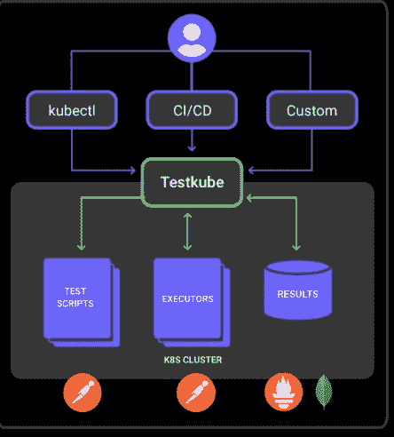

# TestKube:云原生测试的新方法

> 原文：<https://thenewstack.io/testkube-a-new-approach-to-cloud-native-testing/>

[Ole lens mar](https://www.linkedin.com/in/olensmar/)

[Ole 是 Kubeshop 的 CTO。Ole 在 20 世纪 90 年代末开始构建基于 HTTP/XML 的 API，并在包括 SmartBear 在内的几家初创公司和公司担任 CTO，还在 Ambassador Labs 担任产品架构师。他是面向 XML 的咨询公司 base8 和 Eviware Software 的联合创始人，在那里他创建了 SoapUI，这是最常用的开源测试工具之一。他从 2016 年初开始担任 OpenAPI 倡议的主席，直到 2020 年底。](https://www.linkedin.com/in/olensmar/)

当公司谈论现代化他们的技术栈或移除遗留基础设施时，它通常包括除了他们的测试工具链之外的一切——他们只是很高兴它没有被破坏。

虽然从简单的 web 应用程序到有状态的数据库，几乎所有的东西都已经转向更多的云原生架构，但是我们测试应用程序的方式仍然经常牢牢地停留在另一个时代。

这不是没有原因的:测试通常与开发工具和相关的工作流紧密集成，因为将它们作为构建的一部分运行，允许我们容易地检查构建的工件是否如它们应该的那样工作。然而，这也产生了一个紧密耦合的堆栈，它很容易改变，并且在面对故障时没有弹性。

Cloud native 旨在使事情更加模块化、可重用和松散耦合，然而紧密耦合的测试工具链与这些理想背道而驰。受限于某些工具和相关的工作流限制了跨单个测试、整个工作流和不同基础设施的测试模块化。

当只添加了一个小的错误修复或功能时，集成的 CI/CD 工作流通常会迫使您重新运行整个测试套件，即使可能只需要运行一次测试。一旦你建立了一个工作流程，作为一个测试人员，你被允许做的事情通常会受到你的 CI/CD 工具和你被给予的访问权限的限制。并且通常由您根据用于构建和测试您的应用程序的工具来拼凑一个一致的测试结果仪表板。最后，一旦您为一个集群或平台构建了测试工作流，重新开始可能比尝试将其移植到其他地方更容易，甚至保持它与您当前的基础架构相关也是一个挑战。

## **让测试云原生**

仅仅将测试放在像 Kubernetes 这样的云原生平台上也不会有多大帮助。提供测试环境也比较容易，特别是使用 GitOps 方法，但是处理不同的环境、集群网络、远程访问等等仍然是一个挑战。不幸的是，许多测试工具并不是“为 k8s 制造的”，这可能导致在使用它们来测试运行在 Kubernetes 上的应用程序时使用笨拙的方法。

为了帮助克服这些挑战并将测试带入云原生时代，有几件事情是必要的。首先，使您的管道更加可重用和模块化，以便在任何 CI/CD 或测试框架中使用，允许您快速适应解决方案中的变化，而不需要适应或创建与 CI/CD 或测试框架紧密耦合的完全不同的管道。其次，测试应该知道你的基础设施的状态，并集成到其中。通过将测试云本地化，我们可以更快、更自信地将代码投入生产。

## **在 Kubernetes 上测试云原生时代**

基于上面的见解，我们创建了 TestKube，这是一个开源的轻量级测试框架，采用了一种有点固执己见的测试方法。

1.  **测试包含在你的集群状态中。**

测试是使用 Kubernetes 结构和集群本身的服务来定义和执行的，确保您的应用程序和服务总是“可测试的”，而不是必须依赖于正确配置的、外部可用的工具和工件。测试执行是在集群内部执行的，不需要为了测试执行而配置/打开 Kubernetes 网络，也不需要外部依赖来验证事情是否正常工作。

测试执行可以由内部和外部触发器触发——ku bectl 命令、Kubernetes 资源更新，或者由 CI/CD 系统直接与 TestKube API 服务器交互。需要重新运行单个测试来验证配置图更新吗？没问题！还是在部署应用程序后运行整个测试套件，由 ArgoCD 触发？TestKube 已经覆盖了你。

2.  测试工作流程和结果是模块化的。

测试脚本、编排和执行器遵循一种通用的格式，这种格式可以用于任何类型的测试——功能、性能、安全性、一致性等。测试结果以一种通用的格式聚集在一起，并通过 API 暴露给外部工具，或者作为标准的度量标准，供 Prometheus、Grafana 等工具使用。这种模块性允许团队根据需要重新调整和重用测试，并且不再依赖于 Kubernetes 上测试相关活动的单一 CI/CD 工具的能力。

3.  **测试是环境感知和集成的。**

底层架构是开放和模块化的。由于本地 Kubernetes 结构，如定制资源和配置图，被用于配置和编排测试，GitOps 工作流和工具可以确保集群中的测试总是最新的。QA 工程师可以专注于为您的应用构建正确的测试，而不必担心如何或何时将它们部署到您的集群或环境中以供执行，同时他们仍然能够根据需要运行测试和分析测试结果。

## **我们在哪里，我们要去哪里**

鉴于上面列出的雄心勃勃的目标，TestKube 无疑是一个正在进行的工作，但已经处于交付其中几个目标的状态。我们已经开始支持 API 的 Postman 集合和 UI 的 Cypress 测试的执行，我们计划支持更多类型的脚本，包括 Selenium、K6、JMeter、SoapUI 和 Cucumber。查看最新的 0.8.0 版本，了解如何将多个脚本编排到复杂的集成测试中，并通过 TestKube 的测试结果仪表板获得集成的结果。

TestKube 是由开源加速器/孵化器 [Kubeshop](https://kubeshop.io/) 带给你的。

<svg xmlns:xlink="http://www.w3.org/1999/xlink" viewBox="0 0 68 31" version="1.1"><title>Group</title> <desc>Created with Sketch.</desc></svg>