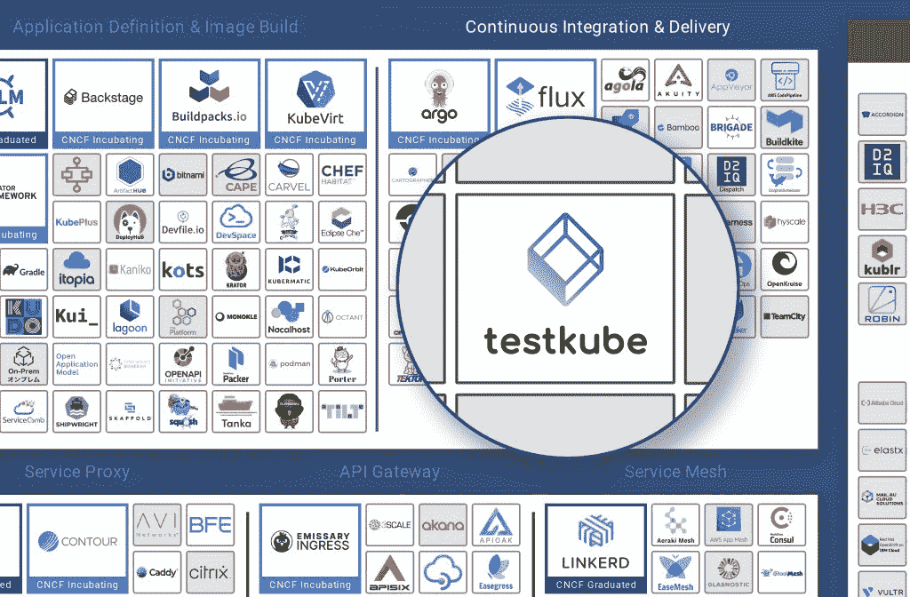
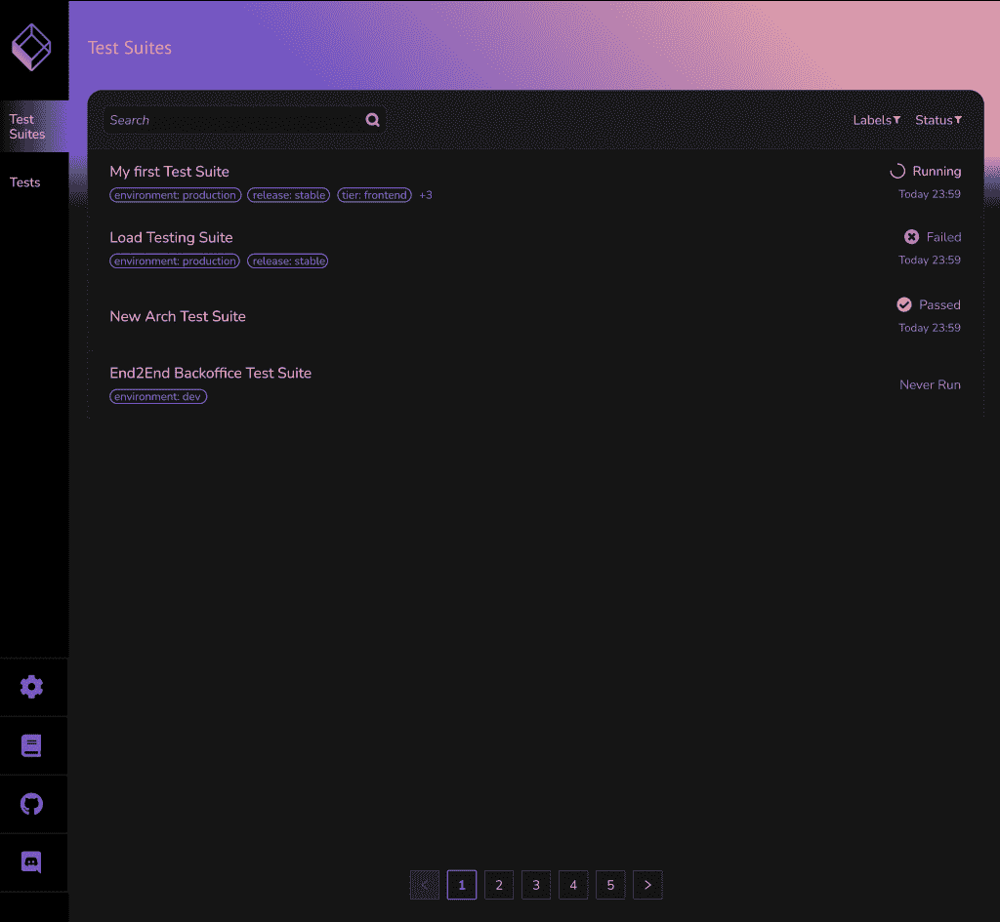
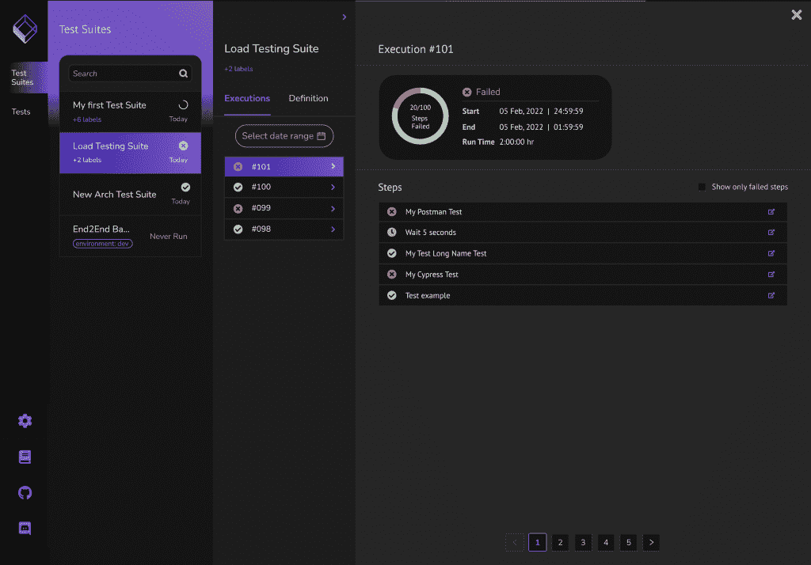
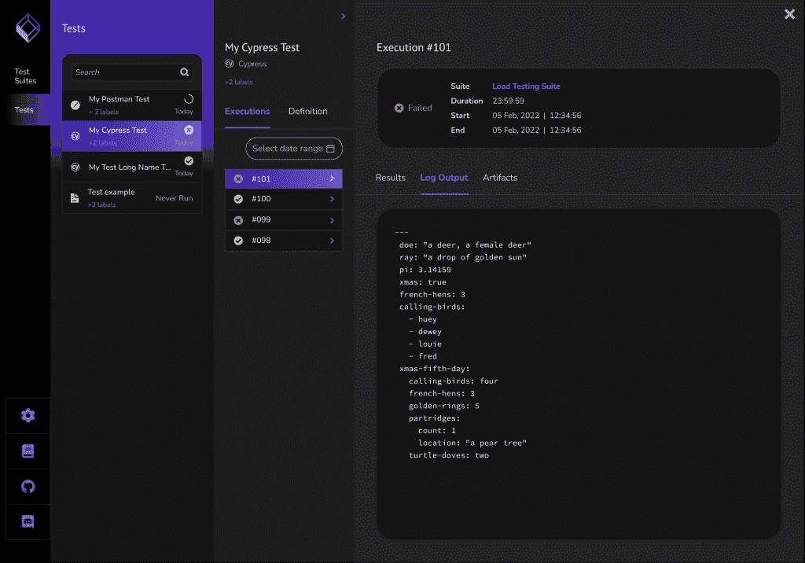
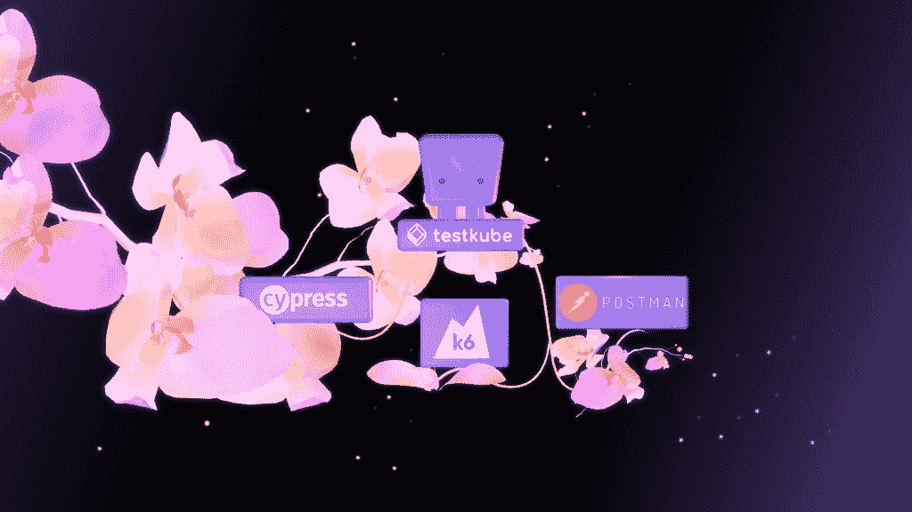

# test kube:Kubernetes 的云原生测试框架

> 原文：<https://thenewstack.io/testkube-cloud-native-testing-framework-for-kubernetes/>

 [最近，布鲁诺渴望为开源世界做出更多贡献，并加入了 Kubeshop。](https://pt.linkedin.com/in/bruno-lopes-a73b48103) 

根据云原生计算基金会的数据，CNCF 云原生景观中充满了数百个开源项目和价值约 15.6 万亿美元的开放核心公司。

对于每天都依赖云原生技术的企业来说，从小型开发公司到跨国企业，其价值甚至可能更高。

该领域由众所周知的类别组成，如数据库、配置管理、安全、监控和机器学习，每个类别都有一些项目最终改变了组织在云中创建、部署和维护应用程序的方式。想想 [Kubernetes](https://thenewstack.io/kubernetes-and-the-cloud-native-community/) ，Helm，Redis，Grafana，Ansible 等等。

至少对我们来说，可能有些令人惊讶的是，在 CNCF 的版图中没有专门的测试/QA 类别。目前，测试已经被分配到持续集成和交付类别中。

这就是我们如何开始使用[test kube](https://testkube.kubeshop.io/)——反思我们自己使用 Kubernetes 的测试痛苦，并试图准确理解我们过去使用 Postman 和 Cypress 等行业标准工具部署失败的地方和原因。我们开始构建一个框架，将测试编排和执行集成到 Kubernetes 和您的 CI/CD/GitOps 管道中。

今天，我们发布了这个云原生测试框架的 1.0 版本，我们认为这是生态系统中的第一个。我们愿意认为我们正在为定义 CNCF 景观中的新测试类别迈出第一步，但时间会证明一切。我们的挑战是明确的。

## Kubernetes Testing 的 Testkube 愿景是什么？

我们构建 Testkube 是因为我们相信云原生软件应用不仅需要新的工具来构建、部署或监控，还需要测试。当今流行的测试工具，如 Postman、Cypress 或 K6，并不是专门为 Kubernetes 设计的。我们想，“我们如何才能弥合这一差距？”

## 解开测试编排和执行链

我们认为测试不应该与 CI/CD 结合使用。

在许多团队中，自动化测试与他们的 CI/CD 工作流紧密地结合在一起，这使得在不对 CI/CD 管道进行一些更改的情况下，很难更改和试验新的测试工具。有了 Testkube，在选择如何在测试或生产环境中运行应用程序的测试时，您不再受 CI/CD 工具的束缚。Testkube 通过 Testkube CLI 或其 API 服务允许测试作为集群的一部分被存储、执行和管理，从而简化了测试管理、编排和执行。

## 自带应用测试工具

我们相信您应该能够在您的 Kubernetes 集群上使用任何测试工具。

您应该能够从您的集群内部运行功能、负载/性能、安全性和合规性测试，而不必将测试包装在复杂的 Docker 容器中，向您的集群授予有风险的网络访问权限，或者依赖外部服务来执行测试。

Testkube 为 Postman、Cypress.io 或 K6 等流行的测试工具提供了一个带有开箱即用执行器的模块化测试执行框架，允许团队使用现有的测试资产。您还可以为您想要在集群中运行的任何类型的测试创建自己的执行器。

## 单一的“质量控制平面”

我们认为您应该对集群中的所有测试结果有一个整体的看法。

我们建议更好的工作流程，而不是不断地运行 kubectl 并返回日志，以了解测试是如何执行的，调试问题并查明故障。这应该发生在一个单一的仪表板上，它不仅返回结果，还返回日志和工件，用于可操作的 QA 分析。Testkube 1.0 正在为实现这一愿景迈出一步。

所包含的仪表板为您的 Kubernetes 集群提供了一个“警示灯”，就像您为您的汽车提供的警示灯一样，它会告诉您出现了问题，并存储所有必要的上下文，以便对集群本身的问题进行诊断和故障排除。

## 用于测试的集中式 Kubernetes 仪表板

Testkube 的用户界面可以让你一目了然地看到所有的测试和测试套件，以及它们是否已经通过、正在运行或者计划运行的细节。

在仪表板上，您可以快速地看到哪些测试套件失败了。只需两次点击，您就可以了解哪些特定的执行失败了，它们何时开始，它们的运行时间以及您可能想要进一步调查的相关步骤。

既然您已经知道您的 Postman 或 Cypress 测试都失败了，那么您可以探索单独的执行来查看结果、日志输出和任何适用的工件。您拥有所有合适的资源来修复 bug，而不是再次运行 kubectl 或者在多个浏览器标签之间切换来比较日志和工件。

我们还添加了标签功能，以有意义的方式帮助组织您的测试套件和单个测试。因为 Kubernetes 具有许可标签，所以您可以使用已经应用于 Kubernetes 资源和 Kubernetes 节点的相同标签来丰富 Testkube 考虑像后端、前端、登台、生产等标签——以缩小范围并帮助集中您的测试工作。

## 更熟悉的 Testkube CLI 体验

此时，您可能已经熟悉了 kubectl 的语法:`kubectl + command/verb + resource type + name`。如果这不成为你肌肉记忆的一部分，你就无法在 Kubernetes 的世界里走得很远。我们已经彻底改造了 Testkube 的 CLI 体验，以匹配您已经熟悉的内容。

例如，`testkube **get** test [test-name]`现在返回关于特定测试的信息。

这可能看起来是一个小变化，但我们认为共享语法将有助于开发人员更快地熟悉 Testkube，并且我们都致力于改善开发人员对云原生测试的总体体验。

## 自带 Kubernetes 测试工具

Testkube v1.0 的最后一个新特性是通过执行器将任何测试工具/平台与 Testkube 执行引擎集成的可能性。

Testkube 包括用于 UI 测试的 Cypress 执行器和用于提高后端应用弹性的 Postman 执行器，我们很高兴为开源负载测试工具 [k6](https://k6.io/) 提供一流的支持。

K6 允许开发人员使用 API 和 Javascript 编写测试，这些测试是灵活的，模拟了使 Kubernetes 集群紧张的真实场景，包括 CPU 和内存使用情况、持久性卷上的磁盘使用情况以及整体资源使用情况。这是一个很好的工具，可以用来检查您的集群在各种情况下的可靠性和性能，将简单的入门与大量可用的复杂性结合起来。

## 第一次大的社区胜利

k6 executor 是由外部贡献者 [Leander Reimer](https://github.com/lreimer) 开发并贡献给 Testkube 的，对于像我们这样年轻的项目来说，这是一个令人兴奋的发展。当我们的团队宣布我们希望支持 k6 将负载测试引入 Kubernetes 集群时，他恰好在独立地研究这个执行器。我们很高兴能合作推出代码。

如果您有兴趣构建自己的执行器来扩展您的云原生测试能力，我们已经将代码库设计成完全模块化的。不需要对 Testkube 整体有很深的理解。我们已经收集了一些资源来帮助你开始使用[贡献的](https://kubeshop.github.io/testkube/contributing/)，包括一个关于[创建一个定制执行器](https://kubeshop.github.io/testkube/executor-custom/)的文档和一个[模板执行器库](https://github.com/kubeshop/testkube-executor-template)给那些想要构建一个可靠框架的人。该模板使用 Go，但是您可以用任何其他编程语言编写执行器，比如 Rust、Javascript、Clojure 等等。

## 展望 Kubernetes 测试的未来

虽然 Testkube v1.0 是一个重要的步骤，但我们有很大的野心。我们的下一步工作将扩展仪表板的功能，例如提供关于您的测试随时间变化的强大报告，或者通过相关的横截面来帮助识别您组织的开发生命周期中的增长区域。

我们对 Cypress，Postman，k6 的支持只是一个开始。我们已经在和 Reimer 合作开发 Maven 和 Gradle 的执行器，并且我们正在研究增加对 SoapUI、Selenium、Cucumber 和其他的支持。

一旦你有时间安装 Testkube 并定义你的第一个测试，我很想听听你的经历。[与我预约时间](https://calendly.com/bruno-at-kubeshop/30min-1),我们会想出如何让 Testkube 今天对你更好。还是加入我们的[不和](https://kubeshop.github.io/testkube/installing/)！随着我们开始展望 v2.0，现在是帮助塑造云原生测试未来的最佳时机。

<svg xmlns:xlink="http://www.w3.org/1999/xlink" viewBox="0 0 68 31" version="1.1"><title>Group</title> <desc>Created with Sketch.</desc></svg>