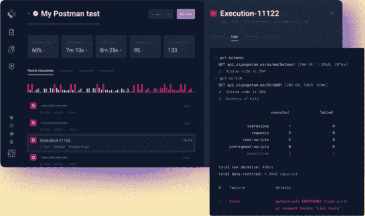
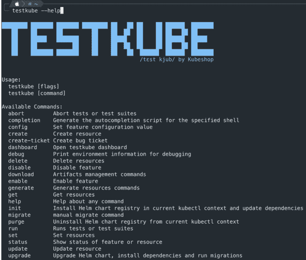
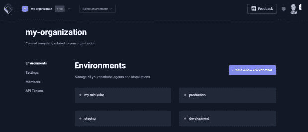
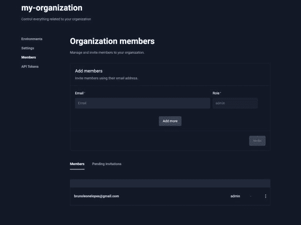

# Testkube 在 Beta 版中迁移到了云端

> 原文：<https://thenewstack.io/testkube-moves-to-the-cloud-in-beta-release/>

我们很高兴地宣布 [Testkube Cloud](http://cloud.testkube.io) 的测试版，这是一个强大而灵活的平台，允许您在所有的 Kubernetes 环境中运行测试。Testkube Cloud 是我们流行的开源测试框架[的基于云的版本。它提供了新的特性和功能，使开发人员更容易有效地测试他们的应用程序。在这篇博文中，我们将提供 Testkube Cloud 的概述，并重点介绍它的一些关键特性和优势。](http://testkube.io)

## Testkube 是什么？

Testkube 是一个面向测试人员和开发人员的 Kubernetes-native 测试框架。它允许您在 Kubernetes 集群中本地编排和执行所有测试，并轻松地将它们与 CI/CD 或 GitOps 管道集成。

不管您使用的是什么测试框架，Testkube 都提供了一种在您的 Kubernetes 环境中执行测试文件的快速方法，它提供了一个广泛的[列表，可以开箱即用地运行测试，或者允许您快速](https://testkube.io/integrations)[创建自己的](https://kubeshop.github.io/testkube/test-types/container-executor)。

为了查看所有测试的状态并在测试失败时进行调试，Testkube 提供了一个强大的仪表板，允许您管理测试并实时查看它们的状态和执行情况。

或者，如果您更喜欢命令行，或者想要在 CI/CD 系统中自动执行某些操作，您可以使用 [Testkube 的 CLI](https://testkube.io/download) 。

## Testkube 云的主要特性

Testkube Cloud 构建在流行的开源项目[之上，增加了用户管理、新的认证机制和环境管理等功能。](https://github.com/kubeshop/testkube)

### **多种环境的分布式可扩展测试**

它的内置支持跨所有环境收集和分析测试结果，允许开发人员快速识别和修复问题。这极大地提高了在任何 Kubernetes 环境中测试的整体效率和有效性。

### **用户管理**

无论你是一个只有几个开发人员或测试人员的小团队，还是一个拥有数百名工程师的大企业，管理和控制谁可以访问什么总是很重要的。在 Testkube Cloud 中，现在可以向您的组织添加用户，并允许他们访问您的 Kubernetes 环境。

值得注意的是，在测试阶段，添加到您组织中的所有成员都可以访问您组织中的所有环境。

在接下来的几个月中，当我们为下一个 Testkube Cloud 版本推出新功能时，我们将添加组织角色和环境角色，这将帮助您以细粒度的方式定义每个人对您的每个 Kubernetes 环境拥有哪些访问和权限。

### **认证机制**

Testkube Cloud 的 API 令牌认证特性允许您使用 API 令牌安全地访问您的 Testkube 帐户和资源。有了这个特性，您可以轻松地生成和管理 API 令牌，这些令牌可用于验证您的 API 请求。这使得自动化任务和将 Testkube 与其他工具和系统集成变得容易。

API 令牌认证是安全可靠的。令牌经过加密并安全存储，您可以根据需要轻松撤销或轮换它们。Testkube Cloud 还支持多级访问，因此您可以控制每个令牌允许访问哪些资源和操作。

无论您是希望自动化任务的开发人员或测试人员，还是希望将 Testkube 与您的工作流集成的 DevOps 工程师，Testkube Cloud 的 API 令牌认证都是完美的解决方案。

## 免费注册

我们鼓励所有测试人员和开发人员试用 Testkube Cloud，并提供您的体验反馈。Testkube Cloud 的测试版现已免费发布，我们期待听到您的想法和建议。在这里注册。

<svg xmlns:xlink="http://www.w3.org/1999/xlink" viewBox="0 0 68 31" version="1.1"><title>Group</title> <desc>Created with Sketch.</desc></svg>