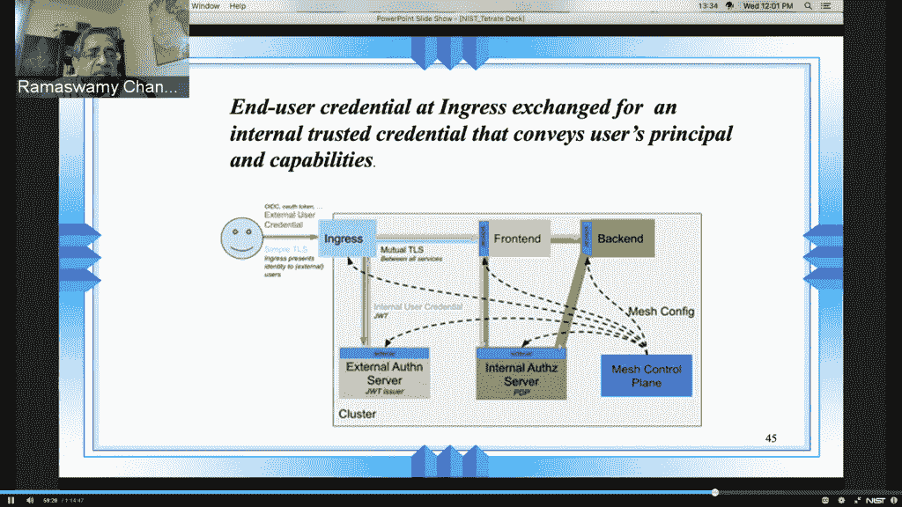

# Tetrate:服务网格可以是分布式系统的安全内核

> 原文：<https://thenewstack.io/tetrate-a-service-mesh-can-be-the-security-kernel-for-distributed-systems/>

Tetrate 高级工程师 [Zack Butcher](https://www.linkedin.com/in/zack-butcher-339a2180/) 在由[美国国家标准与技术研究院](https://www.nist.gov/) (NIST)和 [Tetrate](https://www.tetrate.io/?utm_content=inline-mention) (一家基于 [Istio](https://istio.io/) 的高级服务网格供应商)举办的关于零信任安全的虚拟会议上建议，如果你打算使用服务网格来管理一组微服务，你不妨开始将服务网格视为这些分布式系统的“安全内核”。

“服务网格本身可以是一个安全内核，是我们系统中一个严格控制的元素，我们可以审计，可以更密切地检查，以断言它是安全的，”他在上个月举行的活动中告诉虚拟 NIST 的观众。

除了微服务系统的监控、路由和发现之外，[服务网格](https://thenewstack.io/category/service-mesh/)还集中了许多安全功能。它从应用程序本身卸载了所有可怕的身份验证和授权任务。理想情况下，每个应用程序的 sidecar 可以充当一个不可绕过的执行点。

当然，Butcher 承认，有了所有这些控制系统的能力，sidecars 本身将成为攻击者的磁铁。但这是一个功能，而不是一个缺陷，“因为我们知道攻击可能是集中的，而不是分散到整个组织的所有应用程序代码，”他说。

布彻说，服务网将有利于经营一家开发店。服务网格可以在连续的基础上提供策略实施。对于许多高度管制的行业来说，这是一个巨大的需求。

## 服务网格框架

Butcher 与 NIST 合作，为微服务制定了一个基于服务网格的安全系统计划，并由此产生了 NIST 专刊“[使用服务网格架构构建安全的基于微服务的应用](https://csrc.nist.gov/publications/detail/sp/800-204a/final)”(NIST SP 800-204 a，面向 NIST 发烧友)。该文档承诺“为基于代理的服务网格组件提供部署指导，这些组件共同形成一个健壮的安全基础设施，以支持基于微服务的应用程序。”

这种框架将在最终用户和服务级别支持多种授权和认证服务。NIST 计算机科学家 Ramaswamy Chandramouli 在他自己的演讲中解释说，理想情况下，它将支持那些已经在企业中使用的授权/认证系统。

该框架建议使用 OASIS 标准、[可扩展访问控制标记语言](https://www.oasis-open.org/committees/tc_home.php?wg_abbrev=xacml) (XACML)，以及 NIST 自己的下一代访问控制(NGAC)架构，如 [INCITS 565-2020](https://standards.incits.org/apps/group_public/project/details.php?project_id=2328) 所述，该架构提供了管理授权/认证组件的标准 API。服务网格将所有配置数据推送到连接到每个应用的侧柜，以及处理流量的数据平面代理，以确保策略得到执行。外部生成的最终用户凭据可以在入口处交换为代表用户权限的内部凭据。

在这种方法中，“服务网格提供了许多不同的操作保证:传输中的加密、经过验证的服务身份、这些可以充当多执行点的代理，”Butcher 进一步解释道。“使用这些技术，我们可以保护网格中的应用程序，并且可以使用它来部署和保护我们实际的身份认证系统本身。”

本次活动的所有演讲都可以在 NIST 网站上观看。

由 [Markus Spiske](https://unsplash.com/@markusspiske?utm_source=unsplash&utm_medium=referral&utm_content=creditCopyText) 在 [Unsplash 上拍摄的特征图像。](https://unsplash.com/s/photos/kernel?utm_source=unsplash&utm_medium=referral&utm_content=creditCopyText)

<svg xmlns:xlink="http://www.w3.org/1999/xlink" viewBox="0 0 68 31" version="1.1"><title>Group</title> <desc>Created with Sketch.</desc></svg>