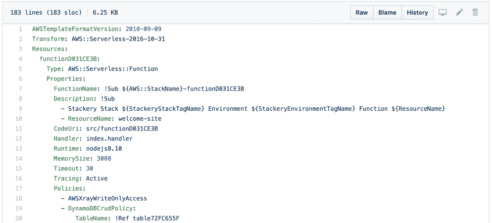
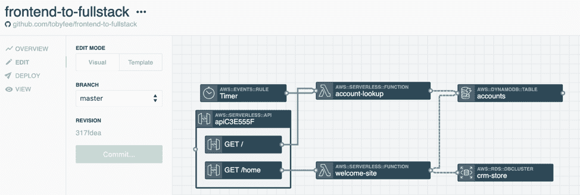

# 12 因素应用#4:无服务器不仅仅是功能

> 原文：<https://thenewstack.io/the-12-factor-app-4-serverless-is-more-than-functions/>

Stackery 赞助了这篇文章。

*这个[系列文章](https://thenewstack.io/12-factor-app-1-why-serverless-version-control-is-critical/)探讨了我们需要做些什么来遵循一个 [12 因素 App](https://12factor.net/) 的设计需求，以便于开发和维护。请每周查看未来的分期付款。*

 [托比·费

Toby 是 Stackery 的社区开发人员。她的角色和经历结合了软件工程师、作家和技术讲师的工作，用新兴工具构建有趣的项目，并与世界分享她的发现。在加入 Stackery 之前，Toby 是 NWEA、瓦卡萨和新遗迹公司的工程师。](https://www.stackery.io/) 

现在是下午 6 点，网站关闭了。下午晚些时候的一次部署中断了一项服务，运营团队正狂热地试图找出中断的原因。该服务团队的经理收到一条 SREs 消息:

SRE:有没有可能更新需要一个特定版本的 redis？

经理:我们的服务不使用 redis。

*SRE:我们看到的错误看起来像是期望“redis ”,但却没有实现。*

经理:我们根本不用 redis 肯定是另一个团队破坏了排队。

SRE:今天没有其他车队发布更新。

经理:可能“redis”配置错误……祝你好运！

事实上，更新引入了新的“redis”要求，在受影响的虚拟机(VM)上安装“redis”解决了该问题。经理没有意识到这一变化。

这种可怕的场景不仅限于虚拟机，它还会影响无服务器环境。事实上，如果你没有遵循我上一篇文章中提到的原则，对无服务器功能的“配置”的更改会以一种极难排除故障的方式中断服务。这就引出了 [12 因素应用](https://12factor.net/)的原则四:

### 四。后台服务:将后台服务视为附属资源

在所有原则中，这是我最喜欢的。既不是明确禁止做某事，也不是绝对要求。相反，它更像是一个围绕灵活而强大的链接的指南，确保您的应用程序可以承受大的变化和小的危机而不会中断。

直接引用 [12 因素应用](https://12factor.net/backing-services)的话:后台服务是应用在网络上消费的任何服务，作为其正常操作的一部分。示例包括数据存储(如 MySQL 或 CouchDB)、消息传递/排队系统(如 RabbitMQ 或 Beanstalkd)、出站电子邮件的 SMTP 服务(如 Postfix)和缓存系统(如 Memcached)。

一段时间以来，我一直在说，我们必须将无服务器应用程序视为比功能更多的。AWS 上的无服务器应用不仅仅是 Lambdas。但是这些联系的本质是什么呢？数据库应该与函数中的代码紧密相连吗？也就是说，从测试数据库而不是开发数据库中提取的相同功能代码，应该被视为一个全新的应用程序吗？答案似乎是“不”，但我们*确实*想把我们的应用程序作为一个整体来考虑，而不是完全忽视后台服务。

无服务器堆栈的确切形状是什么？李小龙说得好:“你必须是无形的，无形的，像水一样。当你把水倒在杯子里，它就变成了杯子。当你把水倒进瓶子时，它就变成了瓶子。当你把水倒进茶壶时，它就变成了茶壶。水可能会滴落，也可能会破碎。变得像水一样我的朋友。”《李小龙:一个战士的旅程》(2000)。图片来自[维基百科](https://en.wikipedia.org/wiki/Bruce_Lee)。

“附加资源”意味着应用程序代码和资源之间的灵活连接，其中:

*   资源是用应用程序代码提供的；
*   您可以交换资源，而不必重写任何应用程序代码。

最明显的场景是从开发环境转移到生产环境，但是另一个常见的情况是某个特定的资源出现故障，需要替换。虽然你不太可能在 AWS 内部遇到这个问题，但是你可能需要在 AWS 云之外加入服务，或者为了追求更低的成本而更换一些东西。

另一个可能的场景是金丝雀模式，在这种情况下，您正在尝试一种不同的架构，只占您流量的一小部分。AWS 为此提供了一些内置工具(感谢[崔琰](https://github.com/theburningmonk)在他关于[生产就绪无服务器](https://www.manning.com/livevideo/production-ready-serverless)的精彩课程中指出了这一点)。在这种情况下，我们希望能够用相同的支持服务向不同的 lambda 发送一些流量。

### 在无服务器中我们如何遵循这个原则？

这是我最喜欢写的原则，因为默认情况下*这是无服务器做得很差的事情。*通过在 AWS 控制台中隐藏配置，并依靠控制台配置将 lambda 连接到资源，AWS Lambdas 通常需要大量的重新工作来切换出后备服务。

最重要的事情是使用一些工具将我们的整个应用程序(有时这里使用术语“堆栈”)视为一个单一的实体。像 DynamoDB、队列和 API 网关这样的后台服务需要在一个配置中一起考虑。直到最近，许多服务试图将这一功能捆绑到 AWS 上，其中包括 apex.run、claudia.js 和 Serverless Framework。现在 AWS 已经发布了自己的开源标准，即无服务器应用模型(SAM ),它直接与 CloudFormation 一起工作，将整个应用程序作为单个配置来处理，并简化部署。

AWS SAM 模板文件。

在这个领域，Stackery 可以通过在图形画布中向您显示整个应用程序来简化工作。

这有助于你将应用程序视为“一个整体”，但是我们如何确保我们可以在不改变应用程序代码的情况下改变资源呢？

### 使后备资源可交换

为此，我想指出我在上一篇文章中提到的环境配置的精心设计。但是，除了拥有可以轻松更新的环境变量之外，这一设计原则还会影响您编写无服务器代码的方式:理想情况下，只要应用程序代码引用自身之外的代码，它就应该关注环境变量，即使它类似于您认为不应该更改的服务 URL。例如:在早期阶段，您可能希望新注册或用户错误进入警报系统和 Slack 集成。为了严格遵循这一原则，所有这些服务 URL 都应该是环境变量。

结果应该是，如果你正在寻找和改变一个后备服务，需要更新的点应该作为[环境变量](https://docs.aws.amazon.com/lambda/latest/dg/env_variables.html)超级可见，并且更容易改变。

### 添加到 AWS 以获得帮助

这也是实现无服务器安全的[扭锁的一个巨大好处:如果支持服务的配置出现在你的源代码中，你可以得到通知，甚至阻止代码的执行。这提高了安全性，并使您的应用程序更加灵活。](https://www.twistlock.com/solutions/serverless-security-aws-lambda-azure-google-cloud/)

我自己在 Stackery 的团队增加了管理环境配置和使环境可移植的工具。您可以对多个堆栈使用相同的环境，从而节省精力并确保一致性。

通过 Pixabay 的特征图像。

<svg xmlns:xlink="http://www.w3.org/1999/xlink" viewBox="0 0 68 31" version="1.1"><title>Group</title> <desc>Created with Sketch.</desc></svg>