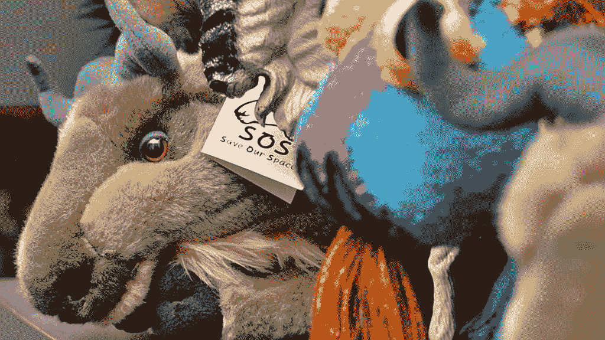

# 2021 年 TNS 礼物指南:帮助联系社区的 4 种方法

> 原文：<https://thenewstack.io/the-2021-tns-gift-guide-4-ways-to-help-connect-to-community/>

延续[安](https://thenewstack.io/exploding-kittens-geeky-gifts-secretly-wish-got/) [年度](https://thenewstack.io/geeky-gifts-secretly-wish-wed-gotten/) [传统](https://thenewstack.io/tech-y-gifts-geeks-2017-edition/) [在](https://thenewstack.io/a-very-geeky-christmas-four-gift-ideas-for-the-programmer-in-your-life/) [TNS](https://thenewstack.io/tns-gift-guide-for-2020-practical-projects-and-fabulous-fun/) 上，我们为你生活中的那个技术型的人准备了一份礼物指南。对于他们好奇的头脑和渴望新奇的心来说，这些礼物提供了新的体验和好玩的东西——但对于 2021 年来说，还有更多的东西。

经过了不同以往的一年，也许这些礼物能带给我们最需要的东西:一种团体感。

在这个传统的团聚时刻，这里有四个礼物创意，不仅承诺了全新的节日奇迹，还承诺了一些全新的朋友与他们分享。

## 1.人体工程学键盘(及其风扇)

真正符合人体工程学——这是公司的名字——正在为[提供一个特别的 40%假日折扣](https://trulyergonomic.com/ergonomic-keyboards/),它声称这是“地球上最舒适的键盘”他们的手指定位分离键盘(品牌为[“Cleave”](https://trulyergonomic.com/ergonomic-keyboards/mechanical-keyboards/products/cleave-truly-ergonomic-mechanical-keyboard/))甚至可以在三种打字模式中的一种模式下购买——静音、点击或带触觉反馈的静音。

“请放心，无论您选择哪种开关，您都将享受无与伦比的舒适性和响应性，”它的网页吹嘘道。

但这只是在线论坛上讨论的关于人体工程学键盘解决方案的许多创新打字选择之一，包括 Reddit 上的一个用户最近发布了一张[他们在过去四年里尝试过的所有古怪分离键盘的“全家福”](https://www.reddit.com/r/ErgoMechKeyboards/comments/rijmgr/all_my_keyboards_since_2017_a_family_photo/)。

在这个[社区](https://www.reddit.com/r/ErgoMechKeyboards/comments/rhp76b/dao_choc_ble_open_source_wireless_split_keyboard/)中，有一个强大的[自己动手队伍](https://www.reddit.com/r/ErgoMechKeyboards/comments/ri2udo/sourcing_bulk_components_for_diy_builds/)，一些修补者甚至完全放弃了 QWERTY 风格的布局[，转而使用自制的“合唱”键盘](https://www.reddit.com/r/ErgoMechKeyboards/comments/pd6dkb/chordie_typing_demo/)(就像法庭记者使用的那种只需敲击几下键盘就能键入整个单词的键盘)。

最棒的是分享发生了——不仅仅是令人自豪的替代键盘的照片，还有运行它们的代码，几乎让读者大胆地组装相同的现成硬件组件并自己制作一个。在某种程度上，你不仅仅得到了一个键盘，还得到所有等着和你讨论它的修补匠朋友。

## 2.MST3K 的新会所

今年，你还可以邀请你最喜欢的极客和一些老电视朋友一起参观——用他们自己的[一年通行证去一个新的在线俱乐部](https://makemoremst3k.backerkit.com/hosted_preorders/cart)，在那里他们可以聚在一起，笑着，看电影——质问木偶机器人。

“神秘科学剧院 3000”历经 33 年，从明尼阿波利斯的当地频道，到喜剧中心，科幻频道，最终到网飞。现在，36，581 名支持者正在探索一种创新的融资模式，他们承诺总计 6，519，019 美元用于建设 Gizmoplex，这是一个在线剧院，幸运通行证持有者将终身获得 13 集新创作的极客友好节目*和* 12 场每月直播活动。(还有 12 个附加的“短裤重复片段”)

只需 95 美元的特别圣诞价格(从 120 美元打折)，你就会收到一张彩色礼券(可打印的 PDF 格式)，持有者可以在几周后所有的娱乐活动开始时获得虚拟电影院的一个座位。(随着时间的推移，演员们会质问每一个人，从加梅拉和蝙蝠女侠到杰克·帕兰斯 1979 年翻拍的赫伯特·乔治·威尔斯的《未来的形状》)

你甚至可以升级你的礼物——不仅仅是 t 恤、帽衫、海报和补丁。只需 50 美元，他们甚至会把你的名字出现在下一集的片尾字幕中，他们甚至会在网上出售与该剧深受喜爱的创作者乔尔·霍奇森(Joel Hodgson)合作的课程，内容涉及与该剧相关的主题，如机器人木偶表演和“发明与魔法”

该特许经营权也将恢复美国的现场巡演，此前运气不好的是在 2020 年初推出。2022 年，该剧将继续上演(现在被重新命名为“时间泡泡之旅”)，一些新演员将古老的魔法带给他们在中心地带的所有粉丝。(本周 [30 城巡演](https://mst3klive.com/events/)在加州找到了核心的 MST3K 剧团:三藩市、洛杉机和圣地亚哥。)

MST3K 的新虚拟家庭提醒人们，经过这么多年——有些时间比其他时间长——我们都*让*成为了不太遥远的未来，在那里，昔日的俗气电影可以直接传输到你的手机上。

在今年年底，霍奇森本人将返回 Gizmoplex，帮助人类和机器人诘问 2014 年的假日电影 [*圣诞龙*](https://www.youtube.com/watch?v=N50pPqlCcIo) 。

## 3.Linux +手机

这个圣诞节也意味着我们正在接近一年中那个神奇的时刻，我们的 3G 连接将永远消失。“这将影响 3G 手机和某些不支持 LTE 语音(VoLTE 或 HD 语音)的老款 4G 手机，”FCC 的一个网页澄清道。

如果你爱的人想要接听电话或接收短信(甚至拨打 911)，他们可能会在市场上购买一部新手机。幸运的是，高科技人群有一些特别独特的选择。

这是一个辉煌的日子，经过多年的发展，Purism 在 2020 年 11 月开始大规模生产其 Librem 5 智能手机(在 2017 年的众筹活动成功筹集了超过 200 万美元之后)。为了回馈社区，Purism 承诺无止境的“终生”更新——漏洞修复、安全更新、新特性，应有尽有。

注重隐私的 Librem 5 提供了新颖的硬件，如物理“kill”开关，让你可以立即切断 WiFi 或蜂窝连接(以及相机或麦克风)。它配备了所谓的“非焊接、易于维修的电池”

而且因为是纯 Linux，所以可以运行所有你喜欢的 *Linux* 应用。比如 [telnet](https://thenewstack.io/the-lost-worlds-of-telnet/) 。一个 2019 年的纯粹主义视频显示，它连接到一个 telnet 网站，输出一个全 ASCII 艺术版的*星球大战*。(整部电影。)试试在你的安卓手机上做*那个*…

[https://www.youtube.com/embed/FrX_UL0P1rs](https://www.youtube.com/embed/FrX_UL0P1rs)

视频

去年[一篇纯粹主义的博客文章](https://puri.sm/posts/investing-in-real-convergence/)解释说，Librem 5 最终是一台你可以放在口袋里的台式电脑。(所以当你在浏览网页时，“火狐不是某种定制的移动叉子，它只是桌面火狐。”)这不仅仅是一部手机，而是一场运动，这篇博文认为:

“纯粹主义认为，建造 Librem 5 只是发起数字权利运动的一步，在这场运动中，我们人民捍卫我们的数字权利，我们将你和你家人的数据控制权放回它应该在的地方:在你自己的手中。”

不幸的是，在 2021 年，Librem 5 一直面临着[供应链问题](https://puri.sm/posts/the-ball-and-supply-chain/)，新订单的交付周期[现在是 52 周](https://shop.puri.sm/shop/librem-5/)(而其价格已经上涨到 1199 美元)。一种选择是 PinePhone，这是另一款更便宜的 Linux 手机，摄像头分辨率较低，但屏幕略大。

与 Librem 5 一样，它也宣传其易于维修的特性，以及用于连接、摄像头和麦克风的保护隐私的物理切断开关。它的显著特点是六个[弹簧针](https://en.wikipedia.org/wiki/Pogo_pin)用于连接各种硬件外设，如全尺寸键盘或无线充电盒。

pine phone[今年也面临着组件短缺](https://www.pine64.org/2021/12/15/december-update-a-year-in-review/)，但是在他们的网站上报告说，这可能会影响其其他产品的可用性，他们仍然期望 PinePhone [全年可用](https://www.pine64.org/availability-and-shipping-status/)。

## 4.FSF 会员，Merch 和更多

在过去的 12 年里，自由软件基金会(FSF)一直在出版它自己的[道德技术捐赠指南](https://www.fsf.org/givingguide/v12/?pk_campaign=fall21)，现在重点推荐最自由的 Android 操作系统和应用程序库，以及最自由的无 DRM 的媒体和电子书(以及购买它们的地方)。

该指南还推荐了一些真正的极客礼物，如 Taurinus X200 笔记本电脑，它在 BIOS 微码中一直运行免费软件，以及 [NeuG USB 真随机数发生器](https://shop.fsf.org/storage-devices/neug-usb-true-random-number-generator)“给你生活中的密码极客”(当你的数字可以从[一个实际的物理过程](https://en.wikipedia.org/wiki/Hardware_random_number_generator)中获得时，为什么要满足于算法生成的数字的固有可预测性呢？)

FSF 最近的一篇博客文章还提出了一个令人愉快的建议，即通过安装一些免费软件来升级你所爱的人的一些旧硬件，给他们一个共享学习体验的礼物，并“成为一个全球用户社区”

但除此之外，该基金会还向其组织出售会员资格，承诺“每个新成员都会成倍地增加我们的影响力和我们做出改变的能力”——这带来了一些很酷的额外待遇。

FSF 特别设计的会员卡具有折叠式 USB 连接器和 16g 的存储空间，预装了完全免费的 GNU/Linux 发行版 Trisquel Live。(“随身携带——随时随地共享 GNU/Linux！”)

基金会成员还可以在梦寐以求的 member.fsf.org 域名中获得五个电子邮件别名，并免费参加三月份在波斯顿举行的 LibrePlanet 大会。最棒的是，会员购买所有 [FSF 商品](https://shop.fsf.org/)都享受 20%的折扣，提供更多古怪的 t 恤、补丁、别针，甚至还有一套特别的 FSF 35 周年纪念袜。古怪新奇的 merch 包括一个 FSF 主题的 Magic 8 Ball 风格的“建议球”——以及该基金会一直受欢迎的 gnu 填充婴儿玩具(如图)。

“假日季节是让软件自由的信息在每个人的嘴唇上，以及在全球的厨房餐桌周围传播的最佳时机，”FSF 的博客文章建议道。它最终证明了“自由是最伟大的礼物。”

<svg xmlns:xlink="http://www.w3.org/1999/xlink" viewBox="0 0 68 31" version="1.1"><title>Group</title> <desc>Created with Sketch.</desc></svg>