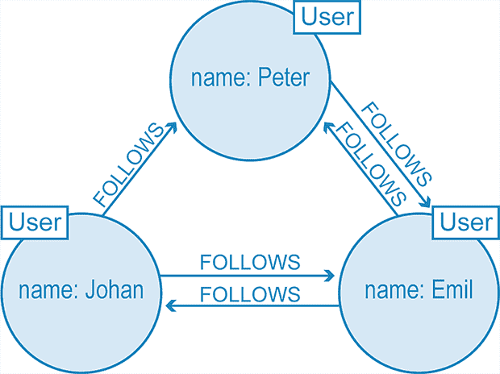
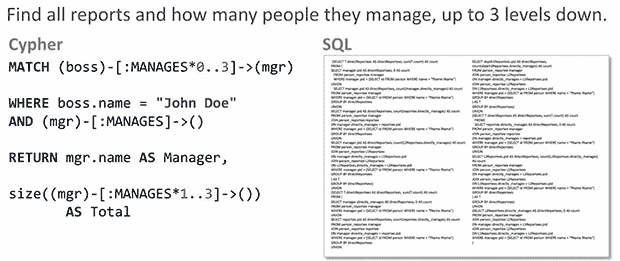

# 原生图形数据库的 3 个被低估的优势

> 原文：<https://thenewstack.io/the-3-underrated-strengths-of-a-native-graph-database/>

图形数据库为您解决的真正问题是大问题:系统中的错误在哪里？哪些交易模式可能是恶意意图的标志？对于最莫名其妙的疾病，哪些治疗组合是最好的治疗方法？

当您在数据中构建连接时，您的数据会在您最需要的时候显示连接。

不仅仅是把圆圈和箭头形象化。可视化附加组件不是像 [Neo4j 那样的](https://neo4j.com/?utm_content=inline-mention)[原生图形数据库、](https://neo4j.com/blog/native-vs-non-native-graph-technology/?utm_source=TNS&utm_campaign=Q322&utm_content=sponsoredpost)。一个本地图形工具解释了关系，以及从关系中衍生出的所有概念(如相关性、完整性、概率、可靠性、偏差、脆弱性)到数据库。这样，来自这些关系的信息可以被数据库定位、分析，然后向你解释。

## 感知的问题

图形数据库生产商 Neo4j 的用户创新高级总监[迈克尔·亨格](https://www.linkedin.com/in/jexpde)在接受《新堆栈》采访时表示，人类通常会观察他们的世界，然后根据相互联系来处理他们看到的元素。

但当这些人用关系数据库来表示这些相同的元素时，Hunger 补充道，“问题是，一旦他们使用他们的技术——他们的数据库——他们就需要忘记所有的相互联系。”

关系可以构建到关系数据库中，但需要相当大的努力，加上大量的内存和存储——这些资源在由云平台提供时会有巨大的价格标签。

因此，为了节省时间和金钱，组织倾向于淡化他们对理解互联性的需求。后来，当他们需要深入分析时，他们依赖于只能从数据库模式的表层推断信息的附加组件和扩展。

科技研究公司 Omdia 的人工智能平台、分析和数据管理首席分析师[Bradley shimmen 说,](https://www.linkedin.com/in/bradshimmin/)金融公司需要了解欺诈检测，或者公司需要能够看到员工下个月是否会辞职。

“图表分析是一种跨维度查看的能力，能够为表格数据所不了解的数据添加上下文和含义。”一

## 什么是原生图形数据库？

在传统的关系数据库模型中，数据分布在通过键链接的多个表中。运行 SQL 查询通常意味着连接几个表和多次索引查找。

相比之下，在 Neo4j 属性图模型中，重点是数据元素之间的关系。这些元素存储为“节点”，其属性可以由任意数量的键/值对表示。

节点可以通过任意数量的关系来连接。节点和关系都可能有“属性”在图模型中，关系数据库表中的列或行被表示为节点的属性。

有了 Neo4j 这样的[原生图形数据库，](https://thenewstack.io/illuminating-the-anonymous-with-neo4js-graph-database/)整个堆栈都围绕这个数据模型进行了优化，从查询语言到文件存储。原生图数据库在分析这些关系时会更有效，因为它们从一开始就被融入到模型中。

区分本地图形数据库和运行在关系数据库之上的图形层非常重要。后者以图形的形式提供结果，但是仍然必须执行连接和其他操作，以便从整个数据库中提取数据。这会导致延迟和过度的计算资源消耗，随着规模的扩大，所有这些问题都会变得更加突出。

Hunger 承认，在创建过程中，开发一个图形数据库确实需要额外的工作，“因为你还必须插入这些关系。”他断言，付出的劳动会有回报，让你更容易推断出数据之间的联系。

回报来自三个被低估的优势:

## 1.可通过性:建立连接

图形数据库[使你能够“跟踪”关系](https://neo4j.com/blog/evolving-an-enterprise-with-graph-technology/?utm_source=TNS&utm_campaign=Q322&utm_content=sponsoredpost)。“当你阅读这些数据，并想要跟踪或遍历这些关系时，你会受益匪浅，”亨格指出

[Neo4j 的开发者关系工程师 William Lyon](https://www.linkedin.com/in/lyonwj/) 指出了一个被称为“[无索引邻接](https://thomasvilhena.com/2019/08/index-free-adjacency)的特性，这是图形数据库所特有的。这基本上意味着您可以从一个节点遍历到任何其他节点，而无需进行索引查找。”

图模型的一部分，其中三个 Twitter 用户相互跟随，尽管不是成比例的。可穿越性揭示了它们之间关系的范围和限制。

这种可遍历性不仅使跟踪数据之间的关系变得更容易。它还减少了执行查询所需的计算，从而减少了管理计算过程所需的人力资源。

对于关系型数据库，Hunger 说，“你必须计算出哪些数据放在一起，然后你必须有某种方法将它们合并在一起。”这意味着更多的加入或跳跃。数据库中的数据量越大，不可避免地需要更多的连接和跳跃。

相比之下，有了图表数据库，Hunger 说，“我的数据库里有没有 80 亿人并不重要。如果我专注于乔，我只对乔的关系感兴趣。其他的我完全可以不管。”

他补充说，这也使得图形数据库对于分析分层数据特别有用，例如一家拥有 20 万名员工和数十层管理层的公司。

由于可遍历性，Neo4j 的 Cypher 查询语言在四行中揭示了三层深的关系，而不是复杂的脚本。

由于可遍历性，Neo4j 的 Cypher 查询语言在四行中揭示了三层深的关系，而不是复杂的脚本。

在关系数据库中对这种庞大而复杂的层次结构进行操作意味着成千上万的自联接:联接 person 或 employee 表、一个经理、他们的经理或每个指定人员的经理

Hunger 说，有了图形数据库，这只是一个简单的沿着层次结构上下追踪关系的问题。

图形数据库格式对数据科学家也特别有吸引力——他认为，他们“不喜欢使用关系数据库，因为有一个强加的严格模式。在开始工作之前，您必须定义数据的模式，并提前实施。”

相比之下，图方法更快、更直观，使您更容易迭代地发展数据模型。

## 2.可解释性:便携式白板

如果人类根据关系和联系来看待世界，数据库应该能够推断出关系和联系意味着什么。

把这个原则想象成输出的“白板友好性”——你试图找到的结果。当研究医生与同事交流结果时，通常会用 Excel 表格或一些表格格式来表示。在某种基础上，这些格式等同于完整的数据库。

同时，图表向人类展示了一个即时的信息结果。“你可以把你白板上的这个丰富的模型放入数据库，因为关系和实体是一等公民，”Hunger 说，他还指出，“你不会失去所有的业务人员。”

里昂说，推荐系统是图形数据库的一个核心用例:“如果你能够说，‘我们向你推荐这本书，因为它与你评价很高的其他书有相似的元素’，这是一个更有价值的推荐。”

网络特征，加上饥饿，使你能够推断出一些节点对其他节点的影响程度:“什么是集群？谁最有影响力？谁连接集群？谁必不可少？”

这是一种分析级别，只有通过非常复杂的聚合过程和[所谓的“知识发现迭代”](https://www.academia.edu/27349019/NCDS_data_mining_for_discovering_interesting_network_characteristics)使用关系数据库才能完成，所有这些都使之前描述的 SQL 交叉连接马拉松看起来更像是 100 码短跑。

印第安纳大学的研究人员在寻找[和帕金森病](https://www.ncbi.nlm.nih.gov/pmc/articles/PMC8756622/)的各种原因之间的遗传关系模式，出于一些非常深刻的原因，他们选择了 Neo4j 作为他们的本地图形数据库。其中:图查询返回的模式本身可以用图来表示。

从他们的角度来看，不仅数据库本身被表示为知识图，输出也是如此。

## 3.公平性:将原始数据放入背景中

高质量的结果需要高质量的数据。图形数据库在公平性和消除偏见方面揭示了更多未被充分认识的优势，特别是在用于机器学习和人工智能的[大型数据集](https://thenewstack.io/big-questions-for-the-ethical-use-of-ai/)中。

Hunger 说，偏见可能来自两个方面:输入算法的数据有偏差，以及研究人员提出的问题有偏差。有了图表模型，潜在的偏差可以在设计阶段突出显示并消除。

里昂说，数据科学家自然希望确保他们的训练数据在被输入他们的机器学习算法之前具有代表性和公正性。在数据准备阶段使用原生图形数据库可能有助于将原始信息放在上下文中，并防止将偏差输入模型的可能性。

“所以你看你的图表的聚类，如果你只有一个大的聚类，那么你就有偏见，你就有问题，”他说。"你需要回去，确保你有好的，分布式集群."

正如 Hunger 指出的，神经网络本身就是图形。“这意味着当你训练一个模型时，神经网络会发生变化，”他说。“如果你展示一个图表，并使它变得可访问、可变和可视化，那么你就可以确定网络是如何获得其权重的。”

换句话说，从模型生成的任何给定输出，都可以很容易地追溯到它的起源。可穿越性是双向的。

所有这些优势是否意味着关系模型的日子屈指可数了？不太可能。但是，Shimmin 指出，图形数据库是“一项至关重要的技术，我非常希望能够更深入地看到它完全集成到传统的分析工作负载中。”

## 从哪里开始

<svg xmlns:xlink="http://www.w3.org/1999/xlink" viewBox="0 0 68 31" version="1.1"><title>Group</title> <desc>Created with Sketch.</desc></svg>