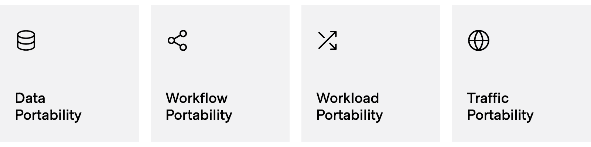

# 多云的 4 个定义:第 1 部分—数据可移植性

> 原文：<https://thenewstack.io/the-4-definitions-of-multicloud-part-1-data-portability/>

 [艾蒙·达德加尔

艾蒙是哈希公司的联合创始人兼首席技术官。他对安全性和分布式系统及其在现实世界问题中的应用充满热情。](https://www.linkedin.com/in/armon-dadgar/) 

世界正在向多云化发展。但是这到底意味着什么呢？

当我们谈论“多云”这个词时，我们倾向于以一种单一的方式来谈论它。但是如果你透过表面看，你会发现人们对它的含义有不同的看法——所以这些对话需要更加具体。本系列文章旨在促进关于该主题的更有成效的讨论，并了解哪些类型的多云功能值得追求。

## 多重云的 4 个定义

多云的不同使用案例不是苹果与苹果之间的比较。它们并不总是互相排斥，这意味着您可以在您的系统中应用多个。当我们谈论多云定义时，它们都是通过便携性联系在一起的。本系列将涵盖四种多云定义:

在本文中，我们将讨论数据可移植性。

## 数据可移植性

多云数据可移植性意味着能够将数据从一个云提供商转移到另一个云提供商。一个重要的目标是了解断电、市场状况、价格变化或供应商关系的变化。另一个目标是在你认为合适的时候提取和移动你的数据。

大规模数据可移植性的最大障碍是光速和带宽成本。带宽和延迟永远是计算的大瓶颈。网络出口费用往往相对较高，因此云架构师倾向于将工作负载及其数据放在同一个云上，以最大限度地降低这些成本并减少延迟。

这个概念叫做[数据引力](http://blog.thestateofme.com/2020/01/03/an-economic-model-for-data-gravity/)。通过网络将大量数据转移到另一个云上需要花费大量的金钱和时间。在某种程度上，将磁盘驱动器实际装载到卡车上，并将其运送到新的数据中心会更加高效。

## 碎玻璃与连续玻璃

有两种方法可以设计数据可移植性:

*   **碎玻璃般的便携性:**您希望能够移动您的数据，作为逃生出口或未来潜在的业务决策。
*   **连续复制:**您希望您的数据在多个云区域持续可用。

在许多情况下，连续复制不是一个选项，因为许多组织在早期没有选择或考虑连续复制，所以对于这些组织来说，他们只能改变他们对新数据系统的做法。

处于数据存储起点的组织有两种截然不同的选择，业务成本大相径庭。取决于您选择哪一个，您必须做出重要的架构选择来支持它。

### 费用

*   **连续:**成本不变。您主动支付跨多个站点复制数据的成本。每增加一条记录，你就要支付一笔额外的费用。
*   **碎玻璃:**费用一次性发生。您可能会在一个巨大的数据湖中的一个位置积累数据，然后当您想要移动所有这些数据时，您的账单会更大。您将不再为每小时十条记录付费，而是为一次迁移中要移动的十亿条记录付费。

一段时间内数据迁移的大致成本

如果您没有在一致、较小的基础上复制数据，此图显示了一次性数据移动的成本(蓝色“选项”线)如何随着时间的推移而增长。然而，在许多情况下，您的数据呈指数增长，这将使选项线成为向上的曲线，而连续线成为上升线。有时，任何数据可移植性的成本都非常高，这取决于工作负载。

*   **初始成本:**对于这两种类型，初始成本都很低，因为你还没有太多的数据。
*   **持续成本:**对于碎玻璃可移植性，持续的数据可移植性成本基本为零，但对于持续移动的数据，通过将每个新数据记录复制到多个位置，您将逐渐降低数据可移植性的成本。
*   **延期成本:**碎玻璃便携性的延期成本非常高，因为如果您需要移动和复制所有数据，账单可能会非常庞大。使用连续复制，您已经在每次创建新记录时提前为这些数据移动支付了费用。

一个很好的类比是股票期权和保险。碎玻璃可携带性就像一个股票期权——你预先支付一小笔费用就可以行使期权，但如果你选择行使它，它的成本会很高。连续复制就像保险，你每个月都要付账。它可能不会经常对你有用，但当你确实需要它时，它不会让你破产。

### 速度、可扩展性、弹性、可观察性、可管理性

速度、可伸缩性、弹性、可观察性和可管理性等其他因素通常有利于连续复制路径。在一次性可移植的情况下，千兆字节到低太字节的少量数据集合当然可以是可管理的、有弹性的、可观察的，并且移动速度相当快，但是随着交易数量和数据大小的增加，这些传输变得不太实际。

小规模数据系统和某些使用情形可能首先不需要连续复制—在这些情况下，连续复制的速度或可靠性无关紧要。连续复制真正重要的地方是在希望利用动态云原生应用的系统中，其中大部分数据需要能够立即可用，并在全球范围内分发到另一个地区或云供应商。

## 第三种选择:即插即用的专有架构

还有一个方向，既不能给你打破玻璃的便携性，也不能给你连续复制——云专有解决方案。如果选择专有的云数据库服务，如 AWS DynamoDB、Azure CosmoDB、GCP 扳手等。你被云供应商锁定了。如果您的组织开始使用另一种技术，您的数据可能很难移动。您将获得商业支持的解决方案的所有常见好处，并且该供应商的解决方案之间的可移植性可能会相当顺利，但是根据您的领域和需求，将自己局限于一个云数据库服务可能会有很大的风险。

## 实现碎玻璃便携性

对于碎玻璃路线，您需要有一个到每个数据区域的公共接口。这意味着您将希望使用广泛可用的开源数据库或专有解决方案。MySQL、PostgreSQL 和其他开源数据库的托管版本也能很好地工作。更重要的是要有一个兼容的接口，让你的应用程序使用相同的 API。例如，您可以使用 AWS Aurora，但仍然具有与 MySQL 的应用程序级兼容性，因为有一个通用的 API。您的数据系统还需要具有导入/导出功能，以便您可以轻松地将数据从一个位置移动到另一个位置。

您不需要能够实时完成这项工作，因为这些是只按需执行的批处理作业。但是，一个缺点是，根据您的数据存储以及它是否支持增量导出/导入，您可能需要暂时关闭您的站点来进行数据迁移。

## 支持连续复制

对于连续路线，您需要支持实时复制的系统。有几个数据系统更关注这种云原生用例，包括 CockroachDB、Cassandra 等。这些系统提供跨区域的连续数据可用性。许多传统数据库系统通常也支持实时流和复制，但可能具有更复杂的故障模式，或者可能仅支持主动/被动配置。连续复制也需要一个兼容的接口，就像碎玻璃可移植性一样，但是除此之外，它*还需要*一个兼容的实现。

对于碎玻璃可移植性，我们做的是导出和导入，所以实现可以不同。对于连续复制，应用程序必须支持在事务级别复制数据。这意味着您不能混合使用 AWS Aurora 和标准 MySQL 来设置连续复制。

## 在选择之前清楚地了解你的需求

利用多云数据可移植性的关键是尽早清楚地了解您的系统需求。您可能认为数据的可移植性在未来并不必要，使用云专有技术也没问题。您可能希望设计一个系统，该系统至少可以在以后的破碎场景中进行大规模数据迁移。或者，您可以选择设计一个连续的数据复制系统，这样您就不会有很大的开销，或者支持全局部署。

无论您的选择如何，每个决定都有前期系统设计考虑和业务成本分析。还需要注意的是，根据您在系统中使用的工作负载类型，这两个选项之间的成本可能会有很大差异。您的系统域和您拥有的数据量也将是您选择哪条路径的主要因素。

## 多重云的其他定义

随着本系列的继续，您可以阅读关于多云的其他三种定义— [工作流可移植性](https://thenewstack.io/the-4-definitions-of-multicloud-part-2-workflow-portability/)、[工作负载可移植性](https://thenewstack.io/the-4-definitions-of-multicloud-part-3-workload-portability/)和[流量可移植性](https://thenewstack.io/the-4-definitions-of-multicloud-part-4-traffic-portability/) —以了解每一种的权衡和实现模式。

<svg xmlns:xlink="http://www.w3.org/1999/xlink" viewBox="0 0 68 31" version="1.1"><title>Group</title> <desc>Created with Sketch.</desc></svg>