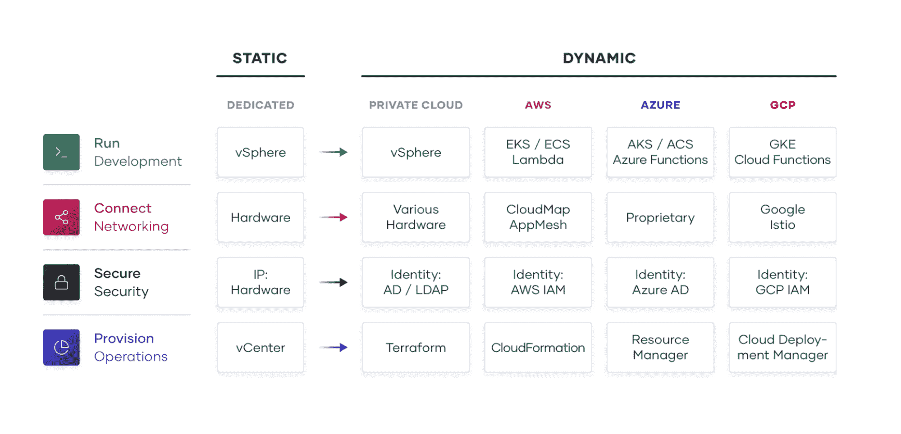
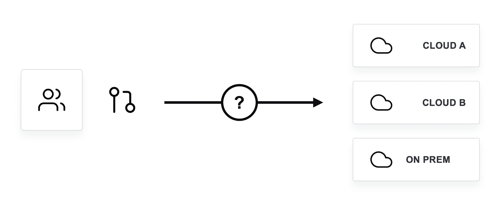

# 多云的 4 个定义:第 2 部分—工作流可移植性

> 原文：<https://thenewstack.io/the-4-definitions-of-multicloud-part-2-workflow-portability/>

为了促进关于该主题的更有成效的讨论(并了解哪些类型的多云功能值得追求)，本系列继续通过工作流可移植性的视角来看多云。

## 工作流可移植性

 [阿蒙·达德加尔

Armon 是 HashiCorp 的联合创始人兼首席技术官，他将自己对分布式系统的热情带到了 DevOps 工具和云基础设施领域。](https://twitter.com/armon) 

多云工作流可移植性意味着开发和运营工作流能够在多个 IT 环境中兼容，无论是云环境还是内部环境。作为这些可移植工作流的用户，您希望能够使用一个工具链、流程和知识集来管理在 Google Cloud、AWS、Azure 和本地数据中心上运行的应用程序的操作。换句话说，一个工作流程，可以在任何地方运行。

事实上，工作流可移植性已经存在于您已经熟悉的部署前和部署后工具类别中:

*   **版本控制:** GitHub， [GitLab](https://about.gitlab.com/?utm_content=inline-mention)
*   **CI:** Jenkins， [CircleCI](https://circleci.com/?utm_content=inline-mention)
*   **包管理:** JFrog Artifactory，Sonatype Nexus
*   **应用部署(编排、调度):** Kubernetes，HashiCorp Nomad
*   **可观察性&报警:**数据狗，[页面责任](https://www.pagerduty.com/?utm_content=inline-mention)
*   **安全&机密管理:** HashiCorp 金库， [AWS](https://aws.amazon.com/?utm_content=inline-mention) 机密管理器
*   基础设施供应: HashiCorp Terraform， [Red Hat](https://www.openshift.com/try?utm_content=inline-mention) Ansible
*   许多其他类别和工具

当您的 IT 堆栈开始分裂成多个异构环境时，您有两个潜在的解决方案来修复这种分裂。构建可移植的工作流就是其中之一。另一个解决方案是迁移到一个单一的技术堆栈，就云而言，这意味着一个云供应商。

## 多云与单云

对于生产前工作流，工作流可移植性是标准。GitHub 或其他版本控制和 CI/CD 系统是当今大多数软件开发的中心系统和公共工作流——从那里它们可以与几乎任何东西集成。今天的大多数挑战都是由于在部署和生产空间中随后出现的工作流的碎片化。

修复这种碎片化的一种方法是使用单一云原生技术堆栈，这不会使您的工作流具有可移植性。只要你不再使用另一个云作为基础设施，你就不需要可移植性。另一种方法是使用跨多个云的工具。

### 当一朵云足够的时候

单一云通常是小型公司或大型公司的正确选择，这些公司刚刚开始在云中开展几个项目。平台原生服务产品应该在部署期间彼此无缝协作，但是要仔细考虑您选择哪些服务，以及您对使用它们的限制有多严格。

如果你是:

1.  计划成长为大型公司，或
2.  认为有可能收购一家公司(或被收购)

那么你应该尽早考虑选择具有跨云兼容性的技术，因为[不管你是否想要，多云很可能就在你的未来](https://www.hashicorp.com/resources/what-is-multi-cloud-why-are-companies-adopting-it)。

### 当多重云不可避免时

对于像全球 2000 强这样的大公司来说，多云不再是一个大问题，而是一个现实。因此，一个堆栈不是一个现实的选择。

### 遗留系统

你必须记住，构成我们世界经济支柱的大多数公司——银行、保险公司、能源、医疗保健和生物技术——在云出现之前就已经存在了。你可以想象一个 IT 组织就像一棵成熟的树，每一代技术都会增加一个新的“环”。每一代技术都还在，很像树的内环。这可能意味着他们有大量的物理空间，可能有多个数据中心。许多公司不会放弃这些投资，一些公司甚至[进一步](https://www.idgconnect.com/article/3581358/on-premise-servers-are-here-to-stay.html)投资本地。

### 获得

收购是大型企业发展战略的关键。潜在的收购不会仅仅因为两个实体没有使用同一个云就停止。在收购的任何一方，工程师都可能会在不同的云平台上开发新的应用和基础设施。

### 折扣

大公司通常会有数百万美元的云预算。当云供应商争夺该预算时，公司通常会获得有吸引力的折扣或积分。这为在多个提供商之间分配工作负载提供了极具吸引力的经济激励。

### 最佳化

有些人可能会说，将应用优化作为多云的理由有些过头了。如果优化是唯一的原因，他们可能是对的，但通常不是。不可否认的是，每个云供应商都有自己的优势领域——他们比其他供应商更擅长的领域。AWS 有优秀的原语。谷歌有很好的数据服务。阿里巴巴在中国有着举足轻重的地位。你会看到一些公司绝对喜欢 Azure 作为他们应用程序的一部分，因为许多旧系统都是基于 Active Directory 和微软中间件服务构建的，与其他供应商相比，Azure 使得在云中运行这些系统相对容易。

## 为什么单一云通常不适用于大公司

由于大公司的遗留系统、收购和技术多样化，将所有东西迁移到一个云通常是不可能的。有几个原因，主要是成本。

### 费用

将工作负载迁移到一个云所需的时间和精力，再乘以在收购后需要转移的每个工作负载，可能会非常巨大。至于遗留系统和公司数据中心，有时合法地继续使用这些基础设施会更便宜、更安全和/或更简单。这并不是说维护这些遗留系统并将其集成到新系统中不会没有成本和复杂性，但是集成中的一些复杂性可以抽象掉。

### 速度

虽然一些遗留系统和多云集成会降低应用程序和交付的速度，但也有提高速度的策略。然而，与将所有东西迁移到一个云中所需的时间相比，集成的速度可能会相差很大。与完全迁移到新云相比，将系统与一致、可移植的工作流集成在一起几乎总是能更快地实现新收购的价值。

### 可扩展性、弹性、可观察性、可管理性

单云和多云的其他比较点根据您选择的多云工具而有所不同。有一些工作流可移植性解决方案可以在部署后工作流中提供与您在单栈设置中使用的云原生等效解决方案一样多的可扩展性、弹性、可观察性和可管理性。

## 工作流可移植性与碎片化

因此，有许多原因可以解释为什么组织不能或不愿意将所有东西都迁移到一个云中。为什么不为每个云使用本地工具，并让专家深入了解他们分配的云呢？每个团队都应该熟悉他们环境中独特的服务、工具和语法。

这就是所谓的碎片化方法，它涉及到每个云部署的分支工作流。

### 分裂的固有缺陷

分散的方法很快变得复杂。想象一下，必须为两到三种不同的云构建专家团队，然后为配置、基于服务的网络、凭据和密钥管理安全性以及部署协调/调度任务建立不同的工作流。工资和复杂性的成本通常会超过专业化可能带来的微小优势。

下图很好地说明了云工具的碎片化。从左侧的静态专用基础架构和右侧的动态云和内部基础架构开始，您可以看到像资源调配这样的领域非常特定于云。每个云平台都有自己的供应工具——例如，CloudFormation for AWS、Azure Resource Manager 和 GCP 云部署管理器——它们只与各自的平台兼容。这意味着使用这些工具的多云公司不具备工作流可移植性。

然而，其中一些工具可以跨不同的云工作。 [HashiCorp Terraform](https://www.terraform.io/) 位于私有云之列(许多其他工具也可以进入该领域)，但它也因能够跨所有主要公共云进行配置而闻名。它与云无关，可以作为每个云平台的单一配置平台。这是一个支持多云工作流可移植性的工具的很好的例子——特别是对于配置工作流。

### 工作流可移植性的相对优势

如果您使用一个单一的、可移植的工作流来处理图表中的每一个类别，那么您不需要为每个云配备两到三个专家团队。您的单一工作流解决方案只需要一个团队，与云原生工作流相比，这也有助于更轻松地将您的内部基础架构和传统系统纳入混合云工作流。

再次以 Terraform 为例，开发人员获得了一种将基础架构编写为代码以定义资源(如服务器、数据库和负载平衡器)的通用方法。然后，他们可以将这些资源配置和调配给几乎任何云或本地设置。

开源是帮助工作流可移植性的另一个关键因素。在 Terraform 的例子中，它让第三方开发者和公司能够创建插件，因此 Terraform 可以提供他们独特的技术。对于主要云供应商的任何服务，HashiCorp 已经维护了一流的插件，这些插件经常更新，以支持新的和更新的服务。

总的来说，当比较单个工作流方法和分散的多专家方法时，成本、速度、可伸缩性、可观察性和可管理性因素都有利于工作流的可移植性。弹性可能会在多专家方法中获得一点优势，但可能不足以使其值得在成本和其他方面做出牺牲。

## 工作流程应该是可移植的，但是应用程序不一定要可移植

我不想暗示你不应该使用任何云供应商原生的服务。多云的优势在于能够运行非常适合一种云的应用，而不会放弃可能非常适合另一种云的应用。

在本系列的第一部分中，我谈到了数据可移植性，这比工作流可移植性更难理解。你不需要数据可移植性和 app 可移植性就能拥有工作流可移植性。

例如，如果您想要构建一个利用 AWS 中的数据库的应用程序和一个利用 Google 的 BigQuery 的分析的应用程序，那么使用 Terraform 的供应工作流可以从同一个界面部署到这两个服务。这里，我们将交付过程从运行时依赖中分离出来。这是有道理的，你不想建立或管理所有你自己的数据库，缓存等。—但要意识到，这些服务可以将您的应用程序绑定到该环境中。

## 实现工作流可移植性

在我看来，工作流可移植性是最容易实现的，也是最值得追求的多云可移植性的实现。

实现工作流可移植性意味着选择多云兼容的工具。即使作为一家较小的单一云公司，如果您没有在前期针对工作流可移植性进行优化，以后可能会非常痛苦。想想云供应商提供的工具和服务，它们可以将您锁定在仅适用于其平台的工作流中。不要一开始就用多云来优化*多云，但一定要马上优化工作流程。*

当 Mitchell Hashimoto 和我创建 HashiCorp 时，我们有一套核心的技术原则，我们希望嵌入到我们制造的每一个产品中——我们甚至[写了一篇关于它们的 Tao](https://www.hashicorp.com/tao-of-hashicorp)。道中的一个关键原则是“工作流，而不是技术。”

因此，当我们构建地形、金库、领事、游牧和(最近的)路点和边界时，我们的目标一直是创建能够在尽可能多的环境中提供通用工作流的产品。无论是混合云还是多云方法，我们的信念始终是，我们需要满足公司的需求，而不是试图将它们都推向一个全新的同质环境。

## 多重云的其他定义

随着本系列的继续，请阅读多云的其他三种定义— [数据可移植性](https://thenewstack.io/the-4-definitions-of-multicloud-part-1-data-portability/)、[工作负载可移植性](https://thenewstack.io/the-4-definitions-of-multicloud-part-3-workload-portability/)和[流量可移植性](https://thenewstack.io/the-4-definitions-of-multicloud-part-4-traffic-portability/) —以了解每种定义的利弊和实现模式。

<svg xmlns:xlink="http://www.w3.org/1999/xlink" viewBox="0 0 68 31" version="1.1"><title>Group</title> <desc>Created with Sketch.</desc></svg>