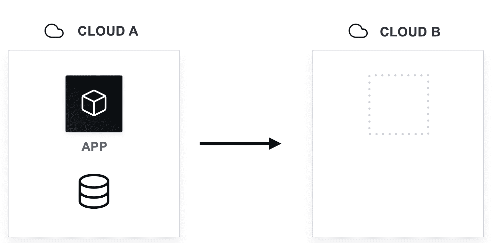
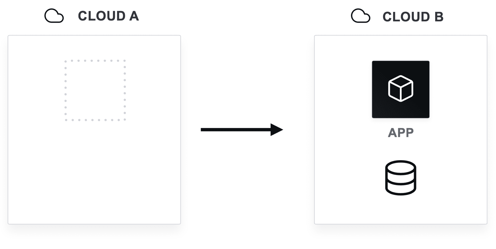
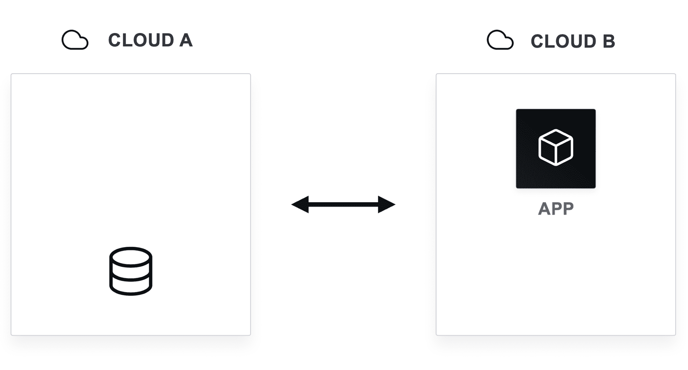
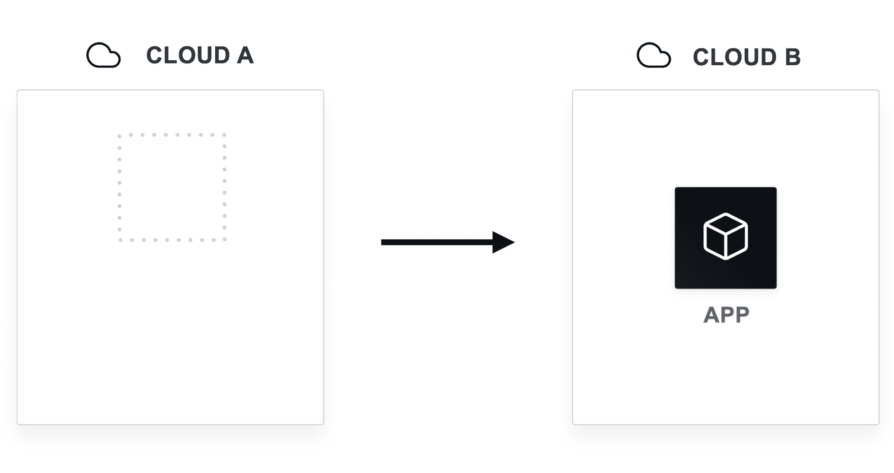

# 多云的 4 个定义:第 3 部分—工作负载可移植性

> 原文：<https://thenewstack.io/the-4-definitions-of-multicloud-part-3-workload-portability/>

为了更有效地讨论这一主题，并了解哪些类型的多云功能值得追求，本系列继续从工作负载可移植性的角度来看多云。

## 工作负载可移植性

 [阿蒙·达德加尔

Armon 是 HashiCorp 的联合创始人兼首席技术官，他将自己对分布式系统的热情带到了 DevOps 工具和云基础设施领域。](https://twitter.com/armon) 

多云工作负载可移植性意味着您可以按下按钮，将工作负载从一个云或内部数据中心移动到另一个。有点像这样的想法:“写一次，然后在任何地方运行。”不幸的是，很难只为一种云编写一个应用程序，而无需修改代码就能在其他云上运行该应用程序。不同的供应商有不同的 API、语义、功能、语法和其他细微差别，这使得工作负载可移植性实际上是最具挑战性的多云可移植性形式之一。

实现工作负载的可移植性并不像*写一次到处运行*那么简单，但这是可行的。本质上，它更复杂，因为它是[数据](https://thenewstack.io/the-4-definitions-of-multicloud-part-1-data-portability/)和[工作流可移植性](https://thenewstack.io/the-4-definitions-of-multicloud-part-2-workflow-portability/)的超集，这意味着这两者都是这种可移植性工作所必需的。这是一个可行的策略，并且根据业务需求，可能是必需的。出于合规性和监管原因，公司可能需要实现工作负载可移植性，以便在多个云供应商之间实现故障转移。

其他人可能是为了节约成本。一个例子是[大型对冲基金](https://www.hashicorp.com/resources/large-hedge-fund-uses-nomad-arbitrage-cloud)使用 HashiCorp 的工作负载协调器 [Nomad](https://www.nomadproject.io/) ，每天将可移植的工作负载调度到最便宜的云供应商和实例类型上，利用诸如现货实例定价之类的东西。

工作负载可移植性有三种类型:

*   全部工作负载可移植性
*   部分工作负载可移植性
*   无数据工作负载可移植性

如果实现的挑战在成本或功能上值得回报，其中一些类型可能对您的用例有意义。

## 实现全部工作负载的可移植性

完全工作负载可移植性是最难实现的类型。绝大多数应用程序需要它们的数据和其他上游依赖项。如果你的数据库不在的话，移动你的 web 服务器是没有帮助的。

完整的工作负载可移植性意味着将应用程序及其所有依赖项和数据从一个环境完全迁移到另一个环境。

这些依赖关系包括作为处理和请求一部分的任何上游 API。如果您必须回调工作负载已经离开的环境，由于带宽成本和延迟考虑，这通常会违背迁移它的目的。

如果在应用程序和平台的设计阶段就内置了完整的工作负载可移植性，那么这是最好的。为了实现完全的工作负载可移植性，内部服务必须按照相同的要求进行设计。如果你的应用可以移动，但你的上游依赖不能移动，这是没有帮助的。

您还需要决定您将使用哪种类型的[数据可移植性](https://thenewstack.io/the-4-definitions-of-multicloud-part-2-workflow-portability/)，权衡与本系列第一篇文章中的相同:

*   **连续复制**:定期跨环境复制数据，这不断增加了额外的运营成本。
*   **打破玻璃的可移植性**:当需要迁移时，跨环境传输数据，一次性花费一大笔钱。

您对频率的决定需要与您对计划迁移工作负载的频率的决定一致，这取决于您是计划频繁地(在这种情况下，使用连续复制)还是在极少的情况下(在这种情况下，碎玻璃可能起作用)移植工作负载。

最后一个指导是避免会将您束缚在环境中的云专有服务。虽然有些可能在正确的抽象下是可行的，但是涉及的专有服务越多，可移植性就变得越难。

## 支持部分工作负载可移植性

在某些应用程序不一定要求将数据放在同一个环境中的情况下，工作负载的可移植性开始变得更加合理。无状态或前端服务就是一个很好的例子。对于这些类型的服务，您可以将数据留在原始环境中，应用程序仍将工作。

然而，当您为每个请求通过网络移动数据时，通常会有成本和性能损失，就像您在这个场景中所做的那样。其中包括:

*   **昂贵的带宽**:一个位置内的带宽很便宜，但是该位置之外的连接带宽很贵。
*   **高延迟**:光速是固定的，因此网络上的流量总是比同一位置内的流量慢。

在您考虑这种形式的工作负载可移植性之前，您需要回答这个问题—您潜在的计算成本节约会被更高的带宽成本和性能下降抵消吗？

另一个要考虑的因素是，具有复杂缓存和数据管理的专用体系结构将期望低延迟，因此，部分工作负载迁移将导致用户体验下降。

为了实现部分工作负载的可移植性，您的应用程序必须是专门构建的，以便知道它正在通过网络进行持续的请求。多层缓存和使用部分或“热”数据子集可以缓解一些挑战。运营和应用团队将不得不在架构和流程上进行深度协作，这是另一个需要考虑的重要挑战。

## 实现无数据工作负载可移植性

如果您的应用程序没有要移动的数据怎么办？一个例子可能是无状态应用程序或具有大部分静态数据集的应用程序。这个场景可能是工作负载可移植性的最简单和最具成本效益的用例。

对于一个无状态的应用程序，几乎没有成本，对于一个静态的或很少改变的数据集，您需要支付一次移动的费用，如果它不是一个巨大的数据量，那也可以是便宜的。

以下是一些无数据工作负载可移植性可能有意义的使用案例示例:

*   **金融建模应用**:这些应用通常使用各种市场的历史数据集。如果您在许多位置复制了数据集，并且数据更新足够频繁，那么移动应用程序工作负载并集成该数据集应该不难。
*   **计算密集型大规模模拟**:科学高性能计算(HPC)任务(如蛋白质折叠模拟)通常依赖于相对较小的数据集，这也使得工作负载的可移植性更简单。
*   **测试和试运行环境**:虽然这些环境可能有数据库，但是因为它们有模拟数据或静态副本，所以您不必关心数据是否不同步。测试和暂存数据本质上是短暂的。

所有这些例子都是成本套利的绝佳选择，尤其是在现货定价的情况下。前面提到的大型对冲基金通过这种方式在金融模拟上省钱。

这种类型的工作负载可移植性不需要太多的数据可移植性，让您专注于工作流可移植性，这通常可以通过跨多个云和混合云部署的自动化工具来实现。像 HashiCorp Nomad 或 Kubernetes 这样的调度程序在这里会有很大的帮助。

## 当对冲锁定是有害的

当人们从工作负载可移植性的角度对多云表现出兴趣时，他们的主要动机是防止锁定，但正如我们从上面解释的三种类型中看到的那样，这很少是值得的。

主要挑战是:

**数据和工作流的可移植性都是必需的**:应用被它们的数据和你的上游依赖关系所束缚。如果他们不能轻松地与其应用同步移动，那么您的工作负载也不会轻松移动。

**您的应用程序受限**:为了构建工作负载可移植性，应用程序需要设计为对云服务的访问受限，这可能会将应用程序锁定在一个云中。虽然这避免了锁定，但您会失去许多使云提供商首先有用的高级服务，例如本地日志记录或特定的无服务器平台。

有时，更好的策略是计划工作负载锁定，并在最适合的平台上专门构建应用程序。为全部或部分工作负载的可移植性而构建会将您选择的平台的有用性稀释到最小公分母。这对于大多数用例及组织来说是不切实际的，而且在很多情况下很难实现。

无数据工作负载可移植性是三种工作负载可移植性类型中最现实的选项。当您的应用程序只需要一些基本的计算能力，而不需要任何云供应商的任何独特功能时，它可以在更大规模的云使用中节省一些资金。

## 多重云的其他定义

随着本系列的继续，请阅读多云的其他三种定义— [数据可移植性](https://thenewstack.io/the-4-definitions-of-multicloud-part-1-data-portability/)、[工作流可移植性](https://thenewstack.io/the-4-definitions-of-multicloud-part-2-workflow-portability/)和[流量可移植性](https://thenewstack.io/the-4-definitions-of-multicloud-part-4-traffic-portability/) —以了解每种定义的利弊和实现模式。

<svg xmlns:xlink="http://www.w3.org/1999/xlink" viewBox="0 0 68 31" version="1.1"><title>Group</title> <desc>Created with Sketch.</desc></svg>