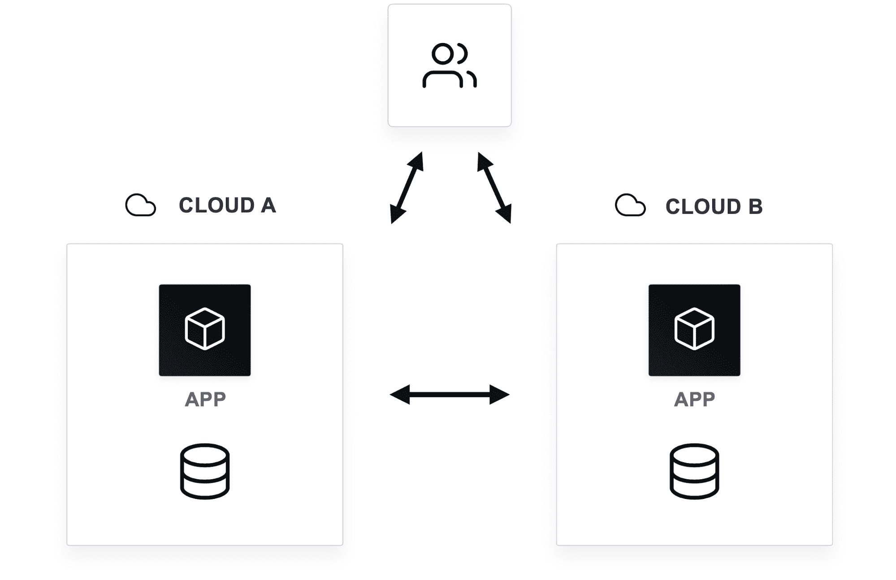

# 多云的 4 个定义:第 4 部分——流量可移植性

> 原文：<https://thenewstack.io/the-4-definitions-of-multicloud-part-4-traffic-portability/>

为了更有效地讨论这一主题，并了解哪些类型的多云功能值得研究，本系列文章最后从流量可移植性的角度来看多云。

## 交通便携性

 [阿蒙·达德加尔

Armon 是 HashiCorp 的联合创始人兼首席技术官，他将自己对分布式系统的热情带到了 DevOps 工具和云基础设施领域。](https://www.linkedin.com/in/armon-dadgar/) 

多云流量可移植性意味着您可以在不同环境之间动态转移流量。如果您有地理上分散的用户，流量可移植性将允许您将流量路由到最近的可以为他们服务的云提供商。因此，如果你的应用可以在 Azure 和 AWS 上运行，也许有比 Azure 更接近你的客户的 AWS 数据中心。或者，某个云供应商在欧洲的数据主权方面做得更好，因此您只需将这些请求发送给某个特定的供应商。

在大多数情况下，流量可移植性的目标是能够在多个云平台和内部数据中心之间快速动态地转移流量。这也可能意味着你在 AWS 和 Azure 之间平衡 50/50 的流量。或者，也许你正在维护你的谷歌云环境，所以你把 100%的流量暂时转移到另一个云。金丝雀部署是另一个例子，其中您在公共云提供商上测试 5%的流量，并将其余 95%的流量保留在您的数据中心。

流量可移植性有三种类型:

*   仅入口流量可移植性
*   部分故障转移流量可移植性
*   完全故障转移流量可移植性

每种类型在速度、可靠性和成本方面都有不同的权衡。其中一些类型只有在大规模公司才变得现实。

## 支持仅入口流量可移植性

仅入口流量可移植性是通过轴辐式架构实现的，其中一个“中枢”数据中心或云包含您的大部分数据并完成大部分协调工作。在这种体系结构中，“辐条”的末端是您的所有前端，它们主要接收入口流量。你也可以称之为“仅前端”。

仅入口流量可移植性的主要属性有:

*   入口流量可以到达任何前端
*   一个请求可能涉及多个环境
*   对于在边缘缓存和减少延迟非常有用
*   要求[工作流可移植性](https://thenewstack.io/the-4-definitions-of-multicloud-part-2-workflow-portability/)
*   前期投资:中等

这种体系结构的缓存和延迟优势来自于这样一个事实，即您是在分层设计中进行烘焙的。这要求应用程序了解这种架构，并且通常要求工作流的可移植性，这样您就不必在不同的环境中使用不同的工作流来管理不同前端的入口。

## 部分故障转移流量可移植性

与仅入口相比，这种类型的流量可移植性是对您正在移动的数据和服务的增强。它增加了对每个云区域和数据中心中的后端数据系统的部分复制的需求。它不是你后端数据中心的副本，但是你的大部分后端服务和数据都在那里。这可能包括按区域划分的数据和所有区域的集中位置的一些数据。

部分故障转移流量可移植性的主要属性有:

*   数据可能会按地区划分
*   一些后端系统和数据在区域之间复制
*   提高高可用性(HA)和灾难恢复(DR)
*   需要工作流可移植性
*   可能需要有限的数据可移植性
*   前期投资:大

与存在单点故障的星型模型不同，如果您的中央数据出现故障，这种模型具有更多的高可用性和灾难恢复功能。然而，这比仅入口模型有更大的数据可移植性要求，并且两者都需要某种形式的工作流可移植性。

与 ingress-only 相比，部分故障转移的优势在于，通过部分故障转移选项，应用及其流量的整体可移植性得到了提高，当您开始对不同的云和数据中心进行流量整形时，重要的数据已经在那里了。

## 完全故障转移流量可移植性

完全故障转移流量可移植性是最复杂的流量可移植性类型。有了它，您可以完全关闭一个站点(本地或云)并将流量故障转移到任何其他站点。在这种情况下，您的站点都有必要的数据，因此这允许入口流量到达任何前端。完全故障切换还提供最大的高可用性和灾难恢复。通过完全故障切换，如果您在多个云中运行副本，您的所有流量调整都将是可移植的。

完全故障转移流量可移植性的主要属性包括:

*   入口流量可以到达任何前端
*   请求可以在每个环境中完成(不需要调用“集线器”)
*   所有系统和数据都被复制
*   最大的高可用性和灾难恢复能力
*   需要数据、工作流和工作负载的可移植性
*   前期投资:非常大

这种流量可移植性非常罕见，因为它需要所有四种类型的多云工作流可移植性。不再需要中心辐射式架构，因为每个请求都可以在任何位置完全处理。

## 每种类型的权衡

每种流量可移植性的大部分权衡都与成本、速度和可靠性有关。

*   **成本**:从仅入口到部分和完全故障转移，成本会变得更加昂贵。
*   **延迟**:从仅入口故障转移到部分故障转移和完全故障转移时，每个基础设施位置中可用的数据越多，由于对远程位置的网络调用越少，您的应用程序处理速度就越快。
*   **可靠性**:当您从仅入口故障转移到部分故障转移时，HA 和 DR 会变得更好。它们在完全故障转移流量可移植性方面正处于巅峰状态

由于任何形式的流量可移植性都会大幅增加成本，因此需要对成本和收益进行深入评估。部分和完全故障转移流量可移植性应该仅适用于大型网络规模的公司。这些形式的流量可移植性即使在能够负担得起的公司中也是罕见的。

通常，我们看到的使用部分或完全故障切换的客户是因为法规或合同要求而这样做的。例如，沃尔玛要求其大多数供应商[在非 AWS 平台](https://www.wsj.com/articles/wal-mart-to-vendors-get-off-amazons-cloud-1498037402)上运行他们的工作负载。

在较小的规模上，仅入口流量可移植性是更现实的选择，以避免流量必须基于每个应用进行转发的情况，这意味着一些服务必须始终转到特定的云、区域或本地数据中心。

## 概括数据、工作流程、工作量和流量可移植性

作为本系列文章的总结，这里总结了“成为多云”的四个主要定义:

*   **数据可移植性**:您有能力将数据从一个云提供商转移到另一个云提供商，无论是持续转移还是在破碎玻璃事件期间。
*   **工作流可移植性**:您拥有跨多个环境兼容的开发和运营工作流，无论是云环境还是内部环境。
*   **工作负载可移植性**:您可以按下按钮，将工作负载从一个云或内部数据中心移动到另一个。
*   **流量可移植性**:您可以动态地在环境之间转移流量。

我鼓励每家公司计划建立的一个多云功能是工作流可移植性，即使你还没有处于多云和混合云场景中。即使你坚定地站在单一云阵营，开始使用与云无关的工具和工作流也只需要很少的额外投资。

数据、工作负载和流量可移植性是多云可移植性的罕见形式。虽然它们可以在速度和可靠性方面带来显著的收益，但还有其他方法可以获得这些东西，而不会增加这三个选项的复杂性和有时的大量投资。通常，最好接受数据、工作负载和一些流量锁定，而不是试图构建复杂的架构来支持任何意外情况。

相比之下，当 multicloud 最终为您带来时，工作流可移植性消除了大量复杂性。当统一的工作流是一个可行的选择时，为两种不同的云(或云和本地云)提供单独的工作流、工具集和所需的专业知识是对工程师时间和资源的浪费。正是这种对选项的看法让我们以我们的方式构建了 HashiCorp 的产品，前提是工作流可移植性为当今企业在现实世界的多云环境中运行应用程序和基础架构提供了最具成本效益和最有用的优势。

## 多重云的其他定义

如果您还没有阅读过关于多云的其他三个定义，即[数据可移植性](https://thenewstack.io/the-4-definitions-of-multicloud-part-1-data-portability/)、[工作流可移植性](https://thenewstack.io/the-4-definitions-of-multicloud-part-2-workflow-portability/)和[工作负载可移植性](https://thenewstack.io/the-4-definitions-of-multicloud-part-3-workload-portability/)，请阅读本系列的前三篇文章，了解每一种的利弊和实现模式。

<svg xmlns:xlink="http://www.w3.org/1999/xlink" viewBox="0 0 68 31" version="1.1"><title>Group</title> <desc>Created with Sketch.</desc></svg>