# API 市场的 5 种类型

> 原文：<https://thenewstack.io/the-5-types-of-api-marketplaces/>

[Shiro kula tilake](https://wso2.com/about/team/shiroshica-kulatilake/)

[Shiro kula tilake 是 WSO2 的一名解决方案架构师，她与来自不同业务领域的客户密切合作，并提供基于解决方案的咨询服务，帮助他们了解如何有效地使用 WSO2 堆栈来实现组织的业务目标。在此之前，她以软件架构师的身份在 WSO2 的云技术小组工作。她在 IT 行业有 20 年的经验，从开发开始，多年来积累了丰富的经验。Shiro 也是 WSO2 活动的定期发言人，她喜欢从经验的角度谈论各种话题。](https://wso2.com/about/team/shiroshica-kulatilake/)

API 应该被设计成真正的数字产品——可复制的、可替换的、可靠的——而不仅仅是暴露系统。理想情况下，API 应该附带文档和示例代码，以便开发人员快速上手并运行，即使他们是 API 的新手。企业应该应用 API 产品管理，以标准、合规和一致的方式创建 API。内部 API 管理不仅对于 API 重用和发现很有价值，而且对于跟踪高性能 API 和应用程序的使用也很有价值。本质上，API 应该代表一个完整的产品，可以很容易地在市场上销售。

当观察公共 API 市场时，例如 RapidAPI 和 IdeaBiz，我们看到 API 的使用肯定在增加，证明 API 实际上是 21 世纪的产品。

我们经常听到这样的观点，API 市场实际上是一个开发者门户。这是不正确的:除了门户的特征之外，API 市场的不同之处在于它是一个由多个组件组成的生态系统。此外，市场是通过 API 联合产生的，API 联合将多方提供的 API 集合在一起。当构建一个 API 市场时，开发者门户成为一个关键的组件——但是它是由消费者访问的，并且 API 是由几个提供者推送的。所以，一个单一的提供商，一个单一的消费者团体开发者门户肯定不是一个 API 市场。一个拥有许多提供商和消费者群体的开发者门户仅仅是一个更大的生态系统的一部分，这个生态系统由许多其他组件组成，构成了一个 API 市场。

在过去的 15 年里，WSO2 已经帮助了许多企业客户实现 API marketplaces。在我们的工作过程中，我们确定了五种主要模式。本文通过查看每种方法的范围、不同的组件、部署模型、操作模型和示例来讨论每种模式，以便您可以更好地理解每种模式并决定哪种模式最适合您。

## API 市场联盟模式

### 内部市场

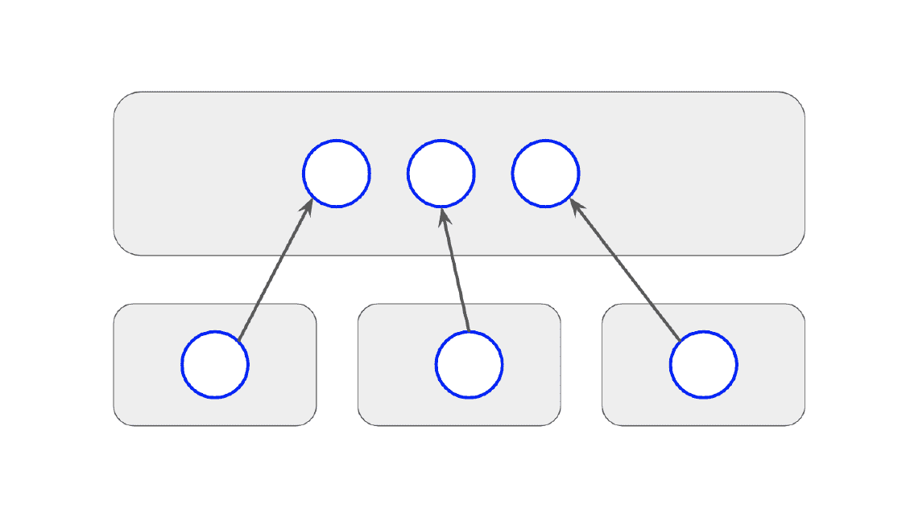

图 1:联合内部市场

这是一个局限于单个组织的市场。联盟者或不同的发布者是不同的团队、部门或业务单位，他们拥有 API，管理它们，并需要将它们推向一个公共市场，以便在组织内重用。消费者是各种内部单位以及可能使用这些 API 子集的外部合作伙伴。

由于拥有这些 API 的单位各不相同，因此在一个单位内部，API 的定义和管理都有自主权。然而，由于它被发布到一个公共的市场中，当一个 API 被发布时，为了确保所有的 API 都符合一个基本的质量水平，将会应用一些总体的治理和质量控制。对于不同的单元，这里没有收入激励——相反，主要目标是重用和协作。内部市场的部署有两种风格。

共享组件:

在一个完全共享的模型中，如图 2 所示，每个单元将使用共享的 publisher 来创建和发布 API。一旦发布，所有单位的所有 API 都将显示在一个共享的开发者门户上。出于调用的目的，每个单元可能有自己的网关来管理传入的请求。该网关将被放置在更靠近单元所拥有的端点的位置。

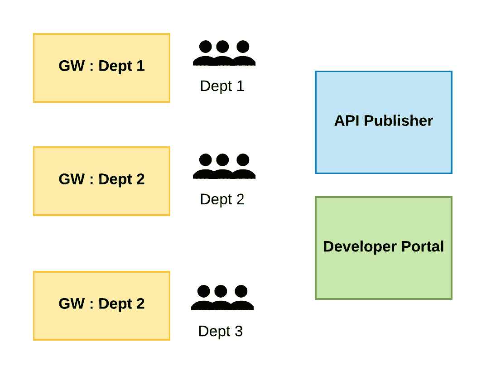

图 2:内部市场的部署(一)

由于所有单位共享市场的公共组件，底层 API 管理平台需要在发布者和开发者门户层支持可靠的可见性控制，以便来自特定单位的登录用户能够只看到与他们相关的 API。

分离的组件汇聚到一个通用的市场门户:

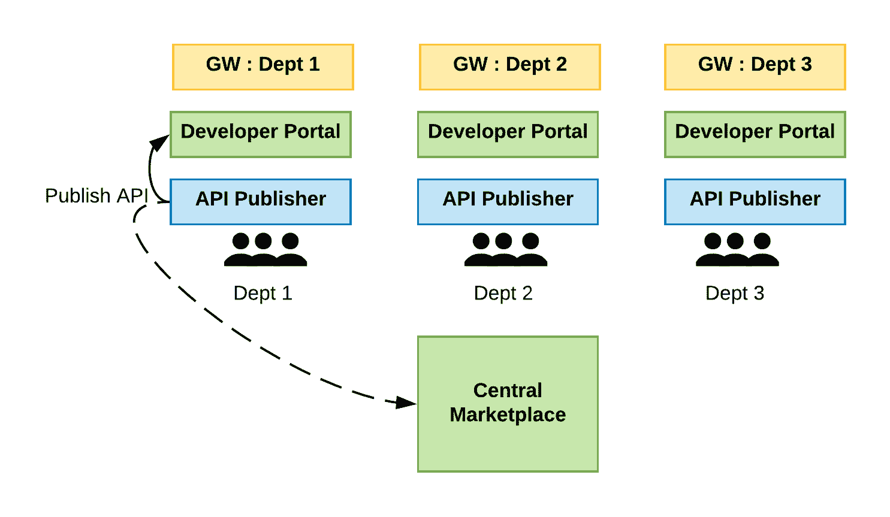

图 3:内部市场的部署(二)

在图 3 所示的模型中，每个单元都有自己独立的发布者和开发者门户。因此，将在这些由该单元管理的组件上创建 API。然而，由于该模式的总体意图是促进 API 在组织中跨部门的重用，因此需要一个中央市场门户，以及一个可以看到已发布 API 的地方。底层 API 管理平台需要提供以下功能:a)提供多个开发人员门户；b)当从发布者组件发布 API 时，发布到多个开发人员门户。同样，每个单元都有自己的网关来处理 API 调用。

总部位于欧洲的大型卡车制造商斯堪尼亚采用了内部市场模式。该公司从共享组件的集中式模型开始，在该模型中，组织中有一个卓越中心单元，通过该单元做出每一个决策。然而，这并没有成功，因为创建 API 的不同业务单元需要更多的自主权。最终，他们转向了一种内部市场模式，这种模式倾向于将独立的组件聚合成一个公共的市场部署模型。

在大多数模式中，概念模型是一个中心市场，联合的不同方面是从提供者的角度出发的，并且还考虑了消费者如何使用这些 API。因此，为了保持图表的简单，我们将使用内部市场图表的第一种形式来描述共同市场的概念。

### 合作伙伴市场

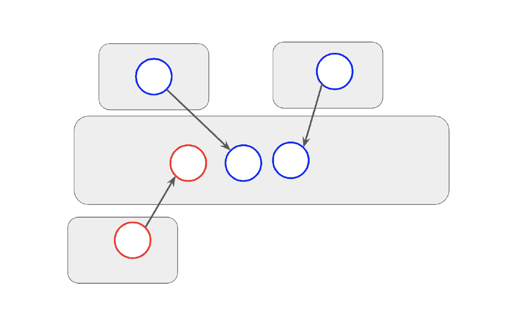

图 4:联合合作伙伴市场

下一个市场模式是合作伙伴市场模式。这是第一种模式的扩展。尽管如此，不同的内部单位还是会向市场发布 API。除了内部组织单位之外，合作伙伴组织也得到认可，因为最终，合作伙伴将成为整个生态系统的一部分。最初，合作伙伴可以是消费者网络的一部分，使用由各种内部单位发布的 API。然而，随着时间的推移，如果这些合作伙伴组织中的一些拥有 API，这些 API 将被相同的消费者用来创造更多的价值。然后，开放市场，这样这些合作伙伴也可以将他们的 API 发布到同一个市场中，使这些 API 可以被同一个 API 消费者群访问。

这个市场的部署同样可以遵循内部市场的两种风格。

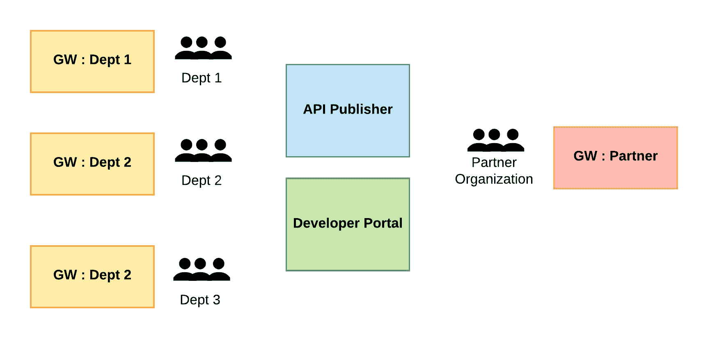

图 5:合作伙伴市场的部署

类似于每个单位将 API 发布到一个公共市场，伙伴组织也将他们的 API 发布到同一个公共市场。底层 API 管理平台需要支持合作伙伴组织的外部身份，要么通过联合，要么通过将合作伙伴用户存储合并到部署中。

BNY 梅隆银行是世界上最大的资产管理银行之一，拥有统一的 API 市场，可供内部消费者业务部门以及合作伙伴消费者部门访问。然后，这个市场对这些合作伙伴单位开放，让他们也可以发布自己的 API，从而为整个消费者群体提供更丰富的 API 集合，供他们从自己的应用程序中挑选和使用。

### 封闭的团体市场

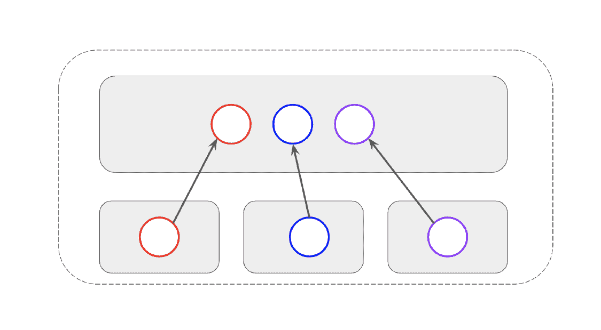

图 6:联合封闭团体市场

封闭的团体市场是不局限于单个组织的市场。相反，它是几个组织共有的市场，这些组织以共同的焦点联系在一起。比如，他们属于同一个运营主题，属于同一个行业，正在朝着一个共同的目标努力等等。虽然这不是一个局限于单个组织的市场，但不是任何组织都可以加入的。将会有一些管理机构通过基于共性参数的邀请将组织包括到该组中。联邦方面是自然出现的，因为这些事实上是不同的组织，它们正在汇聚到一个共同的市场上。

封闭集团市场的部署可以描述为下图所示。

在这个模型中，每个组织可能有自己的 API 管理基础设施，但是从概念上讲，它们将共享公共组件，尤其是在发布到公共开发人员门户时。每个组织都有自己的网关和安全组件。

底层 API 管理平台需要支持基于标准规范创建统一 API 的能力，并且能够与外部身份提供者以及网关无缝集成。

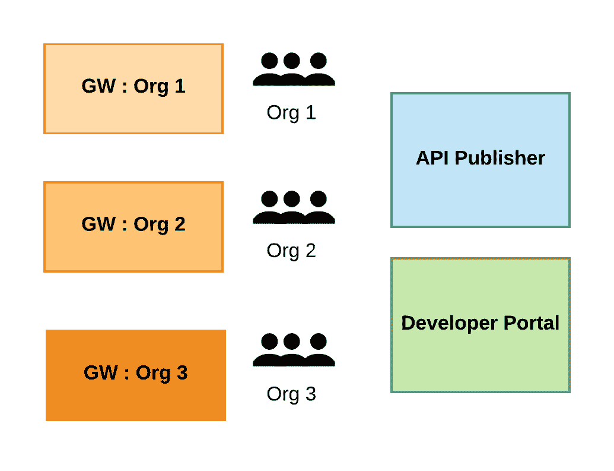

图 7:封闭的集团市场的部署

一个封闭的集团市场的例子是欧洲的金融机构所使用的，因为他们在公开他们的 API 时需要遵守一个标准规范。这些组织并不一起工作或为了一个共同的事业，但事实上是竞争对手。但是，由于法规要求，他们需要以标准方式公开其内部操作，以便第三方提供商在创建聚合器应用程序和支付应用程序时能够以标准方式使用这些 API。消费者是受益者，最终用户也是，因为他们现在可以通过一个应用程序访问他们所有的财务资源。

封闭集团市场的另一个例子是政府市场，其中的共性因素是朝着一个共同的目标努力。一个政府可以有多个下属机构，但这些部门提供的所有服务都应围绕政府设定的同一主题。这个市场将托管来自各种代理机构的所有 API，这样 API 消费者就可以在一个地方访问这些 API。智能迪拜就是这样一个例子，在保持不同政府部门独立性的同时，政府仍然能够提供一个统一的 API 市场，在一个地方提供不同部门的数字服务。

### 共享收入市场

图 8:联合共享收入市场

共享收入市场是一个 API 市场，它对任何想要在一个已知平台上托管其 API 的人开放。除了在组织加入这个市场并开始在其上发布 API 之前，管理机构可能需要运行一些基本的有效性检查之外，没有类似于封闭组模式中看到的限制。这种模式背后的主要驱动力是利益相关者之间的收入共享。市场提供商与 API 的提供商分享收入。这个市场中托管的 API 可以直接或间接货币化。

共享收入市场的部署:

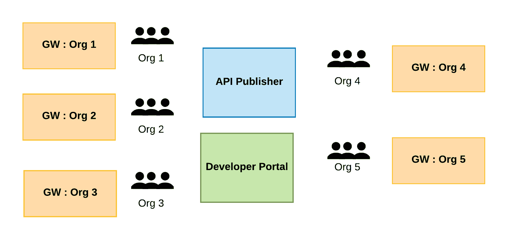

图 9:使用通用 GW 技术部署共享收入市场

在共享收入市场中，不同的组织将在一个平台上托管他们的 API。他们将共享市场的公共发布者和开发者门户。在某些情况下，他们将使用市场本身提供的网关功能，每个组织将获得一个单独的网关或网关空间，如图 9 所示。在其他情况下，一些与网关无关的市场可能为这些不同的组织提供将他们自己的网关集成到市场基础设施中的能力，如图 10 所示。

分享收入市场的一个很好的例子是 RapidAPI，它是全球领先的市场之一。RapidAPI 到目前为止托管了 20，000 个 API，经历了超过一万亿次 API 调用。他们有不同风格的市场，作为公共市场，也作为团队和企业中心，这更符合专注于少数组织的私有市场。

Ideabiz 是另一个例子。这是斯里兰卡移动运营商 Dialog Axiata 的一项倡议。它最初是一个内部市场，现在是一个公共市场，2，500 名开发人员能够在成立后的 18 个月内开发出 3，000 个应用程序。

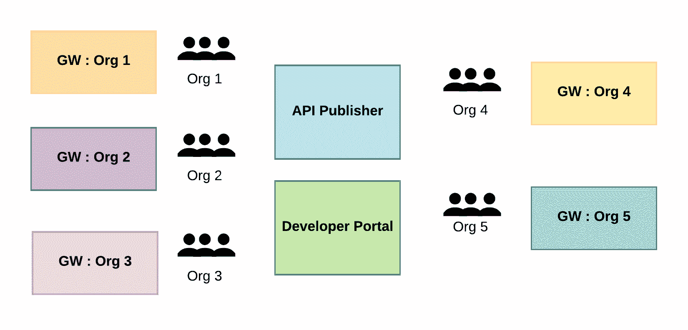

图 10:GW agnosticzxazz 共享收入市场的部署

### 聚合器市场

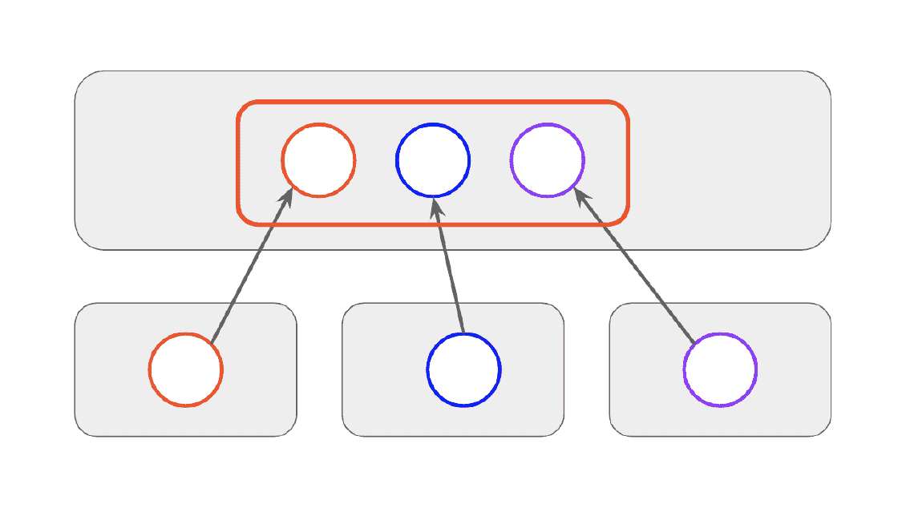

图 11:联合聚合器市场

聚合器市场是 API 提供者向平台提供 API 的地方。然后，将这些 API 或这些 API 的一部分制成被认为是价值包的产品并出售。销售的单一产品的组成部分可能来自不同的方面。因此，收入是以交错的方式分享的。该中心的消费者为他们从该中心消费的 API 产品付费。集线器所有者保留一部分收入，然后将剩余部分分配给为售出的产品提供构件的各个提供商。

聚合器市场的部署:

这个市场的部署模型如图 12 所示。每个向市场贡献或提供 API 的组织都有自己的发布者、开发者门户和网关。这些 API 中的一些也将被认为是适合聚合器市场的 API。聚合器市场也有自己的发布者，因为聚合需要在那里进行。聚合器市场可以由至少一个中心组成。API 提供者将通过有效的定义在中心发布者上创建他们的 API，然后在中心发布者处，通过混合几个这样的 API 或来自几个这样的 API 的资源来创建 API 产品。

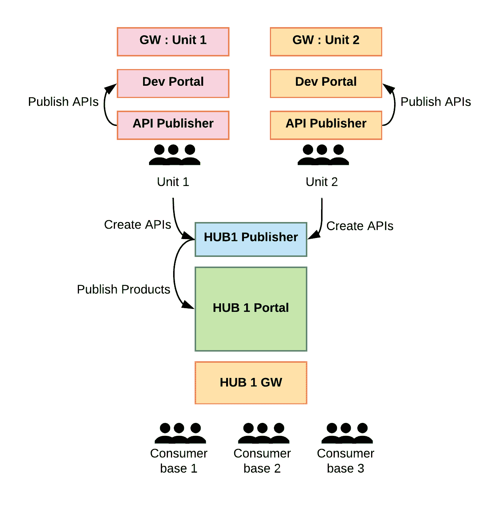

图 12:部署一个具有单一中心的聚合器市场

这些 API 产品从中心发布者发布到中心开发者门户。该中心将拥有自己的消费者基础，他们将订阅这些 API 产品并消费这些 API。集线器也将有自己的网关。

对上述模式的扩展是有多个这样的集线器，如图 13 所示。Hub 1 将向 hub 2 提供一些 API 产品，hub 2 也将拥有自己的 API 提供者集和 API 产品集。从 hub 1 到 hub 2 共享的 API 产品将在 hub 2 和 hub 1 获得收入。

这方面的一个例子是 Apigate，它在电信领域遵循这种模式。Apigate 在东南亚创建了一个 API 中心，将 API 汇总并销售给该地区的电信运营商。电信运营商为他们使用的 API 产品付费，Apigate 在保留一定比例后在 API 提供商之间重新分配这笔收入。他们还通过转售给中东的第二个这样的枢纽进行扩张，从而在多个枢纽之间分享收入。

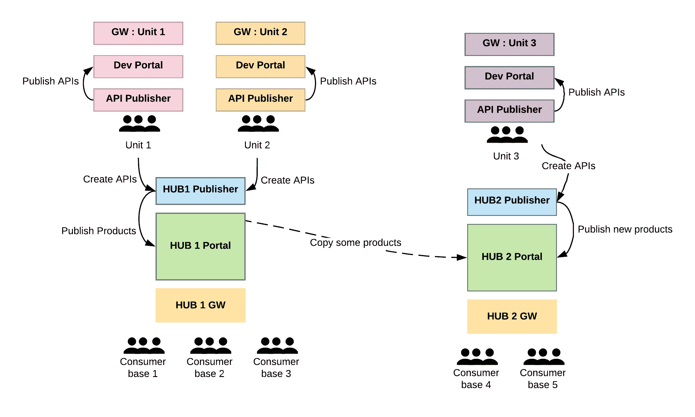

图 13:具有多个中心的聚合器市场的部署

## API 市场部署模式

所有上述模式都是来自 API 联盟的市场模式。这种分类是通过观察和记录这些 API 中的每一个与其他 API 的不同之处来实现的，这些不同之处是基于诸如谁拥有这些 API 之类的因素。

我们还可以提出一套基于市场部署方式的市场模式。在我们结束这篇文章之前，我们将在下一节中简要地触及这一点，以便在未来，我们不仅可以通过联盟模式，还可以通过部署模式对 API 市场进行分类。

### 共享组件市场

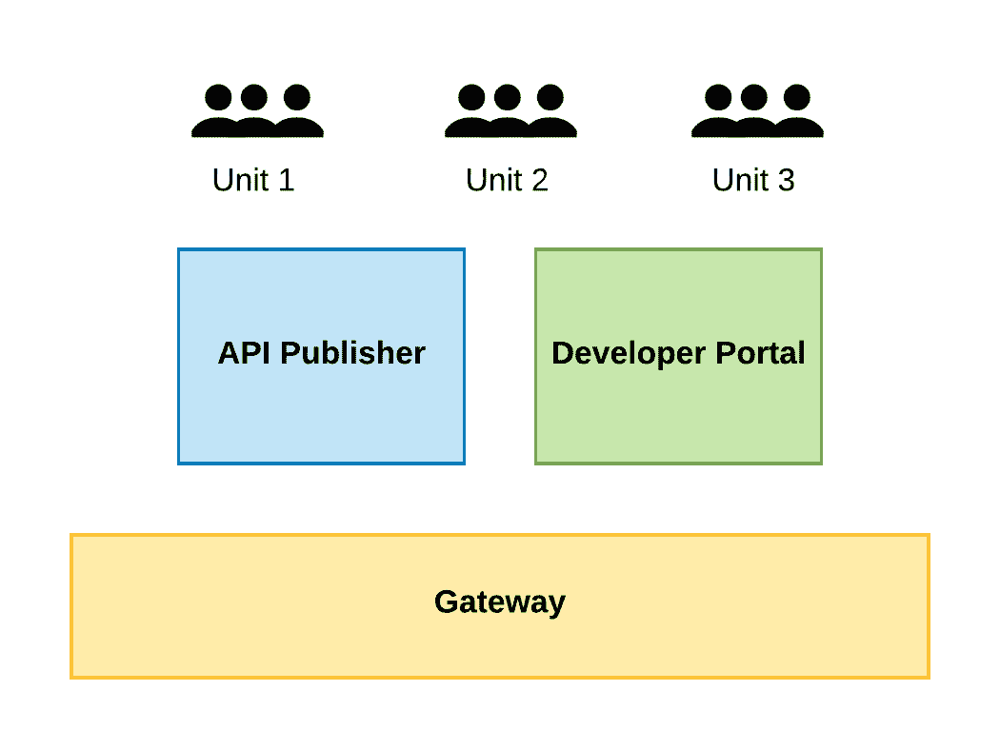

图 14:共享组件市场

所有组件在使用市场的所有单位之间共享。

### 共享发布者和门户组件市场

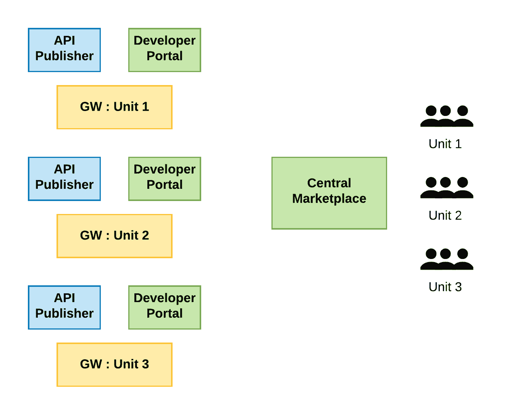

图 15:部分共享的组件市场

每个使用市场的单位都有自己的发布者和开发者门户；他们还将 API 发布到中央市场门户中。此外，每个单元也有其自己的网关，该网关可以放置在离该单元所拥有的端点更近的地方。

### 与 GW 无关的共享发布者和门户组件市场

图 16: GW 不可知的共享组件市场

marketplace 提供了一个共享的发布者和开发者门户，并且默认情况下提供了一个网关。它还为每个 API 提供者提供了引入自己的网关和整体运行时基础设施的能力。这要求底层 API 管理平台能够与多个网关以及市场的开发者门户组件集成，以便与多个 API 安全提供者集成。这种模式使组织不仅可以拥有自己的企业 API 部署，还可以在外部市场中公开他们的 API，而不需要更改任何运行时组件。

### 枢纽市场模型

图 17:单中心模型

在 hub 模型中，hub 操作者拥有一个 API 发布者和一个开发者门户以及一个网关。API 提供者创建 API，并在他们自己的开发者门户上发布这些 API，并且拥有他们自己的用户群。对于从多个 API 创建 API 产品的 hub 所有者来说，其中一些 API 被认为是有价值的包的一部分。这些 API 在 hub publisher 上创建，然后价值捆绑产品在 hub publisher 上根据几个这样的 API 创建，并发布到 hub developer 门户上。没有必要将单独的 API 发布到 hub developer portal，因为这些 API 不会被订阅。各种实体将从中心购买这些价值包，这些价值包将由这些实体的消费者基础使用。

它的一个扩展是多中心模型，如图 18 所示。在这种情况下，有多个中心，一些 API 价值包也在其他中心共享，并出售给拥有新消费者基础的新实体。此外，有了多个中心，更多的 API 提供者将连接到额外的中心，并提供可以捆绑到价值产品中的 API。

图 18:多中心模型

## 结论

API 市场在当今世界很重要，注意它们与典型的实体市场的不同也很重要。市场提供者需要记住，用户，即 API 提供者和消费者，仍然会重视购买和销售体验，并受益于使其特定于 API。

类似于所有被重复使用的东西，API 市场也可以被归类为模式。当构建企业 API 市场时，或者当想要成为 API 市场的一部分时，理解每个市场的具体特性是很重要的，这样您就可以知道哪种市场模式最适合您的需求。

API 市场对企业计算空间的影响超出了技术方面，即从公司的 API 门户到许多出版商和组织列出其 API 的共享环境的转变。它将技术与业务和人员方面结合起来，以促进 API 的使用和消费。API 市场不仅为我们创造了更丰富的环境和更有趣的工作空间，还促进了跨外部和内部生态系统的联合 API 的发展。

<svg xmlns:xlink="http://www.w3.org/1999/xlink" viewBox="0 0 68 31" version="1.1"><title>Group</title> <desc>Created with Sketch.</desc></svg>