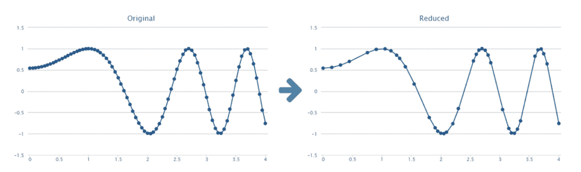
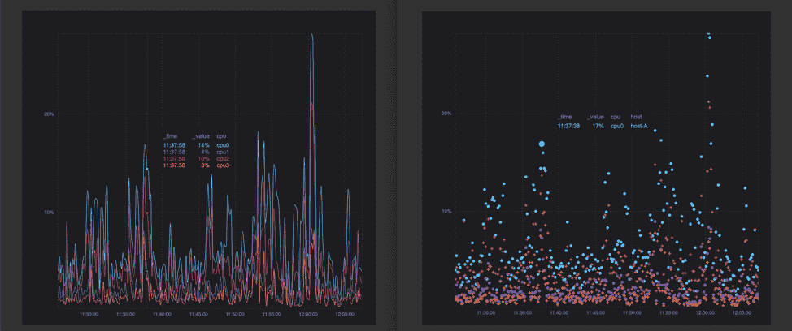
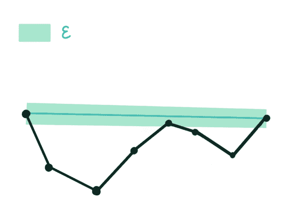
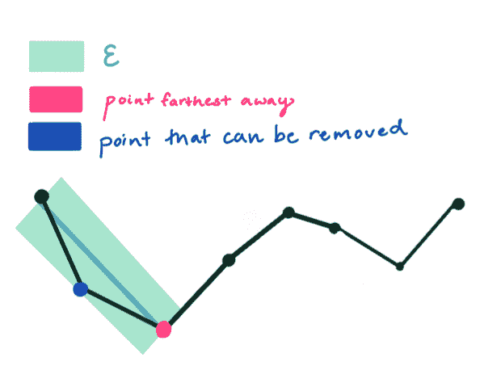
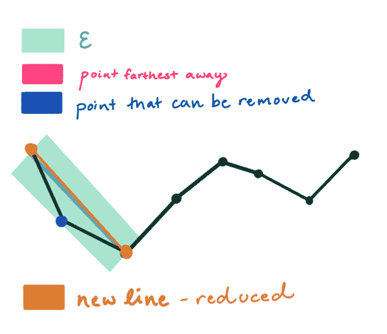
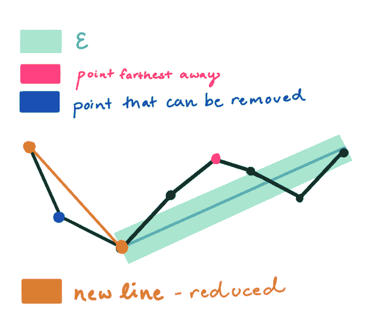
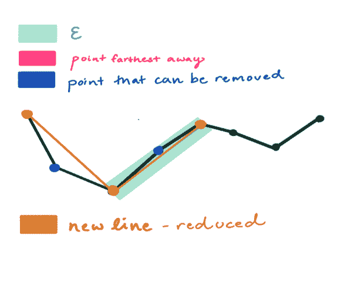
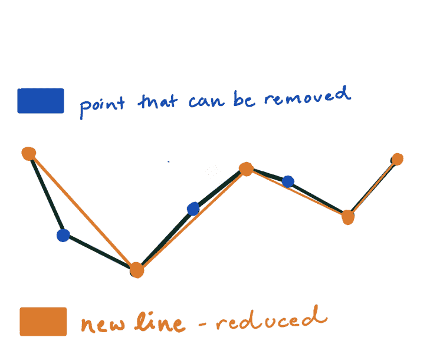

# 将谷歌地图和 InfluxData 的长颈鹿联系在一起的算法

> 原文：<https://thenewstack.io/the-algorithm-that-ties-together-google-maps-and-influxdatas-giraffe/>

[InfluxData](https://www.influxdata.com/) 赞助了这篇文章。

成为一名开发者倡导者的最大好处之一就是能够与社区分享开发者的工作。在 InfluxData 工作还意味着，我在博客中提到的代码、项目或想法都来自优秀的工程师，就像任何优秀的编码魔术师一样，他们有一些锦囊妙计。今天，我详细描述一个简单但重要的技巧:在[长颈鹿](https://github.com/influxdata/giraffe)中使用的算法，这是一个基于 React 的可视化库，用于实现 [InfluxDB Cloud 2.0](https://www.influxdata.com/blog/press-release-influxdata-opens-influxdb-cloud-2-0-to-public-beta/) 用户界面(UI)。

## 一种算法，两种可视化

谷歌地图和 InfluxData 的长颈鹿有什么共同点？Ramer-Douglas-Peucker 算法(RDP 算法)的实现。作为减点算法。它代表一条复杂的线，以视觉上适当的方式用较少的点。

Ramer-Douglas-Peucker 算法的原始数据集(右)和缩减输出(左)。图片来自 NAMEKDEV。

## 为什么它有用

 [阿纳伊斯·多蒂斯-乔治乌

Anais 是 InfluxData 的开发者倡导者，热衷于通过使用数据分析、人工智能和机器学习来使数据变得美丽。她将收集到的数据进行综合研究、探索和工程设计，将其转化为具有功能、价值和美感的东西。](https://www.influxdata.com/) 

直到我了解了这种算法，我甚至想过问这样一个问题:“谷歌地图是如何在我的浏览器上如此快速地渲染地图的？”地图包含数百万个地理空间数据点，但这些数据的可视化仅使用几千个像素。

在地图上画每一个点都是多余的，而且计算量很大。RDP 算法用于减少冗余点，并实现快速渲染，这是我对谷歌地图的期望。虽然该算法通常用于渲染地理空间数据，但它也适用于时序数据。客户需要能够从 InfluxDB 中查询成千上万个点，并让 [Chronograf](https://www.influxdata.com/time-series-platform/chronograf/) 快速渲染线图或散点图。下面的线条和散点图是 [InfluxDB Cloud 2.0](https://v2.docs.influxdata.com/v2.0/cloud/get-started/) 中一些漂亮的长颈鹿可视化的两个例子。

请查看这本[故事书](https://influxdata.github.io/giraffe/?path=/story/xy-plot--line)了解更多示例，包括直方图和热图。或者直接免费试用一下[这里](https://v2.docs.influxdata.com/v2.0/cloud/get-started/)。

## 它是如何工作的

为了应用该算法，用户必须将ε(用于确定保留和丢弃哪些点的阈值限制)定义为大于 0 的值。看一下这个[互动可视化](https://observablehq.com/@chnn/running-ramer-douglas-peucker-on-typed-arrays)，了解ε的值如何影响输出。RDP 算法是递归的，有三个步骤。

第一步:算法自动保留第一个和最后一个点。接下来，它从书端点画出最短的线。

第二步:它确定离直线最远的点，并从该点开始绘制一条新直线。

第三步:距离这条线[ε距离](https://en.wikipedia.org/wiki/Distance_(graph_theory))内的任何点都将被删除。因为一个点位于ε内，所以把它去掉，画出近似值。

这就是全部了。该过程递归重复，直到形成折线的新近似。

重复第一步。

重复第二步。

一个周期后的最终近似值，由烧焦的橙色线表示。

## 结论

能够收集和存储高吞吐量的时间序列数据是跨多个行业的任务关键型工作负载的一部分。然而，如果没有快速渲染和有意义的可视化解决方案，这些数据会失去很多价值。毕竟，如果数据需要几分钟才能渲染，导致您错过重要事件，那么能够以纳秒精度收集几十万个点又有什么意义呢？

通过 Giraffe 在 InfluxDB Cloud 2.0 中快速呈现时间序列数据，可以实现快速分析、实时监控和即时行动。如果你有任何问题，请发表在我们的[社区网站](https://community.influxdata.com/)或 [Slack](https://influxcommunity.slack.com/join/shared_invite/enQtNjA4MTM2NDgyNDUwLTUxMDAzNmM1YzJmOTNhMGE0ZjI2NzUxNzE4YjQ2OTY3MjVhNDlkNzFlMTZiZGJiOTIyNGE1ZDY3MGFmY2Q0OWE) 频道。

来自 Pixabay 的 Jim Semonik 的专题图片。

<svg xmlns:xlink="http://www.w3.org/1999/xlink" viewBox="0 0 68 31" version="1.1"><title>Group</title> <desc>Created with Sketch.</desc></svg>