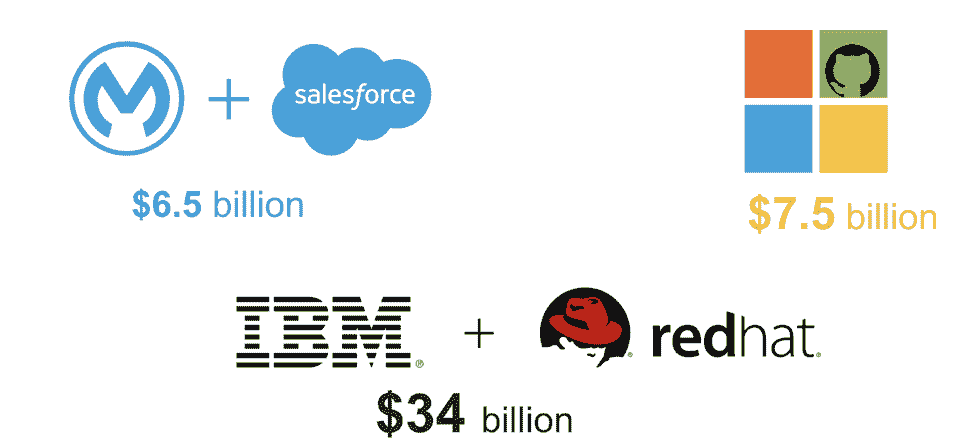
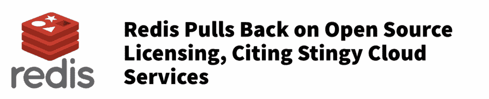
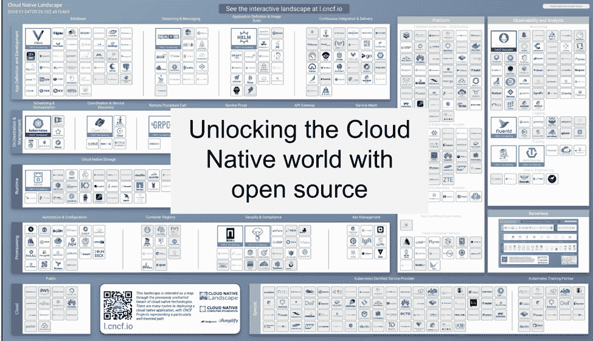
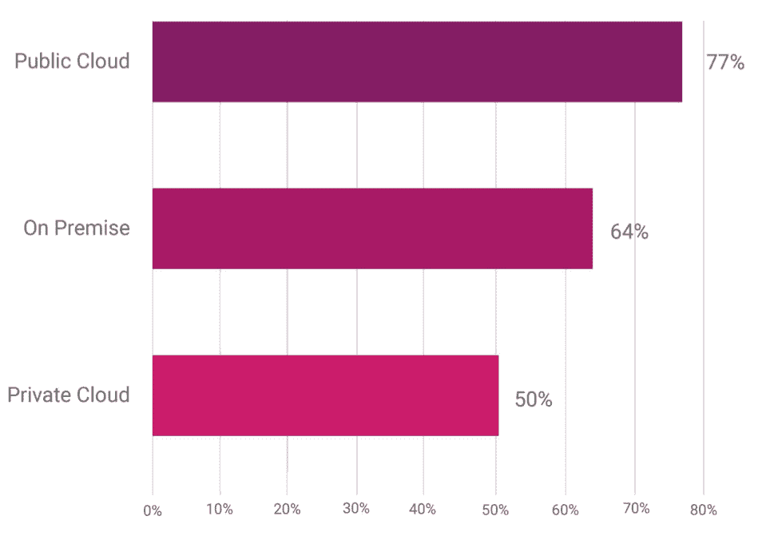

# 开源的亚马逊效应

> 原文：<https://thenewstack.io/the-amazon-effect-on-open-source/>

[Nati Shalom](http://cloudify.co)

[Nati Shalom，Cloudify 的创始人兼首席技术官，是云计算和大数据技术领域的思想领袖。Shalom 被 CIO 杂志评为首席信息官的顶级云计算博客，他的博客被 YCombinator 列为优秀博客，并因其对 OpenStack 社区的贡献而获得 HP Helion MVP 奖。Nati 是 OpenStack 以色列社区的创始人和领导者之一，并且经常在行业会议上发言。](http://cloudify.co)

云计算和开源是两大运动，它们正在重塑并不断颠覆我们对供应商和消费者之间关系的思考方式。它开启了甚至是最基本问题背后的整个思维，比如:什么是正确的商业模式？什么才算有价值，值得花钱买的产品？我们愿意在多大程度上接受供应商锁定？

云计算通过随增长付费模式和 SaaS，带来了一种全新的、敏捷的供应商/消费者商业模式思维方式。这种模式迫使供应商在交付软件时变得更加高效和准确，并思考产品背后的价值。

消费者愿意为“货架软件”付费的世界已经一去不复返了，因为云也让消费者能够更加成熟地衡量产品背后的价值，并做出数据驱动的决策。

对于开源，情况要复杂一些。Linux 和许多第一批开源项目都是从商品化战略开始的，即提供免费或“廉价”的软件来替代过去昂贵的软件。今天，许多开源项目是新创新的驱动力，并且经常依赖大量资金来维持它们的运行。虽然这些产品中的许多都有免费版本，但它们使用开放核心策略，在许多情况下，软件的成本与任何其他非开放源代码产品一样昂贵。

那么，如果成本不再是关键的驱动力，那么作为一个开源产品还有什么价值呢？

这其实是一个很好的问题。我自己也很惊讶地看到，我在过去一年中遇到的许多投资者都向我提出了这个问题，并对开源背后是否存在可行的商业模式提出了很多质疑(红帽被认为是这方面的独角兽)。

> 开源改变了供应商和消费者之间的关系，从一种不信任的关系和一个名副其实的“黑匣子”的被动消费者的关系，到一种信任和伙伴关系。

他们有充分的理由这样做，因为他们已经被投资于有前途的开源项目“烧伤”了(OpenStack 是最近在这方面作为参考经常出现的例子之一)。

显然，这让我对这个问题进行了深入的思考，我有了一个非常简单的认识。

开源改变了供应商和消费者之间的关系，从一种不信任的关系和一个名副其实的“黑匣子”的被动消费者的关系，到一种信任和伙伴关系。开源使得消费者在购买产品之前就能确切地知道他们得到了什么，同时还提供了更多的方法来控制他们消费给定产品的方式，或者通过代码贡献、特性请求等来塑造产品。使用非开源技术，消费者完全依赖于供应商的每一步。

开源中的“免费”部分还允许消费者根据他们的采用阶段和他们从产品中获得的价值来选择何时为给定产品付费。许多开源公司会允许你完全免费使用他们的产品，并假设随着你的成长和从产品中获得更多的实质性价值，你将需要支持和特定的强化，这就是他们将看到的货币化。所以，简而言之，只有当消费者觉得他们从产品中获得了足够的价值或者希望随着价值的增长而增长时，开源才允许他们为产品付费。

然而，这篇文章既不是关于开源原则，也不是云商业模式，而是关于它们相遇并改变和破坏了技术现在被采用和消费的整个方式。

## 亚马逊对专有/闭源公司的影响

2018 年是关键的闭源公司认识到开源不仅仅是一种技术选择，而且从商业价值角度来看也发挥着关键作用的一年:规模。

成功的开源公司往往比闭源公司扩展得更快。

开源公司与其消费者之间的信任关系也创造了更高程度的忠诚度，从而产生了粘性，这是导致与非开源替代方案相比规模差异的关键因素之一。

非开源公司不得不争夺每一笔交易和客户，即使是在他们现有的客户群中。对于开源来说，这个过程是非常不同的，因为在很多情况下，客户已经被说服并使用产品一段时间后，货币化过程才开始。因此，他们会更容易接受快速前进。

这和这篇文章的主题有什么关系？

嗯，云是关于规模的。像微软和现在的 IBM 这样的公司，已经意识到我们现在正处于一场抢夺土地的战争中。如果他们不能建立一个快速增长、可扩展的引擎，他们将会输给 AWS。当你从这些方面考虑时，现在就完全可以理解为什么微软和 IBM 愿意为 Github 和 Red Hat 的交易支付这么多钱。

输给 AWS 的成本远远高于那些交易的成本。

[Salesforce 收购 Mulesoft](https://www.redpill-linpro.com/news/salesforce-acquires-mulesoft-value-open-source-proven-again) 的有趣之处在于，它表明这种认识也适用于“诞生于云”的公司，而不仅仅是传统供应商。

### 开源公司的亚马逊效应

亚马逊对开源公司的影响实际上非常有趣，因为它表明了云和开源之间的相互影响。

在这篇文章的开头，我描述了开源商业模式背后的关键假设。关键的假设是，当你认真使用产品的时候，货币化就会发生。

当亚马逊开始提供特定开源产品的托管服务时，他们正好打破了这个假设。换句话说，通过为他们没有开发的产品提供托管服务，亚马逊“窃取”了货币化的果实，而不必承担产品实际开发的成本和投资。

这打破了许多开源模型背后的整个“信任系统”。像 MongoDB 和 Redis[这样的开源公司不得不采取防御措施，最终使他们的产品变得不那么开放。这种防御性的举动损害了消费者和开源提供商之间最敏感的方面——信任，对整个行业产生了负面影响。](https://www.theregister.co.uk/2018/08/23/redis_database_license_change/)

 

### 云原生开源拯救世界

所以，问题回到了，开源和云提供商之间的正确关系应该是什么样的？

当我在[为我们的第一次云本土日会议做主题演讲](https://www.youtube.com/watch?v=A4FYR__cRWA&index=2&list=PLBbbxYi2GRdY-vrCdgZwOG-E0AIUgVipU&t=0s)时，画面变得更加清晰。

虽然像 Amazon 这样的云提供商为了自己的利益滥用开源产品，甚至以损害开源社区为代价，但其他云供应商认为这是一个弱点，因此将开源视为打破当前 AWS 垄断并通过展示开源的“非锁定”战略赢得更多云业务的机会。

随着 Kubernetes 作为一个开源项目的推出，Google 率先意识到了这一点。Kubernetes 展示了云提供商(这里是 Google)如何通过允许其他提供商提供相同的产品并在同一堆栈上竞争，从而在推动和促进开源项目方面发挥积极作用，甚至冒着自相残杀的风险。

这就提出了一个问题——这对谷歌有什么好处？

答案实际上非常简单，无论是在前云时代还是在后云时代都是如此。这也是帮助谷歌在智能手机业务上击败苹果的策略——推出 Android 作为 iOS 的开放替代。

走开源路线是赢得开发者民心的有效策略。Kubernetes 是一个巨大的成功，其成功的部分原因是因为它没有绑定到特定的云提供商。通过这一举措，谷歌赢得了开发者的心，因为它没有将他们锁定在自己的平台上。谷歌正在通过让 Kubernetes 成为一个很好的地方来创建一个与开发人员社区的信任系统，它是一个如此好的地方的部分原因是他们在回馈平台方面投入了大量资金。

关于云原生生态系统，值得注意的是，它有助于平衡云提供商和消费者之间的关系。云提供商不是在为每个云提供商提供专有堆栈上竞争，而是在竞争谁有更好的“家”来托管这个云原生堆栈。

回到安卓的类比，安卓社区在推动 iOS 路线图和功能方面也相当有效，这些都间接受到了与安卓竞争的影响，可能比任何替代方案都有更大的影响。同样，我相信 Kubernetes 生态系统将直接或间接地决定 AWS 如何提供自己的服务。

微软对 Github 的[收购，以及最近 IBM 对 Redhat](https://www.redpill-linpro.com/news/salesforce-acquires-mulesoft-value-open-source-proven-again) 的[收购，以及规模较小的 VMware 对 hepio](https://techcrunch.com/2018/10/28/biggest-software-acquisition/)的[收购，都遵循了类似的思路。与谷歌不同的是，他们通过一系列收购，走了一条通往开发商的捷径。这是否会导致类似的成功还有待观察。这在很大程度上取决于大公司对开源背后微妙的信任体系的理解程度，以及他们在整个运营过程中会维持多少信任体系。](https://techcrunch.com/2018/11/06/vmware-acquires-heptio-the-startup-founded-by-2-co-founders-of-kubernetes/)

投资的规模，特别是微软和 IBM 的投资规模，表明开源是一个战略举措，所以我倾向于相信他们会努力工作，使它取得成功。

## 最终说明

多年来，人们一直在争论开源在云时代是否有重要作用，在云时代，软件通常作为服务交付。

由于许多公司的高失败率以及亚马逊在战略上的货币化威胁，开源背后的商业模式也受到了挑战。

对我来说，2018 年将被铭记为开放源代码的突破之年。这是开源公司能够毫无疑问地证明其商业价值的一年。这是开源公司上市的一年，其价值远远高于其他非开源公司。

这一年，主要的非开源公司如[微软](https://rcpmag.com/articles/2018/09/17/microsoft-open-source-shift.aspx?m=1)、IBM、VMware、[都与开源有着暧昧的关系，并全力加入开源阵营](https://www.theverge.com/2018/10/10/17959978/microsoft-makes-its-60000-patents-open-source-to-help-linux)。对于一家整个商业模式都围绕开源构建的公司来说，这是最大的软件收购交易。

也是在这一年，开源迫使所有主要的云提供商最终就交付和管理应用程序的通用平台达成一致，正如最近的 [Linux 基金会调查](https://www.cncf.io/blog/2018/08/29/cncf-survey-use-of-cloud-native-technologies-in-production-has-grown-over-200-percent/)中可以看到的那样，这显然是由真实数字支持的。

您的公司/组织使用以下哪种数据中心类型？(CNCF 调查)

根据调查，在这一年，我们看到云原生计算基金会项目的生产使用增长了 200%以上，这意味着云原生技术。

那么，开源背后(后云时代)有可行的商业模式吗？太好了。

[https://www.youtube.com/embed/A4FYR__cRWA?list=PLBbbxYi2GRdY-vrCdgZwOG-E0AIUgVipU](https://www.youtube.com/embed/A4FYR__cRWA?list=PLBbbxYi2GRdY-vrCdgZwOG-E0AIUgVipU)

视频

<svg xmlns:xlink="http://www.w3.org/1999/xlink" viewBox="0 0 68 31" version="1.1"><title>Group</title> <desc>Created with Sketch.</desc></svg>