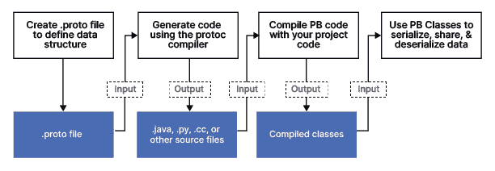
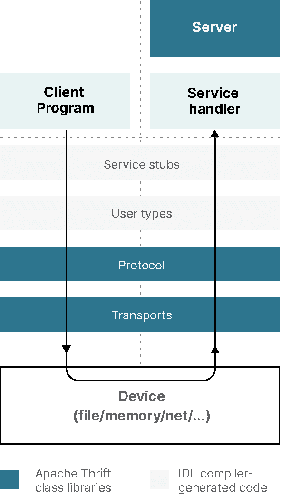
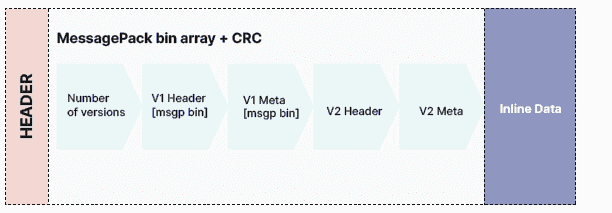
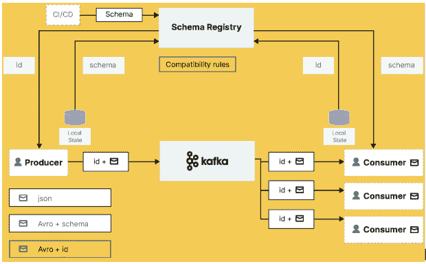
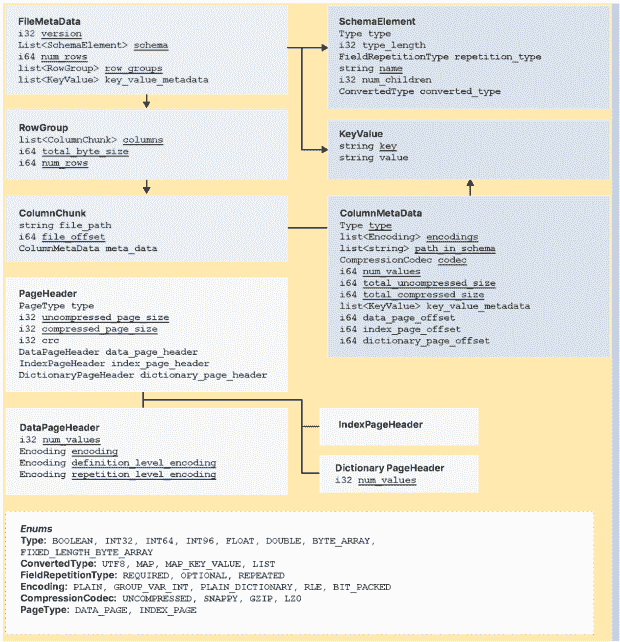
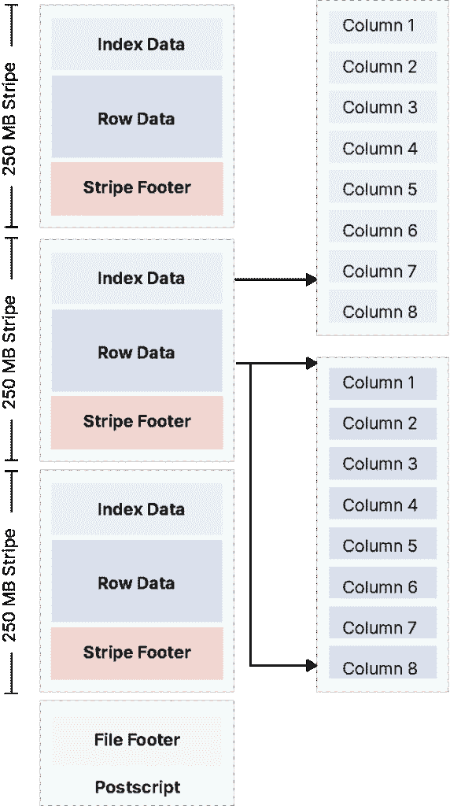
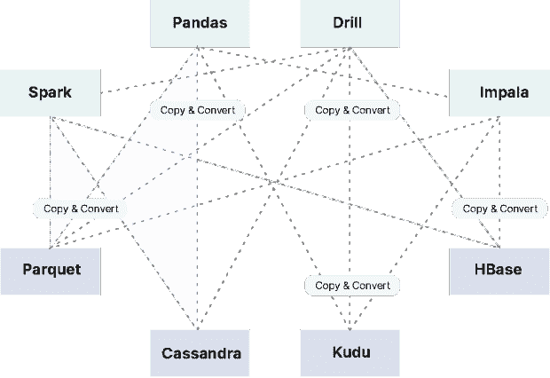
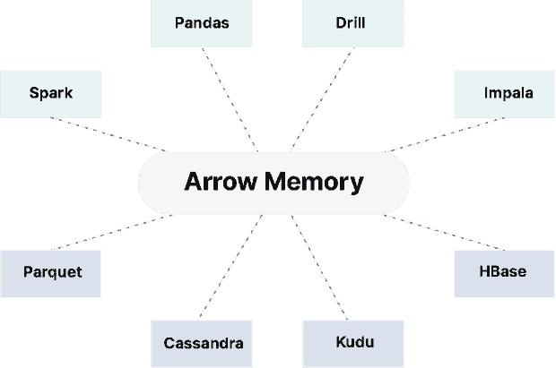

# 数据和文件格式的建筑师指南

> 原文：<https://thenewstack.io/the-architects-guide-to-data-and-file-formats/>

数据世界正在发生一场革命。在技术进步的推动下，当前的开源数据格式浪潮正在改变整个生态系统的游戏——从供应商到企业。

数据需要组织和分析，以生成及时的见解，帮助公司做出更好的决策和改善运营。处理图像等非结构化数据。pdf、音频、视频等。提出了不同的挑战。结构化和半结构化数据，如 CSV、XML、JSON 等。难以长期压缩、优化和存储。从这些数据集中获得洞察力的能力取决于数据的组织方式。由于企业记录的业务数据越来越复杂，他们可能会发现，现在他们不是为每个数据事件收集 20 个字段，而是捕获数百个字段。虽然这些数据很容易存储在数据湖中，但如果以基于行的格式存储，查询这些数据将需要扫描大量数据。

利用数据处理、人工智能/机器学习(AI/ML)、商业智能和报告工作负载来查询和操作数据的能力变得至关重要。这些工作负载总是需要从庞大的数据集中获取小范围的数据。因此需要数据格式。

如果你和任何数据工程师交流过，你一定听说过不同的数据格式，比如 Parquet，ORC，Avro，Arrow，Protobuf，Thrift，MessagePack 等等。这些文件和数据格式是什么？它们适用于哪里？如何为合适的工作选择合适的设计？这些是我们将在本文中解密的一些问题。

## 微服务的数据格式

在深入研究数据湖中高效存储和检索的数据格式之前，让我们先看看与数据湖不太相关的布局。像 Protobuf、Thrift 和 MessagePack 这样的数据格式与微服务之间的互通更相关。

## 协议缓冲区

Google 的 Protocol Buffers(也称为 Protobuf)是一种语言和平台无关的数据序列化格式，用于有效地编码结构化数据，以便通过网络传输或存储在文件中。它被设计成可扩展的，允许用户定义他们自己的数据类型和结构，并提供一个紧凑的二进制表示，可以有效地传输和存储。协议缓冲区在各种 Google APIs 中使用，并在许多编程语言中得到支持，包括 C++、Python 和 Java。协议缓冲区通常用于需要通过网络传输数据或以压缩格式存储数据的情况，例如网络通信协议、数据存储和数据集成。

### 实施概述

gRPC 是一个现代的、开源的、高性能的 RPC(远程过程调用)框架，可以在任何环境中运行。它支持客户端和服务器应用程序的方法之间的直接交互，类似于面向对象编程中的方法调用。gRPC 构建在 HTTP/2 之上，作为传输协议和 ProtoBuf 框架，用于编码请求和响应消息。gRPC 设计为高效，支持双向流和低延迟通信，可以在任何环境中运行。它被用于各种 Google APIs 中，并被许多编程语言支持，包括 C++、Python 和 Java。

gRPC 用于低延迟、高性能和高效通信非常重要的各种环境和应用中。它通常用于连接多语言系统，例如连接移动设备、web 客户端和后端服务。它还用于微服务架构中，以连接服务并构建可扩展的分布式系统。此外，gRPC 还用于 IoT(物联网)应用、实时消息和流媒体，以及连接云服务。



资料来源:https://developers.google.com/protocol-buffers

## 节约

另一种类似 Protobuf 的数据格式是 Thrift。 [Thrift](https://thrift.apache.org/) 是一种接口定义语言(IDL)和通信协议，允许开发可跨多种编程语言使用的可扩展服务。它类似于其他 IDL，如 CORBA 和 Google 的协议缓冲区，但被设计成轻量级和易于使用的。Thrift 使用代码生成方法，根据 IDL 定义为所需的编程语言生成代码，允许开发人员使用 Thrift 的二进制通信协议轻松构建可以相互通信的客户端和服务器应用程序。节俭用于各种应用，包括分布式系统、微服务和面向消息的中间件。

### 支持的语言

Apache Thrift 支持广泛的编程语言，包括像 Erlang 和 Haskell 这样的函数式语言。这允许您用一种语言定义一个服务，然后使用 Thrift 生成必要的代码来用另一种语言实现服务，以及可以用来从另一种语言调用服务的客户端库。这使得构建使用多种编程语言的互联系统成为可能。

### 实施概述

IDL 编译器生成的代码创建了客户机和服务器存根，它们在幕后通过本地协议和传输层在两者之间进行交互，从而支持进程之间的 RPC。



资料来源:https://thrift.apache.org/

## 消息包

MessagePack 是一种数据序列化格式，提供结构化数据的紧凑二进制表示。通过使用数据的二进制表示而不是基于文本的表示，它比其他序列化格式(如 JSON)更高效、更快。MessagePack 可用于各种应用，包括分布式系统、微服务和数据存储。许多编程语言都支持它，包括 C++、Python 和 Java，并且经常在需要通过网络传输数据或以紧凑格式存储数据的情况下使用。除了效率和速度之外，MessagePack 还被设计成可扩展的，允许用户定义自己的数据类型和结构。

### 支持的语言

MessagePack 支持许多编程语言，这主要归功于它的简单性。参见其门户网站上的实施列表[。](https://msgpack.org/index.html#languages)

### 实施概述

我们在 [MinIO](https://min.io) 决定将 [MessagePack](https://msgpack.org/) 作为我们的序列化格式。它通过允许添加/删除键来保持 JSON 的可扩展性。最初的实现是一个头，后跟一个 MessagePack 对象，结构如下:

```
{
  "Versions":  [
    {
      "Type":  0,  // Type of version, object with data or delete marker.
      "V1Obj":  {  /* object data converted from previous versions */  },
      "V2Obj":  {
          "VersionID":  "",  // Version ID for delete marker
          "ModTime":  "",    // Object delete marker modified time
          "PartNumbers":  0,  // Part Numbers
          "PartETags":  [],  // Part ETags
          "MetaSys":  {} // Custom metadata fields.
          // More metadata
      },
      "DelObj":  {
          "VersionID":  "",  // Version ID for delete marker
          "ModTime":  "", // Object delete marker modified time
          "MetaSys":  {}    // Delete marker metadata
      }
    }
  ]
}

```

元数据转换从以前的版本开始，新版本包括“V2Obj”或“DelObj ”,这取决于收到更新请求时的活动操作。本质上，在我们只需要读取元数据的情况下，我们可以在到达元数据的末尾时停止读取文件。我们最多可以通过两次连续读取来实现更新。

磁盘上的表示也随之改变。以前，所有元数据都存储为一个包含所有版本的大对象。现在，我们改为这样写:

*   带版本的签名
*   标题数据的版本(整数)
*   元数据的版本(整数)
*   版本计数(整数)



xl.meta 的整体结构

如果你想更好地理解如何在 MinIO 中使用这个 MessagePack 进行版本控制，请阅读这篇精彩的[博客](https://blog.min.io/minio-versioning-metadata-deep-dive/)。

## 流媒体数据格式

## Avro

Apache Avro 是一个数据序列化系统，它提供了数据结构的紧凑和快速的二进制表示。它被设计成可扩展的，允许用户定义他们自己的数据类型和结构，并提供对动态和静态类型语言的支持。Avro 常用于 Hadoop 生态系统中，用于各种应用，包括数据存储、数据交换和数据集成。Avro 使用基于模式的方法，其中模式是为数据定义的，用于序列化和反序列化数据。这使得 Avro 能够支持丰富的数据结构和数据随时间的演变。Avro 还支持一个容器文件来存储持久数据、RPC 和与多种语言的集成。

Avro 依赖于模式。写入 Avro 数据时，Avro 模式保存在文件中。Avro 模式是一个 JSON 文档，它定义了存储在 Avro 文件中或在 Avro 消息中传输的数据的结构。它定义了数据中字段的数据类型，以及这些字段的名称和顺序。它还可以包括有关数据编码和压缩的信息，以及与数据相关联的任何元数据。

Avro 模式用于确保数据以一致且可预测的格式存储和传输。当数据写入 Avro 文件或在 Avro 消息中传输时，数据中会包含模式，以便数据的接收方知道如何解释它。

模式方法允许序列化既小又快，同时支持动态脚本语言。

文件可以在以后由任何程序处理。如果读取数据的程序需要不同的模式，这可以很快解决，因为两种模式都存在。

### 支持的语言

Apache Avro 是记录数据的领先序列化格式，也是流数据管道的首选。它提供了优秀的模式进化，并且实现了 JVM (Java、Kotlin、Scala、…)、Python、C/C++/C#、PHP、Ruby、Rust、JavaScript 甚至 Perl。

要了解 Avro 与其他系统的更多比较，请查看文档中的这个[有用的比较](https://avro.apache.org/docs/1.11.1/#comparison-with-other-systems)。

Apache Kafka 和[合流平台](http://docs.confluent.io/current/)为 Avro 做了一些特殊的连接，但它可以处理任何数据格式。



## 数据湖的大数据文件格式

## 镶木地板

Apache Parquet 是一种用于大数据处理的柱状存储格式。它被设计为高效的存储和处理，并作为数据存储和交换格式在 Hadoop 生态系统中广泛使用。尽管 Hadoop 衰落了，但这种格式仍然相关并被广泛使用，部分原因是它继续得到关键数据处理系统的支持，包括 Apache Spark、Apache Flink 和 Apache Drill。

Parquet 以列格式存储数据，以一种针对列操作(如过滤和聚合)优化的方式组织数据。Parquet 使用压缩和编码技术的组合以高效的方式存储数据，并且它允许创建数据模式，这些数据模式可用于强制数据类型约束和实现快速数据处理。Parquet 是存储和查询大型数据集的流行选择，因为它支持快速查询和高效的数据存储和处理。

### 实施概述

这种模式允许高效地捕获元数据，支持文件格式的发展并简化数据存储。拼花压缩算法减少了存储需求，实现了更快的检索，并且受到许多框架的支持。有三种类型的元数据:文件元数据、列(块)元数据和页眉元数据。Parquet 利用 Thrift 的 TCompactProtocol 对元数据结构进行序列化和反序列化。



礼貌:parquet.apache.org

## 妖魔

ORC，即优化的行列，是一种数据存储格式，旨在通过优化大量数据的存储和检索来提高数据处理系统(如 Apache Hive 和 Apache Pig)的性能。ORC 以列格式存储数据，这意味着数据是按列而不是按行来组织和存储的。这允许更快地查询和分析数据，因为只需要访问相关的列，而不是读取整行数据。ORC 还包括一些特性，如压缩、谓词下推、在对相同文件使用单独的记录读取器时提高并发性，以及进一步提高性能的类型推断。

与 RCFile 格式相比，ORC 的另一个改进领域，特别是在 Hadoop 部署中，是它极大地减少了 NameNodes 上的负载。

应该注意的是，ORC 针对 Hadoop 架构和工作负载进行了调整。鉴于大多数现代数据堆栈正在远离 Hadoop，ORC 在云原生环境中的效用有限。

### 实施概述

ORC 文件中的行数据被组织成称为条带的组，其中包含一系列行和关于这些行的元数据。每个条带包含一系列行，每行又分为一系列列。每一列的数据都是单独存储的，这使得 ORC 可以有效地只读取特定查询所需的列，而不是读取整行。ORC 还包括关于数据的元数据，如数据类型和压缩信息，这有助于提高读取性能。ORC 支持各种压缩格式，包括 zlib、LZO 和 Snappy，这有助于减少磁盘上的数据大小，提高读写性能。它还支持各种类型的索引，如行索引和 bloom 过滤器，这些索引可用于进一步提高读取性能。



礼貌:orc.apache.org

`orcfiledump`**的输出包括文件元数据的摘要，比如文件中的行数、列数和条带数。它还包括列的数据类型和存储在文件中的任何索引信息。**

 **除了元数据，`orcfiledump`还打印 ORC 文件中的实际数据。这包括每行中每列的值，以及存在的任何空值。每一行代表一条记录，该记录由定义为字段的每一列组成。这些行组合起来表示一个表格结构。

## 箭

相对较新的 Apache Arrow 是一种开源的内存列数据格式，旨在加速分析和数据处理任务。它是一种标准化格式，用于在各种系统中表示和操作数据，包括数据存储系统、数据处理框架和机器学习库。

Apache Arrow 的主要优点之一是它能够在不同的系统和进程之间高效地传输数据。它允许在系统之间共享和交换数据，而不需要序列化或反序列化，序列化或反序列化可能会非常耗时和耗费资源。这使得它非常适合在分布式和并行计算环境中使用，在这些环境中需要快速处理和分析大量数据。

除了性能优势之外，Apache Arrow 还有丰富的特性集，包括支持多种数据类型、支持嵌套和分层数据结构，以及与多种编程语言的集成。Arrow 格式通常用于大数据和分析应用程序，可用于在系统之间高效传输数据和处理内存中的数据。它还用于分布式系统和实时分析管道的开发。

### 实施概述

大多数数据团队面临的挑战是，在没有标准列数据格式的情况下，通过序列化/反序列化来处理每个数据库和语言的内部数据格式会导致效率低下和性能问题。另一个主要挑战是为每种数据格式编写标准算法，这会导致重复和膨胀。



礼貌:https://arrow.apache.org/

Arrow 的内存列数据格式通过减少磁盘 IO 读写和支持查询加速，显著增强了数据分析。它对数据使用固定宽度的二进制表示，这允许在内存中快速读写数据。除了由于其内存计算而改进操作工作之外，该框架还允许添加定制连接器来简化跨各种格式的数据聚合。



礼貌:https://arrow.apache.org/

礼貌:https://arrow.apache.org/overview/

Dremio 是构建在 Arrow 框架上的查询加速工具。Dremio 旨在为各种数据源提供快速查询性能，如数据库、数据湖和云存储系统。它使用 Arrow 内存列数据格式来存储和处理数据，这使它能够利用 Arrow 的性能和效率优势。如需进一步阅读，请参考“ [Apache Arrow 及其如何适应当今的数据环境](https://www.dremio.com/subsurface/the-origins-of-apache-arrow-its-fit-in-todays-data-landscape/)”

## 课程用马——选择最佳形式

为了更好的软件管理，组织已经投资了微服务架构，避免了单一的方法。采用容器化并部署在大型 Kubernetes 集群上是一种自然的发展。这些微服务是用不同的语言构建的，并且采用了多语言的多范例。

在这些情况下，采用协议缓冲区、Thrift 或 MessagePack 是有帮助的。它们简化了微服务之间的相互通信，并实现了更快的事件处理。有助于提高应用程序可支持性的其他好处是独立和频繁部署的能力。

随着流和消息驱动架构的出现，对数据格式和压缩的广泛需求将 Avro 推向了前沿。如上所述，Arvo 非常灵活，可以跨微服务、流应用和消息驱动架构采用，并在数据湖和湖屋架构中大量实施。像 Iceberg 和胡迪这样的开放表格式利用 Avro 和支持快照隔离的模式。

Parquet 在数据湖和湖屋架构中处于领先地位，并且仍然是该领域的标准。ORC 支持大条带大小的能力使其在 Hadoop 分布式文件系统(HDFS)世界中广泛传播，但正如我们所知，这个世界正在缩小。尽管如此，它对备份用例还是有用的。Arrow 是块中的新成员，它非常适合内存使用，可以用于对对象持久性需求不太大的对象存储用例。

## 结论

现代数据堆栈是一种选择，当涉及到数据和文件格式时，有越来越多的好选择。MinIO 支持所有这些技术，让您和您的云架构师来决定使用哪一种。通过下载[到这里](https://min.io/download#/kubernetes)或查看我们的 [Slack 频道](https://slack.min.io/)或通过[商业许可](https://min.io/pricing)直接与工程团队接触，您可以自由地用 MinIO 试用它们。

<svg xmlns:xlink="http://www.w3.org/1999/xlink" viewBox="0 0 68 31" version="1.1"><title>Group</title> <desc>Created with Sketch.</desc></svg>**