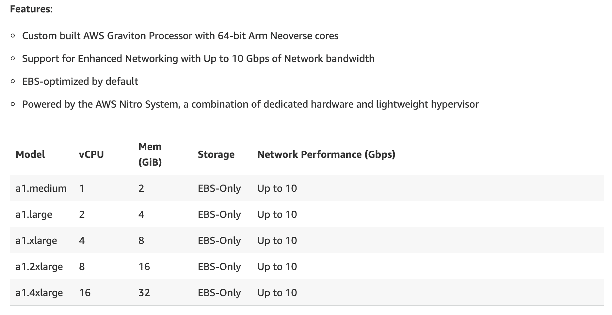

# AWS 云从业者考试:了解 AWS 的经济学

> 原文：<https://thenewstack.io/the-aws-cloud-practitioner-exam-understand-the-economics-of-aws/>

Stackery 赞助了这篇文章。

 [托比·费

Toby 是 Stackery 的社区开发人员。她的角色和经历结合了软件工程师、作家和技术讲师的工作，用新兴工具构建有趣的项目，并与世界分享她的发现。在加入 Stackery 之前，Toby 是 NWEA、瓦卡萨和新遗迹公司的工程师。](https://www.stackery.io/) 

[AWS 认证云从业者考试](https://aws.amazon.com/certification/certified-cloud-practitioner/)要求你展示对亚马逊网络服务的熟悉程度，作为你获得其他 AWS 认证的第一步。为了[通过第一项考试](/one-womans-journey-to-crack-the-aws-cloud-exam/)，你必须熟悉 AWS 的功能，以及如何在计算、存储和数据库类别中选择最适合你需求的产品。

考试中的大部分问题都围绕着用于特定任务的最佳 EC2 实例类型。当您看到几十种大小和类型的 EC2 实例并找到每种类型的枯燥信息时，这可能会令人生畏。

AWS 告诉您准备好选择正确的实例类型。他们真的希望你记住 1.2 倍大的字体有 16 千兆字节的内存吗？

谢天谢地，这不是他们所说的实例类型。它实际上是指您的实例的四种定价类型之一，您必须单独选择。它们是:

*   按需实例
*   定点实例
*   保留实例
*   专用实例

如果你记得它们的各种成本是基于市场经济的，即使这四个也不应该要求你记住一大堆细节。

以上哪一种总是比其他的便宜？一个都没有。在某些特定的情况下，每一种都会让你得到最好的交易。

### 按需实例:最简单也是最昂贵的

当您想要更多 EC2 实例时，Amazon 会为您提供。总统刚刚是不是在推特上称你的首席执行官为“失败的混蛋”，让你的浏览量飙升？AWS 可以轻松提供您需要的所有容量。但是以这种方式购买服务器容量是最昂贵的。为什么？

对此的解释是，AWS 需要能够满足几乎任何地方的突然需求高峰。为了有能力满足更高的需求，必须存在大部分时间都不使用的服务器。当您为一个随需应变实例付费时，一些成本将包括服务器空闲等待某人需要它的时间。

因此，就每计算小时的费用而言，按需实例是最昂贵的，但您只需为您正在使用的容量付费。当需求回落时，您应该能够配置您的部署以“缩小规模”并使用更少的容量。

### 现货实例:我们想要什么？计算！我们什么时候想要它？我不知道，什么时候都行，不急。

Spot 实例为可以等待的作业提供计算。这个名字可能有点令人困惑，因为“当场购买”听起来像是你马上就买了，但实际上，当场实例上的任务可能几个小时都不会运行！

“现货”指的是“现场”市场，但真正发生的是容量的快速出售。

从 AWS 的角度考虑经济问题:他们有一个庞大的稳定的服务器。为了帮助客户按需满足其容量需求，必须有大量的服务器可用。很好，但是如果在东海岸的凌晨 4 点，当每个人都在睡觉，没有人需要计算能力时，有一些方法可以出售服务器时间，这不是很好吗？

进入 Spot Instances，这是一个重新编译视频或进行机器学习训练集的好地方。就每小时的费用而言，Spot 实例是最便宜的，但是你不能确定你什么时候能得到你所购买的计算时间。

### 保留实例:具有最明显名称的实例

我经常用“我们刚刚播出的超级碗广告”来解释为什么我们需要保留实例。有时，我们知道我们将提前需要服务器容量，并可以保留它。

在现货实例之后，预订将是购买容量的最便宜的方式。AWS 向您出售服务器空间，无需猜测您将需要多少空间。你保留的每一点计算能力都将被出售，所以亚马逊不需要像上面描述的那样在现货市场上出售时间。

这种价格优势也描述了保留实例的缺点:你最终总是要为你不需要的计算能力付费。

### 专用实例:当你停留在过去的时候

AWS 服务器非常好。它们肯定比运行自己的数据中心更便宜，而且通常比任何其他基础架构供应商都便宜。为什么不总是使用它们呢？

嗯，一个原因是你使用的软件是在 AWS 变得必要之前写的。许多旧的软件许可证不处理 AWS 所谓的服务器或“EC2 实例”的实际性质

想一分钟:当你买一个 EC2 实例，有 X 数量的 RAM 和这么多的 CPU 容量，你真的是在某个地方租一个盒子吗？有没有一个女孩在数据中心跑来跑去，标签制造商在你的一点机架空间上写着“Dave 的服务器”,运行你的堆栈？

不会。您购买的大多数服务器只是大型服务器的虚拟化子部分。这就是为什么 AWS 可以提供数百种不同的容量配置，因为您真正购买的是一个更大馅饼的一部分。

从一个时刻到下一个时刻，“你的”服务器也可能移动位置以更有效地分配容量。作为用户，你应该看不到这一点，但它节省了 AWS 的资金。

不幸的是，一些授权软件不允许这些；如果您的服务器从一种硬件转移到另一种硬件，他们会向您出售新的许可证。因此，在 EC2 上安装限制性许可软件可能会有问题。

进入专用实例:现在你的服务器保证运行在特定的硬件上。这降低了 AWS 的效率，因此专用实例总是有点贵，但对于一些堆栈来说是唯一的选择。

## 前去证明

通过这次考试是 Stackery 拥有其 [AWS DevOps 资格](https://aws.amazon.com/partners/competencies/)的部分原因。我们的解决方案是[开始构建无服务器应用](https://www.stackery.io/)的绝佳方式，让您相信您选择的解决方案已经达到 AWS 严格的 DevOps 标准。

<svg xmlns:xlink="http://www.w3.org/1999/xlink" viewBox="0 0 68 31" version="1.1"><title>Group</title> <desc>Created with Sketch.</desc></svg>