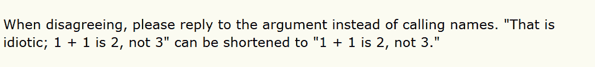

# 被围攻的版主将黑客新闻集中在知识分子的好奇心上

> 原文：<https://thenewstack.io/the-beleaguered-moderators-who-keep-hacker-news-focused-on-intellectual-curiosity/>

当风险投资家保罗·格拉厄姆在 2007 年推出《黑客新闻》时，他制定了激起“求知欲”的目标

“听起来很矛盾，让黑客成为如此优秀的初创企业创始人的原因是，他们关心的不仅仅是商业。他们有求知欲，也有赚钱的欲望。因此，为初创公司创始人制作新闻网站的方法是让它不仅仅是关于初创公司的，”他当时写道。

上周四，《纽约客》在“[主持黑客新闻](https://www.newyorker.com/news/letter-from-silicon-valley/the-lonely-work-of-moderating-hacker-news)的孤独工作”中对这一目标进行了评估文章透露，技术新闻和讨论论坛现在每月有 500 万独立访客，并怀疑“该网站的原始技术知识文化是否可以负责任地扩大规模，为更包容、更广泛的技术愿景腾出空间。”

《纽约客》作家[安娜·维纳](https://www.newyorker.com/contributors/anna-wiener)写道，“该网站现在特有的表演式博学——超理性、冷静、逆势、权威——往往掩盖了更深层次的鲁莽，”她补充道，由于它在工程师中几乎普遍受欢迎，“它变得越来越难以调和。”

《黑客新闻》开始时每天只有大约 1600 名访客。但是今天它的日流量增加了 100 倍——所以它现在有两个版主，丹尼尔·格克尔和斯科特·贝尔，他们由一些自动化软件辅助。维纳提供了一些有趣的一瞥，让人们了解主持人带给他们工作的个性。“Gackle 被吸引到治疗工作室；贝尔，印度哲学。有时，他们似乎在对一种痴迷于未来的文化应用陈旧的人文主义技术。”

> “我们试图优化的黑客新闻是定性的，而不是定量的。”—丹尼尔·加克尔

在文章中，Gackle 承认“就做这份工作的心理体验而言，你所有的按钮都是定期按下的。”

贝尔于 2016 年加入该团队，Gackle 将此举描述为“[内部重构](https://news.ycombinator.com/item?id=12073675)，以实现假期和休息日等创新。”

Gackle 使用的是“dang”这个昵称，而 Bell 是“sctb”，在本周的一条评论中，Gackle 估计他们在过去的七年里已经发布了超过 38，000 条评论。以禅宗老师的耐心，他们会建议愤怒的用户[发表中立的评论](https://news.ycombinator.com/item?id=20687789)，以更好地传达他们想法的价值。(“这需要耐心和内心的平静……”)你每天都可以看到，在任意选择的两位[版主的](https://news.ycombinator.com/threads?id=dang) [评论](https://news.ycombinator.com/threads?id=sctb)中。

你可以看到，这种解除武装的方法有时确实会带来深思熟虑的回应。([本周](https://news.ycombinator.com/item?id=20684392)一位用户写道:“我看了我最近的评论，看来你是对的。”。"我会反思这一点，承认我的精神可能受到了伤害.")

2014 年，保罗·格拉厄姆称格克尔是“我见过的最体贴的人之一”

“当人们在评论帖子中说一些卑鄙、愚蠢的事情时，他会死的。管理一个匿名论坛是很难的，事实上，我们对 HN 糟糕的评论和太快禁止人们的评论感到大致相同的悲伤，这表明他迄今为止做得很好。”

## 社区的中心

当我本周给 Gackle 发电子邮件，询问他作为这场争论的中心感觉如何时，他似乎有些犹豫。“我没注意到多少令人困惑的对话，”他回复道。“在哪里发生的？”

但当我问他，让《纽约客》承认他们对网站进行深思熟虑的调整所付出的努力，感觉如何时，他小心谨慎的意识开始形成。

“我觉得记者安娜重视的许多东西和我们重视的一样，所以我们觉得自己被倾听了，这很令人满意，”加克尔回信说。“我们认为让更多的 HN 故事公之于众对社区有好处，我认为这可能是正确的。”

这似乎是一个吃力不讨好的工作，试图跟上每一个评论——好的，坏的，尤其是丑陋的。我问 Gackle 他们是否有任何方法来衡量他们的影响，或者知道什么有效，什么无效？“我们通过密切观察现场来做到这一点，”他回答说，“并讨论我们的观察结果。

“虽然我们跟踪一些量化指标，但我们并不基于它们做太多事情。我们试图优化 HN 的是定性而非定量。”

在本周的黑客新闻上，数百名用户已经在评论《纽约客》的文章，有些人只是好奇他们的两位辛勤工作的版主是如何管理不断膨胀的评论量的。看到 Gackle 分享关于他们工作流程的细节很有趣。“所有的评论都是公开的(只需点击顶栏的‘评论’)，但我们不会以这种方式监控网站。太过分了。”

“我们基本上像其他人一样阅读帖子，并依赖审核列表，如用户标记的内容。”

Gackle [后来补充道](https://news.ycombinator.com/item?id=20643177)“我曾经有一个客户端软件，它会在评论文本中突出显示特定的正则表达式，但是在我们重写我们使用的客户端 Lisp(Parenscript->Lumen->Arc)时，它停止了工作，我还没有找到时间让它再次工作。”

我还问是否有特殊的工具可以只突出显示新的/未读的，Gackle 回答说“这是我们计划添加到 HN 的一个功能。”

“我相信已经有一些第三方工具提供了这种功能。”

## 对美好未来的梦想

在文章中，Gackle 说至少网站的部分 DNA 是极客本能的一种转化，以建立更好的系统，在那里“你至少可以在互联网上做梦、阅读和争论。”(他补充说，这使得该网站成为“受挫的理想主义者的一个泄压阀。”)

这就构成了文章的最后一个诗意段落。“我想到了这种中庸之道所需要的不懈的耐心和真诚。我把贝尔和格克尔想象成阻力池里的游泳者，逆着网络言论的潮流缓慢爬行。我希望《黑客新闻》这个项目是值得努力的。”

来自黑客新闻指南

在 2007 年推出该网站时，格雷厄姆承认“大多数论坛都会随着时间的推移而退化，但我们不认为这是不可避免的。我们决心保持这个网站的良好状态，因为我们自己也在使用它。”

那么《黑客新闻》的读者对《纽约客》的分析有什么反应呢？当所有的注意力都集中在网站所面临的挑战上时，很高兴看到一些网站的读者花点时间说一些感谢的话: *"* 非常感谢 dang 和 sctb。你在做一项不可能的工作，而且是两个人才能做到的。”

至少有一条评论暗示他们在鼓励求知欲方面取得了成功。“我喜欢这篇文章，尽管我认为它错过了黑客新闻最精彩的部分。对我来说,《黑客新闻》就像走过邓布利多的办公室——神奇而令人难以置信的设备、想法和怪事的集合……”

“作者对 HN 有争议的政治部分的关注，在我看来就像是去参加一个音乐节，并对食品卡车发表评论。是的，这是体验的一部分，但这不是人们去的原因，也不是它的神奇之处。”

* * *

# WebReduce

<svg xmlns:xlink="http://www.w3.org/1999/xlink" viewBox="0 0 68 31" version="1.1"><title>Group</title> <desc>Created with Sketch.</desc></svg>