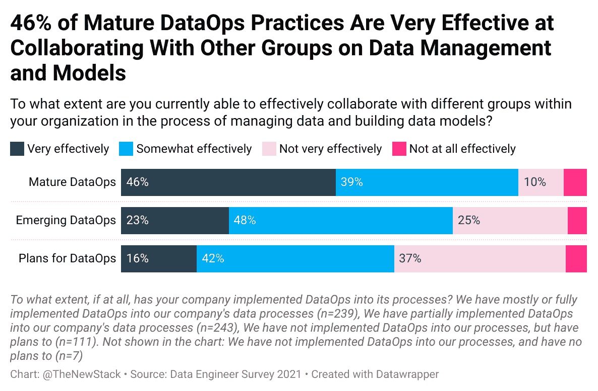
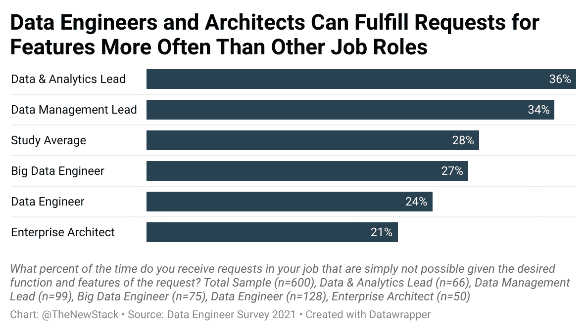
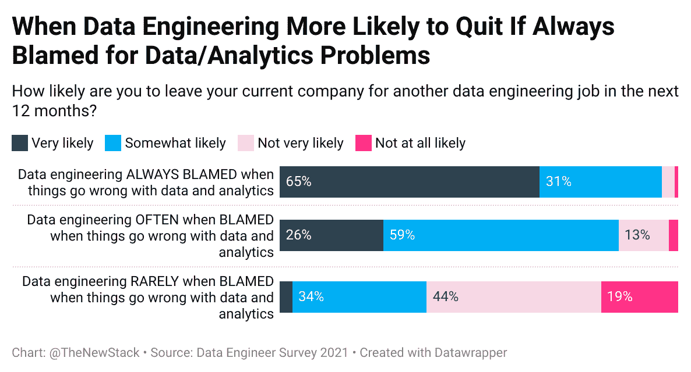
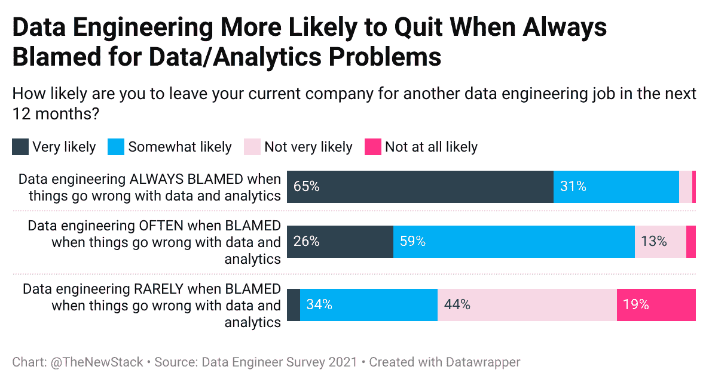
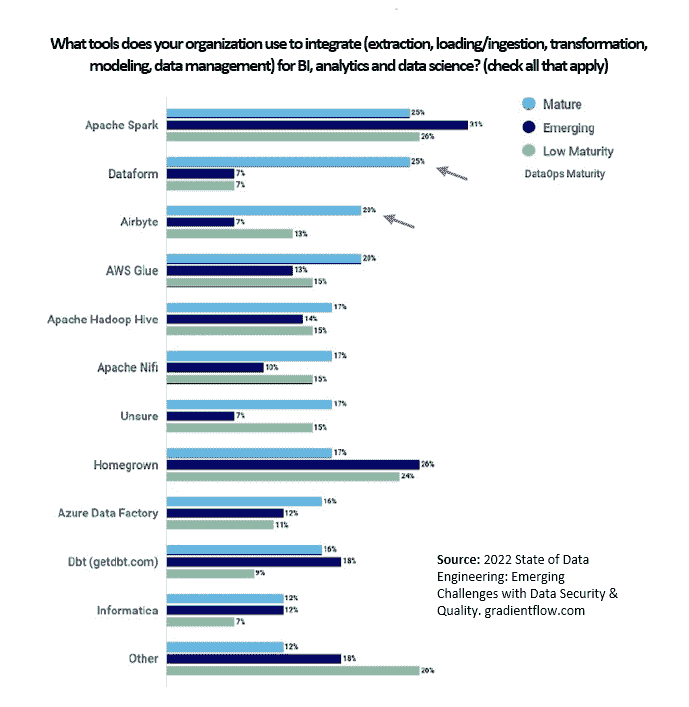
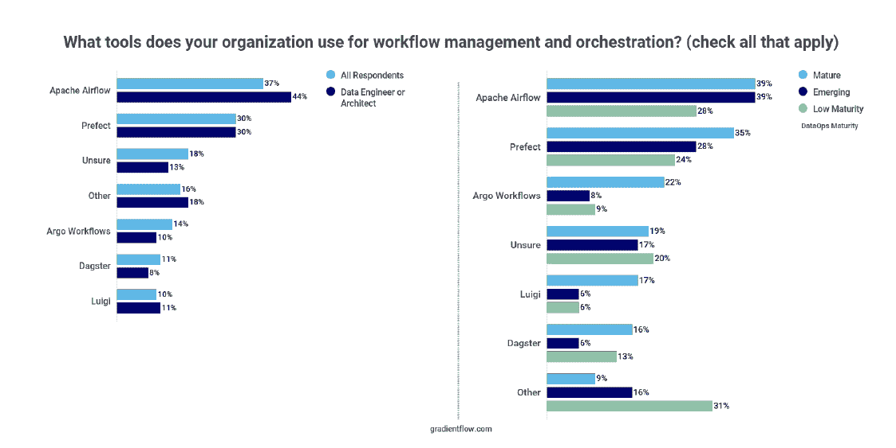

# 数据操作在实践中的优点和缺点

> 原文：<https://thenewstack.io/the-benefits-and-drawbacks-of-dataops-in-practice/>

根据我们对代表 [data.world](https://data.world/integrations) 和 [DataKitchen](https://datakitchen.io/dataops-maturity-model/) 进行的一项调查的原始数据的分析，DataOps 做了它应该做的事情，但可能会带来新的挑战。

*   在拥有成熟数据运营实践的公司中，数据建模和管理方面的协作“非常有效”的可能性是只有部分实践的公司的两倍。
*   工程师面临的压力数据可能被夸大了。由于不断发展的[数据](https://thenewstack.io/category/data/)生态系统，数据和分析团队的领导者面临着更沉重的负担。

在八月份的[数据工程 2021 调查](https://data.world/industryresearch/data-engineer-survey-2021)中，三分之二的研究参与者开发、维护和优化数据系统，以使数据可用于分析。37%的受访者表示，他们的公司已经在数据流程中大部分或全部实施了 DataOps，另有 41%的受访者已经部分实施或正在实施。

不同团队之间在数据管理和构建数据模型方面的协作仅在 23%的部分实施了 DataOps 实践的公司中非常有效。成熟的 DataOps 实践的成功率翻了一番，有 46%的受访者声称合作非常有效。此外，当被问及尖端工具时，如果这些技术被集成到完整的数据操作生命周期中，这些公司的人对这些技术不屑一顾的可能性是其他人的两倍。

集成技术和流程，以及实现沟通可能会产生意想不到的后果。例如，在拥有成熟数据运营实践的公司中，36%的受访者表示数据治理政策可能会使他们的日常工作变得非常困难，而在处于数据运营流程早期阶段的公司中，只有 12%的受访者有这种感觉。数据运营似乎意味着公司在执行规则，这并不总是有趣的。

报告已完全实施数据操作的受访者比其他人更有可能总是收到带有不合理期望的数据请求。鉴于所要求的特性和功能，分配给负责[数据分析和数据管理](https://thenewstack.io/category/data/)的团队领导的超过三分之一的任务无法完成。数据工程师和企业架构师被赋予了更现实的任务，部分原因是他们可以定义项目的范围。

DataOps 工作流程中的几乎每个人都面临不合理的截止日期，但只有 19%的人表示计划外工作总是会破坏他们的工作生活平衡。数据和分析团队的领导者(36%)和成熟数据运营实践的领导者(30%)更有可能总是面临中断和随之而来的与精疲力竭相关的风险。

尽管不合理的期望通常是一种负担，但是企业架构师和数据工程师的工作职责更加有限。

## 数据运营和就业市场

对于担心留住和吸引人才的雇主来说，这是一个危险信号——在拥有成熟数据运营实践的公司中，43%的人很可能在未来 12 年内离开，去从事另一份数据工程工作。这相当于 44%的管理层受访者在寻找出路。然而，除去管理层，只有 17%的受访者很可能会离开。

对于这个问题，我们不太看重“有点可能”,因为现在几乎每个人都至少在考虑找份工作。在 SlashData 今年进行的另一项研究中，只有 10%的受访开发人员表示，没有什么能促使他们更换雇主，但薪酬、福利和工作生活平衡的通常组合是跳槽的催化剂。另一个问题是[有毒的工作环境](https://thenewstack.io/why-tech-is-still-toxic-for-women-and-what-to-do-about-it/)，这不一定是性别或种族歧视的结果。通常，问题是没有人声称对问题负责，或者当事情出错时，某些群体受到指责。

当公司的数据分析出现问题时，数据工程经常会受到指责。事实上，21%的人说这经常发生，另外 42%的人认为这经常发生。有时责备可能是应得的，但当不应得时，辞职是一个有吸引力的选择。毫不奇怪，当数据工程总是被指责为数据/分析问题的原因时，65%的人很可能会离开。

没有计划的工作，不合理的要求和对超出你控制的事情的责备。这足以让很多人希望他们的工作能有一个治疗师来帮助管理压力。事实上，99%的人强烈或某种程度上同意这种说法，在那些公司，数据工程师总是受到指责。相比之下，当数据工程师不是替罪羊时，只有 49%的人有这种感觉。如今，这算是好消息了。

### ****

## 其他研究中的数据操作

根据 2021 年 5 月由 [451 Research](https://www.immuta.com/downloads/dataops-dilemma-survey-reveals-gap-in-the-data-supply-chain/) 代表 Immuta 对在拥有 1000 多名员工的企业中工作的 525 名从业者进行的调查，41%的人拥有数据运营战略，该战略要么已根植于公司文化中，要么已全面实施并正在创造价值。数据治理供应商 Immuta 今年忙于赞助研究，因为它还与 Gradient Flow 合作，根据 2021 年 6 月至 8 月期间联系的 372 名受访者编写了 [2022 年数据工程调查报告](https://gradientflow.com/2022desurvey/)。该报告使用了相同的数据运营成熟度衡量标准，发现几乎相同的 40%处于优化或加速(成熟)状态，唯一的区别是小公司不太可能开始实施数据运营战略。

## 成熟数据运营公司最喜欢的技术

[2022 年数据工程调查报告](https://gradientflow.com/2022desurvey/)根据公司在数据运营之旅中的进展情况比较了技术采用情况。在一些情况下，采用 DataOps 的公司选择的产品明显不同。值得进一步研究，以确定这些技术是否会结合成一个新的堆栈，如果 DataOps 过程变得更受欢迎，它将得到更广泛的使用。这里有两点:

*   **集成工具:** [Dataform](https://github.com/dataform-co/dataform) 被 Google 一年前购买的成熟 DataOps 队列中的 25%使用，它提供了一个管理 BigQuery、Snowflake 和 Redshift 中基于 SQL 的数据操作的框架。 [Airbyte](https://thenewstack.io/airbyte-building-data-connectors-made-easy/) 和 AWS Glue 也有 20%的成熟 DataOps 群体在使用。
*   **工作流管理和协调:**随着数据操作采用实践变得越来越普遍，对 Prefect 的使用也在增加。35%的成熟数据运营公司正在使用 Prefect，该公司没有固步自封，因为它刚刚发布了第二代 its 工作流程编排引擎 [Orion](https://www.prefect.io/orion/) 。在最成熟的数据运营公司中，有 22%的公司使用 CNCF 主办的 [Argo Workflows](https://thenewstack.io/argo-the-kubernetes-native-workflow-engine-joins-the-cncf/) 。随着 Luigi 和 Dagster 也被使用，似乎仍然有关于如何编排 MLOps 管道的选择。

### 

### 

<svg xmlns:xlink="http://www.w3.org/1999/xlink" viewBox="0 0 68 31" version="1.1"><title>Group</title> <desc>Created with Sketch.</desc></svg>