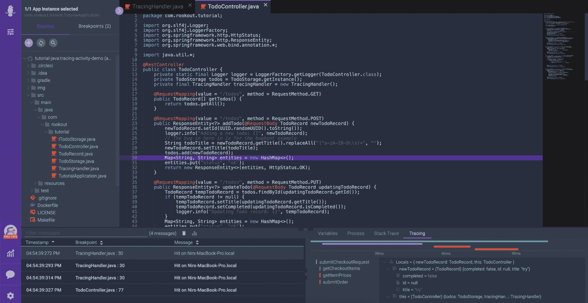

# 将调试和跟踪数据结合在一起的好处

> 原文：<https://thenewstack.io/the-benefits-of-bringing-together-debugging-and-tracing-data/>

[Oded Keret](https://www.linkedin.com/in/oded-keret-49786229/)

[Oded 是 Rookout 的产品负责人。他是一名经验丰富的软件工程师和产品经理。](https://www.linkedin.com/in/oded-keret-49786229/)

过去几年数字化转型的兴起意味着越来越多的公司正在采用云原生技术。虽然这些分布式体系结构提供了可伸缩性和敏捷性，但它们也增加了复杂性。正如 IDC 软件开发研究主管 Arnal Dayaratna 所写的那样，[，](https://f.hubspotusercontent10.net/hubfs/7470317/IDC%20Report%20-%20A%20Data-Driven%20Remote%20Debugging%20Platform%20Accelerates%20Bug%20Resolution%20and%20Enhances%20Understanding%20of%20Applications.pdf?__hstc=56004532.8b82c13d174184191b0adbcc20b1a5cd.1621959095083.1623279049511.1623856895388.7&__hssc=56004532.1.1623856895388&__hsfp=2828352387&hsCtaTracking=f5ff9ff8-9984-4d36-ba29-7042528dd696%7C607d9333-2454-4594-8cf3-f93660861958)，“当代开发人员面临的挑战之一是理解他们可能从未开发或使用过的应用程序(无论是第三方、开源还是同事编写的代码)。”

传统的调试方法，例如逐步调试，实际上不可能在云原生环境中使用。因为环境是动态的，并且容器、pod 和无服务器功能在运行中上下旋转，所以从来没有一台服务器需要连接和调试。

开发人员经常退回到基于日志的调试，这在云原生环境中带来了一系列挑战。日志成本变得很大，对性能的影响也是如此。这意味着必须添加一行日志代码，等待新的发布，浪费宝贵的开发时间，同时推迟问题的解决。

这些挑战催生了分布式跟踪，分布式跟踪已经成为监控和排查基于云的应用程序的实际方法。跟踪是对记录和监视的补充，现在被认为是可观察性的基础之一。这是一个相对较新的行业趋势，它强调实时查看应用程序内部状态的能力。最突出的分布式跟踪实现是 [OpenTelemetry 项目](https://opentelemetry.io/)，这是仅次于 Kubernetes 的第二个最活跃的云本地计算基金会(CNCF)项目。

OpenTelemetry 和实现它的跟踪工具——如 Jaeger、Zipkin 和 light step——使开发人员能够查看不同基于云的微服务之间的内部关系，并在尝试对复杂的动态环境进行故障排除时提供宝贵的背景。将跟踪信息与代码级、特定于上下文的调试数据相结合的能力，使开发人员能够更深入地了解应用程序行为，将可观察性带入下一个发展阶段:可理解性。这种能力不仅可以查看应用程序的内部状态，还可以全面了解其结构和功能。

在现代调试器中，开发人员可以在应用程序中放置所谓的“不间断断点”，以收集数据，如局部变量和各种标签。但是，理想的工作流还会在这些特定的断点处收集跟踪数据，为更快速的故障排除提供丰富的上下文，包括分布式跟踪、跨度和日志等可观察性数据。在 Rookout，我们已经集成了 OpenTelemetry 来创建一个跟踪时间线，将这些通常不同的数据集并排可视化:

GrubHub，[的高级工程总监 Paval Fux 写道，](https://www.globenewswire.com/news-release/2021/06/23/2251862/0/en/Rookout-Integrates-with-OpenTelemetry-and-Launches-a-Tracing-Timeline-on-its-Visual-Debugging-Platform.html)“当试图了解哪里出错时，跟踪是重要的遥测技术，但在可观察性工具和调试器之间来回切换上下文也很耗时。能够并排查看调试快照和跟踪数据使我能够看到全貌，并使我更容易更快地找到根本原因。”

如果我们要解决云原生应用程序日益增加的挑战，如复杂性和对第三方代码的依赖，那么现代、不间断调试器与分布式跟踪的新融合必须变得流行。基于日志的调试和传统的一步一步的调试器只能带我们走这么远。我们期待在未来，软件行业将可观察性提高到可理解性，让我们在不断发展的技术中更深入地了解我们的应用程序的行为。

<svg xmlns:xlink="http://www.w3.org/1999/xlink" viewBox="0 0 68 31" version="1.1"><title>Group</title> <desc>Created with Sketch.</desc></svg>