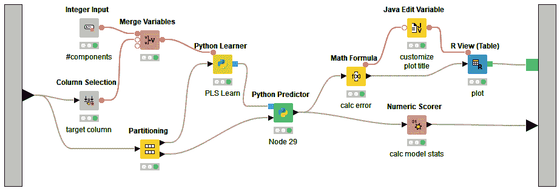
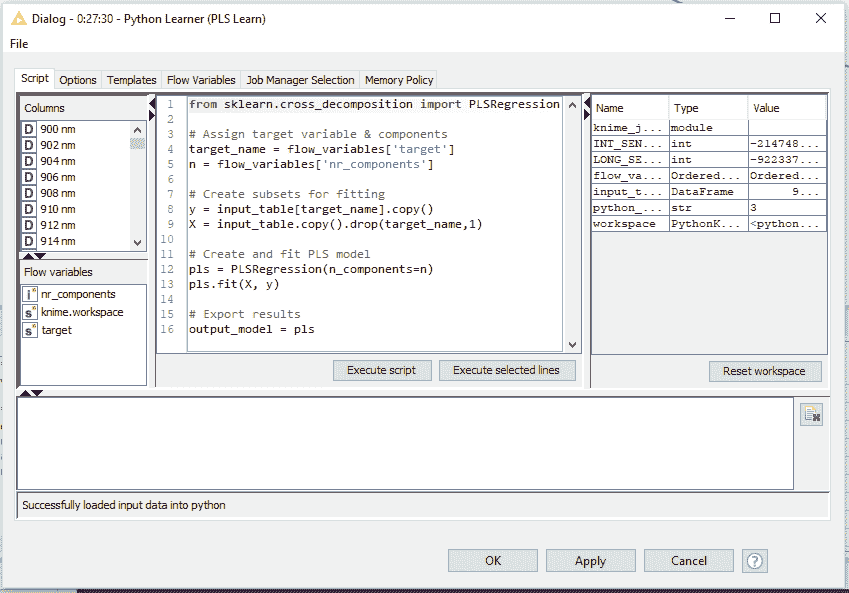

# 两全其美:可视化开源数据分析案例

> 原文：<https://thenewstack.io/the-best-of-both-worlds-the-case-for-visual-open-source-data-analytics/>

 [迈克尔·贝特霍尔德

迈克尔·贝特霍尔德是 KNIME 的创始人兼首席执行官。他拥有计算机科学博士学位，曾在康斯坦茨大学担任教授 15 年，并在美国的英特尔和 Tripos 从事工业工作 10 年。他喜欢帮助人们理解数据，他的研究和专业知识横跨数据分析、机器学习、人工智能和规则归纳。在 Twitter、LinkedIn 和 KNIME 博客上关注迈克尔。](https://www.knime.com/) 

如今，数据科学的自动化有了巨大的推动力。考虑到编程数据科学应用程序可能如此复杂，这并不奇怪。真正掌握用于数据分析的脚本或编程语言需要数年时间，这忽略了一个人还需要建立实际的数据科学专业知识。然而，无代码的解决方案可以让数据科学的具体细节变得更加容易理解。这意味着数据科学团队的宝贵时间可以花在实际*进行*数据科学上，这样组织就不必依赖外部的、预配置的、透明的数据科学自动化大规模产品。

这在很多方面都是好消息。可视化、无代码的环境向更多人开放了数据分析的世界和力量，他们的组织也从更高水平的洞察力中受益。可视化环境直观地解释了在什么配置下执行了哪些步骤。无论这是对程序员的一次彻底检查，还是帮助相对新手获得更好的理解，这都是积极的。而且，在许多创业公司中，团队非常分散，无代码解决方案可以节省大量时间。

但是，也有不好的一面。直接编写代码现在是，将来也永远是根据您组织的特定需求创建新分析的最通用方式。数据科学家通常希望获得最新的发展，这需要更多的实践方法。为了从数据中获得最大价值，专家需要能够快速尝试新的程序，无论是他们自己还是他们的同事编写的。

现代数据分析的美妙之处在于，不管你怎么想，都不必非此即彼。您可以拥有无代码和定制代码分析的优势，同时获得易用性和多功能性。以下是方法。

## 选择开放平台

当试图确定如何将有意义的数据分析引入您的组织时，肯定有很多要考虑的因素，其中应该有一个可视化开源解决方案。开源平台的最大吸引力在于，它们不会将您局限于任何一种分析语言，今天的开源选项集成了多种分析语言，如 R 和 Python，同时还集成了 SQL 代码的可视化设计。也很容易从现在可用的东西发展到结合未来的创新。

此外，一个真正开放的平台允许您选择您喜欢的，更重要的是，您的数据科学家喜欢使用的。他们可以协作地利用他们最了解的东西，而不必为了提供价值而学习在整个组织中实现的每一个其他编码范例的复杂性。这使得一系列的可能性，提供了大量的定制。

开源平台是弥合商业产品和本土解决方案之间差距的理想平台，让用户决定他们想编码什么、为什么编码以及编码多少。

## 它是如何工作的

您可能想知道开源数据分析平台在实践中会是什么样子。让我们从 R 和 Python 开始，因为它们是数据分析最重要的脚本语言。有了合适的开源平台，您的数据科学家之一可以设计一个工作流，其中 R 用于创建图形，Python 用于建模，这只是举个例子。这两种语言在工作流中协同工作，不同的用户可以选择并重用它们，甚至可能不需要查看底层代码。模型和工作流可以变得越来越复杂，但是原理是一样的。

数据加载和集成是开源平台可以发挥作用的另一个领域，这是人们不太谈论的部分。专家可以编写几行 SQL，比用图形方式组合模块要快，但并不是每个人都足够精通 SQL 来做这件事。那些没有这样做的人仍然应该能够混合和匹配他们的数据。可视化开源平台允许他们通过 SQL 访问大多数可用的功能(同时记住不同数据库的许多细微差别)。

再比如大数据。合适的开源平台将支持在您的大数据环境中本地建模和控制 ETL 操作的工作流。他们可以通过使用 Hadoop、Spark 和 NoSQL 数据库的连接器来实现这一点，它的工作方式就像在本地 MySQL 数据库中运行操作一样——只有事情是在您的集群上(或云中)执行的。这仅仅是个开始，仅仅提供了这种集成如何与其他分布式或云环境一起工作的一个例子。

最后一个非常重要的例子。开源平台有可能提供 JavaScript 节点，允许用户快速构建新的可视化，然后将它们展示给用户，而不是构建另一个可视化库或紧密耦合现有的库。可以使用众所周知的库生成复杂的网络表示，然后用户可以显示交互式可视化，并最终部署基于 web 的交互式工作流接触点。这是真正的好东西，因为它实现了真正的指导分析，这意味着人类的反馈和指导可以在任何需要的时候应用，甚至在进行分析的时候。这是数据科学家、业务分析师和在中间工作的机器之间的交互交流，共同为您的业务产生最佳、最具体、相关的数据分析。

## 数据分析的现在和未来

数据分析将在企业发展中发挥越来越重要的作用。任何解决方案都需要速度、功能、灵活性和易用性，而且随着数据以令人难以置信的速度激增，这些要求将变得更加复杂。你今天所做的决定会影响你明天所能收集的分析和信息的类型。

随着您的发展，我建议您考虑组织的数据需求。您需要非常具体的数据分析类型吗？你想控制信息的分析方式吗？想想你的团队。你有一支数据科学家和专业程序员的队伍吗，或者你有一个小本经营的团队，或者一个健康的组合？当您权衡所有的需求、资产和潜在赤字时，请考虑可视化开源平台如何帮助您，并准确提供现在和未来所需的内容。

通过 Pixabay 的特征图像。

<svg xmlns:xlink="http://www.w3.org/1999/xlink" viewBox="0 0 68 31" version="1.1"><title>Group</title> <desc>Created with Sketch.</desc></svg>