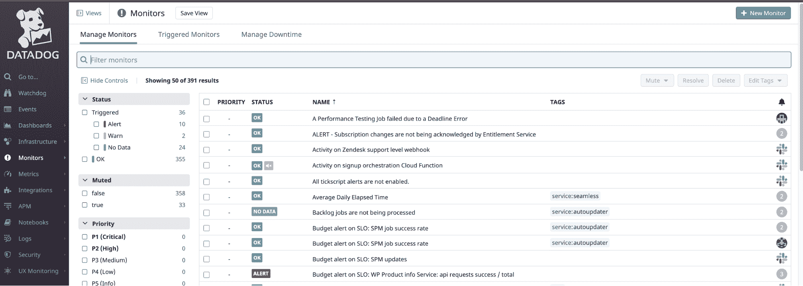
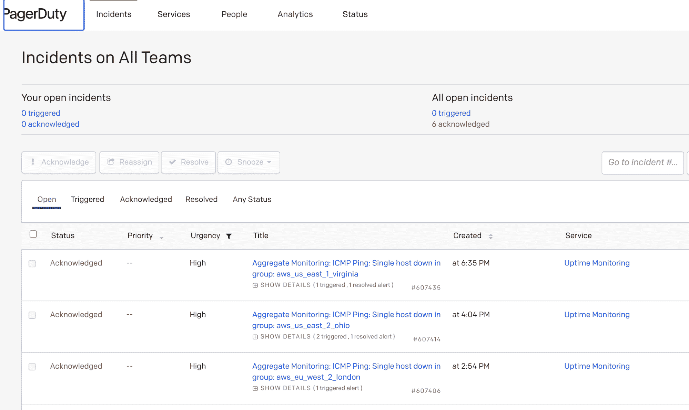
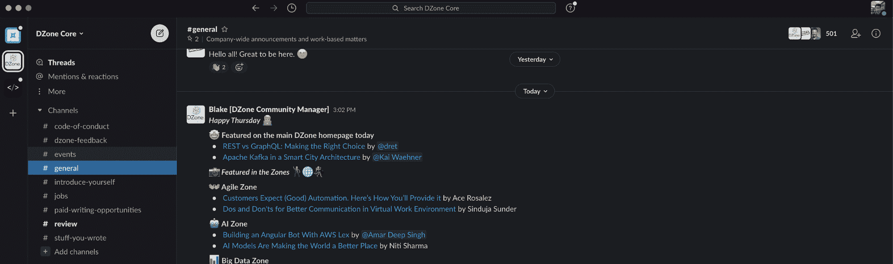

# 2021 年最佳现场可靠性工程工具

> 原文：<https://thenewstack.io/the-best-site-reliability-engineering-tools-in-2021/>

 [西奥·德斯普迪斯

西奥是一名高级软件工程师、顾问和经验丰富的导师。](https://www.linkedin.com/in/theofanis-despoudis-7bb30913/?originalSubdomain=ie) 

现场可靠性工程(SRE)是一个令人兴奋的领域。这不仅是因为 sre 承担着一系列独特的职责，还因为他们通常可以自由选择自己的 [数据工程工具](https://thenewstack.io/top-10-tools-for-data-engineers/) 和技术，以便在日常运营中优先考虑可靠性。

在上一篇文章中，我们讨论了 SREs 最实用的工具，并解释了它们如何帮助实现高可靠性、有效沟通和透明性。在这篇文章中，我将概述我个人最喜欢的 SRE 工具。

## **关键 APM(应用性能管理)和监控工具**

尽管有许多好的 APM 和监控工具可用，但以下三个是我个人最喜欢的:

*   **Datadog:** Datadog is marketed as a cloud monitoring solution, and it offers almost everything you need in that regard. For example, you can set up monitors, review current infrastructure hosts, collect events, add synthetic and RUM monitoring and so on. It offers plenty of opportunity for customization, and it integrates well with other systems. Although the UI looks rather bloated, and it takes time to learn its query language, you will be able to get the most out of this service with proper training.

    数据狗监视器

*   **Kibana:** Kibana 是一个免费的数据可视化平台，收集指标，通常来自弹性搜索集群。如果您使用的是弹性堆栈(ELK stack)，那么 Kibana 是最适合这项工作的工具。Kibana 还提供许多其他服务，如 SecOps 和商业分析，使其成为一个有价值的工具。由于它是免费的，Kibana 对于小企业和初创企业来说也是一个不错的选择。
*   **New Relic:** New Relic 是一个基于云的平台，专门研究可观测性、遥测和监控性能。它用于在单个仪表板中跟踪分布式服务和应用程序的性能特征，主要面向大型企业。

## **关键自动响应系统**

在我看来，SREs 的三大自动响应系统是:

*   **PagerDuty:** PagerDuty is a cloud-based incident response platform that specializes in on-call rotations and incident management. It can integrate with many providers and services, and it works well when real incidents occur. The company’s pricing model is quite affordable, and the product is suitable for all types of businesses. You can even receive calls and notifications on your phone or smartwatch by installing the native app.

    值勤事故列表

*   **VictorOps (Splunk 电话技术支持):** VictorOps 现在是 Splunk 电话技术支持的一部分，这是企业级事件响应系统的另一个好选择，尽管有点贵。如果您的组织已经使用 Splunk，那么采用其随叫随到选项也是有意义的。
*   这个事件响应平台是 Atlassian 的一部分，所以对于那些喜欢使用其产品的人来说，这是一个很好的选择。该定价模式也非常经济实惠，它甚至有一个免费层，最多可为五个用户提供基本的警报和随叫随到管理。

## **关键实时通讯工具**

使用实时通信工具大大提高了响应就绪性。在这一类别中，我的三大建议是:

*   **Slack:** Slack, which is now part of Salesforce, is one of the most popular platforms for real-time communication. It is intended to serve as a primary collaboration tool for teams and businesses, but you can also use it as a programmatic platform for automating events or responses. Its pricing model is geared toward all kinds of businesses, and it even has a free version (with limited messages). Slack can also be used to set up ChatOps services and other hooks.

    松弛渠道

*   **微软团队:**团队是 Slack 的主要竞争对手。如果您的组织已经在使用 Office 365 套件中的微软产品，这可能是一个不错的解决方案。甚至有多达 100 个用户的免费版本。
*   **Telegram:** Telegram 是一个简单可靠的 messenger 平台，适用于各类团队。更好的是，它是免费的，并提供了编程访问的 API。

## **最佳项目跟踪工具**

您还应该使用项目跟踪器来跟踪事件并记录事件。我建议如下:

*   **吉拉:**这是 Atlassian 最主要、最普遍的产品。这是一个跟踪项目和团队进展的敏捷平台，被各种规模的专业组织所使用。缺点是有时看起来和感觉都很慢。
*   **Trello:** 这也来自 Atlassian，但比吉拉更平易近人，更容易使用。您可以免费开始使用 Trello，它无需太多投资就可以很好地扩展。
*   **Asana:** 这种敏捷项目管理服务可以免费启动，并与您的业务一起成长。它是吉拉的一个很好的替代品，并且拥有越来越多的用户。根据 [Crunchbase](https://news.crunchbase.com/news/asana-direct-listing-asan/#:~:text=Asana%20has%20more%20than%2075%2C000,to%20its%20S%2D1%20filing.) 的数据，它去年带来了 1.425 亿美元的收入，考虑到在线项目管理软件的市场价值超过了[40 亿美元](https://www.globenewswire.com/news-release/2021/01/18/2159928/0/en/Global-Online-Project-Management-Software-Industry.html#:~:text=Amid%20the%20COVID%2D19%20crisis,Software%20estimated%20at%20US%243.&text=5%20Billion%20in%20the%20year,the%20analysis%20period%202020%2D2027.)，这还算不错。如果你对吉拉不满意，你可以试试体式作为替代。

## **最佳基础设施部署工具**

最后，SREs 希望自动化部分甚至全部部署基础设施。以下是实现这一目标的好工具:

*   Terraform: Terraform 是 HashiCorp 的一个工具，象征着术语基础设施即代码(IaC)。它允许 DevOps 团队使用特定于领域的配置语言来描述他们的基础设施组件，如 VM、Kubernetes 集群、数据库或 VPC。然后，它获取这些描述，并在云环境中创建基础架构组件。Terraform 实际上是开发的必备工具，好消息是您可以开始免费使用它。
*   **Ansible:** Ansible 是一个自动化 IT 基础设施的工具。它主要使用 YAML 文件来描述需要以特定顺序运行的角色、服务和任务。在每次运行时，Ansible 将使用 SSH 连接到机器，并作为脚本运行行动手册中描述的任务。此时，它会从连接的主机上删除任何脚本或临时信息，并将状态报告给用户。由于它是用 Python 编写的，Ansible 具有很强的可扩展性，可以处理各种各样的角色和脚本。
*   **SaltStack:** SaltStack 是另一个 IT 基础设施和配置管理工具，采用了不同寻常的方法。它依赖于安装在主机中的代理，然后主机使用数据驱动的通信命令编排。如果配置正确，它可以毫不费力地自动部署到数千个节点中。SaltStack 被 VMware 收购，因此它的未来现在取决于 VMware 的愿景。

<svg xmlns:xlink="http://www.w3.org/1999/xlink" viewBox="0 0 68 31" version="1.1"><title>Group</title> <desc>Created with Sketch.</desc></svg>