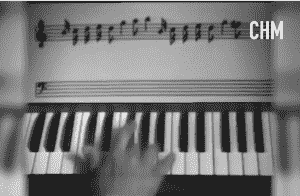

# 闲聊的巨大影响:50 周年回顾

> 原文：<https://thenewstack.io/the-big-impact-of-smalltalk-a-50th-anniversary-retrospective/>

这不仅仅是因为现代计算机世界的大部分发展源于 20 世纪 70 年代施乐 PARC 中心的工作。是的，在一个非常真实的意义上，它启发了我们的硬件形式，我们的用户界面，甚至我们的编程方法。

但除此之外，同样有趣的是*他们是如何做到的——他们创作的动机和激情。甚至对今天的程序员来说也有一些教训。*

硅谷的[计算机历史博物馆](https://computerhistory.org/)最近举办了两场特别的活动来庆祝 [Smalltalk 编程语言](https://thenewstack.io/can-man-spark-renaissance-smalltalk-programming-language/)诞生 50 周年——其中一场活动让最初语言的几位创造者重聚一堂。

这是一个探索历史是如何形成的机会…

## Smalltalk 的巨大影响

演讲以 Smalltalk 的影响简史开始，称 Smalltalk 的创造者“发明了许多现代图形用户界面，包括重叠窗口和弹出菜单——在 50 多年前，比第一台苹果 Macintosh 发布早 12 年。”Smalltalk 还极大地影响了从 Smalltalk 派生出来的其他面向对象语言，包括 Python、Java、JavaScript、Ruby 和 Objective C——但还不止这些。

该视频还称赞 Smalltalk 社区发明了定期审查迭代进度的实践和被称为[极限编程](https://en.wikipedia.org/wiki/Extreme_programming)的敏捷方法(这导致了今天的敏捷运动)。

然而在 1993 年，艾伦·凯写下了“Smalltalk 的早期历史”，描述了它是如何从“新的个人计算隐喻形成的磁场”中发展起来的

特别是在美国国防部高级研究项目(ARPA)社区，有一种“人机共生”的说法(通过“图形屏幕和指点设备”实现)。

在一个停留在巨型计算主机上的时代，“现代个人计算、重叠窗口界面和面向对象设计很快就会发生范式转变，这是因为人们认为 60 年代的工作不仅仅是‘更好的旧物’。”"

凯最终设想了一种手持、类似平板的设备(他称之为 dyna book)——但专门针对儿童。正如计算机历史博物馆在对事件的记录中所说，“凯相信，这种计算机将通过使儿童和成人能够模拟和模拟真实世界来改变他们的教育。Smalltalk 就是为这个目标而创建的，它运行在施乐新推出的 Alto 个人工作站上。

或者，就像凯在他的文章中写的那样，“我只雇佣那些当他们听说笔记本电脑的想法时眼睛里有星星的人。”

他的团队的影响最终延伸到了个人电脑本身的历史上——通过视频，凯想起了史蒂夫·乔布斯在苹果电脑早期历史的关键时刻看到界面的传奇时刻。

虽然乔布斯可能错过了对象的概念，“与大多数商业人士相比，史蒂夫·乔布斯可以看到更多…他意识到重要的是，如果你要做广泛传播的计算，这是个人计算的全部目标，你必须解决用户界面问题。”

凯在他的早期历史中写道，“史蒂夫试图从施乐公司(苹果的少数风险投资者之一)获得和/或购买技术，但施乐公司既不会放弃它，也不会拿出资源来继续在内部开发它……”

## 每个人——包括孩子

该活动由前《纽约时报》技术记者 John Markoff 主持，他也是计算机历史博物馆的历史学家，他指出 Smalltalk 被认为是“图形用户界面从 T2 进入 T3 的世界”

那么，谁是这一切变化的幕后推手呢？博物馆的活动让凯(出现在英国的视频中)和两个眼睛里带着星星的人重聚。有研究实验室的经理[阿黛尔·戈德堡](https://www.h-its.org/people/about-adele-goldberg/)。(演示会上播放的一段视频称赞 Goldberg 在 David Robson、Glenn Krasner 等人的帮助下，推动了 Smalltalk“在出版物、教室和计算机行业”的公开发布。)

同时出现的还有丹·英格尔斯，凯在他的早期历史中强调的另一个名字。虽然学习研究小组中的每个人都“以深入和卓越的方式为项目做出了贡献…我想我们所有人都会同意，对于 Smalltalk 的大部分开发来说，Dan 是核心人物… Dan 不仅仅是一个伟大的实现者，随着 Smalltalk 进入实际世界，他也越来越多地成为设计者，不仅是语言的设计者，也是用户界面的设计者。”

凯写道，“虽然我是 Smalltalk 的发起人和最初的设计者，但它一直更属于那些让它工作并让它出门的人，特别是丹·英格尔斯和阿黛尔·戈德堡。”

但是他们是如何做到这一点的，这是有启发性和鼓舞人心的。凯的文章认为，他们的创新来自一个更雄心勃勃的推动，以体现一种新的计算。“我们实际上是在试图实现信仰结构的质的转变……本着与印刷机发明相同的精神——因此采取了非常极端的立场，这几乎迫使这些新的风格被发明出来。”

Markoff 询问了该组织的文化，引用了 Kay 对该组织谈论 Dynabook 的回忆，“以及它扩大人类影响力的潜力，并为急需它的摇摇欲坠的文明带来新的思维方式。”(凯的文章附带补充道，“这种目标在 60 年代后的加州很普遍。”)

## 留下遗产

在视频中，凯承认他们的一些创新“是因为孩子才这样做的——当然，正如他们一次又一次证明的那样，成年人在复杂性和学习能力等方面往往比孩子好不了多少。因此，用户界面变得非常受成年人的欢迎……”

事实上，当 Markoff 问孩子是否是开发 GUI 的动力时，Ingalls 说不，Goldberg 也同意，认为这个想法是为了获得关于交流本身的更基本的东西。“不仅仅是小孩子，”戈德堡强调说。"人类倾向于理解他们看到的东西."

“那么，你如何逐步展现一个模型的自然复杂性，并且不让一个人错过它？视觉化，触觉和听觉的能力，伴随着能够看见。这就是多媒体变得如此重要的原因——因为它是我们交流的方式。”

这显然是一个有效的范例。博物馆对该事件的[报道记得戈德堡最初在 PARC 招募同事的孩子(后来将该计划扩展到当地学校)。罗布森记得孩子们很鼓舞人心。](https://computerhistory.org/blog/smalltalk-at-50/)

在 1972 年的档案录像中，9 岁的尼尔·沃伦展示了他创作的一个简单的互动图像。“每次你按下鼠标键 1，这个家伙就会把另一个家伙踢走，”沃伦说——一点也没意识到他是历史上第一个用鼠标工作的人。15 岁的布鲁斯·霍恩编写了一个程序，可以实时显示 7 岁的雷切尔·戈丁在键盘上弹奏的音符。

布鲁斯·霍恩(Bruce Horn)从九年级开始，他记得在那次活动中，作为一名青少年，他的问题得到了他眼中创造未来的人的回答，这是一次变革性的经历。后来，戈丁拿起了目标 C，想起了 Smalltalk 的“它唤起了记忆”。戈丁随后成为苹果电脑公司的一名程序员，用 Objective C 编写代码，“这有点像是一次往返旅行。”

“这真的是一段不寻常的旅程，”戈丁在视频中说，“我希望观众中的每个人都能在编程实践中享受同样有趣的旅程。”

[https://www.youtube.com/embed/PaOMiNku1_M?feature=oembed](https://www.youtube.com/embed/PaOMiNku1_M?feature=oembed)

视频

<svg xmlns:xlink="http://www.w3.org/1999/xlink" viewBox="0 0 68 31" version="1.1"><title>Group</title> <desc>Created with Sketch.</desc></svg>