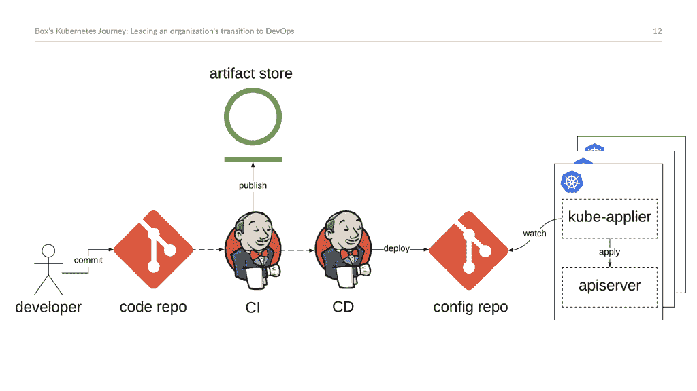

# 微服务的盒子之路:Kubernetes、DevOps、GitOps 和理想状态

> 原文：<https://thenewstack.io/the-box-way-to-microservices-kubernetes-devops-gitops-and-the-desired-state/>

云存储服务 [Box](https://www.box.com/home) 是创业公司的古老传奇之一。Box 现在是一家上市公司，它曾经拥有自己陈旧的基础设施和流程，阻碍了所有构建微服务架构的尝试。今天，Box 是一家已经接受了 [GitOps](https://thenewstack.io/from-gitops-to-adaptable-ci-cd-patterns-for-kubernetes-at-scale/) 概念的公司，这是一种基于 git 的开发工作流和流程的方法，使 Box 能够控制其运行 Kubernetes 的集群的“期望状态”。

结合 Kubernetes、DevOps 原则中的原则和它开发的基于 pull 的开源项目，Box 开发了一个流程来扩展其微服务，具有更强的安全态势和更快的开发速度，并能更好地控制应用程序架构的管理。

上个月，Box 高级工程经理 [Kunal Parmar](https://www.linkedin.com/in/kunalparmar/) 在 JFrog[JFrog](https://jfrog.com/)[swamp](https://swampup.jfrog.com/agenda/)活动的主题演讲中表示，通过转型，Box 现在只需几天就能开发出微服务，而以前需要几个月。

Parmar 说，其整体架构的紧密耦合使得每一个代码更改都是一项任务，以定义代码如何在整个架构中使用。没有 API 边界。

Parmar 在主题演讲后的一次采访中说，工程师们会做出改变并开始推进代码。他们会发现测试中没有发现的失败。为了恢复，将会有一个版本的回滚和任何新功能的丢失。

“我们在自己的数据中心运行大部分软件，使用 Puppet 配置服务器，”Parmar 说。"随着时间的推移，这些配置已经演变成一团复杂的乱麻."

Box 工程师开始发现自己在这个空间中，配置开始漂移，受多年来构建具有可变变化的整体架构的影响。例如，一个改变，比如一个 Java 的新安装，会导致 cruft，从而影响更新。变更将被推出，然后必须被回滚。它甚至可能无法正确回滚。在一年多的时间里，这个问题变得越来越复杂，成为构建微服务时必须考虑的问题。

“这给我们以我们想要的速度创建微服务带来了问题，”Parmar 说。

Parmar 说，2014 年 6 月，Box 团队去了 DockerCon，了解了 Kubernetes，当时它刚刚成立 6 个月。Google 工程师在解决微服务架构问题时构建 Kubernetes 的方式也与 Box 团队解决问题的方式一致。他们都相信不变性——由于容器的不变性，配置可以被抽象出来。物理服务器变成了商品，允许 Kubernetes 跨多个云提供商运行容器。

到 2015 年底，Box 团队开始相信他们可以在生产中使用 Kubernetes。特别是，社区已经开发了管理 IT 系统期望状态的方法。这部分是因为它采用了 GitOps 作为工作流程

## GitOps

为微服务管理 monoliths 带来的经验让 Box 团队思考他们系统的期望状态如何受到提交代码的开发人员的影响。他们希望开发人员清楚地知道一个变化会如何影响期望的配置。

[GitOps 是一个工作流](https://thenewstack.io/gitops-git-push-all-the-things/)，要求所有的变更都要通过 git 来完成。一旦提交，它就启动一个自动化管道，对代码进行封装和测试，然后投入生产。使用框方法，开发人员可以看到他们所做的更改的影响。例如，它可以让开发人员看到一个库的改变如何影响其他服务。

GitOps 还提供了更清晰的控制和可用性。git 中的版本控制意味着可以在任何时间点查看集群，如果需要缓解，允许用户恢复到以前的版本。

了解如何通过 GitOps 实现所需的状态导致了一个名为 [kube-applier](https://github.com/box/kube-applier) 的开源项目的开发，根据 Box 的说法，该项目为 Kubernetes 集群提供了自动化部署和声明式配置。

Box 将 Jenkins 用于其 CI/CD 工作流程。最初，Jenkins 将更改推送到集群。该公司后来改为拉模型，这是一种提供更严格控制的方法——安全表面在 Kubernetes 集群内管理。

## 个人体验

Box 现在在 Kubernetes 上运行一个持续的开发过程。他们通过 DevOps 实践、GitOps 和寻求达到理想状态的组合来实现它。但是要取得真正的成功，帕尔马说还有一段路要走。

该公司拥有帮助他们的核心工具。JFrog artificial factory 用作存储二进制文件的注册表，Jenkins 也用于持续集成。GitOps 实践作为结合点，允许回滚和更好地跟踪对配置的更改。目标是:让开发者的体验相对简单。

挑战来自于开发人员工具与 Kubernetes 及其更新的集成。服务发现、负载平衡、监控、秘密管理 Kubernetes 已经具备了这些功能以及更多功能。随着 Kubernetes 生态系统的发展，整个生态系统也必须发展。

<svg xmlns:xlink="http://www.w3.org/1999/xlink" viewBox="0 0 68 31" version="1.1"><title>Group</title> <desc>Created with Sketch.</desc></svg>