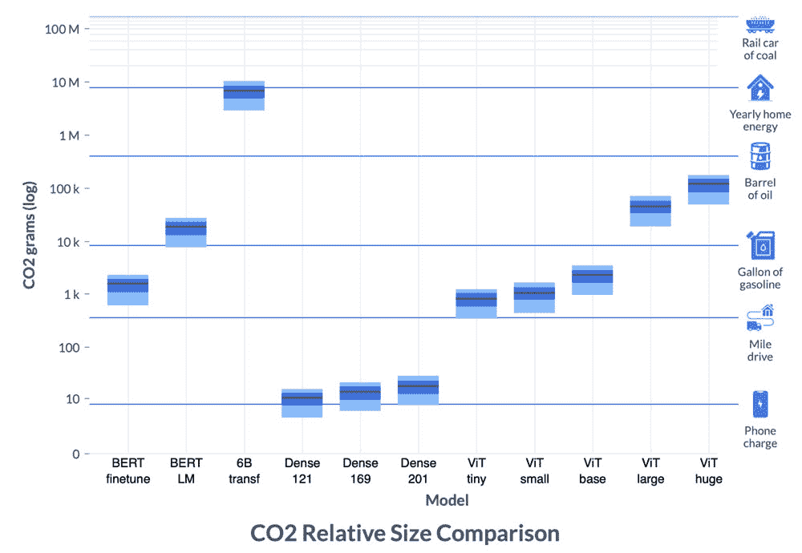
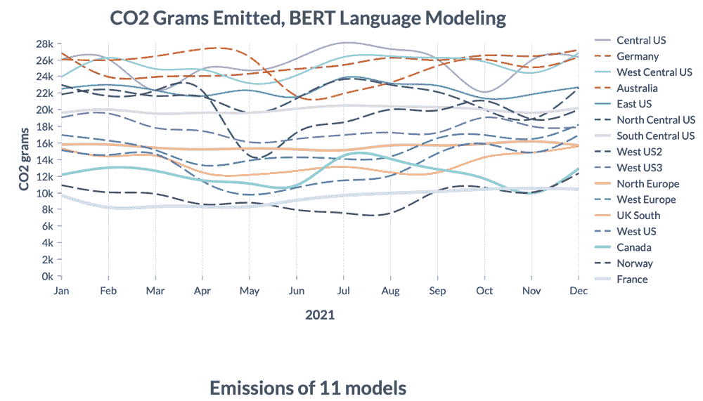

# 机器学习的碳足迹

> 原文：<https://thenewstack.io/the-carbon-footprint-of-machine-learning/>

机器学习模型的能力正变得越来越强大，无论是在处理自然语言、处理错综复杂的计算机视觉、或其他令人兴奋的应用中。

但是我们发现，随着这些模型变得越来越大，它们相应的碳足迹也越来越大，特别是当涉及到[创建和训练这些复杂的模型](https://thenewstack.io/check-your-ml-carbon-footprint-with-the-machine-learning-emissions-calculator/)时。

这一趋势导致一些专家开发能够监测机器学习模型背后的碳影响的工具，并为缓解方法奠定基础，如碳感知计算。

然而，大多数测量人工智能碳足迹的工具仍处于相对早期的开发阶段，正如最近的一些研究[所示](https://hal.archives-ouvertes.fr/hal-03435068/)，它们的里程数可能会因环境而异。

现在，一个来自[艾伦人工智能研究所](https://allenai.org/)、[微软](https://thenewstack.io/microsoft-accelerates-the-journey-to-low-code/)、[希伯来大学](https://en.huji.ac.il/en)、[卡耐基梅隆大学](https://www.cmu.edu/)和人工智能初创公司[拥抱脸](https://huggingface.co/)的跨学科团队正在展示一种更复杂的方法，使用基于位置和特定时间的数据来更准确地测量流行人工智能模型的操作碳排放。

最近在 [ACM 公平、问责和透明会议](https://facctconference.org/) (FAccT)上展示的新[工作](https://facctconference.org/static/pdfs_2022/facct22-145.pdf)不同于以前的方法，因为它将服务器 GPU 的能源使用记录为一系列测量结果，而不是将其过于简化为整个模型训练期间的总和。

此外，该团队的方法还跟踪这些波动的测量值以及一系列数据点，这些数据点显示了当地每千瓦时(kWh)能源的排放量。

这些计算最终可以帮助用户了解他们基于云的工作负载的隐藏碳成本，或者每千瓦时电力消耗产生多少碳排放的[碳强度](https://carbonintensity.org.uk/)，该团队写道:“可以说这篇论文最重要的贡献是最简单的:介绍了[软件碳强度](https://greensoftware.foundation/projects/software-carbon-intensity-sci-specification/) (SCI)，作为给定云实例运行时碳排放的代理。”

## 比较不同的碳强度

该团队的工作包括训练 11 个不同规模和应用的机器学习模型，训练时间从 1 个 GPU 上的 1 小时到 256 个 GPU 上的 8 天不等。

除了每隔 5 分钟跟踪一天中不同时间在 16 个地理位置的不同碳强度外，还定期记录能源使用情况。这种方法允许研究人员比较模型的能源消耗，因为它与地理，时间和能源产生的类型有关。

“电网的碳强度对碳密集型发电的微小变化很敏感，并可能因地点和时间而异，”研究的合著者杰西·道奇在一篇博客文章[中解释道。](https://blog.allenai.org/measuring-and-mitigating-ai-carbon-intensity-8624bc805c1a)

“每个地区都包含不同的能源组合，因此可能会有很大差异。由于电力需求、低碳发电(风能、太阳能、水能、核能、生物质能)和常规碳氢化合物发电的变化，碳强度随着时间、日期和季节而变化。因此，有很多机会来转移计算资源以利用这些变化:这就是所谓的碳感知计算。”

在他们的实验中，团队得出了一些令人大开眼界的发现。例如，他们发现，在训练一些较轻的人工智能模型时产生的碳排放量相当于给手机充电的碳排放量，而测试的一个较大的模型——如 61 亿参数的[“transformer”](https://daleonai.com/transformers-explained?utm_source=thenewstack&utm_medium=website&utm_campaign=platform)模型——只完成了 13%，但产生的碳量却“惊人”，相当于为美国的一所房子供电一年。人们只能想象训练更大的模型所涉及的排放，如 OpenAI 的开创性 [GPT-3](https://thenewstack.io/openais-gpt-3-makes-big-leap-forward-for-natural-language-processing/) NLP 模型，它包含 1000 亿个参数。

该团队发现，减少排放的最大因素是选择最佳的地理位置。例如，在训练常用的 NLP 模型 [BERT](https://thenewstack.io/researchers-drop-the-zeroes-to-speed-deep-learning/) 时，该团队发现，通过使用位于挪威或法国等国家的可再生能源对其进行训练，排放量可以减半。

研究人员发现，甚至训练发生的时间也有影响；晚上在华盛顿州训练一个模型导致了更低的排放，因为那时电力是由水力发电产生的，而不是在白天与燃气发电站的能量混合。

除了这些发现，该团队还评估了两种优化算法，以减少微软 Azure 云计算平台上人工智能工作负载的排放。

其中第一个是“灵活启动”，将训练推迟 24 小时，小型车型受益最大。相比之下，该团队的“暂停和恢复”方法将在排放高峰期停止训练，但只要不增加训练时间，就会青睐更大的模型。

虽然该团队的工作只关注训练人工智能模型的操作碳排放，而没有考虑与构建硬件、冷却数据中心等相关的碳排放，但该团队指出，更全面的碳感知方法将在确保机器学习模型的未来可持续性方面变得至关重要。

“碳核算和报告在机器学习中越来越常见，像 [NeurIPS](https://nips.cc/) 这样的会议要求提交报告他们的排放量，最近的工作报告产生的排放量，”该团队指出。“然而，它尚未成为我们领域的规范，我们仍然缺乏关于训练机器学习模型的环境足迹以及我们如何减少它的系统信息。在这篇论文中，我们认为，如果机器学习社区的成员能够获得有关他们行动的碳排放的信息，他们就可以调整自己的决定，以减少这些排放，同时仍然满足他们最终任务的计算需求。”

在团队的[论文](https://facctconference.org/static/pdfs_2022/facct22-145.pdf)中了解更多。

<svg xmlns:xlink="http://www.w3.org/1999/xlink" viewBox="0 0 68 31" version="1.1"><title>Group</title> <desc>Created with Sketch.</desc></svg>