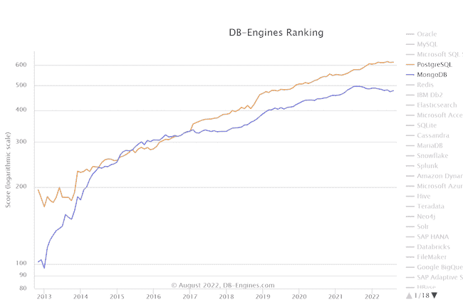
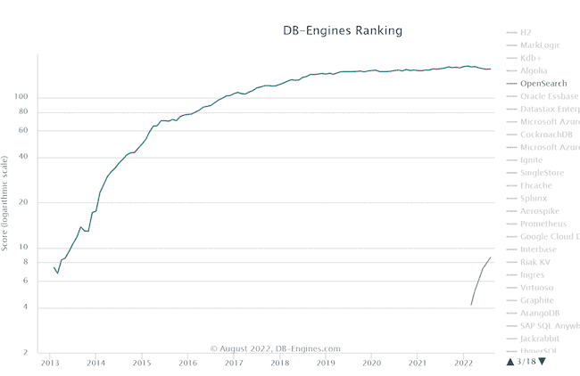
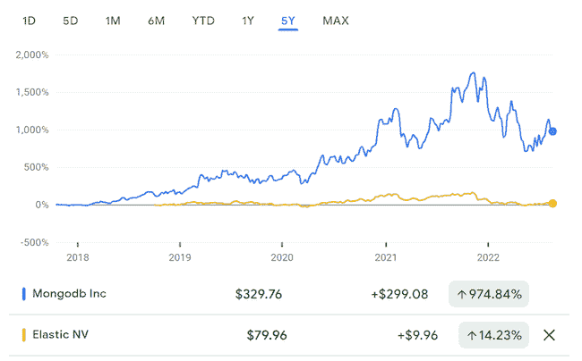

# 诉服务器端公共许可证案(SSPL)

> 原文：<https://thenewstack.io/the-case-against-the-server-side-public-license-sspl/>

大约四年前 [MongoDB 引入了服务器端公共许可证](https://techcrunch.com/2018/10/16/mongodb-switches-up-its-open-source-license/) (SSPL)并开始发布 [MongoDB](https://www.mongodb.com/cloud/atlas/?utm_content=inline-mention) 服务器软件，使用这种非 OSI 批准的专有(源代码可用)许可证，而不是之前使用的 AGPL v3。

作为为开源软件提供企业支持的 Percona 的创始人，我并不太喜欢 SSPL(查看“[为什么 SSPL 对你不好](https://www.percona.com/blog/2020/06/16/why-is-mongodbs-sspl-bad-for-you/)”了解更多关于这个话题)。在本文中，我想看看这一步会给开源数据库生态系统带来什么变化。

## SSPL 如何影响牵引力

我发现这张比较 PostgreSQL 和 MongoDB 的 [DB-Engines](https://db-engines.com/en/ranking_trend) 图最能说明问题——我们可以看到，虽然 MongoDB 的分数继续增长，但在这次变化之后，它从 2021 年初开始下降。这当然是相关性，不是因果关系，但仍然很有趣。

这仍然没有影响 StackOverflow 调查结果(仅适用于 2021 年)，其中 [MongoDB 采用指标](https://insights.stackoverflow.com/survey/2021)继续增长(2020 年为 27.7%对 26.4%)。

Elastic 是另一家从 Apache 2.0 转向 SSPL 的公司，并称之为"[双倍于 open](https://www.elastic.co/blog/licensing-change) "这使得许多嵌入 Elastic 的公司无法使用他们的软件，而这是非常宽松的 Apache 2.0 许可所允许的，这也确保了与 MongoDB 不同的一个分支的诞生。

MongoDB 避免使用 fork 可能是因为它一直在使用 AGPLv3 许可，这已经是一个相当严格的许可，而且[有意](https://www.techrepublic.com/article/mongodb-ceo-tells-hard-truths-about-commercial-open-source/)没有开发一个能够使用 fork 的贡献者社区。然而，MongoDB 协议级兼容性是由 [AWS](https://www.amazonaws.cn/en/documentdb/) 、 [Azure](https://docs.microsoft.com/en-us/azure/cosmos-db/mongodb/mongodb-introduction) 、 [Oracle](https://blogs.oracle.com/database/post/mongodb-api) 、 [FerretDB](https://www.ferretdb.io/) (OSS)在不同的数据库引擎之上添加的。

如果我们看看 DB-Engines，我们会发现 Elastic 在 2022 年停滞不前，而 OpenSearch 却在快速增长。

MongoDB 和 Elastic 都是上市公司，所以我们可以看到它们在公开市场上的表现:

我们可以看到 MongoDB 的表现比 Elastic 好得多，虽然两家公司都从峰值下跌(以及科技行业的大多数股票)，但 MongoDB 的交易价格比它放弃开源时高得多，而 Elastic 则低得多。

因此，至少在短期和中期内，我们不能真的说抛弃开源对商业有害(以股价衡量)。

## 坏主意是会传染的

虽然 SSPL 对你不利，但作为一个消费者，MongoDB 在许可证变更后没有崩溃，这一事实鼓励了数据库领域更多的公司放弃开源许可证或开始使用源代码可用的许可证。

[cocroach db](https://www.cockroachlabs.com/blog/oss-relicensing-cockroachdb/)、 [TimescaleDB](https://www.timescale.com/blog/building-open-source-business-in-cloud-era-v2/) 、 [Redis](https://redis.com/legal/licenses/) 和 [Confluent](https://www.confluent.io/blog/license-changes-confluent-platform/) 都将其平台的全部或部分许可从开源更改为源代码可用。

更糟糕的是，他们没有诚实地将这种软件定位为专有软件，只是碰巧有你能看到的源代码，而是将它定位为几乎和开源一样好。我觉得他们故意使用误导性的术语，比如“开放”(在 Elastic 的情况下是“T1”)，在 MongoDB 的情况下，他们甚至试图说服 OSI 承认 SSPL 是一个开源许可(谢天谢地，T2 没有成功，T3)。

让我们明确一点:这种新的专有软件有一个你可以看到的许可证，它确实比过去几十年的传统专有软件提供了更多的自由。但它不是开源的。

## DBaaS 才是最重要的

如果您查看数据库领域中那些源代码可用许可证中引入的限制，您会发现大多数限制都集中在创建 DBaaS 垄断上，因此，如果您想要运行 DBaaS，您必须从软件供应商那里购买，或者在此类供应商的许可下提供。你不能继续进行开源如此著名的无许可创新，并构建像亚马逊 Aurora 或 [Neon PostgreSQL](https://neon.tech/) 这样的东西。

“那又怎么样，”你说，我仍然可以以非 DBaaS 的方式部署数据库软件，无论是在你自己的时候，还是在其他人的帮助下，使部署更容易。是的，您可以，但是在简单性、可用性或敏捷性方面，它无法与 DBaaS 相提并论，尤其是在大规模的情况下。

DBaaS 类似于陆地运输的轮子，虽然无轮子的运输方法是可能的，但它们是不切实际的。

随着新一代开发人员对简单性的期望不断增长，我们看到某些形式的 DBaaS 正在成为公共云和私有云的预期标准。“其他方式”部署数据库很快变得无关紧要。

由于单个供应商垄断了 DBaaS 软件的部署，我们又回到了“客户作为人质”的好日子，没有真正的选择，这为软件供应商创造了一个可靠的盈利来源。

## 竞争

如果商品在商业中是一个肮脏的词，那么它涉及的是一个，同时，依赖商品与多种可行的可互换来源为您的投入被认为是一个很大的积极因素，因为它给你一个价格优势和保护你免受许多其他风险。

众所周知，竞争可以提高质量，降低价格，增加创新，开源在引发这种竞争方面非常重要，因为它使进入的技术壁垒非常低。

DBaaS 绝育源可用许可证试图把它带走。

接下来，让我们来看看 MongoDB 和 PostgreSQL 在 DBaaS 领域的竞争情况，它们可能是 DBaaS 可用性方面许可最宽松的数据库

官方的 MongoDB DBaaS 叫做 [MongoDB Atlas](https://www.mongodb.com/atlas/database) 。同样的地图集也可以在一些云市场上买到，比如 [AWS Marketplace](https://aws.amazon.com/marketplace/pp/prodview-pp445qepfdy34) 。MongoDB 还迫使其他一些云供应商从 [Alibaba](https://www.alibabacloud.com/product/apsaradb-for-mongodb) 到 [Linode](https://www.linode.com/products/mongodb/) 在所有情况下(就我所见),这些供应商都是普通的老式 MongoDB，没有核心数据库引擎创新。如果它看起来与 Oracle 数据库在 AWS 和其他云上完全一样，那是因为它确实可用。

让我们来看一下 PostgreSQL 作为对比——除了许多提供“普通”托管 PostgreSQL 的云供应商之外，我们还看到了 [AWS Aurora](https://aws.amazon.com/rds/aurora/) 、 [AlloyDB](https://cloud.google.com/alloydb) 、 [Neon PostgreSQL](https://neon.tech/) 、 [TimescaleDB](https://www.timescale.com/) 、 [BigAnimal](https://www.enterprisedb.com/products/biganimal-cloud-postgresql) ，它们都在 PostgreSQL 核心上进行了重大创新(不需要任何人的许可或产生一些许可费用)。)

## 作为人质的代价

您可能想知道，如果您使用的是第三方 DBaaS 而不是 MongoDB Atlas，那么与其他数据库技术(比如 PostgreSQL)相比，您的成本有什么不同吗？我将使用 Linode 进行比较，因为它的透明定价非常容易。

让我们来看一个在三节点集群上运行的中型数据库，具有 128GB 节点和共享 CPU，[三个节点本身每月花费 1920 美元](https://www.linode.com/products/shared/),[PostgreSQL 集群将花费您 4480 美元](https://www.linode.com/products/postgresql/)，而 [MongoDB 将花费 5760 美元](https://www.linode.com/products/mongodb/)，仅单个副本集的基本软件许可证每年就要花费 15000 美元。

您可能还会从该定价中看到，与基础架构成本相比，针对 PostgreSQL 上的托管 DBaaS，Linode 收取 130%的附加费—如果您希望实现这些价格节省，请考虑使用 Kubernetes 和 Operators，例如由 [Percona](https://www.percona.com/software/percona-kubernetes-operators) 提供的服务。

## 摘要

我们可以看到，虽然很难判断许可证变化的财务结果，但我们可以怀疑采用非开源许可证会降低吸引力和采用率，但最重要的是，它会减少创新，减少竞争并提高价格。想成为顾客而不是人质？选择真正的开源，而不是一个叫做 Source Available 的糟糕模仿软件。

<svg xmlns:xlink="http://www.w3.org/1999/xlink" viewBox="0 0 68 31" version="1.1"><title>Group</title> <desc>Created with Sketch.</desc></svg>