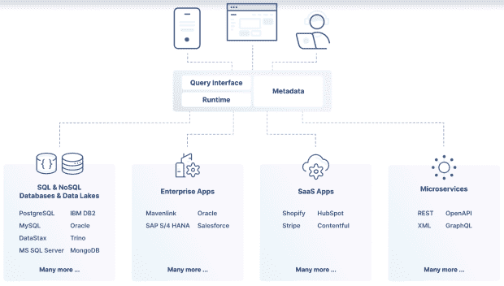
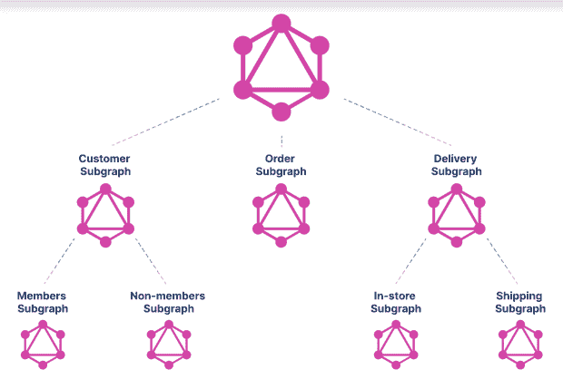

# 使用 GraphQL 的联邦数据访问层的情况

> 原文：<https://thenewstack.io/the-case-for-a-federated-data-access-layer-with-graphql/>

数据被孤立在多个系统中，而应用程序需要一个数据视图，这个问题几十年来一直很普遍。

传统上，有效实现一个数据视图有三个部分:

*   企业数据源的元数据视图。数据目录或集成中心通常专门从事这些工作。
*   利用元数据访问所有数据源的统一方法。
*   支持跨所有后端的翻译和执行的运行时。



## **联邦数据访问**

 [阿南特·金格兰

Anant 是 StepZen 的创始人兼首席执行官，step Zen 是一家初创公司，采用新的方法来简化开发人员访问数据的方式，以增强数字体验。](https://www.linkedin.com/in/anantjhingran) 

Gartner 和其他人开始将这些部分和围绕它们的最佳实践描述为数据网格或数据结构。确切的术语并不重要(没有两个人会对任何一个术语的含义达成一致)，但重要的是这被视为“联合数据访问层”

有许多技术可以联合数据源的某个子集。例如，Trino 是跨 SQL 后端联合的流行选择。还有专门的数据目录技术，比如 Alation 和 Informatica 的 Integration Hub。在这篇文章中，我们断言 GraphQL 声称是这个难题的一个重要部分。这并不是说 GraphQL 拥有 Trino 拥有的所有功能，也不是说它对元数据的理解就像数据目录一样强大。但是有三个非常具体的原因可以说明 GraphQL 为什么是一个优秀的联邦数据访问层:

*   GraphQL 可以处理任何后端，而不仅仅是关系数据库。它基于 JSON 数据合并，作为各种数据源的通用表示，JSON 比数据库的表表示好得多。
*   GraphQL 是为易于使用而设计的。GraphQL 查询很容易编写，没有复杂的外部连接、等式子句、case 语句等。当然，易于使用意味着它没有 SQL 的全部灵活性，但我们相信它做出的权衡是完全正确的——它们支持更好的开发人员体验，并使数据访问民主化。
*   或许，最重要的是，好的 GraphQL 服务器以迭代的方式平衡了有效实现数据视图所需的三个部分——元数据、查询和运行时。这意味着在用例出现之前，您不能构建数据目录。或者为未来的理想空间设计查询规范。随着您引入更多后端，您扩展了您的元数据，扩展了您的查询范围，并且总是有一个运行时。联合数据层本身可以是联合数据层的联合——一路向下，带来组织效率。

让我们详细阐述其中的每一个。

## 处理异构后端

假设一个前端开发人员想要“查看”一个已登录的客户及其所有订单以及每个订单的交付状态。客户数据可能来自以 JSON 格式返回数据的微服务。订单数据可能来自返回平面表格数据的数据库。和交付状态可能来自返回 XML 格式的 SOAP 服务。人们可以将每个表中的数据反规格化为表格结构，然后进行交叉连接，产生一个大规模的反规格化表，前端开发人员必须解析该表并将其重新构造为嵌套格式。或者，可以将所有数据转换成 JSON 格式，然后将它们缝合在一起，从而提高数据生成的效率，并简化前端开发人员的工作。

当数据来自异构后端，并且前端应用程序需要 JSON 时，最好将所有后端视为 JSON 生产者，将中间件视为 JSON 缝合器。这是 GraphQL 的观点，也是为什么它对这些用例来说是自然的。

## 易于消费

联邦数据层的强大之处在于它抽象出了后端。如果这些抽象增加了前端开发人员的认知复杂性，那有什么好处呢？对比一下这个:

```
select 
  row_to_json(cod)  as customers 
from  
  (
    select  
      c.*,  
      json_agg(
        row_to_json(od.*)
      )  as orders 
    from 
      customer  c  
      left outer join  (
        select  
          o.*,  
          json_agg(
            row_to_json(d.*)
          )  as deliveries 
        from 
          orders  o  
          left outer join  (
            select 
              *  
            from 
              delivery
          )  d  on  (d.orderid  =  o.id)  
        group by  
          o.id,  
          o.customerid,  
          o.carrier
      )  od on  (c.id  =  od.customerid)  
    where  c.email  =  ‘john.doe@example.com’
)  cod

```

用 GraphQL 中的三级查询:

```
{
 customer  (email:  “john.doe@example.com”)  {  
  name
        orders  {
 carrier
 delivery  {
              status
 }
        }
 }
}

```

显然，对于前端开发人员来说，后一种 GraphQL 查询更加简单和直观。(作者已经做了很长时间的 SQL 但是仍然要查找复杂的查询，`json_agg`语法是如此的复杂和不标准。)

GraphQL 被吹捧为减少数据传输。确实如此。但这只是它受欢迎的一个原因。它非常直观，使前端开发人员能够要求并得到他们想要的东西。

## 联邦的迭代方法

对于任何跨企业的计划，你都必须非常实际。构建元数据目录固然很好，但这是不是本末倒置了呢？好的 GraphQL 实现(比如 StepZen 的)会引入足够的元数据，以确保查询可以正确地分散到不同的后端，并被正确地收集(拼接)。随着更多后端的引入，元数据信息越来越丰富，但查询的可能性也越来越大。因为运行时会跟上元数据，所以系统总是启动并运行，并始终提供有用的数据和查询。

此外，通过将缝合自然地构建到其中，GraphQL 支持跨团队的联合。因此，一个企业可以拥有一个电子商务团队、一个营销团队和一个供应链团队，每个团队都构建自己的联合数据层，而企业可以在这些联合层上进行联合。唯一的区别是，对于企业范围的联邦层，后端将是 GraphQL 后端，而不是数据库或 REST 或 SOAP 后端。



## 摘要

虽然我们仍然处于真正的企业范围的联邦架构的早期阶段，但我们非常看好 GraphQL 为这一进步提供一个主要的基础。我们相信，虽然像数据目录和 SQL 联邦这样的个别技术可以发挥作用，但 GraphQL 方法可以在更大的异构后端集上更快地实现价值。

当然，并非所有的 GraphQL 实现都是相同的。在 StepZen，我们从数据库中学到了很多，我们采用了一种声明性的方法来构建这一层。这种方法使构建联邦层的团队能够专注于前端开发人员的需求和后端系统的功能，而将困难的工作留给中间件。

<svg xmlns:xlink="http://www.w3.org/1999/xlink" viewBox="0 0 68 31" version="1.1"><title>Group</title> <desc>Created with Sketch.</desc></svg>