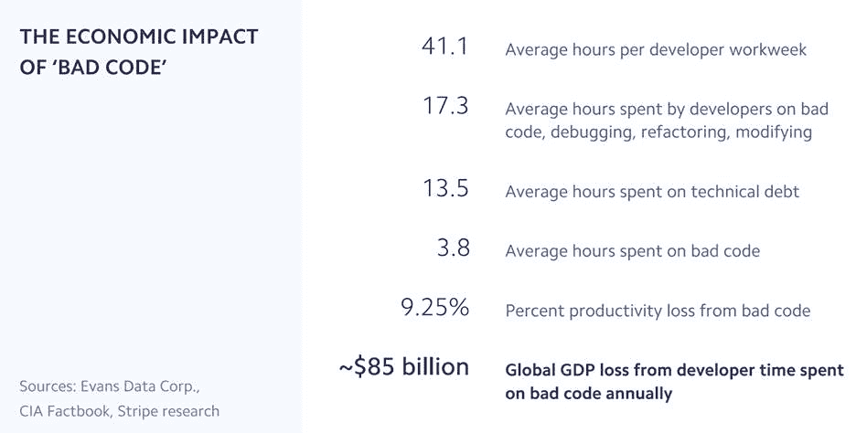

# 数据驱动的开源开发案例

> 原文：<https://thenewstack.io/the-case-for-data-driven-open-source-development/>

 [艾索·康德

艾索·康德是 source{d}的首席执行官兼联合创始人，他认为自己非常荣幸能与一个不可思议的团队共事。他们共同致力于将代码作为数据和代码的机器学习带给开发者和工程领导者。](https://sourced.tech/) 

每年，开源公司和开发者社区的数量都在持续增长。随着公司意识到成本、灵活性和创新的好处，开源正成为软件开发事实上的标准。除了拥抱 Linux，微软最近向开放发明网络的所有成员开放了其全部专利组合。公司不仅根据他们的开源软件(OSS)知识雇佣工程师，而且将他们 100%的时间分配给外部项目。结果，这些项目的质量和特性集显著提高，这进一步加速了它们在企业中的采用。非常成功的开源项目如 Kubernetes 已经帮助定义了贡献(技术和非技术)、交流(在线和离线)、开放(峰会、特殊利益团体等)的最佳实践。)和治理(维护者、技术顾问委员会等。).没有必要重新发明轮子，公司已经有了很好的工作框架。

然而，有一个主要问题需要解决:从开源项目中提取洞察力的标准化度量、数据集、方法和工具的缺乏是真实的。

## 真正重要的开源指标

让我们来看看问题的第一部分:度量标准。OSS 项目的利益相关者根本没有数据来做出明智的决定，在问题出现之前识别趋势和预测问题。向所有利益相关者提供标准化和语言不可知的数据对于整个开源行业的成功至关重要。每个人都可以查询大型代码库(如 GitHub 和 GitLab)的 API，并找到有趣的指标，但这种方法有局限性。您可以提取的数据点并不总是可用、完整或结构正确的。也有一些公共数据集，如 GH Archive，但这些数据集并没有针对提交、问题、PRs、评论、评论的详尽查询进行优化，跨一大组分布式 git 存储库。

从单一存储库中检索源代码是一项更容易的任务，但对于想要跟踪个人或团队贡献的研究人员、开源维护者或管理者来说，大规模的代码检索是一个痛点。开源社区开始认识到这个挑战和现有数据集的局限性。例如，Public Git Archive 现在提供了超过 4TB 的源代码，包括数百种编程语言，其格式更适合学术研究人员进行分析，这无疑是朝着正确方向迈出的一步

似乎更广泛的开源社区缺乏定量和定性数据来有效地衡量开源的成功。除了非常基本的指标，如星级、提交或贡献者的数量，维护人员应该能够知道合并/关闭的平均时间，或者审查关闭的拉请求(PRs)所花费的平均时间。类似地，维护人员将受益于对与合并的 PRs 相关的模式或与关闭的 PRs 相关的情感分析的更深入的理解。这样的度量标准也可以用来奖励顶级贡献者，在项目瓶颈真正出现之前识别新的维护者候选人或项目瓶颈。

## 接受“代码即数据”的概念

除了开放源码软件数据和源代码数据集的质量和数量之外，有效的开放源码数据分析的最大挑战可能是缺乏现有的框架或方法。OSS 项目维护者可能想知道外部贡献的数量、频率、来源和重要性以及总体贡献者体验，但是他们不一定知道跟踪什么度量或者如何有效地跟踪它们。虽然像[社区健康分析开源软件(CHAOSS)](https://chaoss.community/) 这样的组织目前正在解决这个问题，但这仍然是一个相当新的和不发达的学科。

“代码即数据”的概念开始在大型跨国公司中流行，这种概念包括将源代码视为可分析的数据集，提供有价值的业务见解。企业开始意识到它的好处，但往往低估了它的一些挑战。首先，缺乏适当的文档或不遵守工程规则和流程(称为“影子 IT ”)会阻止 IT 领导者了解和衡量他们的代码库中有什么。编程语言、框架、版本的多样性以及日积月累的技术债务，使得大规模的代码分析不仅复杂而且耗时。

在行业层面上，每个人都将受益于将诸如主数据管理(MDM)之类的成熟方法应用到他们的代码库中。它将有助于定义源代码检索和分析的标准流程，这将释放整个行业的机会。MDM for source code 可能是行业需要的开源基础，以防止供应商锁定，同时允许公司在其基础上构建专有平台或应用程序。

## 投资于代码工具的机器学习

根据最近的 [Stripe 报告](https://stripe.com/reports/developer-coefficient-2018),“开发人员处理糟糕代码、调试、重构等的经济影响”总计每年高达 850 亿美元。

根据这个数字，当公司试图使他们的代码库和软件开发实践现代化时，通过度量来提高他们的代码库的质量应该是他们首先想到的。然而，公司似乎没有简单的方法来检索、解析和查询源代码本身及其历史。代码行数以指数速度增长，但开发工具的发展速度还不足以帮助开发人员处理代码的复杂性和多样性。

许多数据科学家和开发人员都认为，机器学习是应对这一大规模代码和数据分析挑战的答案。机器学习算法可以用来改善我们写、读和维护代码库的方式。代码上的机器学习(ML on Code)的概念在软件开发社区获得了很大的兴趣。有几篇博客文章[介绍了关于代码](https://medium.com/sourcedtech/machine-learning-on-go-code-829e85e2d2c6)原则和相关研究领域的机器学习，但这些工具仍处于早期开发阶段。换句话说，这对开源社区来说是一个激动人心的挑战和合作机会。

通过 Pixabay 的特征图像。

<svg xmlns:xlink="http://www.w3.org/1999/xlink" viewBox="0 0 68 31" version="1.1"><title>Group</title> <desc>Created with Sketch.</desc></svg>