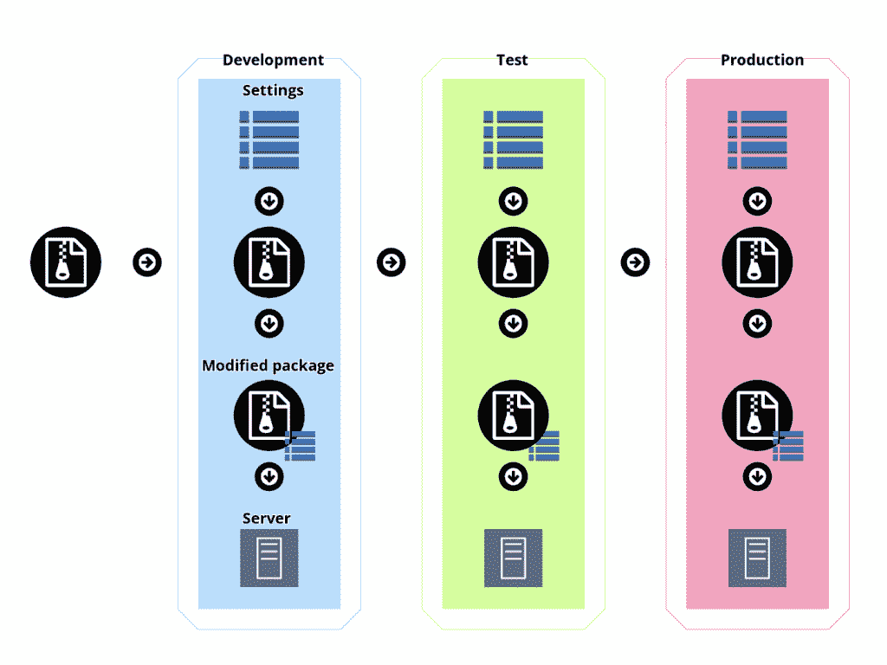
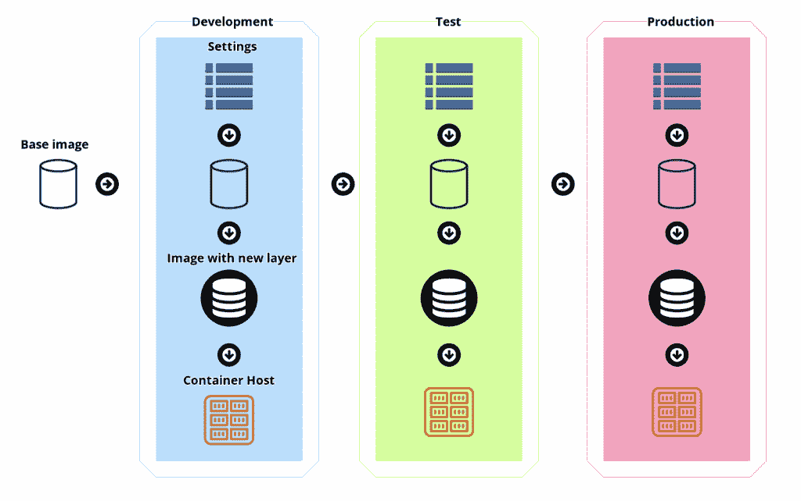

# 特定于环境的 Docker 图像的情况

> 原文：<https://thenewstack.io/the-case-for-environment-specific-docker-images/>

一个简单的事实是，您的部署环境并不是彼此的精确副本。环境之间最常见的差异是用于访问数据库等服务的凭据，因为在测试和生产环境之间共享相同的密码被认为是一种不好的做法。用于公开服务的主机名通常也因环境而异。

 [马特·卡斯帕森

从我的第一台 Commodore 64 开始，我就爱上了技术，这种激情一直延续到今天。作为首席内容工程师，我每天都在用 Octopus 集成企业平台，为 Kubernetes 等平台编写指南和书籍，写博客，培训我的同事，测试前沿的开源项目，并为各种博客投稿。](https://www.linkedin.com/in/mattcasperson/?originalSubdomain=au) 

这意味着您的应用程序需要灵活性，以适应它们在部署生命周期中经历的每个新环境的特定细节。这允许根据需要配置数据库连接字符串或外部服务 URL 等细节。

创建与环境无关的部署的普遍接受的解决方案是通过外部可配置的选项(通常通过环境变量)公开所有特定于环境的设置。这是由 [12 因素 app 方法](https://12factor.net/config)详述的解决方案。

因此，您今天在互联网上找到的绝大多数建议都强烈主张在运行时使用 env vars 配置与环境无关的部署构件(无论是 Docker 映像还是更传统的包，如 ZIP 文件)。然而，这个建议并不是通用的，在本文中，我们将研究为什么特定于环境的 Docker 映像是许多常见部署问题的有效解决方案。

## 了解传统部署流程

Octopus 最初是作为 IIS(Internet Information Services，互联网信息服务)等传统平台的部署工具出现的，并且一直信奉与环境无关的部署工件的概念。为了支持特定于环境的配置，Octopus 会在部署到每个环境的过程中替换配置文件中的值，然后将修改后的包部署到其目的地。

这个变量替换特性很容易成为 Octopus 中使用最多的特性之一，这个概念经受住了时间的考验。

这种方法的有趣之处在于，它实际上意味着特定于环境的包被交付到目的地。正如您在下图中看到的，在每个环境中都部署了一个由原始部署工件和特定于环境的设置组成的唯一包:

从这个工作流程中可以学到的重要东西有:

*   这一流程已经建立并经过了实战检验。
*   一个环境无关的工件是部署过程的输入。
*   特定于环境的工件被创建，即使它们是整个部署过程的不透明的副作用。

记住这个传统的部署过程，让我们看看特定于环境的 Docker 映像在作为多环境工作流的一部分生成时会是什么样子。

## 特定于环境的 Docker 图像工作流程

部署特定于环境的 Docker 映像的过程如下所示:

传统部署工作流与包含特定于环境的 Docker 映像的工作流之间的唯一区别在于，特定于环境的 Docker 映像必须存储在特定于环境的 Docker 存储库中，而不是在部署期间直接复制到目标的不透明文件。否则，这两个过程实际上是相同的。

如果传统的部署流程已经很好地建立并经过了实战测试，那么没有理由认为用一个 ZIP 文件替换 Docker 映像会引入任何重大缺陷。这是一个很重要的比较，因为许多反对特定于环境的 Docker 映像的论点往往会引发不具体的脆弱性或不可取性，而事实上，传统部署流程和特定于环境的映像之间存在不可否认的相似之处。

既然我们已经看到了特定于环境的映像如何反映一个成熟且经过实战检验的流程，那么接下来要问的问题是，与将所有特定于环境的配置外部化为 env 变量相比，它们何时是更好的选择。

## 特定于环境的映像可能不是最佳解决方案

重要的是要预先认识到特定于环境的映像在大多数情况下并不是最佳解决方案。所有现代框架都很好地支持通过 env 变量将配置值外部化，每个托管 Docker 容器的平台都支持设置 env 变量。如果您的代码可以读取 env 变量，那么这应该是默认选项，因为 env 变量对于特定于环境的设置问题是一个健壮的解决方案。

也就是说，您应该小心不要使用 env vars 作为解决所有问题的金锤，在许多场景中，特定于环境的图像是有意义的。

## 迁移传统应用程序

特定于环境的映像的一个明显的用例是迁移依赖于在部署期间操作配置文件的遗留应用程序。

你不需要回顾 Java 或者。NET 应用程序来查找没有读取 env 变量概念的 XML 配置文件。直接编辑配置文件的传统部署过程很好地支持了这些应用程序，这些应用程序到 Docker 的最直接的迁移路径是创建特定于环境的映像，用一个新层用特定于环境的版本覆盖原始配置文件。

## 将脚本与可执行映像捆绑在一起

Docker 正迅速成为基于 CLI 的工具的通用包管理器。每个主要工具都有一个受支持的 Docker 映像，Docker 注册表提供了下载映像的标准化流程。DevOps 与可靠性和自动化息息相关，对任何映像运行“docker pull”的能力是一项非常受欢迎的进步，不再需要定位工具的下载 URL、下载包、提取包并在结果文件结构中挖掘以执行适当的文件。

Docker 映像中托管的执行脚本或读取复杂配置文件的更高级工具允许最终用户挂载卷或文件。例子包括 newman，Postman 的 CLI 工具，它提供了运行本地收集文件的[指令。Cypress 还提供了一篇博文，演示了](https://hub.docker.com/r/postman/newman/)[如何挂载包含测试文件](https://www.cypress.io/blog/2019/05/02/run-cypress-with-a-single-docker-command/)的目录。

当在本地运行 Docker 映像时，挂载文件和目录是微不足道的，但是当在托管平台(如 Kubernetes、ECS、App Runner、Azure Container 实例等)上运行这些相同的映像时，即使不是不可能，也是具有挑战性的。如果这些平台支持文件挂载，那么您通常需要提供一个云文件存储解决方案，以便在您选择的容器编排平台中可靠地挂载文件。为了在一个容器中安装几千字节的文件，设置一个 NFS 文件服务器是否值得花费这么多成本和麻烦，这个问题是有道理的。

特定于环境的图像是解决这个问题的完美方案。例如，您可以基于正式的 Cypress Docker 映像创建一个特定于环境的映像，然后在您的端到端测试脚本中分层。生成的映像可以在任何能够运行 Docker 的平台上运行，因为特定于环境的映像只是普通的旧 Docker 映像。

## 多环境定制

特定于环境的配置可能会超出简单的键/值对。如果我们将环境的概念扩展到租户的概念，那么很容易想象“特定于环境的配置”扩展到诸如特定于租户的网站的 CSS 文件的场景。CSS 是声明性语法的一个例子，它从来没有被设计成从像 env vars 这样的外部值模板化。虽然有一种方法可以做到这一点，但更现实的方法是在通用的基础映像上放置特定于租户的样式表。

12 因素方法要求将配置与代码严格分离。更好的描述方式是将配置**和定制**从代码中分离出来。这种可组合性非常适合特定于环境的映像，其中特定于环境或特定于租户的定制在部署期间是“分层的”。

## 试图在入口点定制文件不是一个好主意

在谷歌上搜索“ [docker envsubst entrypoint](https://www.google.com/search?q=docker+envsubst+entrypoint) ，可以发现大量关于如何在 docker 容器启动时将 env 变量注入文件的建议。从表面上看，这似乎是合理的，但是随着配置文件复杂性的增加，它将不能很好地伸缩。

在 Octopus，我们已经看到了编辑配置文件的愿望是如何发展的。你从一些简单的替换开始。随着时间的推移，越来越多的文件需要编辑，简单的替换迫使您根据目标配置文件格式处理转义空格和引号。接下来是向 JSON 或 YAML 这样的结构化文件注入值的愿望，这允许您发布未注入的默认配置文件，然后以声明的方式更改这些文件的属性。

试图将这一功能植入 Docker 映像的入口点会有引入定制的复杂脚本来处理字符转义或调用 jq 或[奥革阿斯](https://augeas.net/)等工具以结构化方式修改文件的风险。

另一方面，特定于环境的映像可以在 Docker 映像之外执行这种文件操作，使用专门为此目的设计的工具，然后将生成的文件分层到一个新的映像中。创建特定于环境的配置文件的部署时间问题留给了部署工具，而不是试图将其嵌入到 Docker 在容器运行时执行的定制脚本中。

## 结论

创建特定于环境的映像的过程在概念上与传统部署中使用的过程相同，传统部署已被证明是部署到多个环境时的可靠解决方案。虽然使用 env vars 为环境定制容器是一个很好的、甚至是更可取的解决方案，但是在许多场景中，特定于环境的映像非常有意义。

<svg xmlns:xlink="http://www.w3.org/1999/xlink" viewBox="0 0 68 31" version="1.1"><title>Group</title> <desc>Created with Sketch.</desc></svg>