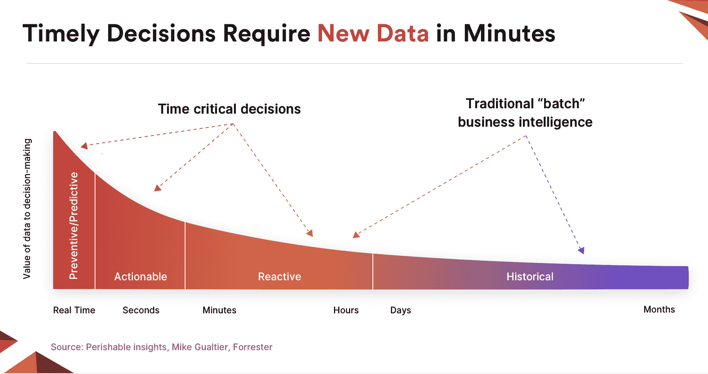

# Furnace 案例，一种可以随您的业务发展的数据结构

> 原文：<https://thenewstack.io/the-case-for-furnace-a-data-fabric-that-can-evolve-with-your-business/>

丹尼·韦特

丹尼·韦特是一名建筑师、全栈开发者和创新者，他创造的技术推动了发展。在近 20 年的行业生涯中，Danny 领导的团队成功地创造了世界一流的产品，并在电信和数字领域创立了一些创新公司。

[Furnace](https://www.linkedin.com/in/dannywaite7/?originalSubdomain=uk) 的目标是成为您的数据结构，即围绕其构建数据驱动型业务的平台。这是一个大胆的说法，需要上下文，所以在这篇文章中，我将尝试解释。

环顾当今的数据环境，人们很容易迷失方向或被大量的选项所淹没；平台对框架，云对内部部署，SaaS 对 PaaS，开源对商业，数据湖对数据仓库，我可以继续下去…你明白了。

这里有很多因素在起作用，从技术上来说，有很多方法可以接近任何解决方案。然而，我认为公平地说，选择错误的技术堆栈可能会让你陷入痛苦的世界。

***TLDR:*** Furnace 是一个开源平台，帮助开发者和企业构建高效的数据驱动应用。它通过提供一个简单而有效的框架来构建无服务器和云原生基础架构，从而降低总拥有成本，解决了企业面临的许多挑战。

### 基础设施；明摆着的难题

根据组织的规模，在安排人员来设计、构建和维护必要的基础架构方面，事情可能看起来很有挑战性。我们是在谈论“大数据”吗？也许不是现在，但如果你是一家初创公司，你可能希望从第一天开始就收集数据，让你有能力进一步发展，但当然你必须经济高效地做到这一点。此外，在初创公司的世界里，上市时间、财务运作和对核心价值主张的关注是生死攸关的事情，因此在 DevOps 资源和 AWS 基础设施(或者更糟，内部)上浪费时间和金钱可能是自杀。简而言之，尽可能快、尽可能便宜地实现产品/市场匹配至关重要。

当然，在企业中，情况就大不相同了。人们普遍认为，80%的时间和资源花在管理基础架构上，只有 20%的时间和资源专注于价值创造。这损害了底线，抑制了企业适应不断变化的环境的能力。为了增加更多的内容，企业通常有相当大的团队致力于构建和维护这些系统，云的承诺应该会改变这种平衡，但糟糕的架构系统，也许是对其内部环境的简单“提升和转移”，会带来与以前相同的问题，甚至更糟。

无服务器技术可用于解决这种不平衡，降低基础设施成本、管理开销并提高可扩展性。

### 数据的形状

数据以各种形状和大小出现。您的组织收集或生成的数据有可能以多种形式出现，如 API、关系数据库、连续流和按特定时间表交付的批处理。在不同的平台上分别处理每一种情况是很常见的，这导致了数据孤岛化。对于我之前的观点…更多的基础设施和更高的运营成本。

因此，一个组织的数据基础设施能够在一个单一而简洁的平台上处理向其呈现数据的方式，使其更接近数据所包含的价值，这是可取的(如果不是至关重要的话)。

### 数据易腐性

不是所有的数据都是平等的。有些来源需要在收到后立即采取行动，因为这可能会启用对某些业务至关重要的预测或预防功能。另一方面，历史数据可以从更“商业智能”的角度进行审查。Forrester 的 Mike Gualtieri 在他关于“易腐洞察”的报告中定义了这一点，他定义了数据如何随着时间快速失去价值的时间线，从预防性/预测性开始，经过可操作、反应性和历史性，从实时到秒、小时和天。

了解这些特征的平台为企业提供了巨大的优势，除了运行融合平台的好处之外，具有不同易腐性级别的数据可以得到不同的处理，或许可以存储在更具成本效益的数据湖中(对象存储与实时解决方案，如 ElasticSearch 或 Redshift)。

### 技能差距

我们都读过云的灵丹妙药，以及我们消耗的越多，面临的问题就越少的概念。现实有些不同。今天，技术人员大量分散，技能、选择和偏好混杂在一起，导致效率低下。假设你已经在 AWS 上“全押”了，但是你的一个供应商要求你在 Azure 上消费一些服务，或者你的老板想在 Google Cloud 上使用最新的 ML 技术，你会怎么做？依靠现有的工程团队来提升技能？走外包的流程？没有简单的答案。精通多种云的云架构师少之又少，你必须申请抵押贷款才能雇用他们。

Furnace 为在多个云上构建数据驱动的应用程序提供了一个简洁的框架。我们提供“刚好够用的抽象”，让您专注于核心价值主张，处理所有繁重的工作、安全策略、管道等。但仍允许您在需要时深入特定的云原生基础架构。

有人说，熔炉抽象了云，并在其上提供了一个不可知论者层。在某些方面确实如此，但我们认为真正的力量在于在单个框架内跨多个云构建高效且高效的数据驱动型应用程序的能力。一个学习工具，三个公共云的所有功能，并计算…

### 发展实效

问问你自己，在利用数据中的价值时，你或你的团队的效率如何？

最近的一项研究显示，大多数企业不会再次查询他们放入数据湖的 95%的数据。这是为什么呢？是因为他们缺乏工具和能力，还是因为他们花了大部分时间来反对他们做出的技术选择？

还有一个问题。您的企业对不断变化的环境做出反应的速度有多快？新的数据来源？一个新的情报来源？

如果你认为雇佣一个新的“数据科学家”很简单，那你可能错了。这些人是如此稀缺(如果他们很优秀的话)，他们可以选择自己的工作，如果你没有他们手边的数据，或者指望他们制作 ETL(提取、转换、加载)管道，他们很快就会被扫地出门。

Furnace 基于“可编程管道”的概念，使其在构建紧密符合业务需求的动态数据流方面高度灵活和高效。

提示:不要让昂贵的数据工程师使用上一代技术构建 ETL 管道，现在有很好的 last 云平台可以做到这一点…哦，嘿，熔炉！

### 基础设施效率

如果您今天正在您的组织中消耗数据，我敢打赌您目前正在为空闲时间付费。也就是说，基础设施坐在那里等待运行夜间批处理作业，或者一些强大的服务器以 5%的利用率运行，“以防”您看到流量激增。

供应一个新的应用程序怎么样？从构思到部署到生产需要多长时间？我敢说整个过程需要数周时间，包括提前进行基础架构资源规划和配置。

Furnace 通过使用无服务器技术解决了这一问题，即:

*   不使用时，基础设施成本绝对为零。
*   您只需为您使用的东西付费。
*   应用程序无需干预即可自动扩展和缩减。

### 进化的建筑

在处理数据时，当今的解决方案通常是僵化而脆弱的，也就是说，诸如改变管道或添加数据源之类的事情通常需要对底层基础设施进行重大更改、重新编译代码、运行质量测试等。组件之间的紧密耦合也会产生影响，因此看似“简单的改变”最终会导致整个基础设施瘫痪。

Furnace 允许您构建动态的、松散耦合的应用程序架构，这些架构能够适应业务并随业务发展。该平台的许多方面都使这一点成为可能，例如，它能够智能地同步云配置(从理想状态到实际状态)和不可变的环境，这些环境可以在最终推广到生产之前根据测试的需要进行旋转。

此外，由于 Furnace 使用简单的声明性 DSL(领域特定语言),这增加了简单性、可理解性和安全性。

## 关闭时

在本文中，我试图概述数据驱动的企业今天面临的一些挑战，以及 Furnace 如何提供解决方案。你可以从这里了解熔炉的来历[。如果你想下载](https://medium.com/projectfurnace/introducing-furnace-e4d7b1b51932)[熔炉，请点击这里](https://furnace.org)。

由 Pixabay 的 kepinator 提供的特征图像。

<svg xmlns:xlink="http://www.w3.org/1999/xlink" viewBox="0 0 68 31" version="1.1"><title>Group</title> <desc>Created with Sketch.</desc></svg>