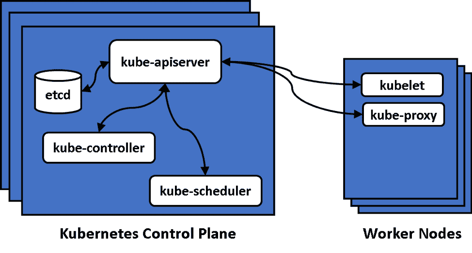
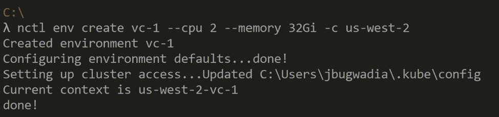
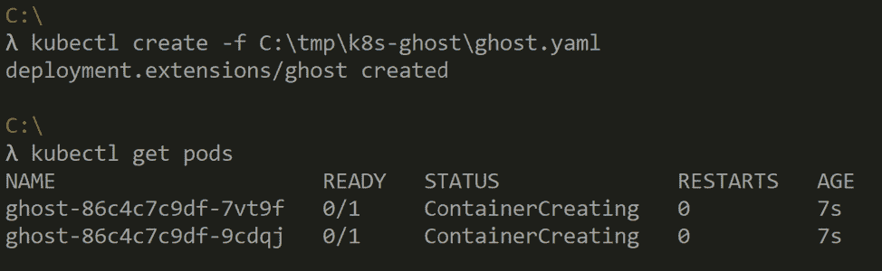
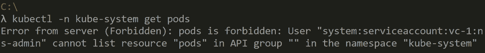

# 虚拟 Kubernetes 集群的案例

> 原文：<https://thenewstack.io/the-case-for-virtual-kubernetes-clusters/>

虚拟化技术使事情更容易管理。在本帖中，我们将讨论虚拟化 Kubernetes 如何帮助解决 Kubernetes 集群管理的复杂性。我们还描述了虚拟 Kubernetes 集群的可用技术和最佳实践。

## 虚拟化简史

 [里泰什·帕特尔

Ritesh 是 Nirmata 的创始人兼产品副总裁，NIR mata 是一个基于 Kubernetes 构建的云原生应用管理平台。Ritesh 拥有大约 20 年的企业软件开发经验，并领导过软件开发团队。在加入 Nirmata 之前，Ritesh 负责 Brocade 的私有云战略和业务开发，领导了各种云和安全相关计划，并创建了合作伙伴生态系统。Ritesh 还在 Trapeze Networks、Nortel 和摩托罗拉担任过重要的技术职务。Ritesh 拥有加州大学伯克利分校的 MBA 学位和密歇根州立大学的硕士学位。](https://www.linkedin.com/in/patelrit/) 

在技术领域，虚拟化意味着创建软件定义的或“虚拟”形式的物理资源，例如计算、网络或存储。虚拟资源的用户应该看不到与实际物理资源的用户有明显的区别。虚拟化资源通常受到底层物理资源共享方式的限制。

最常用的虚拟化形式是服务器虚拟化，其中物理服务器被分成多个虚拟服务器。服务器虚拟化由称为虚拟机管理器(VMM)或虚拟机管理程序的软件层实现。有两种类型的虚拟机管理程序:

*   **Type 1 Hypervisor** :直接运行在物理服务器上，协调服务器资源共享的 Hypervisor。每个虚拟机(VM)都有自己的操作系统。
*   **Type 2 Hypervisor** :运行在操作系统(主机 OS)上，协调服务器资源共享的 Hypervisor。每个虚拟机也有自己的操作系统，称为客户操作系统。

还有另一种形式的计算资源虚拟化，称为操作系统(OS)虚拟化。借助这种类型的虚拟化，操作系统内核本身就允许安全共享资源。如果这听起来很熟悉，那是因为我们今天通常所说的“容器”是操作系统虚拟化的一种形式。

在 21 世纪初成为主流的服务器虚拟化技术实现了信息技术的巨大飞跃，也实现了云计算服务。服务器虚拟化最初的使用案例是为了在一台物理服务器上轻松运行多种类型和版本的服务器操作系统，如 Windows 或 Linux。这对软件测试和质量保证行业很有用，但并没有引发虚拟化技术的广泛采用。几年后，随着 VMware 的 ESX 1 型虚拟机管理程序服务器整合成为一种提高企业 IT 效率的方式，它支持跨工作负载共享服务器，从而减少了所需的物理服务器数量。最后，VMware 的 [VMotion](https://www.vmware.com/pdf/vmotion_datasheet.pdf) 功能允许跨物理服务器迁移正在运行的虚拟服务器，这一功能改变了游戏规则，因为现在可以在不停机的情况下修补和更新物理服务器，并且 IT 服务器现在可以轻松实现高级别的业务连续性。

## 为什么要虚拟化 Kubernetes

Kubernetes 被广泛认为是管理容器化应用程序的事实上的标准。然而，大多数企业仍处于采用的早期阶段。Kubernetes 更快采用的一个主要障碍是学习和大规模管理相当复杂。在 [KubeCon 调查](https://www.nirmata.com/2019/01/24/new-survey-yields-kubernetes-as-mainstream/)中，50%的受访者认为缺乏专业知识是更广泛采用 Kubernetes 的主要障碍。

大多数企业都有几个属于不同产品团队的应用程序。随着这些应用程序越来越多地打包到容器中并迁移到 Kubernetes，以及采用 DevOps 实践，企业面临的一个主要挑战是确定谁负责 Kubernetes 堆栈，以及 Kubernetes 的技能和职责应该如何在整个企业中共享。有一个小的集中的团队在 Kubernetes 中建立专业知识，并允许组织的其余部分专注于交付商业价值是有意义的。[另一项调查](https://diamanti.com/wp-content/uploads/2019/06/Diamanti_2019_Container_Survey.pdf)显示，越来越多的部署(从 2018 年的 17.01%增加到 2019 年的 35.5%)是由集中式 IT 运营团队推动的。

企业采用的一种方法是将现有流程置于新技术周围，以使采用更容易。事实上，传统的平台架构试图对开发人员隐藏容器和容器编排，并提供熟悉的抽象。类似地，采用 Kubernetes 的企业可能会将其置于 CI/CD 管道之后，不向开发人员提供对 Kubernetes 的访问。

虽然这可能是一种合理的开始方式，但这种方式削弱了 Kubernetes 的价值主张，Kubernetes 为开发人员提供了丰富的云原生抽象。

托管 Kubernetes 服务可以轻松启动 Kubernetes 控制平面。这使得简单地为每个团队分配他们自己的集群，甚至使用“每个应用一个集群”的模型(如果这听起来很熟悉，我们的行业确实经历了“每个应用一个虚拟机”的阶段)。

“每个团队/应用一个集群”的方法存在主要问题:

1.  保护和管理 Kubernetes 现在变得更加困难。Kubernetes 控制飞机旋转起来并不困难。大多数繁重的工作是在控制平面启动后配置和保护 Kubernetes，以及管理工作负载配置。
2.  资源利用率非常低，因为没有机会在不同的工作负载之间共享相同的资源。对于公共云，“每个团队/应用一个集群”的模式直接导致了更高的成本。
3.  集群现在变成了新的“宠物”(参见"[宠物与牛](http://cloudscaling.com/blog/cloud-computing/the-history-of-pets-vs-cattle/)")，最终导致集群蔓延，无法控制和管理部署。

解决方案是利用虚拟化来适当分离开发人员和集群操作员的关注点。使用虚拟化，运营团队可以专注于管理跨应用程序共享的核心组件和服务。开发团队可以自助访问虚拟集群，虚拟集群是物理集群的安全部分。

## 库伯内特建筑

Kubernetes 自动化了容器化应用程序的管理。

大型系统架构，比如 Kubernetes，经常使用架构层或“平面”的概念来提供关注点的分离。Kubernetes 控制平面由管理布局、调度的服务组成，并为所有资源的配置和监控提供 API。

应用程序工作负载通常在工作节点上运行。从概念上讲，worker 节点可以被认为是 Kubernetes 的“数据层”。Worker 节点还运行一些 Kubernetes 服务，负责管理本地状态和资源。所有跨服务的通信都是通过 API 服务器进行的，这使得系统是松散耦合和可组合的。

## Kubernetes 虚拟化技术

就像服务器虚拟化包括不同类型的虚拟化一样，虚拟化 Kubernetes 可以在系统的不同层完成。可能的方法是虚拟化控制平面、虚拟化数据平面或虚拟化两个平面。

### 虚拟化 Kubernetes 数据平面

下面是 Kubernetes [名称空间](https://kubernetes.io/docs/concepts/overview/working-with-objects/namespaces/)的定义:

Kubernetes 支持由同一个物理集群支持的多个虚拟集群。这些虚拟集群被称为名称空间。

简单，嗯？不完全是。对于要用作虚拟集群的名称空间，需要正确配置几个额外的 Kubernetes 资源。下面显示和讨论了需要为每个名称空间正确配置的 Kubernetes 对象:

*   **访问控制** : Kubernetes 访问控制允许细粒度的权限集映射到用户和团队。这对于共享集群来说是必不可少的，并且最好与管理用户、组和角色的中央系统集成在一起。
*   **Pod 安全策略**:该资源允许管理员准确配置允许 Pod(Kubernetes 部署和管理单元)做什么。在共享系统中，不允许 pod 作为根用户运行，并且对其他共享资源(如主机磁盘和端口以及 API 服务器)的访问权限有限，这一点非常重要。
*   **网络策略:**网络策略是 Kubernetes 防火墙规则，允许控制来自 pod 的入站和出站流量。默认情况下，Kubernetes 允许集群中的所有 pod 相互通信。这在共享集群中显然是不可取的，因此为每个名称空间配置默认的网络策略，然后允许用户为他们的应用程序添加防火墙规则是很重要的。
*   **限制和配额** : Kubernetes 允许对资源进行粒度配置。例如，每个 pod 可以指定它需要多少 CPU 和内存。还可以限制工作负载和名称空间的总使用量。这在共享环境中是必需的，以防止一个工作负载耗尽大部分资源并使其他工作负载处于饥饿状态。

### 虚拟化 Kubernetes 控制平面

虚拟化 Kubernetes 控制平面意味着用户可以获得他们自己的控制平面组件的虚拟实例。拥有 API 服务器和其他 Kubernetes 控制平面组件的单独副本，允许用户运行单独的版本和完全隔离的配置。

例如，不同的用户甚至可以拥有相同名称的名称空间。这种方法解决的另一个问题是，不同的用户可以拥有不同版本的定制资源定义(CRD)。CRD 对 Kubernetes 越来越重要，因为 Istio 等新框架正在作为 CRD 实现。对于提供托管 Kubernetes 服务或希望为每个租户提供一个或多个集群的服务提供商来说，这种模式也非常有用。服务提供商可用于硬多租户的一个选项是要求每个租户有单独的工作节点。

## 当前状态和活动

Kubernetes [多租户工作组](https://github.com/kubernetes-sigs/multi-tenancy)负责探索与集群安全共享相关的功能。他们每两周一次的会议是了解最新发展的好地方。该工作组正在寻找简化虚拟集群供应和管理的方法，包括使用 CRD、嵌套命名空间等机制管理命名空间，以及使用控制平面虚拟化。该小组还为不同级别的多租户创建了安全配置文件。

Kubernetes 控制平面虚拟化的提案是由阿里巴巴的团队提供的(这里是相关的[博客文章](https://www.cncf.io/blog/2019/06/20/virtual-cluster-extending-namespace-based-multi-tenancy-with-a-cluster-view/))。在他们的设计中，单个“超级主机”协调跨用户的调度和资源管理，并且工作节点可以共享。阿里巴巴的虚拟集群提案还使用名称空间和相关的底层控制来实现数据平面级别的隔离。这意味着该提案同时提供了控制平面和数据平面的多租户功能。

## Nirmata 提供了什么

[Nirmata](https://nirmata.com/) 是一个面向 Kubernetes 的与基础设施无关的管理平台。该平台为 Kubernetes 集群操作员以及共享集群的开发团队提供了角色。借助 Nirmata，运营商可以轻松管理共享集群，并支持开发团队自助创建和管理虚拟集群。

在底层，Nirmata 利用 Kubernetes 和 [Kyverno(一个开源的 Kubernetes 策略引擎)](https://kyverno.io/)为每个团队提供和管理名称空间和共享服务。

以下是一个 CLI，展示了开发人员如何通过指定虚拟集群所需的内存和 CPU 来请求虚拟集群:

现在，标准的 Kubernetes 命令行(kubectl)或任何其他兼容的工具都可以用来管理工作负载:

并且禁止访问共享资源，如 kube-system 名称空间:

为了在 Nirmata 中实现这种体验，IT 运营团队为物理和虚拟集群的自动化集群生命周期管理制定了策略。

## 结论

虚拟化技术改变了计算、存储和网络，并催生了云计算。通过简化资源的配置和管理，虚拟化技术支持复杂技术的大规模采用。

Kubernetes 提供了一套强大的工具，但在大规模配置和操作时可能会很复杂。这种复杂性是阻碍企业采用 Kubernetes 的的最大因素之一。

虚拟化 Kubernetes 允许开发者和运营商之间的关注点分离，而不会削弱开发者对他们所关心的底层 Kubernetes 构造的访问。虚拟 Kubernetes 集群为开发人员提供了所需的自由和灵活性，并允许运营商为生产工作负载和跨团队访问添加必要的防护栏。

<svg xmlns:xlink="http://www.w3.org/1999/xlink" viewBox="0 0 68 31" version="1.1"><title>Group</title> <desc>Created with Sketch.</desc></svg>