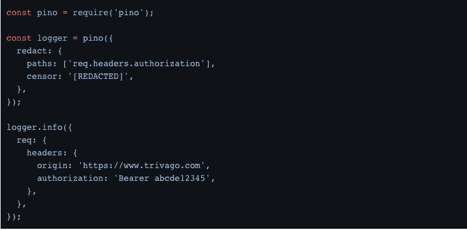
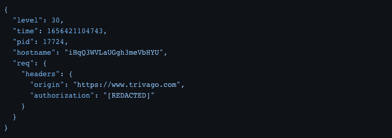
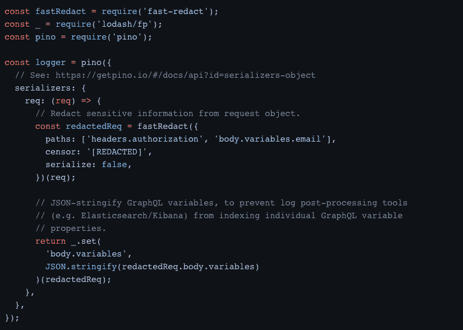
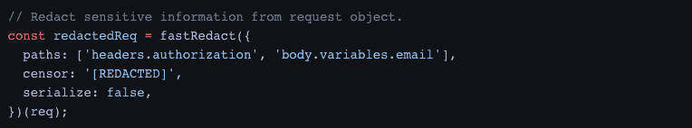
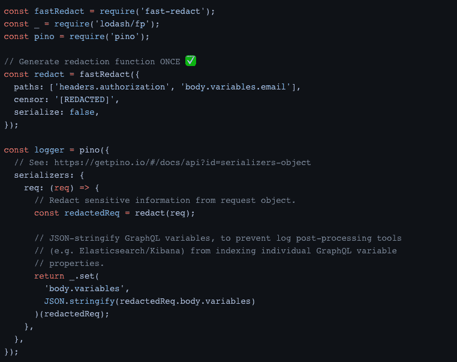

# Trivago 破解了性能提升消失的情况

> 原文：<https://thenewstack.io/the-case-of-the-vanishing-performance-improvements/>

在线旅游服务公司 Trivago T1 发现，根据 T2 K6 T3 的负载测试，Fastify web 框架响应 HTTP 请求的速度比 Express.js 平均快 107%(两倍多)。好消息。但是这些性能改进在生产中消失了。为什么？

这个难题是最近[博客文章](https://tech.trivago.com/post/2022-09-15-how-to-substantially-slow-down-your-nodejs-server/)的主题，作者 [Abdelrahman Abdelhafez](https://www.linkedin.com/in/abdelrahman-maged/) ，Trivago 后端软件工程师。这篇文章记录了从 [Express](https://expressjs.com/) 迁移到 [Fastify](https://www.fastify.io/) 后出现的一个技术挑战和调查。

## 控制环境

为了简化测试的部署，Trivago 的 staging environment 将生产环境模拟到一个高度一致的水平。为了进一步确保准确的指标，Express 和 Fastify 暂存部署都:

*   **一模一样。唯一的分歧点是在引擎盖下运行的 web 框架。**
***   **并发运行，模拟运行条件，因为 [GraphQL](https://graphql.org/) 取数据的数据源会自动缩放。****

 ****测试环境中的问题已经排除，Abdelhafez 和他的团队仍然在寻找“尤里卡！”瞬间，调查了快速到快速迁移拉取请求差异。他们希望找到一些东西来确定是什么导致了这个 bug。他们寻找的答案没有找到，所以调试继续进行。

Abdelhafez 将下一部分解释为，“(拿出)大枪:实时剖析。”

对于这一部分，Trivago 推出了一个单独的 [Kubernetes](https://kubernetes.io/) pod，配备了一个 [node-heapdump](https://www.npmjs.com/package/heapdump) 包，允许他们在实时部署中拍摄 V8 堆的快照。之后，他们将一小部分传入流量定向到这个特殊的 pod。

他们第一次发现了这个错误:日志反应逻辑消耗了“令人讨厌”的大量内存。为什么？

## **日志修订**

这是在将敏感信息(密码、访问令牌、电子邮件等)写入应用程序日志之前覆盖这些信息的过程。日志编辑简化了 Trivago 对 [GDPR](https://gdpr.eu/) 的遵从，并使他们的日志不那么机密，从而让更多的开发人员出于监控和调试目的查看它们。这听起来肯定是他们需要在应用程序中保留的东西。

*快递时代的日志编辑* : Trivago 使用了一个叫做 [pino](https://www.npmjs.com/package/pino) 的“超级快速”JSON 日志记录器。手动编辑传入 HTTP 请求中的敏感信息。Trivago 会在 pino 记录 JavaScript 对象之前拦截它们，使用 deepdash 包深入遍历它们，并覆盖它发现的任何敏感信息。

Fastify 时代的日志编辑 : Fastify 在内部使用 pino 并推荐它，所以没有改变。Fastify 文档称，pin 具有内置的低开销编辑支持，因此 pino 是在没有 [deepdash](https://www.npmjs.com/search?q=deepdash) 的情况下开发的。

下图显示了使用 pino 的密文选项配置的密文功能:

上面的代码将以下内容记录到控制台:

*理论上，这是完美的*。没有任何类型的对象遍历。我们只需要指定需要编辑的路径，然后“瞧”pino 就可以编辑它们了。*但是，现实生活中的用例通常不会这样工作。*在 Trivago 的情况下，他们需要在编校之后但在日志记录之前对 GraphQL 变量对象进行字符串化，以防止日志后处理工具(例如 Elasticsearch/Kibana)索引单个 GraphQL 变量属性。

## 输入快速修订

这一限制导致 Trivago 放弃了 pino 的嵌入式编辑，并尝试了其他东西— [快速编辑](https://www.npmjs.com/package/fast-redact)。快速修订是 pino 使用的一个库，它承诺“非常快速的对象修订”,只比 JSON.stringify 慢大约 1%。

但是快速修订并没有快速修订。放大日志编校显示，使用快速编校编写的代码正是降低整个 Node.js 服务器速度的代码。为什么？

终于有答案了！

对快速修订的深入调查揭示了一个小小的实现错误。

当上面的图像与快速编辑功能的前一个图像比较时，它就在那里。它不是一次生成一个编校函数，而是在每个请求上重新生成编校函数。

下面是 ReadME.md 中正确的实现。

代码已经更新，事实证明快速修订很快。这里有一个孤立的数据可以证明这一点。

阿卜杜勒哈菲兹用一种带来所有戏剧的方式解释了这一点，我在这里就是为了它:如果地球和太阳之间的距离是 1 AU(约 8.3 光分)，那么 238，756 AU(约 3.8 光年)大致是地球和仅次于太阳的第二近恒星比邻星之间的距离。

Node.js 服务器的内存使用量从平均 4gb 下降到 2gb。这使得他们在欧盟地区的 Kubernetes 集群自动从 210 个扩展到 160 个。现在货舱能够在最繁忙的区域处理同样多的流量。

*这是如何在测试阶段被遗漏的？* Trivago 在负载测试期间手动禁用了 staging 中 Express 和 Fastify 部署的日志记录。工程师们没有考虑到禁用日志记录也禁用了日志记录的逻辑(即编校)，并使磁盘 I/O 在负载测试的上下文中“不相关”。阿卜杜勒哈菲兹说道，“🤦‍♂️

总结:Fastify 在性能方面优于 Express，并且在测试期间不要禁用任何生产标志。

<svg xmlns:xlink="http://www.w3.org/1999/xlink" viewBox="0 0 68 31" version="1.1"><title>Group</title> <desc>Created with Sketch.</desc></svg>****