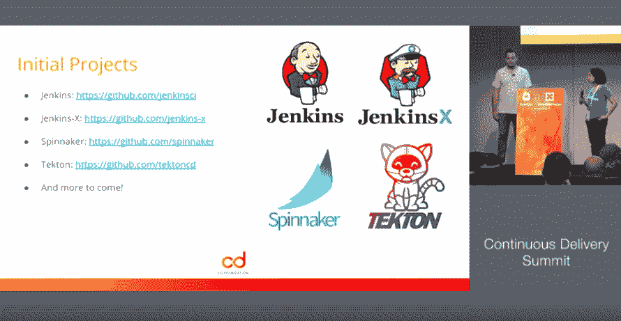

# CD 基金会在持续交付中发现了一个具有挑战性的环境

> 原文：<https://thenewstack.io/the-cd-foundation-finds-a-challenging-environment-in-continuous-delivery/>

持续交付基金会(CDF) 开始帮助成千上万的开发人员，他们经常为采用和实现正确的工具集组合来实现他们的目标而奋斗。在持续交付(CD)和持续集成(CI)领域，CDF 的创始人希望引入流程和标准，以帮助开发人员在可能已经变得过于丰富的选择范围中找到最佳解决方案。

但是有些人有顾虑。一些人质疑与[云本地计算基金会](https://www.cncf.io/) (CNCF)的潜在重叠，这是一个由 Linux 基金会管理的兄弟项目。在 CD 工具提供商中，存在着关于高进入价格和创始成员缺乏与竞争对手协商的争议，强调选择一些项目，包括 [Jenkins](https://jenkins.io/) 、 [Jenkins X](https://jenkins-x.io/) 、 [Spinnaker](https://www.spinnaker.io/) 、 [Tekton](https://github.com/tektoncd) 和其他工具。此外，到目前为止，CD 基金会还没有披露规范和原语，尽管几个消息来源说，这些将在“未来几周内”进行交流。

五月份在巴塞罗那举行的[kube con+CloudNativeCon Europe](https://events.linuxfoundation.org/events/kubecon-cloudnativecon-europe-2019/)期间，我们参加了由 CDF 主办的持续交付峰会。主题演讲和会谈，以及在峰会场外和会议期间进行的对话，是基金会能够(也可能不能)为开源开发社区提供什么的源泉。

在持续交付峰会的间隙，[谷歌的软件工程师 Dan Lorenc](https://www.linkedin.com/in/danlorenc) ，他启动了 Tekton 项目，并且是 CDF 技术监督委员会的成员，他告诉新的堆栈，CDF 是今天 CD 缺失的一环。“肯定存在基金会疲劳，但 CDF 是一个更小、更专注于持续交付的基金会，”Lorenc 说。“已经有一个有数千名参与者的大型基金会，但我们将推出一个更专注的基金会，其范围也比 CNCF 提供的更广。”

一位要求匿名的工具制造商表示，CDF 的价格点是一个问题，特别是对于新成立的初创公司来说，这些公司可能会开发出令人兴奋的技术，但缺乏资本和资源来作为正式成员制定标准。该消息人士称，一个拥有从 CNCF 毕业的项目的组织“获得了很多价值”。相反，对于 CDF，“他们说你必须支付 100，000 美元来为标准做贡献——但[到目前为止]还没有标准，”消息人士说。“将会出现什么令人激动的新发展，将会推出什么令人激动的新标准？(到目前为止)，我们还没有看到任何东西，”消息人士说。

在最近的一期播客 [The New Stack @ Scale](https://thenewstack.io/podcasts/at-scale) 中，[Lyft 的软件工程师、特使代理的创建者马特·克莱恩](https://www.linkedin.com/in/mattklein123/)，CNCF 已经在帮助建立标准，并为开发者工具的 CD 规范提供其他支持。“在 CNCF，我们已经有了这个问题，即帮助最终用户理解什么样的技术适合他们的用例，”Klein 说。

克莱恩说，他的“恐惧”是另一个密切相关的基础。“就像我们看到的那样，有大量的重叠——我不认为没有 CI 和 CD 就能构建一个云原生架构，”Klein 说。“所以现在，我们有一些关键的联锁技术，它们跨越了几个不同的基础，本身并没有被打破，但我认为我们需要小心，以避免混淆用户。”

然而，尽管开发倡导者[利昂·斯蒂格](https://www.linkedin.com/in/leonstigter)承认, [JFrog](https://jfrog.com/) 在 CNCF 和 CDF 之间“可能有一点重叠”。然而，“当涉及到确保我们构建产品时，两者都发挥着同样有价值的作用，”他在持续交付峰会期间的欧洲会议间隙告诉新的堆栈。

“我认为 CNCF 更关注什么是云原生的核心租户。国防部队更多地着眼于部署。“我认为，在确保我们开发出开发人员喜欢的产品方面，两者扮演着同样重要的角色。”

同时，开发人员当然不太关心基础的选择，他们只关心找到他们需要的工具。“当我作为一名开发人员寻找一个工具时，我会用谷歌搜索这个工具——我不会去一个基金会网站说，‘我喜欢这个 CNCF 或 CDF，我只想看看那个。’“我寻找我喜欢的东西，”斯蒂格说。随着开发人员对他们公司使用的工具和技术有了更多的发言权，我认为最终，开发人员会从来自 Linux 基金会的更加面向标准的团体中受益。"

在持续交付峰会的主题演讲中， [CloudBees](https://www.cloudbees.com/) 开源社区总监兼 CD 基金会董事会成员 Tracy Miranda 阐述了为什么开发人员需要 CD 基金会来驾驭当今的开发工具环境。

“真正的问题是，为什么我们需要围绕(持续交付)的基础，为什么我们都需要聚集在这个房间里？”米兰达在主题演讲中说。

如上所述，开发团队面临的障碍之一是可用工具的数量。“如果你观察一下现有的 CD 工具，会发现有许多不同的变体。米兰达说:“这并不是说我们想要一个适合所有人的尺寸或者一个可以神奇地做所有事情的工具，但是对于用户来说，找出哪个工具适合我的用例是一个挑战。”。“如果我用那个工具来处理那个位，用另一个工具来处理那个位，它们会自动一起工作吗？还是像一个练习一样留给用户去弄清楚如何让事物一起工作？因此，这是一个巨大的挑战，仅仅是工具的数量和试图理解它们如何协同工作。甚至概念可能非常相似，但实际上不是一回事。”

米兰达说，开发人员今天面临的 CD 的第二个挑战是如何应对技术领域继续“急剧”变化。例如，云原生平台和在微服务中部署代码无疑代表了开发社区中更新的、当然也是非常热门的选项。对于 CD 来说，有必要了解这些更新的技术是如何改变开发流程的。"你如何在你的团队中实施这些改变？"米兰达说。“然后，我们才刚刚掌握云原生技术，又出现了另一种模式……那么，就服务前景而言，连续交付会有什么变化呢？当我们还在试图弄清楚如何交付东西时，有所有这些事情需要我们去应对；我们如何在不破坏东西的情况下保持它的可靠性，并继续为我们的用户提供价值。”

基金会存在的第三个主要原因是帮助开发团队更好地适应变化。“改变是非常非常困难的。米兰达说:“这不是简单地拿起工具扔向它的问题——你必须改变文化，你必须改变心态。”。“这涉及到很多人。人难，工具易。”

最终，裁谈会基金会有可能将裁谈会从许多结构和文化挑战中解救出来，“如果我们召集许多人来解决持续交付问题，这行得通吗？我们是否能够做比我们任何一个人自己都大得多的事情？所以，现在我们开始与许多人交谈，经过许多许多个月，最终我们可以说，实际上，有许多人接受了我们应该致力于持续交付的想法，”米兰达说。“我们应该有一个中立的家，我们可以一起解决空间中的问题。”

CloudBees，云本地计算基金会，JFrog，KubeCon + CloudNativeCon，Linux 基金会是新堆栈的赞助商。

通过 Pixabay 的特征图像。

<svg xmlns:xlink="http://www.w3.org/1999/xlink" viewBox="0 0 68 31" version="1.1"><title>Group</title> <desc>Created with Sketch.</desc></svg>