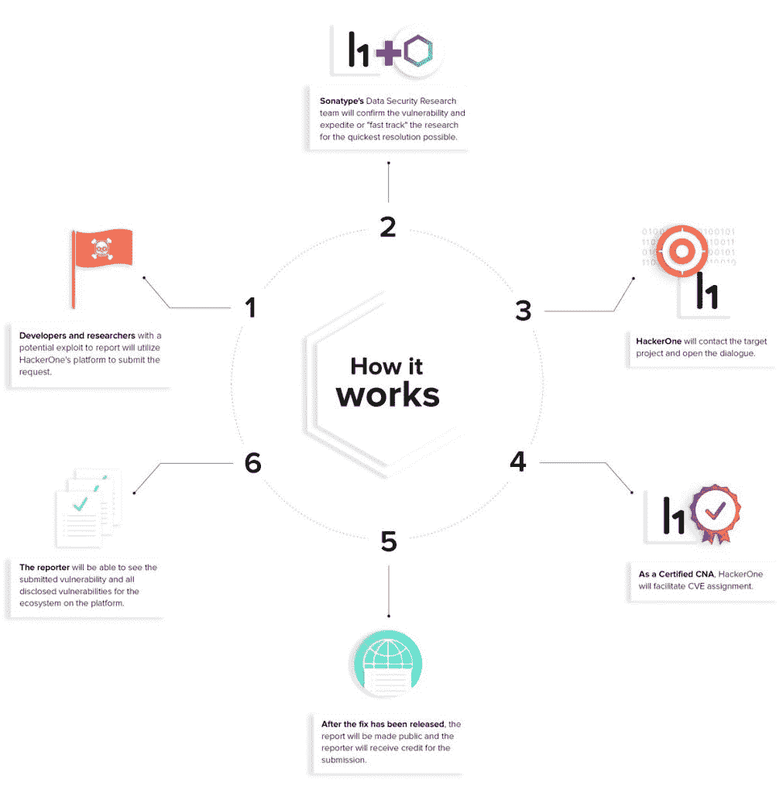

# 中央安全项目:开源 Java 的漏洞报告

> 原文：<https://thenewstack.io/the-central-security-project-vulnerability-reporting-for-open-source-java/>

当安全研究人员发现安全漏洞时，他们会怎么做？不幸的是，答案有时是他们寻找合适的人来通知，当他们找不到时，最终将漏洞发布到公共电子邮件列表、GitHub 项目甚至 Twitter 上。

这就是安全平台 [HackerOne](https://www.hackerone.com/) 和软件供应链管理工具 [Sonatype](https://www.sonatype.com/) 与[合作解决中央安全项目](https://hackerone.com/central-security-project)的问题，根据一份声明，这是一项新的努力，“将道德黑客和开源社区聚集在一起，以简化报告和解决在中央知识库中发现的漏洞的过程，中央知识库是世界上最大的开源组件集合”。

在接受 New Stack 采访时，Sonatype 联合创始人兼首席技术官 Brian Fox 解释说，新项目旨在帮助提供漏洞披露的单一方式。

“这里的想法是为发现零日漏洞并希望将其披露给项目的研究人员提供一个场所。我们想为他们创造一个去处。我们运行 Maven 中央存储库，这是任何 Java 开源组件的默认位置。有些项目会有现有的安全团队，如来自 Apache Foundation 或 Eclipse 的团队，但这些项目中的许多只是一两个人的团队，没有正式的地方私下披露漏洞，进行研究并获得 CVE 的指派，”Fox 说。“没有一个好的地方和过程来做这件事，我们已经看到研究人员举手把漏洞发布在 Twitter 或 GitHub 项目或电子邮件列表上。在这一点上，这不是一个真正负责任的披露，因为每个人在修复它之前都可以访问它。这就是我们正在努力解决的问题。”

通过这一新的合作伙伴关系，两家公司将把 Sonatype 的数据研究能力与 HackerOne 的报告平台结合起来，使漏洞能够被适当地披露给相关方，使他们有时间在向公众报告之前找到解决方案。

首先，HackerOne 将接受漏洞报告，Sonatype 将在中央存储库和 [OSS 索引](https://ossindex.sonatype.org/)内的[每个项目页面上链接到漏洞报告。当一个新的漏洞被报告时，Sonatype 将评估该报告，并在适当的时候开发一个补丁。然后，HackerOne 将直接与项目维护人员沟通，并分配一个公共漏洞和暴露(CVE)编号，其中包含一个标识号、一个描述和至少一个漏洞的公共参考。从那时起，维护者有 90 天的时间来提供修复程序，一旦漏洞被修复，“漏洞将通过 HackerOne 的黑客活动页面公开披露，报告该漏洞的人将因其“发现和提交”而受到表彰。](https://search.maven.org/)

[tomi tribe](https://www.linkedin.com/in/dblevins/)的创始人兼首席技术官 David Blevins 表示，他认为这是 Java 开源社区保护其组件的关键一步。

“我们迫切需要在开源行业集中安全报告，特别是考虑到 Github 这样鼓励去中心化的生态系统的扩散，”Blevins 说。“中央安全项目是一个重要的行业里程碑，它创建了一个可以在 GitHub 规模上运行的开源报告生态系统。”

据 Fox 报道，这个项目是否超越 Java 取决于它的成功。

福克斯说:“如果这项技术获得成功，并且对其他生态系统有持续的需求，我们可能会推出类似的东西，并将其与 OSS 指数联系起来。”“我们正努力缩小这一差距。如果您知道某个漏洞，但找不到披露它的方法，我们将充当中间人。”

由 [Alfons Morales](https://unsplash.com/photos/YLSwjSy7stw?utm_source=unsplash&utm_medium=referral&utm_content=creditCopyText) 在 [Unsplash](https://unsplash.com/search/photos/library?utm_source=unsplash&utm_medium=referral&utm_content=creditCopyText) 上拍摄的特征图像。

<svg xmlns:xlink="http://www.w3.org/1999/xlink" viewBox="0 0 68 31" version="1.1"><title>Group</title> <desc>Created with Sketch.</desc></svg>