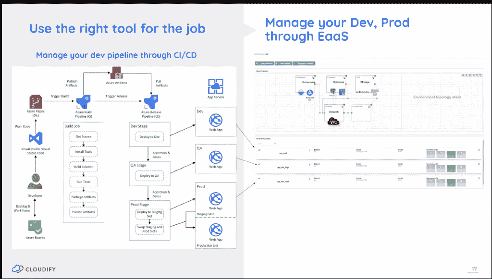
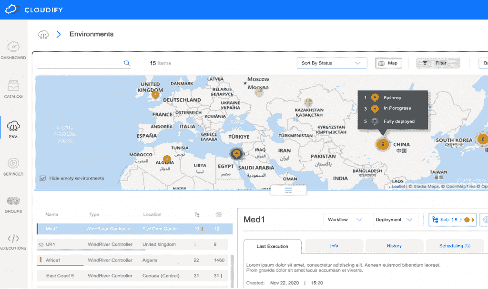

# 分布式环境中连续交付的挑战

> 原文：<https://thenewstack.io/the-challenge-of-continuous-delivery-in-distributed-environments/>

 [纳蒂·沙洛姆

纳蒂·沙洛姆是 Cloudify.io 的首席技术官和创始人，他是一位连续创业者，也是开源、多云协调、网络虚拟化、DevOps 和边缘计算领域的思想领袖和演讲者。Nati 获得了包括 YCombinator 在内的多项认可，并且是 Cloud Native 和 DevOps Israel Meetup 团体的领导者之一。](https://www.linkedin.com/in/natishalom/?originalSubdomain=il) 

许多现代软件应用程序是高度分布式的，这意味着它们同时运行在多种多样的基础设施环境中。

通常，这些高度分布式的应用程序共享地理上分散的数据。众所周知的高端用例包括电子邮件和互联网、电话和蜂窝网络、飞机控制系统、拼车调度系统，以及跟踪当地便利店库存的系统。

如今，许多基于 SaaS 的现代产品也是高度分布式的，因为它们需要确保跨全球分布的低延迟访问(如 Zoom 或网飞)，或者满足 GDPR 等法规要求，这些法规要求禁止客户数据跨越特定的地理边界。

所有这些使得分布式架构更加普遍，甚至成为主流。事实上，如今大多数 SaaS 公司跨多个站点和地区管理数据，并使用混合 SaaS 架构，其中一些服务在内部运行，一些在共享云产品中运行。

不幸的是，我们当前的大多数 [DevOps](https://thenewstack.io/category/devops/) 自动化工具都不是为支持这种分布式和混合架构而设计的，这导致许多软件公司和企业构建定制框架和流程来应对这些架构带来的特定挑战。

当您的所有 IT 基础架构都在一个地方运行时，您需要协调的移动部分比在分布式系统中要少，在分布式系统中，您可能有几十个、几百个、几千个甚至几百万个终端，您的软件需要在这些终端上正确运行。在分布式系统中，IT 运营的复杂性不仅会因终端数量的增加而成倍增加，而且还会因为一切都需要协同工作而变得更加复杂。

在分布式环境中，应用程序运行的每个物理和虚拟环境都有其自身的运营挑战，从常见到极端。例如，基础设施中的微小变化通常会导致系统偏离原始配置。甚至像安全组中的变化这样简单的事情也会造成混乱，导致以前可访问的端口没有响应。

基础设施漂移在分布式系统中比在集中式系统中更有可能，主要是因为有更多的移动部分，并且这些部分彼此独立地发展。此外，分布式系统中的每个端点都可能面临极端的挑战，例如导致大规模电力故障或物理设备或设施损坏的天气事件。

那么，当多个端点环境不断变化时，您如何管理这些环境的持续部署呢？不幸的是，这是分布式系统的现实，也是为什么部署和更新高度分布式应用程序的工作充满了潜在的失败。

## **管理大规模分布式环境的第 2 天挑战**

让我们看一个简单的例子。假设您的公司有两个办公室，一个在东部，一个在西部，每个办公室都在自己的服务器上运行您的客户关系管理(CRM)软件，以减少延迟并遵守数据主权法规。

现在假设您的 IT 团队想要将软件更新推送到 CRM 应用程序。更新需要去东方和西方。如果在东方失败了，在西方成功了会怎么样？你需要再次推送更新，但只能在东部。对于这种部分失败的情况，您需要编写一个完全不同的部署过程。

当然，上面的例子非常简单。因此，让我们将其扩展到对当今企业来说更现实的东西—多站点部署。

在这种情况下，DevOps 团队正在运行 CI/CD 管道，一个更新已准备好部署到多个地区的 10-50 个 Kubernetes 集群。CI/CD 管道中的部署过程是一个基于任务的系统，其中代码的编写和部署是基于这样一个假设，即下游的一切都在正常运行。

理想情况下，您编写任务，系统按照您指定的顺序执行任务。但是如果有些事情不正常呢？那么流程就不行了。那么，如果您部署到 10 个 Kubernetes 集群，您如何知道每个位置的更新是否成功呢？它在跑吗？是不是不跑了？哪个部分在运行？哪部分失败了？

让我们更进一步:如果这三个地方的更新失败了怎么办？如何确定失败的原因？(每个地方的原因可能不同。)有漂移吗？如果不知道，如何成功更新到一个未知状态的环境中？如何从故障点继续更新过程？你不希望不得不再次更新所有 10 个站点；您只想更新失败的三个。如果出现重大缺陷，您如何回滚？

## **由边缘优先环境驱动的复杂性**

正如您所看到的，随着现代 DevOps 团队努力快速创新，并在高度分布式系统中每天多次推送软件更新，挑战也在增加。

大多数团队对每个端点的当前环境没有足够的洞察力；因此，故障需要时间来调查，并且通常需要独特的调整和修复来处理分布式系统状态的每个变化。

这就是为什么 DevOps 工程师要做这么多手工编码的原因。工程师们发现他们必须停止正常的 CI/CD 流程，调查终端基础架构的哪个部分没有运行，然后对软件和部署代码进行手动调整以弥补这一变化。

事情是这样的:系统总会有变化。基础设施环境从来不是静态的，因此许多“连续部署”系统根本不是真正连续的。因为 DevOps 工程师并不总是知道分布式系统中每个端点环境的状态，所以 CI/CD 管道不可能具有足够的适应性。

最终，确保在分布式环境中持续部署的过程可能会极其繁重和复杂，从而减缓业务创新的步伐。

那么，DevOps 团队如何有效地管理这种高度分布式环境中的持续部署和软件更新，而不被第二天的问题淹没呢？

随着边缘优先的实现变得越来越主流，具有前瞻性思维的组织应该考虑使用更适合分布式环境的开源解决方案。

Cloudify 就是这样一个开源项目。

## **消除分布式环境中的部署复杂性**

有了开源的 [Cloudify](https://cloudify.co/) ，DevOps 的工程师们可以卸下管理分布式环境状态的复杂性。在图 1(下图)中，您可以看到管道的左半部分——一部分处理应用程序开发和测试，另一部分负责创建运行软件的环境，包括开发、测试/QA 和/或生产环境。

图一。

这是第二部分——配置和维护环境——被转移到 Cloudify。DevOps 团队简单地按照他们想要的方式设置他们的环境，然后软件持续地管理这些环境(如图 1 右半部分所示)。

## 近距离观察:CI/CD 渠道中的环境即服务

通常， [CI/CD 工作流](https://thenewstack.io/category/ci-cd/)是在假设基础架构保持其原始配置状态的情况下编写的。不幸的是，如果状态改变，工作流就会中断。这意味着用户需要不断地更新他们的工作流操作以处理状态的变化，并且如果这种更新和修订的过程需要得太频繁，整个 CI/CD 工作流变得更加手动而不是自动化，这首先违背了 CI/CD 的目的。

Cloudify 反而假设了基础设施的熵，也就是说，留给自己的设备，基础设施总是会随着时间而漂移，尤其是在高度分布式的环境中。

为了解决这个问题，它使用了一种声明性的方法，将环境状态从工作流中分离出来。环境即服务(EaaS)技术跟踪每个环境的状态以及它如何随时间变化。在每个环境中，it 都知道所有组件(计算、存储、网络)的配置方式以及它们之间的相互关系。

随着时间的推移，软件会监控和检测漂移，并提供内置的工作流程来自动修复一些常见的漂移情况。该软件将关于每个环境的当前状态的信息反馈给工作流，从而允许工作流适应变化。

此外，Cloudify 使用一种[事务工作流](https://docs.cloudify.co/latest/working_with/workflows/)机制，持续跟踪执行状态，因此可以恢复失败的工作流或触发回滚工作流。

在版本 6 中，这种机制被扩展到处理分布式环境中的批量操作。该软件可以在数百或数千个环境或站点中同时并行执行工作流，并确保成功执行这些工作流，即使在网络中断或系统某部分出现故障的情况下也是如此。

所有这些都可以在 Cloudify 的地图视图中看到(图 2)，这允许用户看到每个位置正在运行哪些服务，以及一目了然地了解整个集群的状态。

该地图可以处理数千个位置的数千个部署。此外，新的[部署视图](https://docs.cloudify.co/6.0.0/working_with/console/widgets/deploymentsview/)允许用户在地图和表格视图之间切换，并允许用户从该视图在集群上执行第 2 天工作流或部署(配置)等操作。

管理分布式工作流需要一套新的管理和监控工具，这些工具将能够提供系统状态的快速视图-

这些只是开源 Cloudify 为 SaaS 公司提供的功能中的一部分，这些公司正在寻找多站点管理和高度分布式计算的强大支持者。

## **这一切都是为了改善 DevOps 体验**

Cloudify 社区的主要目标是抽象出负担 DevOps 工程师和 IT 操作员的很大一部分复杂性；具体来说，我们试图让管理分布式系统的工作尽可能类似于运行任何其他云服务。

其想法是，DevOps 工程师应该能够将代码推入 Git，以描述他们系统的期望最终状态，卸载计算当前状态和最终状态之间的增量的工作，并做保持 CI/CD 管道快速运行所需的事情。

作为额外的好处，无论您是使用 Cloudify 为您的内部开发团队管理十几个环境，还是在高级边缘用例中管理数十亿个端点，环境即服务功能都可以同步开发运维与 IT 管理的工作，并可以帮助您的团队打破当今企业中存在的一些最大的孤岛。

<svg xmlns:xlink="http://www.w3.org/1999/xlink" viewBox="0 0 68 31" version="1.1"><title>Group</title> <desc>Created with Sketch.</desc></svg>