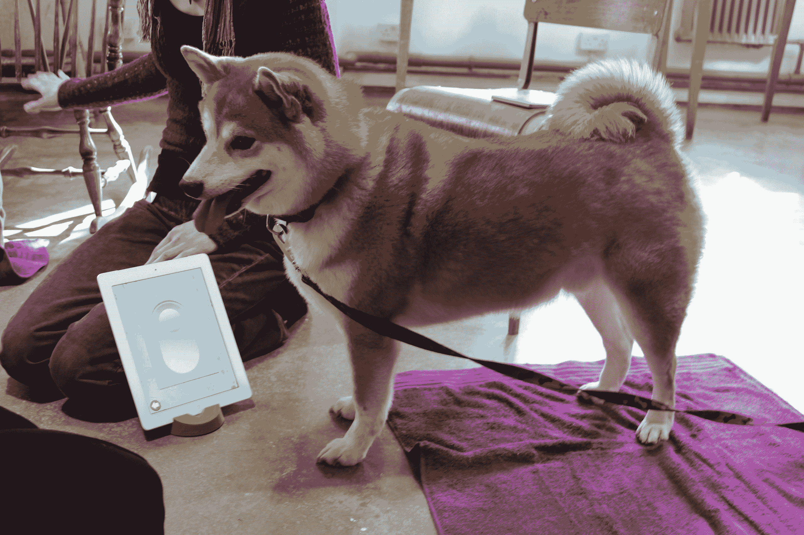
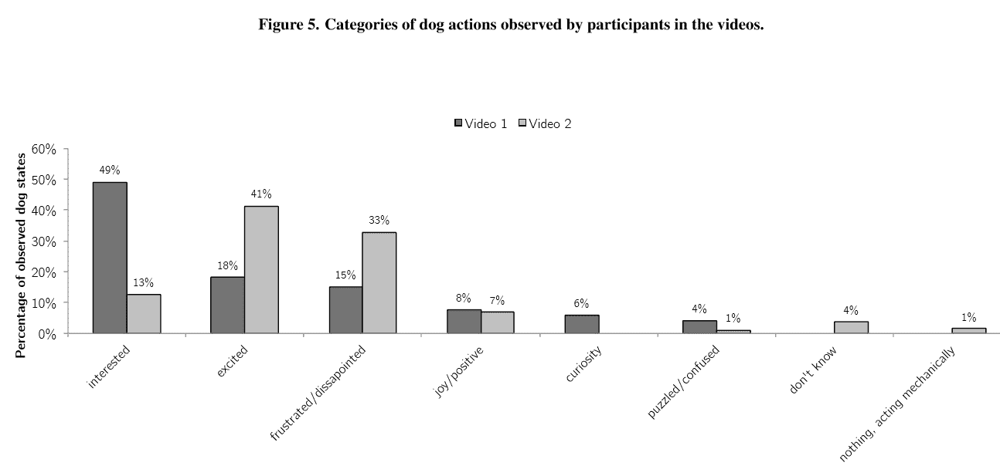

# 为猫制作视频游戏的挑战

> 原文：<https://thenewstack.io/the-challenges-of-making-video-games-for-cats/>

旧金山有一家为猫制作视频游戏的初创公司。

“猫是这个被误解的未接触游戏玩家的市场……”开发者 [Willem Deventhal](https://www.linkedin.com/in/ifyouwillem) 在接受[口袋游戏商业](https://www.pocketgamer.biz/asia/interview/73410/the-big-indie-interviews-willem-delventhal-discussing-making-award-winning-games-for-cats/)网站采访时说。但是，当他在收集数据的地方以及如何使用数据方面开拓新的领域时，这是对我们人类创造力的证明吗？还是仅仅证明了我们的狂妄自大？

有一点很清楚。他不为人知的故事为当今年轻开发者的希望和梦想提供了一个全新的视角…

[https://www.youtube.com/embed/seyH_fX0vr0?feature=oembed](https://www.youtube.com/embed/seyH_fX0vr0?feature=oembed)

视频

## **自由成为“Mew 和 Me”**

"你有没有因为把你的猫一个人留在家里而感到难过？"向 Google 的 Play Store 页面询问 [*Mew 和 Me*](https://play.google.com/store/apps/details?id=mam.mewandme.mewandme) ，回答“我们也是！”

但是有一个应用程序可以做到这一点——它可以在平板电脑或智能手机上运行一整天。“这是唯一一款当你不在家的时候还会开着的游戏，”喵和我网站解释道，“这也是第一款追踪你的宠物使用情况的游戏，可以让你知道它们在做什么！”

在游戏开发者大会上，当 Deventhal 向观众展示他的第一个“用户测试者”——他的猫 Fez 时，引起了一片笑声。"迄今为止，它是我测试过的最不投入的猫之一."

近四年来，威廉一直是大脑训练应用公司 Lumosity 的软件工程师。“2018 年 8 月 3 日，我走出了一份很安逸的工作的大门，开始了自己的创业。”

威廉告诉我，创世纪是一个周末极客项目，为他的猫菲斯创造自制玩具。“基本上，我从亚马逊买了一些便宜的电动猫玩具，并在里面焊接了电线，这样它们就可以用墙上的电源运行了。然后我有了一个可以远程控制的智能插头……然后，我就有了智能猫玩具。”

“菲斯一开始真的很喜欢它们，”威廉告诉我，但是“他很快就厌倦了它们。这也是我转行做游戏的原因之一。随着时间的推移，我可以提供新的和不同的游戏体验，而不是拥有一个永不改变的硬件！”

因此，他开始创作在平板电脑上运行的游戏，这些游戏可能会吸引猫。

他进行了“用户测试”——当然是在猫咖啡馆——但发现猫甚至似乎对它们喜欢的游戏意见不一。很快，他甚至了解到猫是半色盲，近距离观察视力很差。

但是当有人问成年猫是否比小猫更擅长游戏时，他现在有了明确的答案。“不……我们发现，相当普遍的情况是，成年猫充其量只会坐着看。”

“我猜想这与可塑性有关。“基本上，猫在一年半的时间里就基本上建立了自己的个性，所以如果它们在一年半内没有体验过平板电脑和‘这是一个有趣的玩具’，可能在以后的生活中也不会学到。”

那么实验在哪里结束呢？“你和大猫试过吗？”

“不……我们需要一些大平板电脑。”

当然，他演讲中最精彩的部分是猫玩游戏的片段。

## **挑剔的猫科动物**

但最终，开发者能做的也就这么多了。Deventhal 告诉《洛杉矶时报》， [30%的小猫会玩这个游戏](https://www.latimes.com/entertainment-arts/story/2020-05-08/what-your-cat-can-teach-you-about-game-design)。或者 50%——如果它们的主人鼓励它们这么做的话。

但当它起作用时，它是美妙的。“我们有很多人说他们的猫现在爱上了他们的平板电脑，”威廉告诉我，“每当人类试图使用它时，猫就会打断他们！”(当然，有些猫还是会这样做……)

但是有人抱怨过他们的猫刮花了他们 iPad 的屏幕吗？

“其实没有！我们总是建议人们购买屏幕保护器和一个好的外壳，但似乎大多数猫都不会弄坏大多数平板电脑。”

如果不止一只猫呢？他们会为谁能追逐虚拟猎物而争斗吗？

“猫似乎在一起玩得很好！我从未见过因服用药片而导致的攻击行为。通常多只猫会坐着看，而一只攻击！”

Willem 是核心团队的一员，核心团队包括联合创始人 Olivia Dudo 和两名董事会成员(Frank Connolly 和 Donna Morton)。作为对疫情的回应，所有的游戏现在都是免费的。在 Android play 商店的 10 个评论中，它的平均评分为 4.6 星。(尽管一个三星评论抱怨说“应该有一个选项来减少 bug 游戏中的 bug 数量，因为我正在手机上使用它，bug 几乎覆盖了屏幕，我的猫被淹没了”)

一个五星评论滔滔不绝地说“我的小猫绝对喜欢这个…它真的让他着迷。”

《泰晤士报》的游戏评论家托德·马腾斯(Todd Martens)用他 8 岁大的猫斯雷特(Sleater)试过。[结果](https://twitter.com/Toddmartens/status/1258776999742431232)？“她不感兴趣。”

Mew 和 Me 并不是唯一一家与宠物分享个人技术的公司。纽约州的“狗的学校”提供一门 300 美元的课程，T2 用你的 iPad 或 iPhone 训练你的狗，“帮助狗学习如何使用触摸屏设备区分形状、颜色和数字。”(这也有助于你决定狗狗更喜欢用鼻子还是爪子戳屏幕。)

但是 Mew 和我有更大的野心。“我们看到我们自己正在成为世界智能宠物市场，”他们的网站说，戏弄你遥控的猫游戏和“实体”玩具(猫和狗都有)的计划。《泰晤士报》还报道称，他希望为猫创建一个更大的生活方式品牌。

## **捕捉猫数据**

但是数据呢？Mew and Me 网站将该公司描述为“第一个大规模关注宠物行为数据的集团”，并承诺“我们将宠物的数据放在你的指尖，给你一种新的方式来理解它们。”(尽管大部分数据是你的猫爪接触屏幕的地方。)“我们正在接近 30 万次单独的猫点击！”威廉告诉我。“每当猫触碰我们的设备时，我们都会记录下一个‘反应’

“这个响应包含了关于这种敲击的所有信息，从敲击发生的时间到猫爪下的颜色，再到它们在玩什么游戏。”

该网站还分享了他们“有意识地”使用这些猫数据的哲学威廉试图向我解释:

我们希望为我们的猫朋友建立同理心！这样做的第一步就是给我们的用户提供他们以前没有的关于他们的猫的有趣信息。比如他们的游戏时间表，或者他们的猫的咕噜声，一个注册商标的 Mew 和 Me 设计。这些趣闻慢慢地让人们从仅仅把他们的宠物当成一只宠物，转变为把他们的宠物当成家里的另一个人，有思想、有感觉、有情感。我们正在建立同理心，从而帮助这个世界。

“Mew 和我”网站谈到“给你一个你以前没有的了解他们一天的窗口。”

在他的推特个人资料上， Delventhal 称自己为“二级爱情战士”

呃，好吧，但是我们了解猫吗？

我们可以学习各种各样的东西！我们仅仅触及了表面。我们可以得到猫的时间表，什么样的刺激让它们兴奋，它们对焦虑等事情的估计水平，它们在某个空间的总体舒适度，等等！

但是展望未来，威廉的野心更大。“我们正在与科学组织合作，研究我们的数据和猫的种类。我们已经启动了我们的第一项科学研究，由委员会认证的兽医行为学家负责！”

《纽约时报》的文章在 Twitter 上引起了一位动物计算机交互博士的有趣的[回应。帕特里夏·庞斯写道:“我们应该非常小心我们给我们的动物使用什么样的技术，”并补充说，“并不是所有让它们分心的东西都是好的，有这么多动物行为学和福祉的影响……总的来说，它应该得到高质量研究的支持。”](https://twitter.com/patrypons/status/1262403540238176256)

德克·范德林登(Dirk van der Linden)也参与了进来，他告诉我，他是[一个研究小组](http://www.tech4animals.org)的成员，该小组分析来自动物行为实验的数据(以及动物福利监测“以及人工智能和数据科学对动物数据的其他应用”))

他们最近的一篇论文总结了一系列惊人丰富的研究。(" [Wirman 等人](http://www.hannawirman.net/wirman_digra2011_abstract.pdf)讨论了为猩猩设计基于触摸屏的游戏所面临的挑战……")一位[罗马的训狗师](http://www.cani-da-assistenza.it/)甚至告诉研究人员，她正在使用平板电脑来开发她饲养的小狗的认知能力，这些小狗是服务犬。

范德林登告诉我，他们实际上深入研究了宠物主人对宠物玩平板电脑的感受。他们让 276 人观看狗与平板电脑互动的视频，并描述其行为。(虽然至少他们中的一些人回答说，“我不确定狗在做什么。”)一些人担心狗狗会感到沮丧或过于兴奋，或者担心屏幕可能对狗狗的眼睛有害。有些人用了“不自然”这个词。

尽管他们的研究主要集中在狗身上，“该研究的初步结果表明，在宠物在平板电脑上玩游戏的情况下，主人认为他们的宠物在狩猎、挖掘或展示其他行为，就像实际认为他们在‘玩’一样。”"

“事实上，许多宠物主人对这些互动(无论是玩耍还是其他)是否有益于他们的宠物持相当消极的看法，”范德林登告诉我。(尽管该论文后来警告称，“对狗和平板电脑互动的既有观点可能会影响一个人的判断。”)

公平地说，研究论文还假设平板电脑可以给狗带来锻炼和认知刺激——但范德林登说这并不是全部情况。“在此基础上，我们得出的结论是‘动物与技术的嬉戏互动具有潜在的危险，正如我们的探索性研究结果所示，宠物主人和专业人士对这些互动的看法不一。’"

该报告得出结论说，寻找和制造动物刺激物“释放适当的玩耍行为”是“极具挑战性的”

我问威廉是否有学术研究表明猫从玩电子游戏中受益。但显然，没有人真正研究过这个问题。“这就是我们这么做的原因！”

*目前，我们已经就这个问题咨询了两位不同的兽医行为学家，Mikel Delgado 博士和 Karen Sueda 博士。他们都认为我们的应用程序很像家里的另一扇窗户。在最坏的情况下，猫在他们的环境中有一些新的东西要看。充其量，猫有一个新的，互动的，精神刺激的经验！*

他告诉 Pocket Gamer Biz，它现在注册为加州公共福利公司。“我们跟踪你的宠物所做的一切，并与科学组织合作，研究猫的行为。我们已经是世界上最大的猫行为数据中心之一，并梦想利用这些数据来提升我们的国家和我们的星球。

“我们都相信丹尼·斯科特的这句名言:‘衡量一个文明的标准是它如何对待其最弱小的成员。’"

* * *

# WebReduce

<svg xmlns:xlink="http://www.w3.org/1999/xlink" viewBox="0 0 68 31" version="1.1"><title>Group</title> <desc>Created with Sketch.</desc></svg>