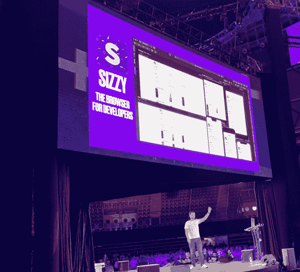

# 营销软件工具对开发者的挑战

> 原文：<https://thenewstack.io/the-challenges-of-marketing-software-tools-to-developers/>

Sizzy 被定位为“网络开发者的浏览器”，它的创建者，一个马其顿开发者，简称为 [Kitze](https://twitter.com/thekitze) ，希望将它变成一个繁荣的业务。目前，该产品可以免费试用 14 天，但之后，你需要注册每月订阅(个人每月 15 美元)。

在最近于克罗地亚举行的 [Infobip Shift](https://shift.infobip.com/) 开发者大会上，Kitze 是开场主题发言人，他讲述了自己为通过向开发者销售软件谋生而奋斗的经历。他并不只是对此感到悲伤；他非常生气(见本文精选图片)。

在 Kitze 的演讲结束后，我采访了他，想知道 Sizzy 是什么，以及为什么他觉得推广它如此困难。

## Sizzy:这对开发者有什么好处？

每月 15 美元的订阅听起来很合理，但是对于一个自由开发人员来说，当你把它加起来超过一年时，这是一个不小的数目——更不用说第二年等等。由于 Kitze 显然是一名开发人员，我问他为什么要建造它，它提供了什么工作开发？

“所以这是从我对调整浏览器大小的失望开始的，”他回答道。“这是最大的特点；我使用谷歌 Chrome 进行响应式设计，我不得不在多种设备之间切换，以检查它是否适用于 iPhone、iPad、[另一个]平板电脑、这个和那个。我当时就想，为什么不干脆用几个 iframes 做一个[web]页面，在那里我可以打开 localhost:3000，我可以在多台设备上看到它。”

Sizzy 的最初版本是一个 Chrome 扩展，实现了这个功能。何[于 2017 年 4 月推出了它](https://medium.com/@kitze/introducing-sizzy-a-tool-for-developing-responsive-websites-crazy-fast-39a8c0061992)，作为“快速开发响应网站”的工具。

然而，到 2019 年 7 月，他得出了“GitHub stars 不会支付你的租金”的结论，因此他重新设计并[重新推出了产品](https://medium.com/@kitze/github-stars-wont-pay-your-rent-8b348e12baed)作为一个全功能浏览器(使用谷歌的开源 Chromium 项目构建)。

Kitze 在 Infobip Shift 2022 的舞台上

新版的 Sizzy 有一个价格标签；但是，根据 Kitze 的说法，它也为开发商带来了额外的好处。

“任何时候你打开 localhost，而不是在谷歌 Chrome 中打开——它隐藏了开发工具，所有东西都隐藏在某个东西后面——[Sizzy 是]一个工具，作为开发人员，你需要的所有东西都在那里。”

他还说，Sizzy 提供了“比谷歌 Chrome 更准确的模拟，因为在谷歌 Chrome 中，他们只给你显示一个框架。”

他补充说，能够在同一个浏览器窗口登录不同的用户账户是 Sizzy 拥有的另一个“普通浏览器”没有的功能。

尽管 Kitze 对 Chrome 感到失望，但 Sizzy 是建立在同一个代码基础之上的:Chrome。所以它提供了 Chromium 开发工具，包括 Chromium Inspector。虽然 Kitze 补充说，“它是在路线图上建立我们自己的开发工具和我们自己的检查员，但现在你可以拥有完全相同的开发工具。”

他告诉我，从开发工具的角度来看，Sizzy 和 Chrome 的主要区别在于，Sizzy 有一个“通用检查元素”。

“因此，当你进入 Inspect Element 并将鼠标悬停在多个设备上时，你可以获得任何元素的信息，如果你单击任何元素，它会将你带到该设备的开发工具，”他说。

## 软件订购的忧郁

Kitze 现在的问题很大一部分是，Sizzy 一开始是一个免费产品——当一个他们上瘾的免费产品试图向他们收费时，用户永远不会喜欢它。尤其是如果他们工作依赖于该工具的话。

Sizzy 在他的 Infobip Shift 演示中表示，当他将新产品作为订阅服务推出时，他从用户那里收到了很多回扣。从 Reddit 帖子来看，部分负面反馈是开发者不喜欢订阅模式；他们宁愿只为产品支付一次费用。

Sizzy 的另一个问题是，帮助开发人员进行响应式设计的基于浏览器的产品存在很多竞争。 [CSS-Tricks 回顾了几年前包括 Sizzy 在内的一群人，它选择了 Polypane，这是另一个订阅服务。](https://css-tricks.com/comparing-browsers-for-responsive-design/)

也许 Kitze 最大的问题是，他在他的重新启动帖子中提到，他有许多兼职项目，还经常在技术会议上巡回。正如我在 Infobip Shift 活动上目睹的那样，Kitze 是一位非常有才华的演示者——他让我想起了美国企业家和媒体人加里·维纳查克。Kitze 不仅看起来像@garyvee，他也有同样富有弹性的魅力。

对我来说，很明显 Kitze 在互联网上获得关注没有问题——他有超过 29，000 名 Twitter 粉丝——所以我问他为什么这对他的热门业务没有帮助？

“因为我们试图改变(开发商)的想法，”他说。“人们最古老的习惯是使用浏览器[……]，我们正试图与免费浏览器竞争。”

他似乎也夹在两个极端之间。他告诉我，他要么想用 Sizzy 做一些真正大的东西——他提到了微软的 VS 代码作为灵感——要么它将仍然是一个次要项目。

最终，虽然我同情 Kitze 想从他的软件创作中谋生的愿望，但他面临着我们其他人在互联网上赚钱时所面临的同样挑战:证明所有替代品的价值，包括免费的。软件领域的赢家通常是那些做了其他产品做不到的事情的产品(见图玛或 T2)。如果 Kitze 认为 Sizzy 确实为开发者提供了一些独特的价值，他需要把这作为他营销的核心。

*披露:Infobip 付钱让 Richard MacManus 去克罗地亚参加 Infobip 的轮班会议。*

<svg xmlns:xlink="http://www.w3.org/1999/xlink" viewBox="0 0 68 31" version="1.1"><title>Group</title> <desc>Created with Sketch.</desc></svg>