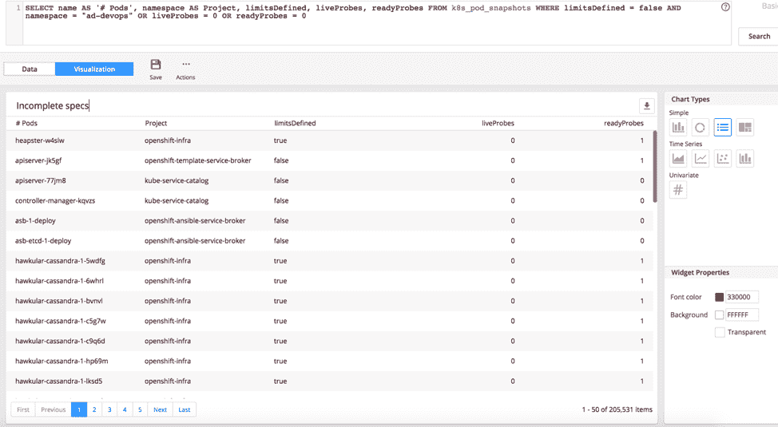

# 监控 Kubernetes 和 OpenShift 的挑战

> 原文：<https://thenewstack.io/the-challenges-of-monitoring-kubernetes-and-openshift/>

[](https://www.appdynamics.com/)

[Sasha Jeltuhin](https://www.appdynamics.com/)

[Sasha 是 AppDynamics 的技术销售支持经理，负责帮助内部销售和合作伙伴在混合云和容器技术的背景下更好地利用 AppDynamics 产品。在加入 AppDynamics 之前，Sasha 曾在许多构建高交易量 SaaS 平台的初创公司担任 CTO。Sasha 还受邀在各种技术活动中发言，包括多个 Gartner 会议。](https://www.appdynamics.com/)

[](https://www.appdynamics.com/)[](https://www.appdynamics.com/)

像许多组织一样，我们也将 Kubernetes 作为我们许多应用程序的部署平台。我们既使用上游的 Kubernetes 又使用 [OpenShift](https://www.openshift.com/) ，这是 Kubernetes 的一个企业级发行版。Kubernetes 框架非常强大。它允许大规模部署，简化新版本的推出和多变体测试，并提供许多杠杆来微调开发和部署过程。

Kubernetes 和 OpenShift 功能强大且灵活。它们的设置、监控和维护也很复杂。下面先睹为快，看看我们在 OpenShift 中监控的内容，以及一些来之不易的建议，告诉我们的策略如何让您的环境受益。

同时，这种灵活性使得 [Kubernetes](https://kubernetes.io/) 在大规模设置、监控和维护方面变得复杂。Kubernetes 的每个核心组件(api-server、kube-controller-manager、kubelet、kube-scheduler)都有相当多的标志来控制集群的行为和执行。对于较小的集群，默认值最初可能还可以，但是随着部署规模的扩大，必须进行一些调整。在监控 OpenShift 集群时，我们已经学会了将这些价值观牢记在心——无论是从我们自己的痛苦中，还是从其他经历了自己令人毛骨悚然的发现的社区成员的公开陈述中。

我们公司的演示平台是第一批迁移到 Kubernetes 的技术资产之一。尽管名称中有“演示”一词，但它是一个具有 24/7 可用性要求的关键平台。由于平台上部署了 30 多个应用程序实例，这些应用程序非常复杂，并且在不断发展。

每个应用程序都包含至少十几个采用各种技术构建的微服务，并提供各种功能。举个例子，我们的一个比较成熟的应用依赖于 3 DB 后端(Oracle、MySql 和 Mongo)、Kafka 队列、Java 遗留组件以及在 go 和 Node 中开发的几个微服务。仅今年一年，就有超过 1400 万行代码被修改。

转向 Kubernetes 让我们认识到了容器管理解决方案提供的所有主要优势:

1.  我们开发得更快:我们不需要花时间开发已经内置到 Kubernetes 中的基础设施组件；
2.  我们更频繁地部署，因为 Kubernetes 使它变得容易。仅今年一年，我们就经历了 30 次重大升级。易于部署也有助于我们在更新和问题解决上花费更少的时间。快速的测试周期允许我们交付更高质量的代码:自从转移到 Kubernetes，Sev1 问题的数量下降了 80 %;
3.  我们降低了运营成本:随着容器化部署密度的提高，我们使用的虚拟机数量减少，我们的云支出也减少了。我们还利用蓝绿色部署的便利性来维护平台的高可用性。

在本文中，我们将分享我们在 OpenShift 集群中监控的内容，并就我们的策略如何与您自己的环境相关给出建议。

## 我们监控什么，为什么

### 集群节点

在基础级别，我们希望监控操作员能够密切关注部署集群的节点的健康状况。通常，您会有一个 masters 集群，其中包含核心 Kubernetes 组件(api-server、控制器-管理器、kube-schedule 等。)部署了一个高度可用的 etcd 集群和许多用于来宾应用程序的工作节点。为了描绘一幅完整的画面，我们将基础设施运行状况指标与我们的 Kubernetes 数据收集器收集的相关集群数据结合起来。

从基础设施的角度来看，我们跟踪所有节点上的 CPU、内存和磁盘利用率，并放大 etcd 上的网络流量。为了发现瓶颈，我们在粒度级别查看流量的各个方面(例如，读/写和吞吐量)。Kubernetes 和 OpenShift 集群可能会遇到内存不足、磁盘日志溢出或 API 服务器消耗高峰等问题。

具有讽刺意味的是，监控解决方案通常会从 Kubernetes APIs 中提取过多的信息，从而导致集群崩溃。确定多少监控是足够的，并在必要时增加监控以进一步诊断问题，这始终是一个好主意。如果需要高级别的监控，您可能需要添加更多的主节点和 etcd 节点。另一个有用的技术，特别是在大规模实现中，是拥有一个单独的 etcd 集群来存储 Kubernetes 事件。这样，用于监控目的的事件创建和事件检索中的峰值不会影响主要 etcd 实例的性能。这可以通过设置 api-server 的*–etcd-servers-overrides*标志来实现，例如:

```
--etcd-servers-overrides  =/events#https://etcd1.cluster.com:2379;https://etcd2\. cluster.com:2379;https://etcd3\. cluster.com:2379

```

从集群的角度来看，我们监控允许 pod 调度的节点的资源利用率。我们还跟踪 pod 计数，并直观显示每个节点部署了多少个 pod，以及其中有多少是坏的(失败/被驱逐)。

*结合了基础设施和集群指标的仪表板小部件。*


为什么这很重要？Kubelet 是负责管理给定节点上的 pod 的组件，它有一个设置*–max-pods*，该设置决定了可以编排的 pod 的最大数量。在 Kubernetes 中，默认值是 110。在 OpenShift 中是 250。该值可以根据需要调高或调低。我们希望看到每个节点上的剩余空间，这有助于主动进行资源规划，并防止突然溢出(这可能意味着停机)。我们添加的另一个数据点是每个节点被驱逐的 pod 数量。

### Pod 驱逐

驱逐是由空间或内存不足引起的。由于日志失控，我们最近在一个工作节点上遇到了磁盘空间问题。结果，库伯莱特从那个节点制造了大量的分离舱。驱逐是有害的，原因有很多。它们通常会影响服务质量，甚至可能导致服务中断。如果被逐出的单元与面临磁盘压力的节点具有排他性关联，并且因此无法在集群中的其他地方重新协调，则逐出将导致中断。驱逐核心组件可能会导致集群的崩溃。

在豆荚被驱逐的事件发生后很久，我们看到被驱逐的豆荚仍然挥之不去。为什么会这样？驱逐的垃圾收集由 kube-controller-manager 中名为*–terminated-pod-GC-threshold 的设置控制。*默认值设置为 12，500，这意味着垃圾收集不会发生，直到您有那么多被驱逐的 pod。即使在大型实现中，将这个阈值调低到一个较小的数字也是一个好主意。

如果您经历了很多驱逐，您可能还想检查 kube-scheduler 是否有一个自定义的*–策略配置文件*，没有定义*checknodemorypression*或 *CheckNodeDiskPressure* 谓词。

在我们最近的事件之后，我们设置了一个新的仪表板小部件，用于跟踪可能导致集群崩溃的任何威胁的指标(例如，大规模驱逐)。我们还将一个健康规则与这个指标相关联，并设置了一个警报。具体来说，我们现在正在寻找警告事件，这些事件告诉我们某个节点将要经历内存或磁盘压力，并且无法重新分配 pod(例如，*nodehasdiskpression*，*nodehasmemorypression*，*ErrorReconciliationRetryTimeout*，*excededgraceperiod*， *EvictionThresholdMet* )。


我们还会查找失败的守护程序 pod 故障(failed daemon pod)，因为它们通常与集群运行状况有关，而不是守护程序集应用程序本身的问题。

### Pod 问题

Pod 崩溃是一个明显的监控目标，但我们也对跟踪 pod 死亡感兴趣。为什么有人要杀一个豆荚？这可能有充分的理由，但也可能表明应用程序有问题。出于类似的原因，我们通过检查 ScalingReplicaSet 事件来跟踪部署缩减。我们还希望将规模缩减趋势与应用健康状态可视化。缩小可能是通过设计实现的，例如，当应用程序负载减少时自动缩放。它们也可能是手动错误地发出的，并使应用程序承受过重的负载。

挂起状态应该是 pod 生命周期中相对较短的一个阶段，但有时并非如此。跟踪挂起时间超过某个合理阈值(例如一分钟)的 pod 可能是个好主意。更好的是，如果您能够像这样确定度量的基线，并跟踪基线的偏差。如果您捕捉到挂起状态持续时间的峰值，首先要检查的是图像的大小和图像下载的速度。一个大图可能会堵塞管道，影响其他容器。Kubelet 有这个标志，**—***serialize-image-pulls*，默认设置为 *true* 。这意味着图像将一次加载一个。如果您想要并行加载图像，并避免因图像过大而造成的潜在堵塞，请将标志更改为 *false* 。然而，请记住，你必须使用 Docker 的 *overlay2* 存储驱动程序来完成这项工作。在较新的 Docker 版本中，这是默认设置。除了 Kubelet 设置之外，您可能还需要调整 Docker 守护进程的*max-concurrent-downloads*标志，以确保所需的并行性。

需要很长时间下载的大型映像也可能导致不同类型的问题，从而导致部署失败。Kubelet 标志*–image-pull-progress-deadline*确定图像被视为“太长而无法提取”的时间点如果你处理大的图像，确保你调高标志的值以适应你的需要。

## 用户错误

集群中的许多大问题都源于用户的小错误(人为错误)。规范中的一个输入错误——例如，映像名称中的输入错误——可能会导致整个部署停止。由于缺少图像或没有足够的注册表权限，也可能会出现类似的效果。考虑到这一点，我们密切跟踪图像错误，并注意过度的图像拉伸。除非确实需要，否则为了节省带宽和加快部署，您应该避免映像提取。

由于规格错误、缺乏权限或策略冲突，也容易出现存储问题。我们监控存储问题(例如安装问题)，因为它们可能会导致崩溃。我们还密切关注资源配额违规，因为它们不会触发 pod 故障。但是，它们会阻止新部署的启动和现有部署的扩展。


说到配额违规，您是否在部署规范中设置了资源限制？

### 监管集群

在我们的 OpenShift 仪表盘上，我们显示了一个潜在危险信号列表，这些危险信号不一定是问题，但可能会导致严重的问题。其中包括部署规范中没有资源限制或健康探测器的 pod。


资源限制可以通过跨整个群集的资源配额来实施，也可以在更精细的级别实施。违反这些限制将会阻止部署。在没有配额的情况下，可以在没有定义的资源限制的情况下部署 pod。由于多种原因，没有资源限制是不好的。这使得集群容量规划极具挑战性。这也可能导致断电。如果在没有限制的活动 pod 存在时创建或更改资源配额，则这些 pod 的任何后续扩展或重新部署都将导致失败。

健康探测(就绪性和活性)是不可执行的，但最好在规范中定义它们。它们是 pods 告诉 kubelet 应用程序是否准备好接受流量以及它是否仍在运行的主要机制。如果未定义就绪探测器，并且 pod 需要很长时间来初始化(基于 kubelet 的默认值)，pod 将重新启动。这种循环可能会持续一段时间，无缘无故地占用集群资源，从而导致用户体验不佳或停机。

如果应用程序正在执行一个很长的操作，并且 pod 在 Kubelet 看来没有响应，那么缺少活跃度探测可能会导致类似的效果。



我们提供了对不完整规格的 pods 列表的简单访问，允许集群管理员与开发团队就纠正措施进行有针对性的对话。

### 路由和端点跟踪

作为 OpenShift 监控的一部分，我们提供了对潜在路由和服务端点问题的可见性。我们跟踪未使用的服务，包括那些由某人错误创建的服务，以及那些因为 pod 失败或被移除而没有任何 pod 的服务。


我们还监控指向旧的(已删除的)pod 的不良端点，这实际上会导致停机。当群集负载增加且 API 请求限制低于需要时，滚动更新期间可能会出现此问题。要解决该问题，您可能需要增加*kube-controller-manager*的**--**-*-kube-API-burst*和*-kube-API-QPS*配置值。

## 应用程序监控

背景在我们的监控理念中扮演着重要的角色。我们总是从最终用户体验和预期业务成果的角度来看待应用性能。与专门的集群监控工具不同，我们不仅对集群健康和正常运行时间本身感兴趣。我们同样关注集群可能对应用程序运行状况以及随后对应用程序业务目标的影响。

除了拥有一个集群级别的仪表板，我们还构建了一个更加以应用程序为中心的专业仪表板。在这里，我们将集群事件和异常与应用程序或组件可用性、真实用户监控报告的最终用户体验以及业务指标(例如，特定用户群的转换)相关联。


### 利用 K8s 元数据

Kubernetes 使运行金丝雀部署、蓝绿色部署和 A/B 或多变量测试变得非常简单。我们通过提取部署元数据并使用标签并排分析不同版本的性能来利用这些便利。


通过将这些不同的数据集放在一个保护伞下，APM 解决方案应该为不同的运营商群体建立一个共同的基础。一方面，您有集群管理员，他们是 Kubernetes 的专家，但可能不了解客户应用程序的细节。另一方面，您有负责 APM 的开发人员或查看业务指标的经理，这两个人可能都不太熟悉 Kubernetes。

合适的解决方案允许这些小组进行富有成效的监控对话，使用每个人都很好理解的术语和单一工具来检查共享控制面板上的数据点。AppDynamics 提供了一个统一的监控平台，围绕业务事务(即应用程序中面向用户的功能)进行对话。有了这个共同的起点，对话就更有成效，我们能够使用 Kubernetes/ OpenShift 等各种系统的具体指标，将它们的性能与我们的用户体验快速关联起来。

<svg xmlns:xlink="http://www.w3.org/1999/xlink" viewBox="0 0 68 31" version="1.1"><title>Group</title> <desc>Created with Sketch.</desc></svg>