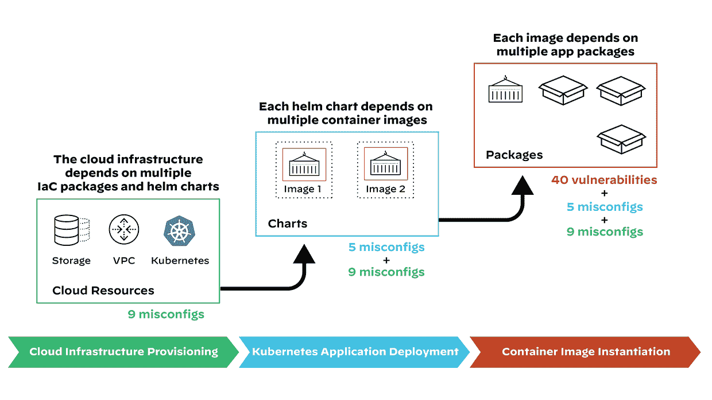

# 保护开源供应链的挑战

> 原文：<https://thenewstack.io/the-challenges-of-securing-the-open-source-supply-chain/>

随着组织将更多的资源转移到云，一些安全风险也在增加:错误配置和云供应链不安全。

来自[网络安全管理软件产品](https://thenewstack.io/solarwinds-hack-reveals-3-overlooked-steps-to-securing-a-software-supply-chain/)和 [Kaseya](https://thenewstack.io/kaseya-sera-whatever-will-be-will-be/) 的受感染 IT 管理软件导致的漏洞是最近供应链不安全的最臭名昭著的例子。但用于构建云基础设施的代码链正面临越来越大的风险，这推动了安全性的左移。

开源软件可能是这个链条中一个薄弱的安全环节。根据 Sonatype[在 9 月](https://www.sonatype.com/?utm_content=inline-mention)发布的一份[报告，随着威胁行为者沿着链向上游渗透开源软件，“下一代”软件供应链攻击在过去一年上升了 650%。](https://www.sonatype.com/resources/state-of-the-software-supply-chain-2021)

这些攻击更容易扩展，让网络罪犯在整个供应链中分发恶意软件，造成最大的破坏。

在关于供应链风险的讨论中经常被忽视的是，“攻击者不一定会修改源代码库来帮助这些违规行为，”正如帕洛阿尔托网络公司 Prisma Cloud 的副总裁兼首席安全官 Matthew chio di 在该公司的 Unit 42 威胁研究团队 9 月份的一份报告中所写的那样。

“他们没有必要，”他补充道。"他们发现软件开发管道中的弱点并攻击它们."

Chiodi 领导的团队创建了这份报告，他明确表示开源不是问题。

“事实上，在我看来，使用开源是创新的一个要求，”他说。“任何说他们的公司不能使用开源的人应该另谋高就，因为从创新的角度来看，他们正在决定他们公司的命运。”

几乎所有现代[云原生](https://thenewstack.io/category/cloud-native/)应用都是使用开源组件开发的，包括几乎任何软件即服务(SaaS)平台。问题是，没有人负责维护或保护这些代码。

“每天都有许多新的云功能和服务推出，包括 SaaS 应用，”Chiodi 告诉 New Stack。“然而，这些应用程序中使用的一些流行的开源模块已经多年没有更新了。这就是问题的症结所在。”

## 开源中的漏洞

Unit 42 报告是由[云本地计算基金会(CNCF)](https://cncf.io/?utm_content=inline-mention) 关于[软件供应链最佳实践的白皮书](https://github.com/cncf/tag-security/blob/main/supply-chain-security/supply-chain-security-paper/CNCF_SSCP_v1.pdf)引发的。该论文的合著者[安德烈斯·维加](https://www.linkedin.com/in/avegaarias/)说，他是安全 SIG 的 CNCF 技术负责人，也是安全技术咨询小组的成员。

在其自己的研究中，Palo Alto Networks Unit 42 团队发现，用于构建云基础架构的 63%的第三方代码模板包含不安全的配置，部署在云基础架构中的 96%的第三方容器应用程序包含已知的漏洞。

“积极应对这些威胁至关重要，”奇奥迪写道。

大多数现代云原生应用程序都是使用基础设施即代码(IaC)开发的，并且部署了多个不同的组件。Chiodi 指出，这个过程依赖于多个 IaC 包和典型的 [Helm](https://helm.sh/) charts，一个用于 [Kubernetes](https://thenewstack.io/category/kubernetes/) 应用程序的包管理器。

The chain of dependencies in a modern cloud native application. (Image courtesy of Prisma Cloud by Palo Alto Networks Unit 42’s “Cloud Threat Report 2H 2021.”)

每个 Helm chart 又依赖于多个容器映像，而每个映像又依赖于多个应用程序包。

“换句话说，开发者可能引入的每个模块都依赖于其他模块，所以存在这种依赖链，”Chiodi 说，他负责大多数安全问题。

Chiodi 告诉新的堆栈，依赖关系的数量和更高的错误配置的可能性之间有直接的关联。例如，对于容器映像的 1 到 20 个依赖包，平均有 22 个漏洞，而对于 100 个以上的依赖包，这个数字会增加到平均 515 个漏洞。

Unit 42 团队使用 [Bridgecrew](https://bridgecrew.io/?utm_content=inline-mention) 的静态分析工具 [Checkov](https://github.com/bridgecrewio/checkov) ，帮助识别 IaC 框架中的错误配置，来分析流行的公共容器注册中的 [Terraform](https://github.com/hashicorp/terraform) 模块。该团队发现，这些模块中几乎有一半包含至少一个严重或高严重性的错误配置。

Chiodi 说:“如果你考虑每个模块被下载的次数，64%导致至少一个高度或关键的不安全配置。”"所以大多数从公共注册处下载的东西配置都很差."

## 易受攻击的软件有什么影响？

另一份来自应用安全公司 Veracode 的报告发现，尽管超过 80%的开发者说他们在选择库时会考虑安全性，但大多数人从来不会更新他们软件中使用的第三方库。

报告发现，虽然开发人员可以快速修补第三方软件中的一些漏洞，但他们最多需要三个月来修补一半的漏洞库，一年来解决 75%的漏洞。

Veracode 报告对超过 86，000 个包含超过 300，000 个独特库的存储库进行了 1，300 万次扫描，并与超过 1，700 名开发人员进行了交谈。

在广泛使用的组件中发现的漏洞可能会产生巨大的潜在后果。例如，最近在开源 npm 包中发现了漏洞和恶意软件，其中一个包的周下载量超过[1400 万次](https://www.securityweek.com/critical-severity-warning-malware-found-widely-deployed-npm-packages)。

许多可追溯到开源软件的安全问题都与信任有关，网络安全公司 TestifySec 的首席执行官兼联合创始人科尔·肯尼迪(Cole Kennedy)说。

他说，一个开发者可能想要合并一个“只有一个居住在 mainland China 的贡献者，并且还受雇于中国军方，这可能是一个问题”的存储库。“这真的是我们在开源中看到的问题:很多东西没有经过审查。”

然后是可能的法律后果。例如，网络安全公司 Venafi 对 1000 多名 IT 和开发高管进行的调查发现，94%的人希望软件供应商承担罚款和法律责任等后果，因为他们未能保护其软件构建管道的安全。

现有的和提议的立法也带来了越来越大的压力。拜登总统在五月的[行政命令](https://www.whitehouse.gov/briefing-room/presidential-actions/2021/05/12/executive-order-on-improving-the-nations-cybersecurity/)确立了详细说明商业和开源组件的软件材料清单(SBOMs)现在要求供应商向联邦政府提供。

它们也被 CISA 网络安全和基础设施安全局提名为关键基础设施[。](https://static.rainfocus.com/rsac/us21/sess/1602603692582001zuMc/finalwebsite/2021_US21_TECH-W13_01_DHS-CISA-Strategy-to-Fix-Vulnerabilities-Below-the-OS-Among-Worst-Offenders_1620749389851001CH5E.pdf)

## 如何防范软件风险

CNCF 最佳实践白皮书将保护软件供应链的问题分为五个关键领域，使用物理制造供应链的类比，并采用用于保护它的实践。这五个领域是保护源代码、材料、构建管道、工件和部署。

该组织还为安全评估和安全审查流程提供了[建议](https://github.com/cncf/tag-security/tree/main/assessments)，并为评估您自己的架构提供了[采用框架](https://github.com/cncf/tag-security/blob/main/supply-chain-security/supply-chain-security-paper/secure-supply-chain-assessment.md)。

CNCF 白皮书着眼于多个行业的实践。“如果我们要为具有安全意识的组织和受到高度监管的行业制定关于最先进的安全措施的标准化建议，我们如何将这些建议整合在一起？”该论文的合著者维加说。

另一个需要考虑的区别是，小型的、一次性的项目和库，以及更大的、商业支持的项目，如 Linux 和 Kubernetes，有着不同的安全风险。“这些大型开源项目可能比大多数闭源企业项目更安全，因为有更多人关注它们，”肯尼迪说。

一些开源项目已经有了第三方评估，通常是公司赞助的项目。例如，网络安全公司 Cure 53 已经为 CNCF 提供了一些评估，开源安全基金会的[记分卡](https://github.com/ossf/scorecard)可以用来评估项目安全性。

肯尼迪说:“如果你有内部专业知识，你可以看看实际的源代码，谁提交的，他们来自哪里。”

[Sigstore](https://docs.sigstore.dev) 是一种新的服务和标准，用于签署、验证和保护软件组件，正如网站所说，“由开源维护者为开源维护者提供”。“它保留了一个公共记录系统，任何人都可以对其进行审计，”Vega 说。[这个项目最初是红帽公司的开源项目](https://thenewstack.io/sigstore-code-signing-for-software-supply-chain-security/)，现在由 Linux 基金会[赞助。](https://training.linuxfoundation.org/training/course-catalog/?utm_content=inline-mention)

根据 Venafi [的博客帖子](https://www.venafi.com/blog/venafi-survey-how-concerned-are-executives-about-protecting-security-software-build)，CloudBees、Sophos、Venafi 和 Veracode 公司正在努力定义一个供应商中立的标准控制地图，用于评估开发团队需要购买的软件。GitHub 上列出了这些控件以及潜在暴露的详细信息[。](https://github.com/Venafi/blueprint-securesoftwarepipeline#readme)

## 保护开发管道

传统上，开发人员依赖于漏洞扫描工具。但是在编译之后，任何插入到代码中的漏洞通常都不会被扫描工具发现。

语言也会影响发现软件弱点的能力。Kennedy 说，在 C 语言中，漏洞更容易隐藏，而 C 语言中内存的某些方面可以使代码更安全。Python 中的漏洞更容易发现，但代码会受到更多类型的攻击。

提供[证明](https://www.testifysec.com/blog/what-is-a-supply-chain-attestation/)——软件质量的可验证证据——肯定会有帮助。例如，evidency sec 正在整合一项服务，帮助组织实施软件供应链安全。

“我们也在开发一种产品，包括开源和商业 SaaS，”Kennedy 说。“我们的新产品 Witness 将发布一个开源版本，这是一个命令行工具，将提供这些证明。”

就其本身而言，Palo Alto Networks 刚刚推出了 Prisma Cloud 3.0，这是一个云原生应用程序保护平台，包括云代码安全在内的许多新功能。

Chiodi 说:“这允许组织将 IaC 和云原生应用程序的安全性集成为其开发人员和开发人员工作流的一部分，并且允许您将开源安全性直接集成到这些流程中。

“它还使组织能够监控和管理所有主要云提供商的云安全状况。我们在一个平台中提供所有这些，而不是必须购买 15 种不同的工具。”

<svg xmlns:xlink="http://www.w3.org/1999/xlink" viewBox="0 0 68 31" version="1.1"><title>Group</title> <desc>Created with Sketch.</desc></svg>