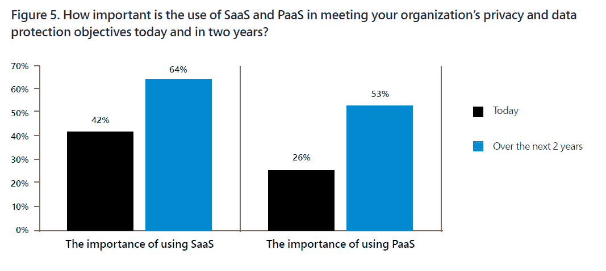
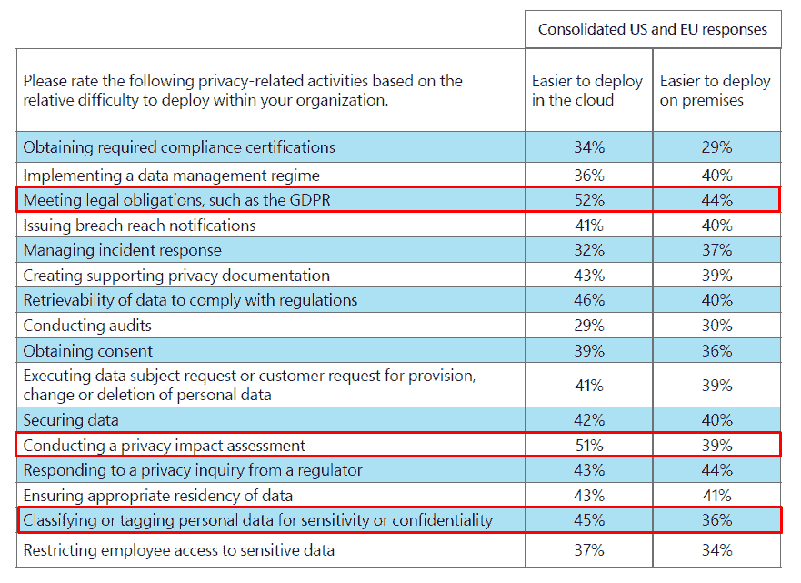
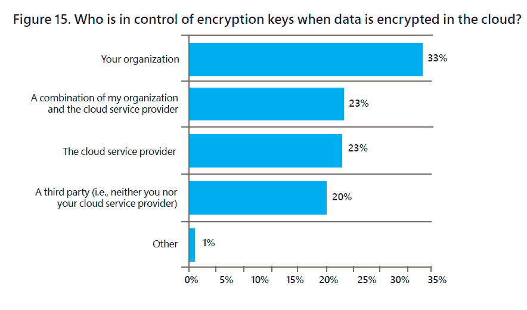

# 云让隐私和 GDPR 变得更容易，而不是更难

> 原文：<https://thenewstack.io/the-cloud-makes-privacy-and-gdpr-easier-not-harder/>

尽管对 SaaS 和 PaaS 应用缺乏信心，但根据微软赞助的 Ponemon Institute [对 1，000 多名熟悉在云环境中保护个人数据并了解其组织的隐私和法律合规性方法的 IT 或安全专业人员的调查](https://azure.microsoft.com/en-us/resources/ponemon-privacy-cloud-research/;/)，云是许多公司隐私和安全工作不可或缺的一部分。

在这个消息灵通的群体中，62%的人认为隐私问题没有阻止或减缓云服务的采用，只有 35%的人认为这些问题是一个障碍。它不仅不是一个抑制因素，54%的人实际上同意安全和/或隐私保护是迁移到云的一个原因，44%的人提到要遵守新兴的数据保护(例如，加利福尼亚州的消费者隐私法案)。

与内部环境相比，与隐私相关的活动(如 GDPR 合规性、进行隐私评估和标记敏感个人数据)更容易部署在公共云中。看起来云提供了更高程度的标准化，这反过来使得检查解决方案变得更加容易。

当被调查者被问及 SaaS 和 PaaS 应用时，情况就更复杂了。60%的受访者不确定其组织使用的 PaaS 应用程序是否满足隐私和数据保护要求，53%的受访者表示 SaaS 应用程序满足这一要求。超过一半的受访者表示，在部署 SaaS 或 PaaS 应用程序之前，会对隐私和数据安全要求进行评估。

尽管存在这种负面情绪，但人们也乐观地认为，在两年内，这些解决方案将对实现这些目标至关重要。事实上，虽然目前只有 26%的受访者认为 PaaS 对隐私和数据保护非常重要，但有两倍多的受访者(53%)预计 PaaS 在不久的将来对隐私和安全工作至关重要。因此，虽然高调的安全漏洞可能会引起很多关注，但云服务也是该行业隐私/安全未来的一部分。

来源:微软和 Ponemon 的《云中的数据保护和隐私合规:隐私问题并没有减缓云服务的采用，但挑战依然存在》。

* * *

## 两张奖金图表

来源:微软和 Ponemon 的《云中的数据保护和隐私合规:隐私问题并没有减缓云服务的采用，但挑战依然存在》。

在随后的问题中，29%的人说他们的组织已经有了自带钥匙(BYOK)的政策，另有 22%的人计划在未来 6 个月内实施。BYOK 允许企业(而非云服务提供商)加密其数据，并保留对其加密密钥的控制和管理。来源:微软和 Ponemon 的《云中的数据保护和隐私合规:隐私问题并没有减缓云服务的采用，但挑战依然存在》。

通过 Pixabay 的特征图像。

<svg xmlns:xlink="http://www.w3.org/1999/xlink" viewBox="0 0 68 31" version="1.1"><title>Group</title> <desc>Created with Sketch.</desc></svg>