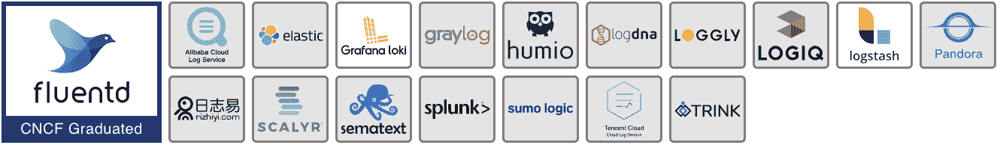
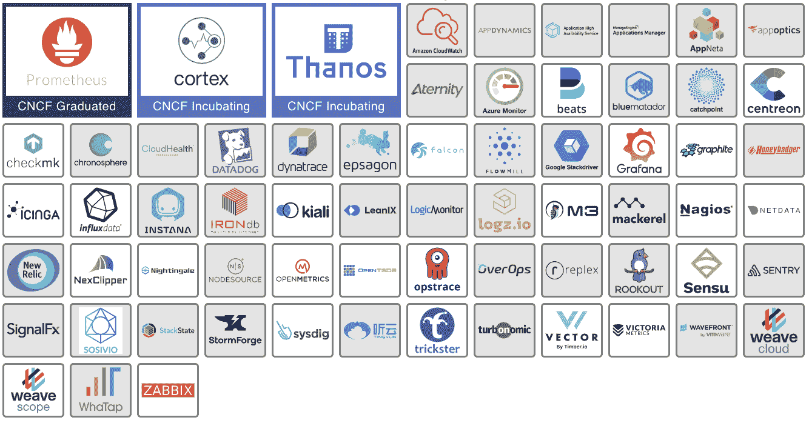
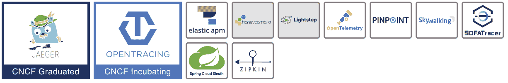
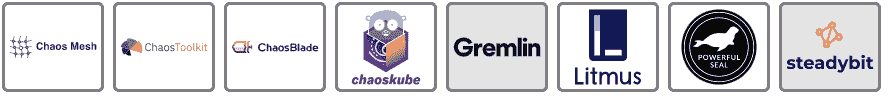

# 云的自然景观:可观测性和分析

> 原文：<https://thenewstack.io/cloud-native/the-cloud-native-landscape-observability-and-analysis/>

 [杰森·摩根

杰森·摩根是 Linkerd 在 Buoyant 的技术布道者。他负责帮助工程师了解 Linkerd，即最初的服务网格。](https://blog.59s.io/) 

我们终于到达了我们的[云本地计算基金会](https://cncf.io/?utm_content=inline-mention)的景观系列的最后一部分。如果您错过了我们以前的文章，我们在一篇单独的文章中分别介绍了[运行时](https://thenewstack.io/the-cloud-native-landscape-the-runtime-layer-explained/)[编排和管理层](https://thenewstack.io/the-cloud-native-landscape-the-orchestration-and-management-layer/) 以及 [平台](https://thenewstack.io/the-cloud-native-landscape-platforms-explained/) 。今天，我们将讨论“可观察性和分析”专栏的每个类别

让我们从定义可观察性和分析开始。可观测性是一种系统特性，描述了从系统的外部输出可以了解系统的程度。通过 CPU 时间、内存、磁盘空间、延迟、错误等来衡量。计算机系统或多或少是可以观察到的。另一方面，分析是一种活动，在这种活动中，你观察这些可观察到的数据并理解它们。

 [凯瑟琳·帕格尼尼

凯瑟琳是 Linkerd 的创建者 buppy 的营销主管。作为一名营销领导者，Catherine 热衷于向业务领导者介绍新堆栈及其提供的关键灵活性。](https://www.linkedin.com/in/catherinepaganini/en/) 

为了确保没有服务中断，您需要观察和分析应用程序的每一个方面，以便立即检测到任何异常并加以纠正。这就是这个类别的全部内容。它跨越并观察所有层，这就是为什么它在侧面而不是嵌入在特定层中。

这一类别的工具分为日志记录、监控、跟踪和混沌工程。请注意，类别名称有些误导。虽然在这里列出，混沌工程是一个可靠性，而不是一个可观测性或分析工具。

## **伐木**

### 事实真相

应用程序发出稳定的日志消息流，描述它们在任何给定时间正在做什么。这些日志消息捕获系统中发生的各种事件，如失败或成功的操作、审计信息或健康事件。日志记录工具收集、存储和分析这些消息，以跟踪错误报告和相关数据。除了度量和跟踪，日志记录是可观察性的支柱之一。

### 它解决的问题

收集、存储和分析日志是构建现代平台的关键部分。日志记录有助于执行这些任务中的一项或全部。一些工具处理从收集到分析的各个方面，而其他工具则专注于收集等单一任务。所有日志工具都旨在帮助组织获得对日志消息的控制。

### 它有什么帮助

在收集、存储和分析应用程序日志消息时，您将了解应用程序在任何给定时间都在通信什么。但是请注意，日志代表了应用程序可能故意发出的消息，它们不一定能指出给定问题的根本原因。也就是说，随着时间的推移收集和保留日志消息是一项极其强大的功能，将帮助团队诊断问题并满足法规和遵从性要求。

### 技术 101

虽然收集、存储和处理日志消息绝不是一个新问题，但是[云原生模式](https://thenewstack.io/category/cloud-native/)和 Kubernetes 已经导致我们处理日志的方式发生了重大变化。适用于虚拟机和物理机的传统日志记录方法，如将日志写入文件，不适合容器化的应用程序，在容器化的应用程序中，文件系统不会比应用程序更持久。在云本地环境中，Fluentd 等日志收集工具与应用程序容器一起运行，并直接从应用程序收集消息。然后，消息被转发到中央日志存储区进行汇总和分析。

Fluentd 是这一领域唯一的 CNCF 项目。

## 监视

### 事实真相

监控是指对应用程序进行检测，以收集、汇总和分析日志和指标，从而提高我们对其行为的理解。虽然日志描述了特定的事件，但指标是在给定时间点对系统的测量，它们是两个不同的东西，但都是获得系统健康状况全貌的必要条件。监控包括从监视单个节点上的磁盘空间、CPU 使用情况和内存消耗，到执行详细的综合事务以查看系统或应用程序是否正确、及时地响应。监控系统和应用程序有多种不同的方法。

### 它解决的问题

当运行应用程序或平台时，您希望它按照设计完成特定的任务，并确保只有授权用户才能访问它。通过监控，您可以了解它是否工作正常、安全、经济高效、仅被授权用户访问，和/或您可能正在跟踪的任何其他特征。

### 它有什么帮助

良好的监控使操作员能够快速响应，并在事故发生时自动做出响应。它提供了对系统当前健康状况的深入了解，并观察变化。监控跟踪从应用程序运行状况到用户行为的一切，是有效运行应用程序的重要组成部分。

### 技术 101

在云原生环境中监控通常类似于监控传统应用。您需要跟踪指标、日志和事件，以了解应用程序的健康状况。主要的区别在于，一些托管对象是短暂的，这意味着它们可能不会持久，因此将您的监视绑定到自动生成的资源名称将不是一个好的长期策略。在这个领域有许多 CNCF 项目，主要围绕 CNCF 毕业项目普罗米修斯。

## 描摹

### 事实真相

在微服务世界中，服务不断地通过网络相互通信。跟踪是日志记录的一种特殊用途，它允许您在请求通过分布式系统时跟踪请求的路径。

### 它解决的问题

理解微服务应用在任何给定时间点的行为是一项极具挑战性的任务。虽然许多工具提供了对服务行为的深刻见解，但很难将单个服务的操作与对整个应用行为的更广泛理解联系起来。

### 它有什么帮助

跟踪通过向应用程序发送的消息添加唯一标识符来解决这个问题。该唯一标识符允许您跟踪或追踪通过系统的单个交易。您可以使用这些信息来查看应用程序的健康状况，以及调试有问题的微服务或活动。

### 技术 101

跟踪是一种强大的调试工具，它允许您对分布式应用程序的行为进行故障排除和微调。这种力量是有代价的。需要修改应用程序代码来发出跟踪数据，并且任何跨度都需要由应用程序的数据路径中的基础结构组件来传播。特别是“服务网格”及其代理。耶格和开放追踪是这个领域的 CNCF 项目。

【T2

## **混沌工程**

### 事实真相

混沌工程是指为了创建更具弹性的应用程序和工程团队，故意将故障引入系统的做法。混沌工程工具将提供一种可控的方式来引入故障，并针对应用程序的特定实例运行特定的实验。

### 它解决的问题

复杂系统会失败。它们失败的原因有很多，分布式系统中的后果通常难以理解。混乱工程被那些接受失败将会发生的组织所接受，而不是试图阻止失败，而是练习从失败中恢复。这被称为优化平均修复时间或 MTTR。

**补充说明**:维护应用程序高可用性的传统方法被称为针对 [平均故障间隔时间](https://en.wikipedia.org/wiki/Mean_time_between_failures) 或 MTBF 进行优化。您可以在一些组织中观察到这种实践，这些组织使用“变更评审委员会”和长期变更冻结来通过限制变更来保持应用程序环境的稳定。 [Accelerate](https://itrevolution.com/book/accelerate/) 的作者建议，高性能的 IT 组织通过优化平均恢复时间或 MTTR 来实现高可用性。

### 它有什么帮助

在云环境中，应用程序必须动态地适应故障——这是一个相对较新的概念。这意味着，当某个东西出现故障时，系统不会完全崩溃，而是优雅地降级或恢复。混沌工程工具使您能够在生产中的软件系统上进行实验，以确保它们在真正发生故障时能够做到这一点。

简而言之，你用一个系统做实验，因为你想确信它能经受住动荡和意外的条件。你不是等待事情发生并发现，而是在受控的条件下通过胁迫来发现弱点，并在机会发现它们之前修复它们。

### 技术 101

混沌工程工具和实践对于实现应用程序的高可用性至关重要。分布式系统通常过于复杂，任何一个工程师都无法完全理解，而且没有任何变更过程可以完全预先确定变更对环境的影响。通过引入深思熟虑的混沌工程实践，团队能够实践并自动化从失败中恢复。混沌网格和石蕊混沌是这个领域的 CNCF 工具，但也有许多开源和专有的选择。

【T2

正如我们所看到的，可观察性和分析层完全是为了了解您的系统的健康状况，并确保它即使在恶劣的条件下也能保持运行。日志记录工具捕获应用程序发出的事件消息，监控手表日志和指标，并跟踪各个请求的路径。当结合使用时，这些工具理想地提供了系统内部正在发生的 360 度视图。混沌工程有点不同。它提供了一种安全的方法来验证系统能够承受意外事件，基本上确保它保持健康。

我们的 CNCF 风景系列终于结束了。在写这些文章的时候，我们确实学到了很多，希望你也一样。

<svg xmlns:xlink="http://www.w3.org/1999/xlink" viewBox="0 0 68 31" version="1.1"><title>Group</title> <desc>Created with Sketch.</desc></svg>