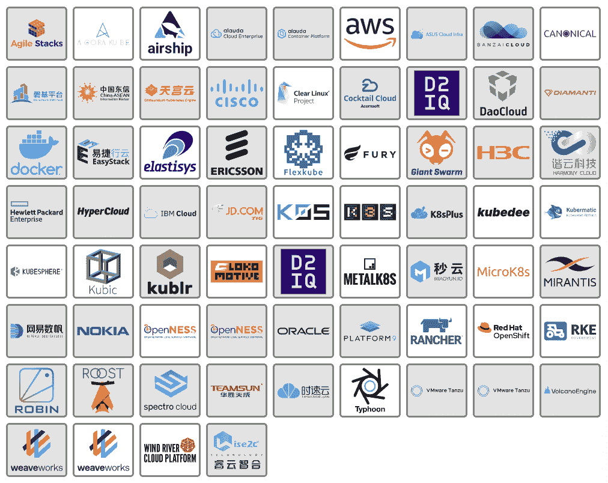
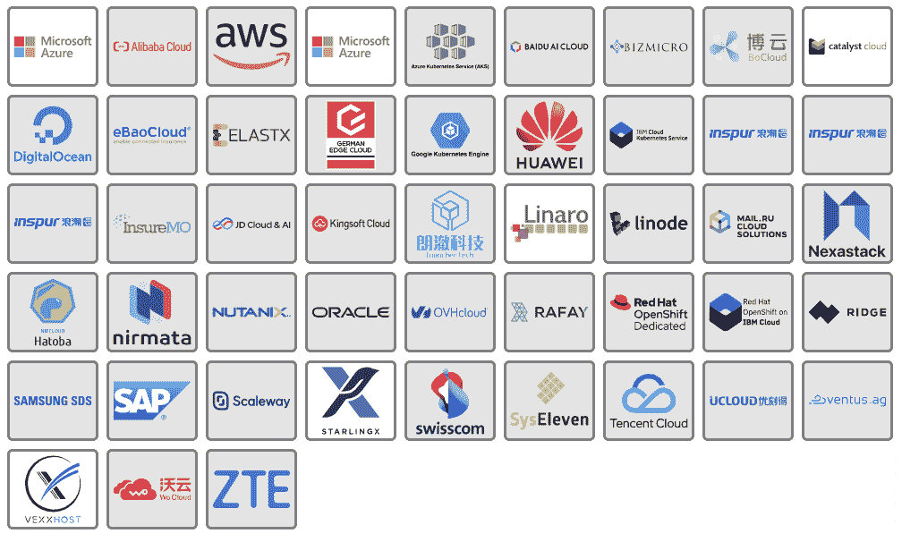
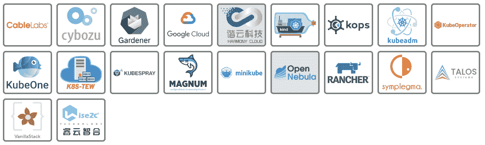
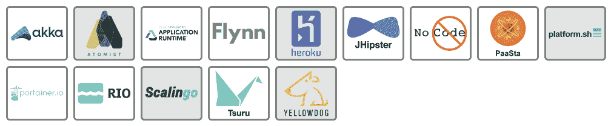

# 云原生环境:平台解释

> 原文：<https://thenewstack.io/cloud-native/the-cloud-native-landscape-platforms-explained/>

*这篇文章是云原生计算基金会的* [*商业价值小组委员会*](https://lists.cncf.io/g/cncf-business-value) *联合主席* *凯瑟琳·帕格尼尼* *和* [*杰森·摩根*](https://thenewstack.io/author/jason-morgan/) *正在进行的系列文章的一部分，重点是向非技术观众以及刚刚接触云原生景观的工程师解释[的每一个类别另请参见关于](https://thenewstack.io/an-introduction-to-the-cloud-native-landscape/)[应用程序定义开发](https://thenewstack.io/the-cloud-native-landscape-the-application-definition-and-development-layer/)、[运行时](https://thenewstack.io/the-cloud-native-landscape-the-runtime-layer-explained/)、[编排和管理](https://thenewstack.io/the-cloud-native-landscape-the-orchestration-and-management-layer/)以及[供应的各层部分。](https://thenewstack.io/the-cloud-native-landscape-the-provisioning-layer-explained/)*

 [凯瑟琳·帕格尼尼

凯瑟琳是 Linkerd 的创建者 buppy 的营销主管。作为一名营销领导者，Catherine 热衷于向业务领导者介绍新堆栈及其提供的关键灵活性。](https://www.linkedin.com/in/catherinepaganini/en/) 

在我们之前的文章中，我们讨论了[云原生计算基金会的](https://cncf.io/?utm_content=inline-mention) [云原生景观](https://landscape.cncf.io) 的每一层。首先，通过提供一个的整体概述，然后是关于 [供应](https://thenewstack.io/the-cloud-native-landscape-the-provisioning-layer-explained/)[运行时](https://thenewstack.io/the-cloud-native-landscape-the-runtime-layer-explained/)[编排和管理](https://thenewstack.io/the-cloud-native-landscape-the-orchestration-and-management-layer/)[应用程序定义和开发层](https://thenewstack.io/the-cloud-native-landscape-the-application-definition-and-development-layer/) 的专门文章。今天，我们将重点关注平台“专栏”

正如我们在本系列中所看到的，每个类别都解决了一个特定的问题。单靠存储并不能满足您管理应用的所有需求。您将需要一个编排工具、容器运行时、服务发现、网络、API 网关等。平台将不同层的不同工具捆绑在一起，解决一个更大的问题。

 [杰森·摩根

Jason Morgan 是浮力公司 Linkerd 的开发人员宣传员。他负责帮助工程师了解 Linkerd，即最初的服务网格。](https://blog.59s.io/) 

这些平台本身没有什么新东西。他们所做的一切都可以通过这些层中的某个工具或“可观察性和分析”栏来完成。你当然可以建立自己的平台，事实上，许多组织都是这样做的。然而，可靠和安全地配置和微调不同的模块，同时确保所有技术总是更新和漏洞得到修补并不是一件容易的事情，您需要一个专门的团队来构建和维护它。如果您没有所需的带宽和/或专业知识，您的团队可能更适合使用平台。对于一些组织，尤其是那些拥有小型工程团队的组织，平台是采用云原生方法的唯一途径。

你可能会注意到，所有平台 [都围绕着 Kubernetes](https://thenewstack.io/primer-how-kubernetes-came-to-be-what-it-is-and-why-you-should-care/) 展开。这是因为 Kubernetes 是云原生堆栈的核心。

### 旁注

当观察[云的自然景观](https://landscape.cncf.io/)时，你会注意到一些区别:

*   大框中的项目是云计算原生计算基金会托管的开源项目。有的还在孵化阶段(浅蓝色/紫色框)，有的是毕业项目(深蓝色框)。
*   小白框中的项目是开源项目。
*   灰色框中的产品是专有的。

请注意，即使在撰写本文期间，我们也看到了新项目成为云计算原生计算基金会(CNCF)的一部分，因此请始终参考实际情况——事情发展得很快！

## 库伯内特分布图

### 事实真相

发行版，或称 distro，是指供应商获得核心 Kubernetes——即未修改的开源代码(尽管有些人会修改它)——并将其打包以供再发行。通常，这需要找到并验证 Kubernetes 软件，并提供处理集群安装和升级的机制。许多 Kubernetes 发行版包括其他专有或开源应用程序。

### 他们解决了什么问题

[开源的 Kubernetes](https://github.com/kubernetes/kubernetes) 没有指定特定的安装工具，给用户留下了很多设置配置选择。此外，对于出现在社区资源之外的问题，如 [社区论坛](https://discuss.kubernetes.io/) 、[、 StackOverflow](http://stackoverflow.com/questions/tagged/kubernetes) 、 [Slack](https://slack.k8s.io/) 或 Discord，支持有限。

虽然随着时间的推移，使用 Kubernetes 变得越来越容易，但找到和使用开源安装程序却是一个挑战。用户需要了解使用什么版本，从哪里获得它们，以及一个特定的组件是否与另一个兼容。他们还需要决定将什么软件部署到他们的集群，以及使用什么设置来确保他们的平台是安全、稳定和高性能的。所有这些都需要 Kubernetes 深厚的专业知识，而这些知识在内部可能不容易获得。

### 它有什么帮助

Kubernetes 发行版提供了一种可信和可靠的方式来安装 Kubernetes，并提供了自以为是的缺省值，从而创建了一个更好和更安全的操作环境。Kubernetes 发行版为供应商和项目提供了在部署、维护和升级 Kubernetes 集群的整个生命周期中为客户提供支持所需的控制和可预测性。

这种可预测性使发行商能够在用户遇到生产问题时为他们提供支持。发行版通常还提供经过测试和支持的升级路径，允许用户保持他们的 Kubernetes 集群最新。此外，发行版通常提供部署在 Kubernetes 之上的软件，这使得它更易于使用。

发行版极大地简化和加快了 Kubernetes 的采用。由于配置和微调集群所需的专业知识已被编码到平台中，组织可以使用云原生工具启动并运行，而无需雇用具有专业知识的额外工程师。

### 技术 101

如果您已经安装了 Kubernetes，那么您可能已经使用了类似 kubeadm 的东西来启动和运行您的集群。即使这样，您可能也必须决定一个 CNI(容器网络接口)，安装并配置它。然后，您可能添加了一些存储类、一个处理日志消息的工具、一个入口控制器等等。Kubernetes 发行版将自动完成部分或全部设置。它还会根据自己对最佳实践的理解或智能默认来提供配置设置。此外，大多数发行版都会附带一些经过捆绑和测试的扩展或附加组件，以确保您可以尽快开始使用新的集群。

让我们以 [Kublr](https://kublr.com/) 为例。这个平台以 Kubernetes 为核心，主要从三个层面捆绑技术:供应、运行时、编排和管理，以及可观察性和分析。所有模块都预先配置了一些选项，可供选择并随时使用。  不同的平台有不同的侧重点。在 Kublr 的情况下，重点更多地放在操作方面，而其他平台可能更侧重于开发人员工具。

这一类有很多选择。截至本文撰写时， [k3s](https://k3s.io) 是唯一的 CNCF 项目。有很多很棒的开源和商业选项，包括 Canonical 的 Microk8s、k3s、VMware 的 Tanzu Kubernetes Grid、Mirantis 的 Docker Enterprise、Suse 的 Rancher，当然还有 Red Hat 的 Openshift。我们没有时间提及甚至接近一半的 Kubernetes 发行版，我们鼓励您在开始评估发行版时仔细考虑您的需求。

## 主持 Kubernetes

### 事实真相

托管 Kubernetes 是由基础设施提供商提供的服务，如亚马逊网络服务、数字海洋、Azure 或谷歌，允许客户按需构建 Kubernetes 集群。云提供商负责管理 Kubernetes 集群的一部分，通常称为控制平面。它们类似于发行版，但由云提供商在*他们的*基础设施上管理。

### 他们解决了什么问题

托管的 Kubernetes 允许团队开始使用 Kubernetes，除了在云供应商那里建立一个帐户之外，不需要知道或做任何事情。它解决了 Kubernetes 入门的五个 w 中的四个。谁(管理它):您的云提供商；内容:他们托管的 Kubernetes 产品；何时:现在；在哪里:在云提供商的基础设施上。原因由你决定。

### 它有什么帮助

由于提供商负责所有的管理细节，托管 Kubernetes 是开始使用云原生的最简单的方法。所有用户所要做的，就是开发他们的应用程序，并将其部署在托管的 Kubernetes 服务上——这非常方便。托管产品允许用户启动 Kubernetes 集群并立即开始使用，*同时对集群可用性承担一些责任。值得注意的是，这些服务带来了额外的便利，同时也降低了灵活性。该服务绑定到云提供商，Kubernetes 用户无法访问 Kubernetes 控制平面，因此一些配置选项受到限制。

** AWS 的 EKS 略有例外，因为它也要求用户采取一些额外的步骤来准备他们的集群。*

### 技术 101

托管 Kubernetes 是由供应商(通常是基础设施托管提供商)提供的按需 Kubernetes 集群。供应商负责供应集群和管理 Kubernetes 控制平面。同样，值得注意的例外是 EKS，其中单个节点的供应由客户端决定。

Hosted Kubernetes 允许组织通过将基础架构组件管理外包给另一个组织来快速供应新集群并降低其运营风险。主要的权衡是，你很可能要为控制平面管理付费(GKE 去年因价格变化而陷入了一场 [争议](https://www.theregister.com/2020/03/05/google_reintroduces_management_fee_for_kubernetes_clusters/) ),而且你能做的事情有限。与 DIY Kubernetes 集群相比，托管集群在配置 Kubernetes 集群方面提供了更严格的限制。

这个领域有许多供应商和项目，但在撰写本文时，还没有 CNCF 项目。

## Kubernetes 安装程序

### 事实真相

Kubernetes 安装程序帮助在机器上安装 Kubernetes。他们自动化了 Kubernetes 的安装和配置过程，甚至可能有助于升级。Kubernetes 安装程序通常与 Kubernetes 发行版或托管的 Kubernetes 产品结合使用。

### 他们解决了什么问题

与 Kubernetes 发行版类似，Kubernetes 安装程序简化了 Kubernetes 的入门。 [开源的 Kubernetes](https://github.com/kubernetes/kubernetes) 依赖于像 kubeadm 这样的安装程序，在撰写本文时，这些安装程序是认证 Kubernetes 管理员认证测试的一部分，用于启动和运行 Kubernetes 集群。

### 它有什么帮助

Kubernetes 安装程序简化了 Kubernetes 安装过程。L 像发行版一样，它们为源代码和版本提供了经过审查的来源。他们还经常附带固执己见的 Kubernetes 环境配置。Kubernetes 安装程序 like-kind(Docker 中的 Kubernetes)允许您通过一个命令获得一个 Kubernetes 集群。

### 技术 101

无论您是在 Docker 上本地安装 Kubernetes，启动和配置新的虚拟机，还是准备新的物理服务器，您都将需要一个工具来处理各种 Kubernetes 组件的所有准备工作(除非您打算以一种困难的方式来做这件事)。

Kubernetes 安装程序简化了这一过程。有些负责启动节点，有些则只是配置您已经配置好的节点。它们都提供不同级别的自动化，并且适合不同的用例。当开始使用安装程序时，首先要了解您的需求，然后选择一个满足这些需求的安装程序。在撰写本文时，kubeadm 被认为是 Kubernetes 生态系统的基础，它被纳入了 CKA 认证的 Kubernetes 管理员考试。Minikube、kind、kops 和 kubespray 都是 CNCF 所有的 Kubernetes 安装程序项目。

## PaaS /集装箱服务

### 事实真相

[平台即服务](https://en.wikipedia.org/wiki/Platform_as_a_service) 或 PaaS，是一种允许用户运行应用程序的环境，无需了解或知晓底层计算资源。此类别中的 PaaS 和容器服务是为开发人员托管 PaaS 或托管他们可以使用的服务的机制。

### 他们解决了什么问题

在本系列中，我们已经讨论了很多关于“原生云”的工具和技术 PaaS 试图以一种为开发者提供直接价值的方式连接这个领域中的许多技术。它回答了以下问题:我将如何在各种环境中运行应用程序，一旦运行，我的团队和用户将如何与它们交互？

### 它有什么帮助

PaaS 提供了关于如何将运行应用程序所需的各种开源和闭源工具组合在一起的观点和选择。许多产品包括处理 PaaS 安装和升级的工具，以及将应用程序代码转换成运行应用程序的机制。此外，PaaS 处理应用程序实例的运行时需求，包括单个组件的按需扩展以及单个应用程序的性能和日志消息的可见性。

### 技术 101

组织正在采用云原生技术来实现特定的业务或组织目标。PaaS 提供了比构建定制应用平台更快的价值实现途径。Heroku 或 Cloud Foundry 应用程序运行时等工具可帮助组织快速启动并运行新的应用程序。他们擅长提供运行 [12 因子](https://12factor.net/) 或云原生应用所需的工具。

任何 PaaS 都有自己的权衡和限制。大多数只处理语言或应用程序类型的子集，其中包含的观点和决策可能适合也可能不适合您的需求。无状态应用程序在 PaaS 中表现得很好，但是像数据库这样的有状态应用程序通常做得不好。目前在这个领域还没有 CNCF 项目，但大多数产品都是开源的，Cloud Foundry 由 Cloud Foundry 基金会管理。

## 结论

正如我们所见，有多种工具可以帮助简化 Kubernetes 的采用。从 Kubernetes 发行版和托管的 Kubernetes 到更多的准系统安装程序或 PaaS，它们都承担了一些安装和配置负担，并为您进行预打包。每种解决方案都有自己的“特色”供应商关于什么是重要的和适当的观点被构建到解决方案中。

在采用这些方法之前，您需要做一些研究来确定适合您的特定用例的最佳解决方案。你会遇到需要控制控制平面的高级 Kubernetes 场景吗？那么，托管解决方案可能并不适合。您是否有一个管理“标准”工作负载的小型团队，并且需要尽可能多地分担运营任务？那么，托管解决方案可能是一个很好的选择。便携性重要吗？生产准备情况如何？有多个方面需要考虑。没有“一个最好的工具”，但是肯定有一个适合您的用例的最佳工具。希望这篇文章能帮助你缩小搜索范围，找到合适的“桶”

这就结束了 CNCF 景观的平台“柱”。接下来，我们将处理本系列的最后一篇文章，可观察性和分析“专栏”

*一如既往，特别感谢来自 CNCF 的 [Ihor Dvoretskyi](https://www.linkedin.com/in/idvoretskyi/) ，他审核了这篇文章，确保了它的准确性。*

<svg xmlns:xlink="http://www.w3.org/1999/xlink" viewBox="0 0 68 31" version="1.1"><title>Group</title> <desc>Created with Sketch.</desc></svg>