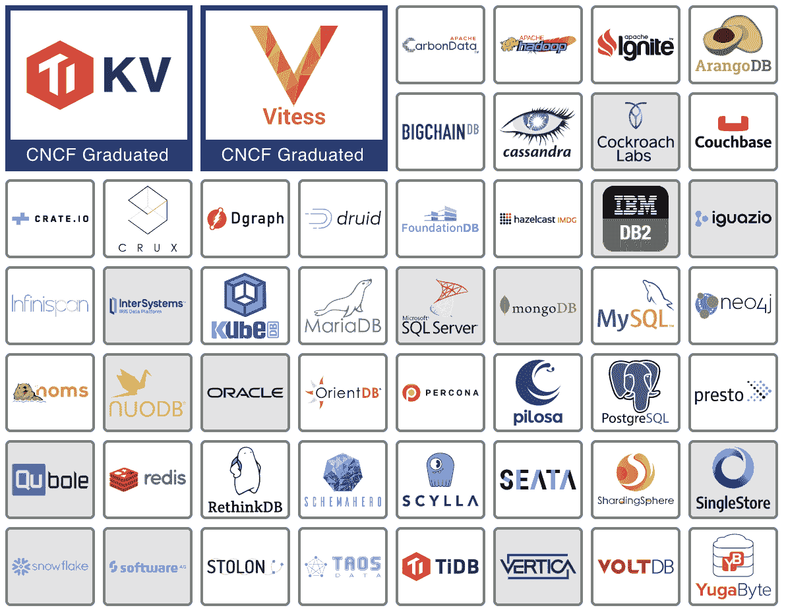
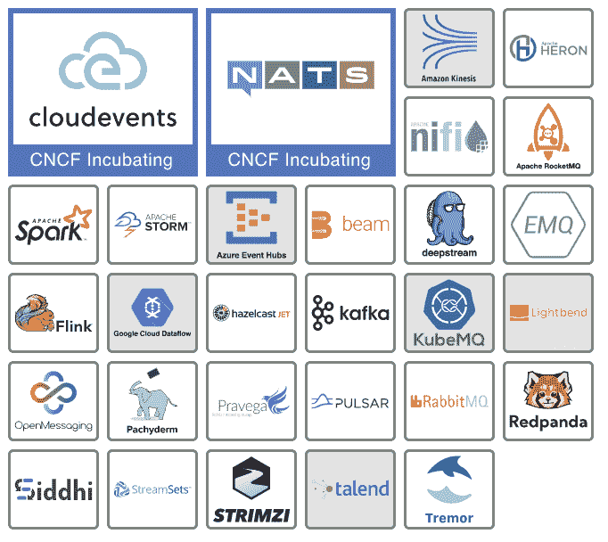
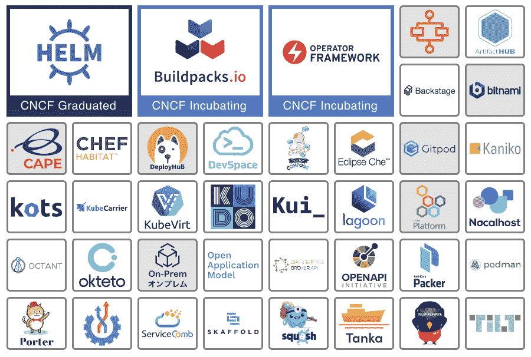
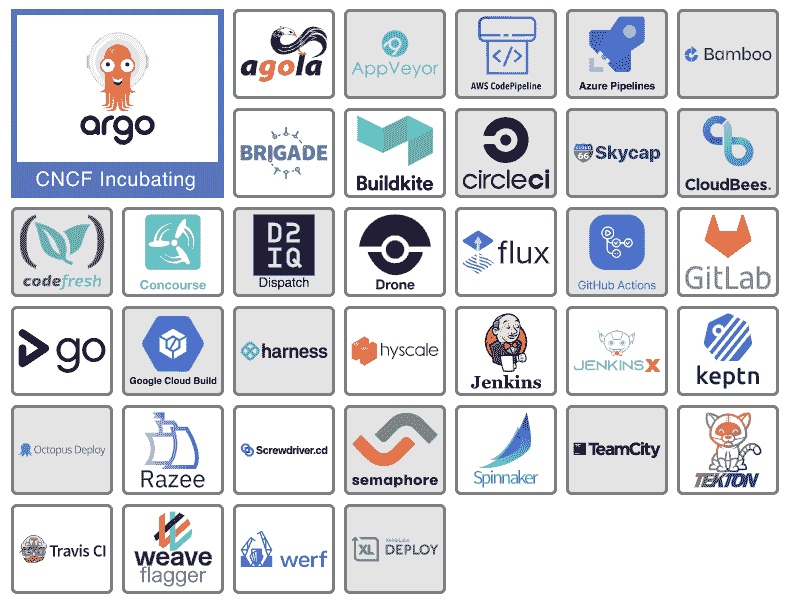

# 应用程序定义和开发层解释

> 原文：<https://thenewstack.io/cloud-native/the-cloud-native-landscape-the-application-definition-and-development-layer/>

*这篇文章是[云原生计算基金会商业价值小组委员会](https://lists.cncf.io/g/cncf-business-value)联合主席 Catherine Paganini 和 [Jason Morgan](https://thenewstack.io/author/jason-morgan/) 正在进行的系列文章的一部分，重点是向非技术观众以及刚刚开始使用云原生计算的工程师解释云原生环境的每个类别。*

 [杰森·摩根

Jason Morgan 是 VMware 的解决方案工程师，专注于帮助客户构建和完善微服务平台。](https://blog.59s.io/) 

我们现在已经到达了[云原生计算基础](https://cncf.io/?utm_content=inline-mention)的[云原生环境](https://landscape.cncf.io)的顶层(如果您错过了我们之前的文章，我们在一篇单独的文章中分别介绍了[简介](https://thenewstack.io/an-introduction-to-the-cloud-native-landscape/)和[供应](https://thenewstack.io/the-cloud-native-landscape-the-provisioning-layer-explained/)、[运行时](https://thenewstack.io/the-cloud-native-landscape-the-runtime-layer-explained/)和[编排和管理层](https://thenewstack.io/the-cloud-native-landscape-the-orchestration-and-management-layer/))。顾名思义，应用程序定义和开发层专注于使工程师能够构建应用程序的工具。我们在以前的文章中讨论的一切都与构建一个可靠、安全的环境和提供所有需要的依赖关系有关。是的，很多东西都投入到构建软件中去了！现在，让我们探索这最后一层。

### 旁注

 [凯瑟琳·帕格尼尼

凯瑟琳是 Linkerd 的创建者 buppy 的营销主管。作为一名营销领导者，Catherine 热衷于向业务领导者介绍新堆栈及其提供的关键灵活性。](https://www.linkedin.com/in/catherinepaganini/en/) 

当观察[云原生景观](https://landscape.cncf.io/)时，你会注意到一些区别:

*   大框中的项目是 CNCF 主持的开源项目。有的还在孵化阶段(浅蓝色/紫色框)，有的是毕业项目(深蓝色框)。
*   小白框中的项目是开源项目。
*   灰色框中的产品是专有的。

请注意，即使在撰写本文期间，我们也看到新的项目成为 CNCF 的一部分，所以总是参考实际的景观——事情发展得很快！

## 数据库 

### 事实真相

数据库管理系统是一个应用程序，通过它其他应用程序可以有效地存储和检索数据。

它确保数据得到存储，只有授权用户才能访问它，并允许用户通过专门的请求检索它。虽然有许多不同类型的数据库采用不同的方法，但它们最终都有相同的总体目标。

### 它解决的问题

大多数应用程序需要一种有效的方法来存储和检索数据，同时保证数据的安全。数据库使用成熟的技术以结构化的方式完成这项工作(做好这项工作相当复杂)。

### 它有什么帮助

数据库为应用程序提供了存储和检索数据的公共接口。开发人员使用这些标准接口，在大多数情况下是一种简单的查询语言，来存储、查询和检索数据库中的信息。与此同时，数据库允许用户持续备份和保存数据，以及加密和管理对数据的访问。

### 技术 101

我们已经确定，数据库管理系统是一个存储和检索数据的应用程序。它使用一种通用的语言和接口来实现，这种语言和接口可以被许多不同的语言和框架轻松使用。

一般来说，我们看到两种常见类型的数据库，结构化查询语言(SQL)数据库和非 SQL 数据库。特定应用程序使用哪个数据库应该由其需求和约束决定。

随着 Kubernetes 的兴起及其支持有状态应用程序的能力，我们看到了利用容器化的新一代数据库。这些新的云原生数据库旨在为数据库带来 Kubernetes 的可伸缩性和可用性优势。像 [YugaByte](https://landscape.cncf.io/?selected=yuga-byte-db) 和 [Couchbase](https://landscape.cncf.io/?selected=couchbase) 这样的工具就是云原生数据库的例子，尽管像 MySQL 和 Postgres 这样的传统数据库在 Kubernetes 集群中运行得非常成功和有效。

[Vitess](https://landscape.cncf.io/?selected=vitess) 和 [TiKV](https://landscape.cncf.io/?selected=ti-kv) 是这个领域的 CNCF 项目。

### 旁注

如果您查看这个类别，您会注意到多个以 DB 结尾的名称(例如 MongoDB、CockroachDB、FaunaDB ),正如您可能猜到的，DB 代表数据库。您还会看到各种以 SQL 结尾的名称(例如 MySQL 或 memSQL)，它们仍然是相关的。有些是“老派”数据库，已经适应了云的原生现实。还有一些数据库是无 SQL 但兼容 SQL 的，比如 YugaByte 和 Vitess。

## 流媒体和消息

### 事实真相

流和消息工具通过在系统之间传输消息(即事件)来实现服务对服务的通信。单个服务连接到消息服务，以发布事件、读取来自其他服务的消息，或者两者兼而有之。这种动态创造了一种环境，在这种环境中，单个应用程序要么是发布者，也就是说它们编写事件，要么是订阅者，或者更有可能是两者兼而有之。

### 它解决的问题

随着服务的激增，应用程序环境变得越来越复杂，使得应用程序之间的通信编排更具挑战性。流或消息传递平台提供了一个发布和读取系统内发生的所有事件的中心位置，允许应用程序协同工作，而不必了解彼此。

### 它有什么帮助

当一个服务做了其他服务应该知道的事情时，它会向流或消息工具“发布”一个事件。需要了解这些事件类型的服务订阅并观看流或消息工具。这是发布-订阅(或简称发布-订阅)方法的本质，是由这些工具实现的。

通过引入管理所有通信的“中间人”层，我们将服务彼此分离。他们只是观察事件，采取行动，然后发布一个新的。

这里有一个例子。当您首次注册网飞时，注册服务会向消息平台发布一个“新注册事件”,其中包含更多详细信息(如姓名、电子邮件地址、订阅级别等)。).订阅注册事件的帐户创建者服务将看到该事件并创建您的帐户。还订阅新注册活动的客户通信服务会将您的电子邮件地址添加到客户邮件列表中，并生成一封欢迎电子邮件，等等。

这允许一个高度解耦的架构，其中服务可以协作，而不需要了解彼此。这种分离使工程师能够在不更新下游应用程序(消费者)或发送大量查询的情况下添加新功能。一个系统的解耦程度越高，就越灵活，越能适应变化。这正是工程师在系统中努力追求的目标。

### 技术 101

消息和流媒体工具在原生云成为现实之前就已经存在了。为了集中管理关键业务事件，组织已经构建了大型企业服务总线。但是，当我们谈论云原生环境中的消息和流时，我们通常指的是 NATS、RabbitMQ、Kafka 或云提供的消息队列等工具。

这些系统的共同点是它们支持的架构模式。云原生环境中的应用程序交互要么是经过编排的，要么是经过编排的。你可以在萨姆·牛顿的书[构建微服务](https://samnewman.io/books/building_microservices/)中找到更多关于这个主题的细节，以及在这篇 StackOverflow 文章和陈晨的博客中的简短摘要[。为了简单起见，我们姑且说编排是指集中管理和编排的系统是那些允许单个组件独立工作的系统。](https://stackoverflow.com/questions/4127241/orchestration-vs-choreography)

消息和流系统为精心设计的系统提供了一个交流的中心。消息总线提供了一个所有应用程序都可以访问的公共场所，既可以通过发布消息来告诉其他人他们在做什么，也可以通过订阅消息来查看正在发生的事情。

[NATS](https://landscape.cncf.io/?selected=nats) 和 [Cloudevents](https://landscape.cncf.io/?selected=cloud-events) 项目都是这一领域的孵化项目，NATS 提供了一个成熟的消息系统，Cloudevents 则致力于系统间消息格式的标准化。 [Strimzi](https://landscape.cncf.io/?selected=strimzi) 、 [Pravega](https://landscape.cncf.io/?selected=pravega) 和[震颤](https://landscape.cncf.io/?selected=tremor)是沙盒项目，每个项目都是为围绕流和消息传递的独特用例量身定制的。

## 应用程序定义和映像构建

### 事实真相

应用程序定义和映像构建是一个宽泛的类别，可以分为两个主要的子类别。首先，侧重于开发的工具有助于将应用程序代码构建到容器和/或 Kubernetes 中。第二，以运营为中心的工具，以标准化的方式部署应用。无论是加快还是简化您的开发环境，提供一种部署第三方应用的标准化方法，还是简化编写新的 Kubernetes 扩展的过程，这一类别都是优化 Kubernetes 开发人员和操作人员体验的许多项目和产品的总称。

### 它解决的问题

Kubernetes，以及更一般的集装箱化环境，非常灵活和强大。这种灵活性也带来了复杂性，主要表现为针对各种经常是新的用例的大量配置选项。开发人员必须将他们的代码容器化，并有能力在类似生产的环境中进行开发。随着发布时间的加快，运营商需要一种标准化的方式来将应用部署到容器环境中。

### 它有什么帮助

这一领域的工具旨在解决开发人员或操作人员面临的一些挑战。在开发人员方面，有一些工具可以简化扩展 Kubernetes 来构建、部署和连接应用程序的过程。许多项目和产品有助于存储或部署预打包的应用程序。这使得运营商可以快速部署 Kafka 等流媒体服务或安装 Linkerd 等服务网格。

开发云原生应用带来了一系列全新的挑战，需要大量不同的工具来简化应用构建和部署。当您开始解决环境中的操作和开发问题时，请寻找这一类别的工具。

### 技术 101

应用程序定义和构建工具包含了大量的功能。从使用 [KubeVirt](https://landscape.cncf.io/?selected=kube-virt) 将 [Kubernetes](https://landscape.cncf.io/?selected=kubernetes) 扩展到虚拟机，到通过允许您使用 Telepresence 等工具将开发环境移植到 Kubernetes 来加速应用程序开发，以及介于两者之间的一切。从高层次来看，这一领域的工具既可以解决开发人员关注的问题，如如何正确编写、打包、测试或运行定制应用，也可以解决运营关注的问题，如部署和管理应用。

Helm 是该类别中唯一的毕业项目，支持许多应用程序部署模式。允许 Kubernetes 用户部署和定制许多流行的第三方应用程序，它已经被其他项目采用，如 CNCF 沙盒项目 [Artifact Hub](https://landscape.cncf.io/?selected=artifact-hub) ，以及提供应用程序管理目录的 [Bitnami](https://landscape.cncf.io/?selected=bitnami-tanzu-application-catalog) 。 [Helm](https://landscape.cncf.io/?selected=helm) 也足够灵活，允许用户定制自己的应用部署。

[操作者框架](https://landscape.cncf.io/?selected=operator-framework)是一个孵化项目，旨在简化构建和部署操作者的过程。运营商不在本文讨论范围之内，但是让我们在这里注意一下，他们帮助部署和管理应用，类似于 Helm(你可以在这里阅读关于运营商[的更多信息)。](https://kubernetes.io/docs/concepts/extend-kubernetes/operator/) [Cloud Native Buildpacks](https://landscape.cncf.io/?selected=buildpacks) ，另一个孵化项目，旨在简化将应用程序代码构建到容器中的过程。

这一领域还有很多，探索这一切需要一篇专门的文章。但是如果您想让 Kubernetes 对开发人员和操作人员来说更容易，请进一步研究这些工具。你可能会找到满足你需求的东西。

## 持续集成和持续交付

### 事实真相

持续集成(CI)和持续交付(CD)工具通过嵌入式质量保证实现了快速高效的开发(我们在本入门中详细介绍了 [CI/CD)。CI 通过立即构建和测试代码来自动化代码变更，确保它产生一个可部署的工件。CD 更进一步，推动工件通过部署阶段。](https://thenewstack.io/a-primer-continuous-integration-and-continuous-delivery-ci-cd/)

成熟的 CI/CD 系统观察源代码的变化，自动构建和测试代码，然后开始将代码从开发转移到生产，在生产中它必须通过各种测试或验证，以确定该过程应该继续还是失败。此类工具支持这种方法。

### 它解决的问题

构建和部署应用程序是一个困难且容易出错的过程。特别是，当它涉及大量的人工干预和手动步骤时。开发人员在没有将软件集成到代码库中的情况下开发软件的时间越长，识别错误的时间就越长，修复错误的难度就越大。通过定期集成代码，可以及早发现错误，并且更容易排除故障。毕竟，在几行代码中找到错误要比在几百行代码中找到错误容易得多。

虽然 Kubernetes 等工具为运行和管理应用程序提供了极大的灵活性，但它们也为 CI/CD 工具带来了新的挑战和机遇。云原生 CI/CD 系统能够利用 Kubernetes 本身来构建、运行和管理 CI/CD 流程，通常称为[管道](https://www.redhat.com/en/topics/devops/what-cicd-pipeline)。Kubernetes 还提供了有关我们的应用健康状况的信息，使云原生 CI/CD 工具能够更容易地确定给定的更改是成功的还是需要回滚。

### 它有什么帮助

CI 工具确保开发人员引入的任何代码变更或更新都是自动地、持续地构建、验证并与其他变更集成的。每当开发人员添加一个更新时，自动测试就会被触发，以确保只有好的代码才能进入系统。CD 扩展了 CI，包括将 CI 过程的结果推进到类似生产和生产环境中。

假设一个开发人员修改了一个 web 应用程序的代码。CI 系统发现代码发生了变化，然后构建并测试该 web 应用程序的新版本。CD 系统获取新版本，并将其部署到开发、测试、预生产和最终生产环境中。在流程的每一步之后，它都会测试已部署的应用程序。所有这些系统代表了该 web 应用程序的 CI/CD 管道。

### 技术 101

随着时间的推移，已经开发了许多工具来帮助将代码从存储代码的仓库转移到运行最终应用程序的生产环境中。像大多数其他计算领域一样，云原生开发的出现改变了 CI/CD 系统。一些传统工具，如 [Jenkins](https://landscape.cncf.io/?selected=jenkins) ，可能是市场上使用最广泛的 CI 工具，已经被[彻底改造](https://jenkins-x.io/)，以更好地适应 Kubernetes 生态系统。其他的，像 [Flux](https://landscape.cncf.io/?selected=flux) 和 [Argo](https://landscape.cncf.io/?selected=argo) 已经开创了一种新的持续交付方式，叫做 GitOps。

一般来说，你会发现这一领域的项目和产品要么是(1) CI 系统，(2) CD 系统，(3)帮助 CD 系统决定代码是否可以投入生产的工具，要么是(4)在 [Spinnaker](https://landscape.cncf.io/?selected=spinnaker) 和 Argo 的情况下，三者都是。Argo 和 Brigade 是这个领域唯一的 CNCF 项目，但是你可以找到更多由[持续交付基金会](https://cd.foundation/)主持的项目。寻找这一领域的工具，帮助您的组织实现生产自动化。

## 结论

正如我们所见，应用定义和开发层中的工具使工程师能够构建云原生应用。您会发现存储和检索数据的数据库或流和消息传递工具允许解耦、编排的架构。应用程序定义和映像构建工具包含多种技术，可改善开发人员和操作人员的体验，CI/CD 可确保代码处于可部署状态，并帮助工程师尽早发现任何错误，从而确保更高的代码质量。

这篇文章总结了 CNCF 景观的层次。在我们的下一篇文章中，我们将关注云原生平台，这是贯穿所有这些层的第一篇专栏文章。到目前为止，在我们讨论过的各个层中配置工具，使它们能够很好地协同工作并不是一件容易的事情。平台将它们捆绑在一起，便于采用，但在我们的下一篇文章中会有更多内容。

*一如既往，非常特别地感谢来自 CNCF 的 Ihor Dvoretskyi ,他审核了这篇文章，确保了它的准确性。*

<svg xmlns:xlink="http://www.w3.org/1999/xlink" viewBox="0 0 68 31" version="1.1"><title>Group</title> <desc>Created with Sketch.</desc></svg>