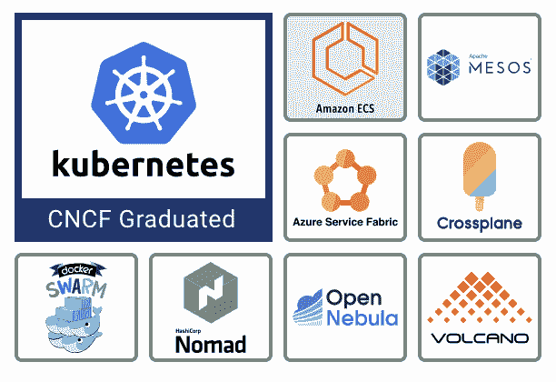
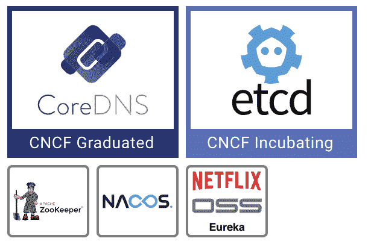
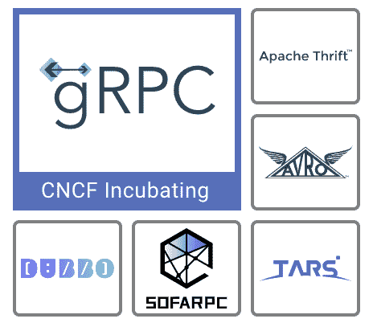
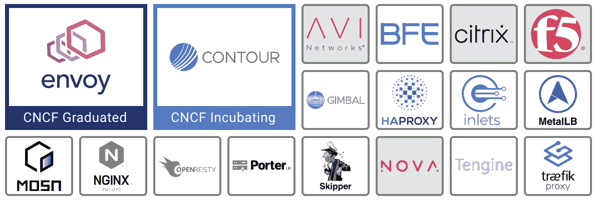
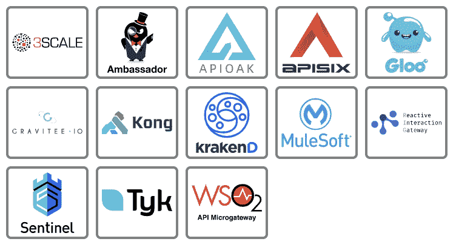
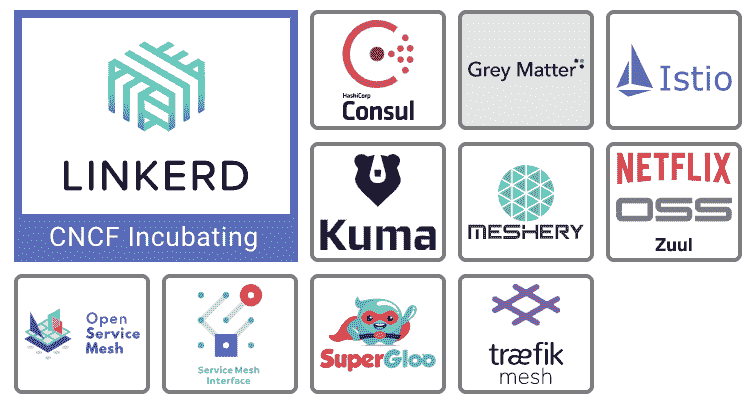

# 云原生环境:编排和管理层

> 原文：<https://thenewstack.io/cloud-native/the-cloud-native-landscape-the-orchestration-and-management-layer/>

*这篇文章是正在进行的系列文章的一部分，该系列文章来自* [*CNCF 商业价值小组委员会*](https://lists.cncf.io/g/cncf-business-value) *联席主席* *凯瑟琳·帕格尼尼* *和* [*杰森·摩根*](https://thenewstack.io/author/jason-morgan/) *，重点是向非技术观众以及刚刚开始使用云原生技术的工程师解释云原生环境的每个类别。*

 [凯瑟琳·帕格尼尼

凯瑟琳是 Linkerd 的创建者 buppy 的营销主管。作为一名营销领导者，Catherine 热衷于向业务领导者介绍新堆栈及其提供的关键灵活性。](https://www.linkedin.com/in/catherinepaganini/en/) 

编排管理层是 [云原生计算基金会的云原生格局](https://landscape.cncf.io) 中的第三层。在处理此类工具之前，工程师们可能已经按照安全和合规性标准( [供应层](https://thenewstack.io/the-cloud-native-landscape-the-provisioning-layer-explained/) )自动化了基础设施供应，并为应用程序设置了运行时( [运行时层](https://thenewstack.io/the-cloud-native-landscape-the-runtime-layer-explained/) )。现在，他们必须弄清楚如何将所有应用程序组件作为一个整体进行编排和管理。组件必须相互识别，以便进行通信和协调来实现共同的目标。固有的可扩展性，[云原生](https://thenewstack.io/category/cloud-native/)应用依赖于自动化和弹性，由这些工具实现。

### ***旁注:***

 [杰森·摩根

Jason Morgan 是 VMware 的解决方案工程师，专注于帮助客户构建和完善微服务平台。Jason 热衷于帮助其他人进行云原生之旅，他喜欢与更广泛的开发人员社区分享经验教训。](https://blog.59s.io/) 

当看着 [C 响亮的本土风景时，你会注意到几个区别:](https://landscape.cncf.io)

*   大框中的项目是 CNCF 主持的开源项目。有的还在孵化阶段(浅蓝色/紫色框)，有的是毕业项目(深蓝色框)。
*   **小白框里的项目**是开源项目。
*   **灰色方框中的产品/项目**是专有的。

请注意，即使在撰写本文期间，我们也看到新的项目成为 CNCF 的一部分，所以总是参考实际的景观——事情发展得很快！

## 编排和调度

### 事实真相

编排和调度指的是运行和管理容器，这是一种跨集群打包和运输应用程序的新方法。集群是一组通过网络连接的物理或虚拟机器。

容器编排器(和调度器)有点类似于笔记本电脑上的操作系统(OS ),它管理所有应用程序(例如，Microsoft 360、Slack、Zoom 等)。).操作系统会执行您想要使用的应用程序，并安排哪个应用程序使用您笔记本电脑的 CPU 和其他硬件资源。

虽然在一台机器上运行所有的东西很棒，但是今天大多数应用程序都比一台计算机所能处理的要大得多。想想 Gmail 或网飞。这些庞大的应用程序分布在多台机器上，形成了一个 [分布式应用](https://thenewstack.io/primer-distributed-systems-and-cloud-native-computing/) 。大多数现代应用程序都是分布式的，这需要能够管理运行在这些不同机器上的所有组件的软件。简而言之，你需要一个“集群操作系统”这就是编排工具的用武之地。

如果你读过我们以前的文章，你可能会注意到容器一次又一次地出现。他们在许多不同环境中运行应用的能力是关键。容器编排器也是如此，在大多数情况下是 [Kubernetes](https://thenewstack.io/primer-how-kubernetes-came-to-be-what-it-is-and-why-you-should-care/) 。容器和 Kubernetes 都是云原生架构的核心，这就是为什么我们会听到这么多关于它们的内容。

### 它解决的问题

在云原生架构中，应用程序被分解为小组件或服务，每个组件或服务都放在一个容器中。你可能听说过他们被称为微服务。现在，您不再拥有一个大型应用程序，而是拥有多个小型服务，每个服务都需要资源、监控以及在出现问题时进行修复。虽然为单个服务手动完成这些事情是可行的，但是当您拥有数百个容器时，您将需要自动化的过程。

### 它有什么帮助

容器编排器自动化容器管理。但这在实践中意味着什么呢？让我们专门为 Kubernetes 回答这个问题，因为它是事实上的容器编排器。

Kubernetes 做了一件叫做期望状态协调的事情:它将集群中容器的当前状态与 T2 期望的状态进行匹配。期望的状态由工程师在文件中指定(例如，服务 A 的十个实例运行在三个节点上，即机器上，可以访问数据库 B，等等。)并不断与实际状态进行比较。如果期望状态和实际状态不匹配，Kubernetes 通过创建或销毁对象来协调它们(例如，如果一个容器崩溃，它将旋转一个新的)。

简而言之，Kubernetes 允许您将集群视为一台计算机。它只关注该环境应该是什么样子，并为您处理实现细节。

### 技术 101

Kubernetes 与 Docker Swarm 和 Mesos 等其他容器编排器一起生活在编排和调度部分。它的基本目的是允许您将许多不同的计算机作为单个资源池进行管理。最重要的是，它允许你以一种声明的方式来管理它们，也就是说，你不需要告诉 Kubernetes 怎么做，而是提供一个你想要做什么的定义。这允许您在一个或多个 YAML 文件中维护所需的状态，并将其或多或少地应用到任何 Kubernetes 集群。然后，orchestrator 本身会创建任何缺失的内容，或者删除任何不应该再存在的内容。虽然 Kubernetes 不是 CNCF 作为一个项目托管的唯一 orchestrator(cross plane 和 Volcano 都是孵化项目),但它是最常用和维护最积极的。

## 协调和服务发现

### 什么是

正如我们所看到的，现代应用程序由多个独立的服务组成，这些服务需要协作来向最终用户提供价值。为了协作，他们通过网络进行通信(在我们的 [运行时层文章](https://thenewstack.io/the-cloud-native-landscape-the-runtime-layer-explained/) 中讨论)。为了交流，他们必须首先找到对方。服务发现是解决如何做到这一点的过程。

### 它解决的问题

云原生架构是动态的、流动的，这意味着它们在不断变化。当一个容器在一个节点上崩溃时，一个新的容器会在另一个节点上启动来替换它。或者，当应用程序扩展时，副本会分散到整个网络中。不存在一个特定服务的位置；一切事物的位置都在不断变化。此类工具跟踪网络中的服务，以便服务可以在需要时找到彼此。

### 它有什么帮助

服务发现工具解决了这个问题，它提供了一个公共的地方来查找和识别单个的服务。这一类别中基本上有两种类型的工具:(1)服务发现引擎是类似数据库的工具，它存储关于存在什么服务以及如何定位它们的信息。以及(2)名称解析工具(例如核心 DNS)接收服务位置请求并返回网络地址信息。

### ***旁注:***

在 Kubernetes 中，为了使 pod 可达，引入了一个新的抽象层，称为“service”。服务为一组动态变化的 pod 提供单一稳定的地址。

请注意，“服务”在不同的上下文中可能有不同的含义，这可能会相当混乱。术语“服务”通常指放置在集装箱/箱内的服务。它是实际应用程序中具有特定功能的应用程序组件或微服务(例如，您 iPhone 的人脸识别算法)。

另一方面，Kubernetes 服务是帮助 pod 找到并相互连接的抽象。它是一个服务(功能)的入口点，作为流程或 pod 的集合。在 Kubernetes 中，当您创建一个服务(抽象)时，您创建了一组 pods，它们共同提供一个服务(功能)和一个端点(入口),这就是 Kubernetes 服务。

### 技术 101

随着分布式系统变得越来越普遍，传统的 DNS 流程和传统的负载平衡器往往无法跟上不断变化的端点信息。为了弥补这些缺点，创建了服务发现工具来处理单个应用程序实例快速注册和注销。一些选项(如 etcd 和 CoreDNS)是 Kubernetes 自带的，其他选项有定制的库或工具，以允许服务有效地运行。CoreDNS 和 etcd 是 CNCF 项目，内置于 Kubernetes 中。

## 远程程序调用

### 事实真相

远程过程调用(RPC)是一种使应用程序能够相互通信的特殊技术。它代表了应用程序组织彼此通信的几种方式之一。这一部分与非开发人员没有特别的关系。

### 问题解决

现代应用程序由许多独立的服务组成，这些服务必须相互通信才能进行协作。RPC 是处理应用程序间通信的一种选择。

### 它有什么帮助

RPC 提供了一种紧密耦合和高度自以为是的方式来处理服务之间的通信。它允许带宽高效的通信，并且许多语言支持 RPC 接口实现。RPC 不是解决这个问题的唯一方式，也不是最常见的方式。

### 技术 101

RPC 为服务之间的通信提供了一个高度结构化和紧密耦合的接口。RPC 有很多潜在的好处:它使连接编码更容易，它允许极其有效地使用网络层和服务之间结构良好的通信。RPC 也因创建脆弱的连接点和强迫用户对多个服务进行协调升级而受到批评。gRPC 是一个特别流行的 RPC 实现，已经被 CNCF 采用。

## 服务代理

### 事实真相

服务代理是一种工具，它拦截去往或来自给定服务的流量，对其应用一些逻辑，然后将该流量转发给另一个服务。它本质上充当“中间人”的角色，收集有关网络流量的信息和/或对其应用规则。这可以简单到充当负载平衡器，将流量转发给各个应用程序，也可以复杂到一个相互连接的代理网格，与处理所有网络连接的各个容器化应用程序并排运行。

虽然服务代理本身是有用的，特别是在将流量从更广泛的网络驱动到 Kubernetes 集群时，但是服务代理也是其他系统的构建块，比如 API 网关或服务网格，我们将在下面讨论。

### 它解决的问题

应用程序应该以受控的方式发送和接收网络流量。为了跟踪流量并可能转换或重定向它，我们需要收集数据。传统上，支持数据收集和网络流量管理的代码嵌入在每个应用程序中。

服务代理允许我们“具体化”这一功能。它不再需要存在于应用程序中。相反，它现在被嵌入到平台层(应用程序运行的地方)。这是难以置信的强大，因为它允许开发人员完全专注于编写应用程序逻辑，即您的价值生成代码，而处理流量的通用任务由平台团队管理(这是其首要职责)。通过从单个公共位置集中分发和管理全球所需的服务功能(例如路由或 TLS 终止)，服务之间的通信更加可靠、安全和高效。

### 它有什么帮助

代理充当用户和服务之间或不同服务之间的看门人。凭借这种独特的定位，他们可以洞察正在发生的沟通类型。基于他们的洞察力，他们决定向哪里发送特定的请求，甚至完全拒绝它。

代理收集关键数据，管理路由(在服务之间平均分配流量或在一些服务中断时重新路由)，加密连接，缓存内容(减少资源消耗)。

### 技术 101

服务代理的工作原理是拦截服务之间的流量，对它们执行一些逻辑，然后潜在地允许流量继续前进。通过将一组集中控制的功能放入该代理，管理员能够完成几件事情。他们可以收集有关服务间通信的详细指标，防止服务过载，并对服务应用其他通用标准，如相互 TLS。服务代理是服务网格等其他工具的基础，因为它们提供了一种对所有网络流量实施更高级别的策略的方式。

请注意，CNCF 包括负载平衡器和入口提供商。特使，等高线和 BFE 都是 CNCF 项目。

## API 网关

### 事实真相

虽然人类通常通过诸如网页或(桌面)应用程序的 GUI(图形用户界面)与计算机程序交互，但是计算机通过 API(应用编程接口)彼此交互。但是 API 不应该和 API 网关混淆。

API 网关允许组织将关键功能(如授权或限制应用程序之间的请求数量)转移到一个集中管理的位置。它还充当(通常是外部的)API 消费者的公共接口。

通过 API 网关，组织可以集中控制(限制或支持)应用程序之间的交互并跟踪它们，实现诸如计费、身份验证等功能，并防止服务被过度使用(也称为速率限制)。

### 例子

拿亚马逊商店的卡来说。为了提供这些服务，亚马逊与一家银行合作，该银行将发行和管理所有的亚马逊商店卡。作为回报，比如说，银行将保留每笔交易 1 美元。为了授权零售商申请新卡，跟踪交易，甚至限制每分钟申请的卡数，银行将使用 API 网关。所有这些功能都被编码到网关中，而不是使用它的服务。服务只是担心发卡。

### 问题解决

虽然大多数容器和核心应用程序都有一个 API，但是 API 网关不仅仅是一个 API。API 网关简化了组织管理和将规则应用于所有交互的方式。

API 网关允许开发人员编写和维护更少的自定义代码(系统功能被编码到 API 网关中，还记得吗？).它们还使团队能够看到和控制应用程序用户和应用程序本身之间的交互。

### 它有什么帮助

API 网关位于用户和应用程序之间。它充当中间人的角色，接收来自用户的消息(请求)并将它们转发给适当的服务。但在提交请求之前，它会评估用户是否被允许做他们正在尝试做的事情，并记录关于谁提出了请求以及他们提出了多少请求的详细信息。

简而言之，API 网关为应用程序用户提供了一个具有通用用户界面的单一入口点。它还使您能够将原本在应用程序中实现的任务移交给网关，从而节省开发人员的时间和金钱。

### 技术 101

像这一层中的许多类别一样，API 网关将定制代码从我们的应用中取出，并将其放入中央系统。API 网关的工作方式是拦截对后端服务的调用，执行某种增值活动，如验证授权、收集指标或转换请求，然后执行它认为合适的任何操作。API 网关充当一组下游应用程序的公共入口点，同时提供了一个团队可以注入业务逻辑来处理授权、速率限制和计费的地方。它们允许应用程序开发人员从客户那里抽象出对其下游 API 的更改，并将诸如接纳新客户之类的任务卸载到网关。

## 服务网

### 事实真相

如果您已经阅读了一些关于原生云的内容，术语服务网格可能会让您想起一些东西。最近它引起了相当多的关注。根据 TNS 长期撰稿人贾纳基拉姆·MSV 的说法，“在 Kubernetes 之后，服务网格技术已经成为云原生堆栈中最关键的组件。”所以请注意这一条——你可能会听到更多关于它的内容。

服务网格管理服务之间的流量(即通信)。它们使平台团队能够跨集群中运行的所有服务统一添加可靠性、可观察性和安全性特性，而无需任何代码更改。

### 它解决的问题

在一个云原生世界中，我们正在处理多种需要通信的服务。这意味着更多的流量在一个本来就不可靠且通常很慢的网络上来回传输。为了应对这些新的挑战，工程师们必须实施额外的功能。在服务网格出现之前，该功能必须编码到每个应用程序中。这种定制代码经常成为技术债务的来源，并为失败或漏洞提供了新的途径。

### 它有什么帮助

服务网格跨平台层上的所有服务统一添加可靠性、可观察性和安全性特性，而无需接触应用程序代码。它们兼容任何编程语言，允许开发团队专注于编写业务逻辑。

### ***旁注:***

由于传统上，这些服务网格功能必须编码到每个服务中，每次发布或更新新服务时，开发人员都必须确保这些功能也是可用的，这为人为错误提供了很大的空间。这里有一个肮脏的小秘密，开发人员更喜欢关注业务逻辑(产生价值的功能)，而不是构建可靠性、可观察性和安全特性。另一方面，对于平台所有者来说，这些是核心能力，是他们所做的一切的核心。让开发人员负责添加平台所有者需要的功能本身就有问题。顺便说一下，这也适用于上面提到的通用代理和 API 网关。服务网格和 API 网关解决了这个问题，因为它们是由平台所有者实现的，并普遍应用于所有服务。

### 技术 101

服务网格通过服务代理将集群上运行的所有服务绑定在一起，创建了一个服务网格，因此称为服务网格。这些通过服务网格控制平面来管理和控制。服务网格允许平台所有者在应用程序上执行常见操作或收集数据，而无需开发人员编写定制逻辑。

本质上，服务网格是通过向服务代理的网络或网格提供命令和控制信号来管理服务间通信的基础设施层。它的强大之处在于它能够提供关键的系统功能，而不必修改应用程序。

一些服务网格为其数据平面使用通用服务代理(见上文)。其他人使用专用代理；例如，Linkerd 使用 [Linkerd2-proxy“微代理”](https://linkerd.io/) 来获得性能和资源消耗方面的优势。这些代理通过所谓的 sidecars 统一连接到每个服务。Sidecar 指的是代理在自己的容器中运行，但生活在同一个 pod 中。就像摩托车边车一样，它是一个附在摩托车上的独立模块，无论它去哪里都跟着它。

### 示例:

以断路为例。在微服务环境中，单个组件经常出现故障或运行缓慢。如果没有服务网格，开发人员将不得不编写自定义逻辑来优雅地处理下游故障，并可能设置冷却计时器来避免上游服务不断请求降级或故障下游服务的响应。对于服务网格，该逻辑在平台级别处理。

服务网格提供了许多有用的功能，包括提供详细的指标、加密所有流量、限制哪些操作由哪些服务授权、为其他工具提供附加插件等等。有关更多详细信息，请查看 [服务网格接口](https://smi-spec.io/) 规范。

## 结论

正如我们所见，这一层中的工具处理如何将所有这些独立的容器化服务作为一个组来管理。编排和调度工具是某种集群操作系统，用于管理集群中的容器化应用程序。协调和服务发现、服务代理和服务网格确保服务可以找到彼此并有效通信，以便作为一个内聚的应用程序进行协作。API 网关是一个附加层，提供了对服务通信的更多控制，尤其是在外部应用程序之间。在我们的下一篇文章中，我们将讨论应用程序定义和开发层——CNCF 的最后一层。它涵盖了数据库、流和消息传递、应用程序定义和映像构建，以及持续集成和交付。

*一如既往，特别感谢来自 CNCF 的 Ihor Dvoretskyi ，他审核了这篇文章，确保了它的准确性。*

安东尼奥斯·恩图马斯·德·皮沙贝。

<svg xmlns:xlink="http://www.w3.org/1999/xlink" viewBox="0 0 68 31" version="1.1"><title>Group</title> <desc>Created with Sketch.</desc></svg>